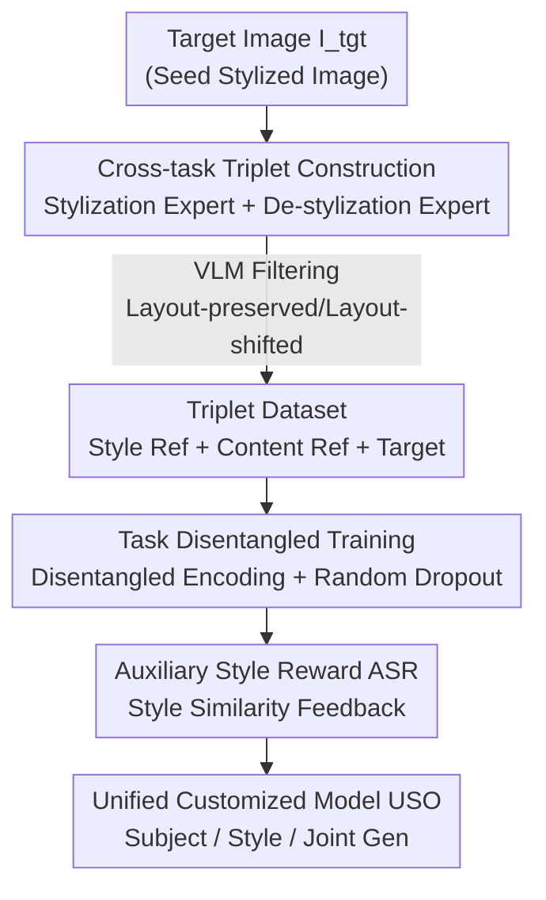

# Unified Customized Generation by Disentangled Reward Modeling

**Conference**: CVPR 2026  
**Paper**: [CVF Open Access](https://openaccess.thecvf.com/content/CVPR2026/html/Wu_Unified_Customized_Generation_by_Disentangled_Reward_Modeling_CVPR_2026_paper.html)  
**Code**: https://github.com/bytedance/USO  
**Area**: Diffusion Models / Customized Generation  
**Keywords**: Subject Customization, Style Customization, Cross-task Disentanglement, Reward Learning, Diffusion Transformer

## TL;DR
USO (Unified Simultaneous Optimization) unifies "subject-driven generation" and "style-driven generation" as complementary tasks within a single DiT model. By constructing cross-task triplet data via two expert models, followed by joint training with disentangled encoding, random condition dropout, and Auxiliary Style Reward (ASR), it achieves open-source SOTA performance in subject consistency, style similarity, and text controllability simultaneously.

## Background & Motivation

**Background**: Customized image generation is currently divided into two independent branches: subject-driven (identifying "what this person/object looks like" from a reference and changing the scene) and style-driven (identifying "this artistic style/brushwork" and drawing new content). Both lines stack methods independently: style-driven approaches include DEADiff (Q-Former for style features only), CSGO (content-style-stylized triplets), and StyleStudio (stylized CFG); subject-driven approaches include RealCustom (dual reasoning for local feature injection) and UNO (refining data and models using the in-context capabilities of DiT).

**Limitations of Prior Work**: Images as visual conditions are inherently "noisy"—a single reference image contains style, appearance, layout, identity, and other features, while a specific task only requires one of them. The fundamental challenge is **precisely "retaining everything needed and excluding everything else"**: style tasks need style and must exclude subject appearance; subject tasks require the exact opposite. However, existing methods perform **disentanglement in isolation for a single task**—designing specific datasets or architectures for each task. Consequently, the disentanglement analysis of style methods is often tied to specific architectures and is not transferable.

**Key Challenge**: Each task essentially learns two things—"which features to include" and "which features to exclude." Features to be excluded in one task are exactly those to be included in its complementary counterpart. During isolated training, the model only learns the "include" half effectively, while the "exclude" half remains weak, leading to incomplete disentanglement.

**Goal**: To model subject-driven and style-driven generation within a unified framework, allowing them to **mutually enhance each other**. The ability of the subject task to "extract and preserve subject appearance" helps the style task "exclude subject appearance" more cleanly, thus refining disentanglement for both.

**Core Idea**: A **cross-task co-disentanglement** paradigm is proposed—optimizing both tasks within a single DiT through a cyclic data-model pipeline: "subject model generates style data → style reward trains subject model."

## Method

### Overall Architecture

The USO pipeline is a "data-model" loop: an existing subject customization model serves as the seed to generate high-quality cross-task triplet data (subject-for-style), which is then combined with style rewards to train a stronger unified model (style-for-subject). The process consists of three steps: **① Cross-task Triplet Construction**: A stylization expert and a de-stylization expert are used to derive a "style reference" and a "de-stylized content reference" from the same target image, forming `<style ref, de-stylized content ref, stylized target>` triplets with both layout-preserved and layout-shifted variants; **② Task Disentangled Training**: Treating the subject task as the primary and the style task as auxiliary, different encoders process the style image (SigLIP + hierarchical projector) and content image (frozen VAE). Random condition dropout forces the model to handle both single-task and multi-task scenarios; **③ Auxiliary Style Reward (ASR)**: The style similarity between the generated image and the style reference is calculated online and fed back as a reward signal to strengthen the "target feature extraction" capability.

### Key Designs

**1. Cross-task Triplet Construction: Decomposing the "Target Image" into "Style Ref + Content Ref"**

Unified training requires `<style ref, content ref, target>` triplets, but aligned data is scarce, and prior work (CSGO, OmniStyle) strictly maintains original layouts, preventing subjects from changing poses or spatial arrangements. USO **reconstructs two references from a target stylized image $I_{tgt}$**: a **stylization expert** (UNO-SFT, fine-tuned on curated style data) synthesizes a style reference $I_{ref}^s$ that captures high style similarity without leaking content; a **de-stylization expert** (frozen FLUX.1 Kontext dev, utilizing its instruction editing capability) back-projects the stylized image into a realistic photo for the content reference $I_{ref}^c$, with the **option to preserve or shift the layout**. A VLM filter ensures style similarity for $I_{ref}^s$ and subject consistency for $I_{ref}^c$, resulting in **layout-preserved** and **layout-shifted** triplets. The layout-shifted triplets are crucial—they force the network to inject the target style and maintain subject consistency despite spatial changes, providing "cross-scenario disentanglement" signals missing in single-task data. Approximately 200,000 stylized image pairs were constructed.

**2. Task Disentangled Training: Bifurcated Encoding + Random Condition Dropout**

Feeding subject and style images into the same encoder causes feature entanglement. Starting from a pre-trained T2I model converted to TI2I (Text+Image→Image), USO **uses different encoders for different condition types**: the style image passes through the SigLIP semantic encoder. To resolve the conflict between high-level semantics (for geometric transformations like 3D cartoons) and low-level details (for brushwork like pencil sketches), a lightweight **hierarchical projector** $M_{Proj}(\cdot)$ concatenates multi-scale features from various SigLIP layers:

$$z_s = \text{Concatenate}(M_{Proj}(\{c_i\}_{i=1}^{N}))$$

where $\{c_i\}$ are embeddings from the $i$-th SigLIP layer. The content/subject image is encoded via a frozen VAE $\mathcal{E}(\cdot)$ into condition tokens $z_c$. During training, only the hierarchical projector is unfrozen, the DiT is fine-tuned with LoRA, and **either the style or subject reference is randomly dropped** with probability $p=0.25$. This preserves single-task capabilities while exposing the network to multi-task scenarios to learn disentangled representations. The final multi-modal sequence is:

$$z_2 = \text{Concatenate}(z_s, c, z_t, z_c)$$

Style tokens $z_s$ share position indices with text tokens $c$, while content tokens use UnoPE for diagonal layout—allowing one model to handle subject, style, and joint tasks seamlessly.

**3. Auxiliary Style Reward (ASR): Style Reward Enhancing Identity Consistency**

The core insight is that "learning to include target features for one task" helps the complementary task "suppress those features." To optimize this, the auxiliary style task is augmented with **Auxiliary Style Reward (ASR)**. Unlike traditional ReFL (which rewards text alignment or aesthetics), ASR is tailored for "Ref-to-Image" scenarios: it directly calculates **style similarity between the online output $\hat{I}_0$ and the style reference $I_{ref}^s$** (measured by VLM or the CSD model $M_{RM}(\cdot)$) as the reward. The reward loss is:

$$L_{ASR} = \mathbb{E}[\omega(M_{RM}(I_{ref}^s, \hat{I}_0))]$$

where $\omega$ maps the reward score to a per-sample loss. To prevent reward hacking, the Flow-Matching objective $L_{Pre} = \mathbb{E}_{x_0,t,\omega}[w(t)\|v_\theta - v_t\|^2]$ is retained. The total objective is:

$$L = L_{Pre} + \lambda L_{ASR}, \quad \lambda = 0 \text{ (step} < S), \ \lambda = 1 \text{ (thereafter)}$$

Warm-up with the generation objective occurs until step $S$, after which the reward is activated. Remarkably, **even with only style rewards and no identity/subject supervision, the identity consistency (CLIP-I) of the unified model increases**, validating the "mutual enhancement" hypothesis.

### Loss & Training
Total loss $L = L_{Pre} + \lambda L_{ASR}$. The Flow-Matching reconstruction loss is active throughout, while ASR is introduced with $\lambda=1$ after step $S$. Training involves unfreezing the hierarchical projector and LoRA fine-tuning of the DiT, with a condition dropout probability $p=0.25$.

## Key Experimental Results

### Main Results
USO was evaluated on USO-Bench (50 content images × 50 style references + 30 subject prompts + 30 style prompts) and DreamBench. Metrics: Subject Consistency (CLIP-I / DINO), Style Similarity (CSD), Text Alignment (CLIP-T).

| Task | Metric | USO | Next Best | Description |
|------|------|------|----------|------|
| Subject-driven | CLIP-I ↑ | **0.647** | 0.605 (UNO) | Highest subject consistency |
| Subject-driven | DINO ↑ | **0.804** | 0.789 (UNO) | Highest subject consistency |
| Style-driven | CSD ↑ | **0.556** | 0.540 (InstantStyle-XL) | Highest style similarity |
| Style-driven | CLIP-T ↑ | **0.286** | 0.282 (StyleStudio) | Highest text alignment |
| Style-Subject Joint | CSD ↑ | **0.492** | 0.407 (StyleID) | Significant lead |
| Style-Subject Joint | CLIP-T ↑ | **0.283** | 0.277 (OmniStyle) | Best joint performance |

The unified model achieves best or joint-best performance across all metrics, notably improving CSD from 0.407 to 0.492 in the challenging style-subject joint task.

### Ablation Study

| Configuration | Subject CLIP-I | Style CSD | Joint CSD | Description |
|------|-------------|----------|----------|------|
| USO Full | **0.647** | **0.556** | **0.492** | Complete model |
| w/o ASR | 0.619 | 0.491 | 0.413 | No Auxiliary Style Reward |
| w/o DE | 0.594 | 0.491 | 0.382 | Single shared VAE encoder |

| Configuration | Subject CLIP-I | Joint CSD | Description |
|------|-------------|----------|------|
| USO | **0.647** | **0.492** | Full |
| UNO (Original) | 0.605 | - | Task-specific baseline |
| UNO† (Rebuilt on USO data) | 0.596 | - | Data change only |
| OmniStyle (Original) | - | 0.365 | Task-specific baseline |
| OmniStyle† (Rebuilt on USO data) | - | 0.382 | Outperforms original with USO data |

### Key Findings
- **ASR is the primary driver and provides "cross-metric benefits"**: Removing ASR drops joint CSD from 0.492 to 0.413 and subject CLIP-I from 0.647 to 0.619, confirming that style rewards indirectly benefit identity consistency.
- **Disentangled Encoding (DE) is essential**: Using a single shared VAE for both style and content causes performance to plummet (joint CSD to 0.382), proving that bifurcated encoding is necessary.
- **Data holds intrinsic value**: Rebuilding OmniStyle on USO triplets increased its joint CSD from 0.365 to 0.382, showing that cross-task triplets benefit models independently of the architecture.

## Highlights & Insights
- **"Mutual enhancement of complementary tasks" validated**: Optimizing style rewards improved identity consistency, quantitatively demonstrating that "inclusion = assisting the complementary task's exclusion."
- **Self-bootstrapping with experts**: The "data loop" using a stylization expert (UNO-SFT) and a de-stylization expert (FLUX.1 Kontext) avoids manual triplet alignment. This "model-generates-data-for-model" strategy is highly transferable.
- **Layout-shifted triplets**: These break the convention that style triplets must preserve layout, allowing subjects to change poses/arrangements, which is key to supporting both layout-preserved and layout-shifted generation.
- **Hierarchical Projector**: Effectively addresses the dual need for high-level semantics and low-level details in style tasks.

## Limitations & Future Work
- **Dependency on seed experts**: The quality ceiling is capped by the external UNO and FLUX.1 models used as experts.
- **Reward hacking risk**: Despite Flow-Matching and delayed activation, the model might exploit biases in the CSD/VLM reward models.
- **Metric limitations**: Evaluation relies on embedding-based automatic metrics; large-scale user studies are needed to confirm alignment with human preference.
- **Scalability**: While effective, the extension to complex multi-subject + multi-style combinations remains limited in the current scope.

## Related Work & Insights
- **vs UNO/RealCustom (Subject-driven)**: These focus on isolated subject disentanglement. USO demonstrates that adding style tasks as an auxiliary objective yields higher subject CLIP-I/DINO scores.
- **vs CSGO/OmniStyle (Style Triplets)**: These are layout-constrained. USO introduces layout-shifted triplets and reuses them across tasks.
- **vs DEADiff/InstantStyle (Style Disentanglement)**: Their disentanglement is often specific to attention structures; USO achieves disentanglement through data, bifurcated encoding, and rewards.
- **vs ReFL (T2I Reward Learning)**: While ReFL rewards text alignment, ASR rewards "style similarity between generated and reference images."

## Rating
- Novelty: ⭐⭐⭐⭐ The cross-task co-disentanglement paradigm and the insight that style rewards boost identity are genuinely innovative, though components like triplets and hierarchical projectors are clever recombinations of existing tech.
- Experimental Thoroughness: ⭐⭐⭐⭐ Covers all three task types with comprehensive ablations, though it relies heavily on self-built benchmarks and automatic metrics.
- Writing Quality: ⭐⭐⭐⭐ Clear motivation and rich illustrations, though some formula symbols and naming conventions show minor inconsistencies.
- Value: ⭐⭐⭐⭐ Open-source code and SOTA performance in the highly demanding "unified subject + style" area makes this directly applicable to production teams.

<!-- RELATED:START -->

## Related Papers

- [\[CVPR 2026\] Enhancing Spatial Understanding in Image Generation via Reward Modeling](enhancing_spatial_understanding_in_image_generation_via_reward_modeling.md)
- [\[CVPR 2026\] UniVerse: A Unified Modulation Framework for Segmentation-Free, Disentangled Multi-Concept Personalization](universe_a_unified_modulation_framework_for_segmentation-free_disentangled_multi.md)
- [\[CVPR 2026\] PaCo-RL: Advancing Reinforcement Learning for Consistent Image Generation with Pairwise Reward Modeling](paco-rl_advancing_reinforcement_learning_for_consistent_image_generation_with_pa.md)
- [\[CVPR 2026\] Scone: Bridging Composition and Distinction in Subject-Driven Image Generation via Unified Understanding-Generation Modeling](scone_bridging_composition_and_distinction_in_subject-driven_image_generation_vi.md)
- [\[CVPR 2026\] SpatialReward: Verifiable Spatial Reward Modeling for Fine-Grained Spatial Consistency in Text-to-Image Generation](spatialreward_verifiable_spatial_reward_modeling_for_fine-grained_spatial_consis.md)

<!-- RELATED:END -->
