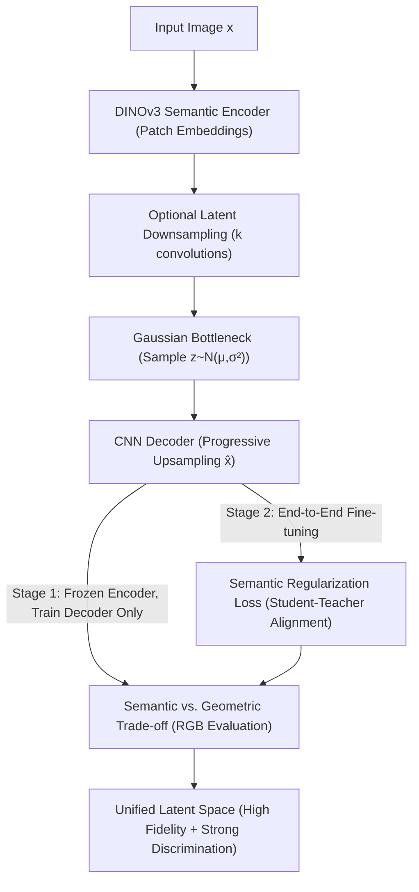

# Unified Latent Space for Understanding and Generation via Semantic Auto-encoder

**Conference**: CVPR 2026  
**Paper**: [CVF Open Access](https://openaccess.thecvf.com/content/CVPR2026/html/Li_Unified_Latent_Space_for_Understanding_and_Generation_via_Semantic_Auto-encoder_CVPR_2026_paper.html)  
**Area**: Diffusion Models / Image Generation  
**Keywords**: Semantic Auto-encoder, Unified Latent Space, DINOv3, Latent Diffusion, Semantic Regularization

## TL;DR
Addressing the fundamental trade-off where "semantic encoder latent spaces possess semantics but lose geometry, while reconstruction VAE latent spaces possess geometry but lack semantics," this paper utilizes a frozen DINOv3 as the encoder, combined with two-stage progressive training and a semantic regularization loss that aligns the student encoder with teacher features. The result is a unified latent space, the Semantic Auto-encoder (S-AE), which simultaneously supports high-fidelity reconstruction (rFID 0.06) and linear probing classification (ImageNet 81.9%).

## Background & Motivation
**Background**: The mainstream of modern image generation is "Latent Diffusion"—first using a pre-trained autoencoder to compress pixels into a compact latent space, then employing a Diffusion Transformer (DiT) to denoise within this space. SD-VAE is the most commonly used compressor; however, it is trained solely on reconstruction objectives, resulting in a latent space that preserves almost exclusively local appearance and geometric details.

**Limitations of Prior Work**: Latent spaces optimized only for reconstruction lack semantic structure; linear probing on VAE latent features yields a classification accuracy of only 8% on ImageNet. This is critical for the development of "unified models for understanding and generation," as such spaces cannot support high-level reasoning, cross-modal alignment, or representation sharing between understanding and generation tasks. Recent works (e.g., SD3 using SigLIP, or others using CLIP/DINO) attempt to integrate semantic encoders into autoencoders, but these semantic features are often too abstract, leading to lost geometric structure, poor reconstruction quality, and slower convergence during DiT training.

**Key Challenge**: This is formalized as a **fundamental trade-off between semantic abstraction and geometric fidelity**. Semantic encoders (DINO/DINOv2/SigLIP) have discriminative latent spaces but lose geometric detail; reconstruction VAEs preserve geometry but lack semantics. Neither alone is sufficient for a unified "generation + understanding" paradigm. Additionally, a measurement trap exists: diffusion training loss is typically calculated in the latent space, but a low latent loss does not guarantee generation quality. Calculating loss in the RGB space is more consistent with human perception.

**Core Idea**: Instead of choosing between "pure semantics" and "pure reconstruction," the authors utilize DINOv3—which models both semantics and geometry via global, patch, and decorrelation losses—as a starting point. By applying a semantic regularization loss during end-to-end fine-tuning to "pin" the encoder to its original semantic capabilities, they achieve a unified latent space that possesses both geometry and semantics.

## Method

### Overall Architecture
S-AE is a tripartite autoencoder: a **semantic encoder** (frozen/fine-tuned DINOv3-ViT-H/16+) projects images into a semantic-rich token space, an **optional latent downsampling module** controls the compression ratio, and a **CNN decoder** restores the latent representation to pixels. An input image $x\in\mathbb{R}^{3\times H\times W}$ processed by DINOv3 produces `[CLS, REG1..4, e1..eN]`. Only the $N$ patch embeddings are retained and rearranged into a 2D feature map $h\in\mathbb{R}^{D\times \frac{H}{16}\times \frac{W}{16}}$. DINOv3 uses a fixed $16\times$ downsampling; for higher compression ratios $f=16\times 2^k$, $k$ sets of convolutions are added. Following the VAE paradigm, a quantization projection layer maps $h'$ to Gaussian parameters $\mu,\sigma^2$, sample $z\sim\mathcal{N}(\mu,\mathrm{diag}(\sigma^2))$, and the decoder performs progressive upsampling for reconstruction.

Training is conducted in two stages: first training only the decoder, followed by end-to-end training with a **semantic regularization loss** to prevent the encoder from deviating from its teacher features.

### Key Designs

**1. Formalization of Semantic Abstraction vs. Geometric Fidelity + RGB Space Evaluation**

The authors observe through overfitting experiments that while semantic encoders like DINOv2 might show lower latent training loss, they fail to reconstruct fine details like text or small faces, and can lead to over-saturated generation. This indicates a gap between latent loss and actual image quality. By evaluating loss in the RGB space, the performance ranking aligns with human judgment. This insight establishes that evaluating latent spaces requires the dual axes of RGB reconstruction quality and discriminative capability (rFID + linear probing accuracy).

**2. DINOv3-based S-AE Architecture**

To address the loss of geometry in pure semantic encoders (e.g., SigLIP/DINOv2), the authors select DINOv3 as the backbone. DINOv3's training objective $L = L_{\text{global}} + L_{\text{patch}} + \lambda L_{\text{decorr}}$ inherently models global semantics and patch-level local information. The architecture rearranges patch tokens into spatial feature maps, preserving DINOv3's semantic structure while allowing flexible compression ratios ($f=16/32/64$) via optional convolutions.

**3. Two-stage Progressive Training**

To prevent the degradation of discriminative power during fine-tuning, the authors use **Stage 1 (Decoder Only)** to freeze DINOv3 while training the decoder, downsampling layers, and bottleneck. This establishes a reasonable reconstruction baseline using L1, LPIPS perceptual loss, and PatchGAN adversarial loss:

$$\mathcal{L}_{\text{Stage 1}} = \lambda_{L1}\lVert \hat{x}-x\rVert_1 + \lambda_{\text{LPIPS}}\mathcal{L}_{\text{LPIPS}}(\hat{x},x) + \lambda_{\text{GAN}}\mathcal{L}_{\text{GAN}}(\hat{x})$$

**Stage 2 (End-to-End Fine-tuning)** then releases the encoder to improve reconstruction details. Without the initialization from Stage 1, end-to-end training causes the encoder's discriminative ability to collapse.

**4. Semantic Regularization Loss**

To mitigate the drop in classification accuracy (from 88.4% to 12.4%) during Stage 2, a frozen DINOv3 serves as a **teacher**. The MSE between the teacher's patch features $f_t$ and the trainable student's $f_s$ is used as regularization:

$$\mathcal{L}_{\text{reg}} = \lambda_{\text{reg}}\cdot\lVert f_s(x)-f_t(x)\rVert_2^2$$

The final objective for Stage 2 integrates this with the KL divergence:

$$\mathcal{L}_{\text{Stage 2}} = \lambda_{L1}\lVert \hat{x}-x\rVert_1 + \lambda_{\text{LPIPS}}\mathcal{L}_{\text{LPIPS}} + \lambda_{\text{GAN}}\mathcal{L}_{\text{GAN}} + \lambda_{\text{KL}}D_{\text{KL}}(f_s(x)\Vert\mathcal{N}(0,I)) + \lambda_{\text{reg}}\lVert f_s(x)-f_t(x)\rVert_2^2$$

### Loss & Training
The model is trained at 256×256 resolution with a batch size of 16 across 8 GPUs using AdamW (lr 5e-6, zero weight decay). Training involves a 5k-step linear warm-up followed by cosine decay over 500k steps, with EMA decay at 0.9995. Weights are set to L1=100, LPIPS=100, GAN=1, and KL=1e-6.

## Key Experimental Results

### Main Results
Reconstruction quality comparison on ImageNet (16×16 compression):

| Model | Semantic Encoder | Linear Probing Acc%↑ | PSNR↑ | SSIM↑ | rFID↓ |
|------|:---:|:---:|:---:|:---:|:---:|
| VAE | ✗ | 8.0 | 25.29 | 0.76 | 0.62 |
| R-AE | ✓ | 84.5 | 19.21 | 0.50 | 0.49 |
| Align. VF | ✓ | 35.1 | 25.83 | - | 0.26 |
| DC-AE | ✗ | 12.7 | 23.85 | 0.69 | 0.66 |
| **S-AE** | ✓ | **81.9** | **33.84** | **0.96** | **0.06** |

S-AE is the only model to maximize both ends, achieving the lowest rFID (0.06) and highest PSNR/SSIM while maintaining strong discriminative power.

### Ablation Study
Semantic vs. Reconstruction trade-off (Distill(λ) refers to Stage 2 with MSE regularization):

| Method | Acc%↑ | PSNR↑ | SSIM↑ | rFID↓ |
|------|:---:|:---:|:---:|:---:|
| Freeze | 88.4 | 19.39 | 0.5593 | 1.17 |
| E2E (No Reg) | 12.4 | 41.35 | 0.9888 | 0.01 |
| Distill (100) | 81.9 | 33.84 | 0.9551 | 0.06 |
| Distill (200) | 86.1 | 32.21 | 0.9458 | 0.10 |

### Key Findings
- **Regularization is the Core Knob**: Increasing $\lambda_{\text{reg}}$ restores classification accuracy toward the frozen baseline while slightly decreasing reconstruction quality. $\lambda_{\text{reg}}=200$ provides the optimal trade-off.
- **Stage 1 Initialization is Essential**: Skipping Stage 1 leads to a rapid degradation of the encoder's discriminative ability.
- **Large Channel Latent Space Benefits DiT**: S-AE (latent dim 1280) converges even when the DiT channel width is significantly smaller (e.g., 384).

## Highlights & Insights
- **Latent loss can be deceptive**: The authors demonstrate that lower latent loss does not necessarily mean better image generation; RGB-based evaluation is far more reliable.
- **Using DINOv3 as a Foundation**: Instead of designing complex geometric constraints, selecting a backbone that inherently models both semantics and geometry is more efficient.
- **Teacher-Student Distillation as a "Brake"**: MSE distillation acts as a controllable knob to prevent end-to-end fine-tuning from destroying pre-trained semantic manifolds.
- **Dual-Purpose Space**: Achieving SOTA in both rFID and classification provides a robust foundation for unified understanding and generation models.

## Limitations & Future Work
- **Discriminative Gap**: The classification accuracy of the best trade-off (86.1%) remains below the frozen baseline (88.4%), indicating slight semantic loss.
- **Indirect Generation Evidence**: Much of the DiT evidence relies on single-image overfitting; large-scale text-to-image generation results are primarily in the appendix.
- **Backbone Dependency**: The method is tied to DINOv3-ViT-H/16+, and performance with more lightweight backbones has not been verified.

## Related Work & Insights
- **vs. SD-VAE**: S-AE significantly outperforms SD-VAE in reconstruction (rFID 0.06 vs 0.62) while improving classification from 8% to 81.9%.
- **vs. R-AE**: S-AE drastically improves reconstruction quality over R-AE while maintaining comparable discriminative power.
- **vs. VA-VAE / l-DEtok**: While prior works injected semantic info, they often sacrificed geometry; S-AE uses a two-stage approach + distillation to control this trade-off precisely.

## Rating
- Novelty: ⭐⭐⭐⭐ (Formalizing the semantic-geometry trade-off with RGB evaluation is highly valuable.)
- Experimental Thoroughness: ⭐⭐⭐⭐ (Solid ablations on regularization and training strategies.)
- Writing Quality: ⭐⭐⭐⭐ (Logical design and clear charting.)
- Value: ⭐⭐⭐⭐ (Provides a ready-to-use SOTA unified latent space.)

<!-- RELATED:START -->

## Related Papers

- [\[CVPR 2026\] Latent Diffusion Inversion Requires Understanding the Latent Space](latent_diffusion_inversion_requires_understanding_the_latent_space.md)
- [\[CVPR 2026\] Semantics Lead the Way: Harmonizing Semantic and Texture Modeling with Asynchronous Latent Diffusion](semantics_lead_the_way_harmonizing_semantic_and_texture_modeling_with_asynchrono.md)
- [\[CVPR 2026\] Semantic Scale Space: A Framework for Controllable Image Abstraction](semantic_scale_space_a_framework_for_controllable_image_abstraction.md)
- [\[CVPR 2026\] Learning to Generate via Understanding: Understanding-Driven Intrinsic Rewarding for Unified Multimodal Models](learning_to_generate_via_understanding_understanding-driven_intrinsic_rewarding_.md)
- [\[CVPR 2026\] Scone: Bridging Composition and Distinction in Subject-Driven Image Generation via Unified Understanding-Generation Modeling](scone_bridging_composition_and_distinction_in_subject-driven_image_generation_vi.md)

<!-- RELATED:END -->
