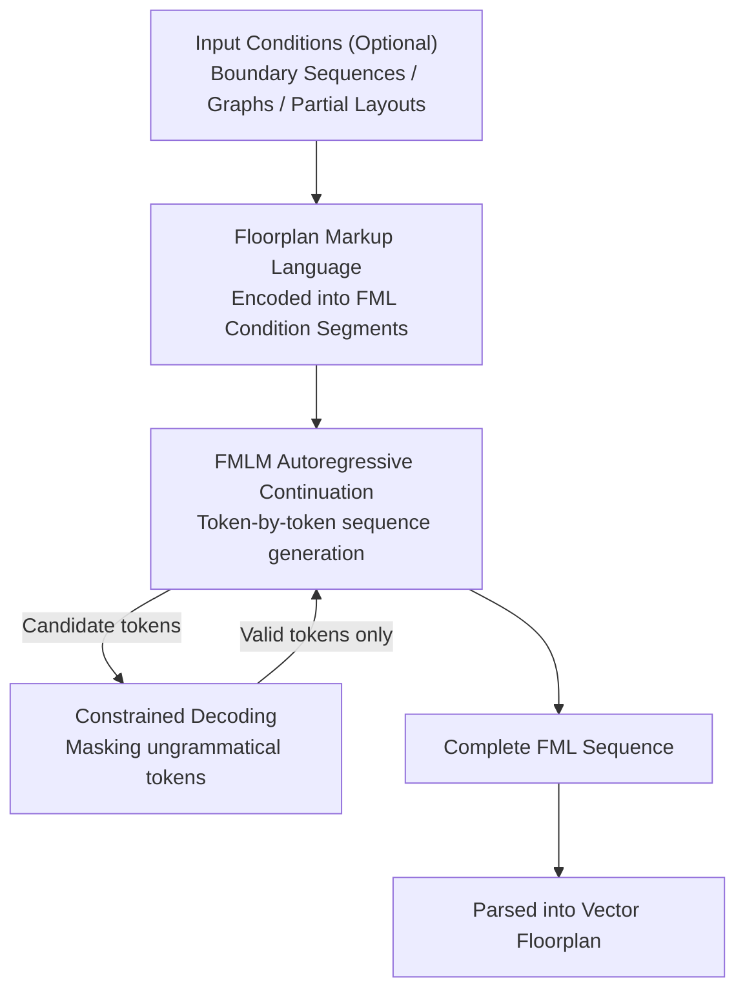

# Unified Vector Floorplan Generation via Markup Representation

**Conference**: CVPR 2026  
**arXiv**: [2604.04859](https://arxiv.org/abs/2604.04859)  
**Code**: [https://mapooon.github.io/FMLPage](https://mapooon.github.io/FMLPage)  
**Area**: Image Generation  
**Keywords**: Floorplan generation, markup language, autoregressive sequence model, constrained decoding, vectorized representation

## TL;DR

This paper proposes Floorplan Markup Language (FML) to encode floorplan elements such as rooms and doors into structured token sequences. A LLaMA-style Transformer model (FMLM) is employed to uniformly solve various floorplan generation tasks, including unconditional, boundary-conditioned, graph-conditioned, and completion tasks, achieving FID metrics over 80% lower than HouseDiffusion.

## Background & Motivation

1. **Background**: Automated floorplan generation is a core requirement in architectural design and the real estate industry. Existing methods are categorized by condition types—Graph2Plan for boundary conditions, and HouseGAN++/HouseDiffusion for adjacency graph conditions—but each task requires a dedicated model.
2. **Limitations of Prior Work**: (1) Different generation tasks utilize different architectures, preventing unification; (2) Diffusion-based methods (GSDiff) generate raster images, where post-processing to vector formats introduces errors; (3) GAN methods are prone to mode collapse and demonstrate limited generation diversity.
3. **Key Challenge**: Floorplans are inherently structured vector data (room polygons + door positions + connectivity relations), but existing methods either operate in pixel space (losing structural information) or require specialized Graph Neural Networks.
4. **Goal**: To design a unified representation that transforms all floorplan generation tasks into the same sequence prediction problem.
5. **Key Insight**: Inspired by markup languages (HTML/XML) in NLP—token sequences defined by grammatical rules are naturally suited for representing structural information and can be directly modeled using autoregressive Transformers.
6. **Core Idea**: Define FML grammar to encode floorplans into "tag + coordinate + index + type" token sequences and use constrained decoding to ensure the grammatical validity of the generated results.

## Method

### Overall Architecture

The core challenge addressed in this paper is that floorplans are inherently structured vector data, yet existing methods either build separate architectures for each condition or lose structural information by rendering in pixel space followed by vectorization post-processing. The authors treat the floorplan as a "markup document"—defining a Floorplan Markup Language (FML) grammar to compress the entire floorplan into a linear token sequence, similar to how HTML describes a webpage. Thus, unconditional generation, boundary-conditioned generation, graph-conditioned generation, and completion all become the same problem: having an autoregressive Transformer continue this sequence.

The pipeline is as follows: optional input conditions (boundary point sequences / adjacency graphs / partial floorplans) are first encoded into FML condition segments and prepended to the sequence; the FMLM model then continues the sequence token-by-token to generate rooms and doors; during this process, constrained decoding filters out all ungrammatical tokens; finally, the generated FML is parsed back into a vector floorplan.

### Key Designs

**1. Floorplan Markup Language: Representing Floorplans as Parsable Markup Sequences**

To address the issues of task-specific architectures and raster-to-vector post-processing, FML uses a grammar to flatten all elements of a plan into four token types: tags (e.g., `<room>`, `<door>`), coordinates, room indices, and room types. Coordinates use 1D encoding $z = x + y \times W$ ($W=256$) to map 2D grid points into integers, avoiding the large and sparse vocabulary problem of direct 2D coordinate prediction. The sequence follows a fixed grammar: `<sequence> → <condition> → <floorplan> → rooms → doors → front_door → </sequence>`. Consequently, a floorplan reads like a document: `<room> type index vertices... <door> endpoints room_indices...`. The tag tokens provide structural supervision. A critical detail is that rooms are arranged in **descending** order of their indices; ablation studies show this modification improved the FID from 94.57 (ascending) to 25.50, as descending order allows larger rooms (usually higher indices) to be placed first, providing stable spatial references for smaller rooms.

**2. FMLM: A Unified Output Head for Determining Token Types**

With the sequence defined, modeling is handled by a LLaMA-3 style Transformer with 24 layers, 512 hidden dimensions, and 32 attention heads. Embeddings for the four token types are distinguished by their nature: coordinate tokens use sinusoidal positional encoding with a learnable projection to maintain numerical continuity, while discrete symbols like tags, indices, and types use learnable embedding tables. The output utilizes a unified linear head $W \in \mathbb{R}^{(C_{tag}+C_{coord}+C_{index}+C_{type}) \times C}$ to predict the concatenated vocabulary once. The model learns to follow a `<room>` tag with coordinates and close the segment when finished without requiring an external state machine.

**3. Constrained Decoding: Zero-Overhead 100% Validity via Masking**

Autoregressive models may generate ungrammatical sequences, such as a door with 3 vertices or overlapping polygons. Constrained decoding encodes FML rules into the decoding steps: doors must have exactly 2 vertices, room polygons must not overlap existing rooms, and doors must lie on room boundaries. Candidate tokens violating these rules are masked to zero probability after the softmax. This process provides a deterministic guarantee of legality with almost no computational overhead, proving more reliable than the post-processing corrections used in methods like HouseDiffusion.

### Loss & Training

The training objective is standard cross-entropy on non-structural label tokens of the FML sequence. A significant training technique is room arrangement augmentation: the writing order of rooms is randomly shuffled during training to force the model to learn permutation equivariance rather than memorizing a fixed sequence. Ablation shows this is crucial—removing it increases FID from 14.17 to 24.36 (+72%).

## Key Experimental Results

### Main Results

| Task | Method | FID↓ | GED↓ | IoU↑ |
|------|------|------|------|------|
| Unconditional | GSDiff | 15.02 | - | - |
| Unconditional | **FMLM** | **7.22** | - | - |
| Boundary Condition | Graph2Plan | 34.20 | - | 95.87% |
| Boundary Condition | **FMLM** | **6.51** | - | **97.86%** |
| Graph Condition (ALL) | HouseGAN++ | 48.44 | 2.57 | - |
| Graph Condition (ALL) | HouseDiffusion | 29.31 | 1.55 | - |
| Graph Condition (ALL) | **FMLM** | **3.41** | **1.21** | - |
| Boundary + Graph (ALL) | Graph2Plan | 22.87 | 3.43 | 92.96% |
| Boundary + Graph (ALL) | **FMLM** | **14.17** | **1.24** | **97.59%** |

### Ablation Study

| Configuration | FID↓ | GED↓ | IoU↑ | Explanation |
|------|------|------|------|------|
| Full + Permutation Aug. | 14.17 | 1.24 | 97.59% | Full Model |
| w/o Permutation Aug. | 24.36 | 2.35 | 95.82% | FID increases by 72% |
| Ascending Indices | 94.57 | - | - | Poor FID performance |
| Descending Indices | 25.50 | - | - | Descending far superior |

### Key Findings

- Room permutation augmentation is critical for performance; removing it increases FID significantly, indicating the model must learn permutation equivariance for effective generalization.
- FMLM substantially outperforms GAN and Diffusion methods across all conditional settings.
- Constrained decoding ensures 100% grammatically valid results, whereas post-processing in methods like HouseDiffusion cannot provide such guarantees.
- Performance slightly decreases in 8-room scenarios (FID from 3.41 to 4.64) due to limited training samples.

## Highlights & Insights

- **Elegance of Markup Representation**: By defining grammar rules, structural generation is elegantly transformed into sequence prediction. This approach can be transferred to other structural tasks like circuit layouts or molecular structures.
- **Zero-Overhead Legality**: Implementing hard constraints via masking illegal tokens during inference eliminates illegal outputs without added cost, which is more reliable than post-hoc corrections.
- **Unified Multi-tasking**: A single model handles unconditional, boundary, graph, and completion tasks simultaneously, eliminating the redundancy of specialized architectures.

## Limitations & Future Work

- Only single-story floorplans are supported; multi-story buildings require extended FML grammar.
- Performance drops for 8+ room scenarios due to insufficient training data.
- Coordinate quantization to a 256×256 grid may lose precision; higher resolutions would increase vocabulary size.
- Integration with LLMs (translating natural language requirements to floorplans) is a promising direction.

## Related Work & Insights

- **vs HouseDiffusion**: Diffusion methods model in continuous space and require vectorization post-processing; FMLM generates vector results directly in discrete token space, ensuring higher precision.
- **vs Graph2Plan**: Requires GNNs to encode adjacency graphs, resulting in a complex architecture. FMLM serializes adjacency relations into FML condition segments, removing the need for extra encoders.
- **vs GSDiff**: Rasterized diffusion achieved an FID of 15.02, while FMLM achieved 7.22. the gap stems from the structural prior of vector representation.

## Rating

- Novelty: ⭐⭐⭐⭐ The markup language representation is a novel perspective, though autoregressive generation itself is established.
- Experimental Thoroughness: ⭐⭐⭐⭐⭐ Comprehensive comparison across four condition settings, including ablation and room-count analysis.
- Writing Quality: ⭐⭐⭐⭐ Clear and rigorous definition of FML grammar.
- Value: ⭐⭐⭐⭐ Direct application value in architectural design; the markup language approach is highly transferable.

<!-- RELATED:START -->

## Related Papers

- [\[CVPR 2026\] VecGlypher: Unified Vector Glyph Generation with Language Models](vecglypher_unified_vector_glyph_generation_with_language_models.md)
- [\[CVPR 2026\] CG-Floor: Centroid-Guided Diffusion for Large-Scale Floorplan Generation](cg-floor_centroid-guided_diffusion_for_large-scale_floorplan_generation.md)
- [\[CVPR 2026\] ExpPortrait: Expressive Portrait Generation via Personalized Representation](expportrait_expressive_portrait_generation_via_personalized_representation.md)
- [\[CVPR 2026\] Unified Customized Generation by Disentangled Reward Modeling](unified_customized_generation_by_disentangled_reward_modeling.md)
- [\[CVPR 2026\] UniVerse: Empower Unified Generation with Reasoning and Knowledge](universe_empower_unified_generation_with_reasoning_and_knowledge.md)

<!-- RELATED:END -->
