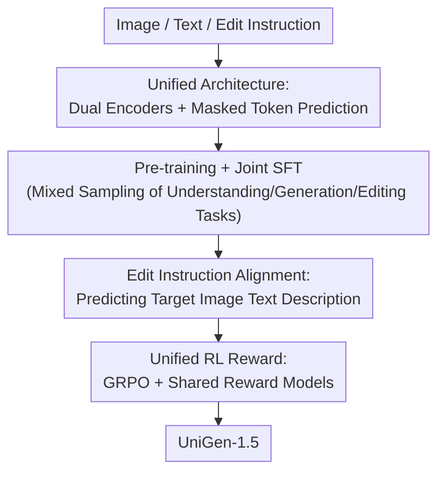

# UniGen-1.5: Enhancing Image Generation and Editing through Reward Unification in RL

**Conference**: CVPR 2026  
**Paper**: [CVF Open Access](https://openaccess.thecvf.com/content/CVPR2026/html/Tian_UniGen-1.5_Enhancing_Image_Generation_and_Editing_through_Reward_Unification_in_CVPR_2026_paper.html)  
**Code**: To be confirmed  
**Area**: Image Generation / Unified Multimodal Models  
**Keywords**: Unified MLLM, Image Editing, GRPO, Reward Unification, Masked Token Prediction

## TL;DR
UniGen-1.5 integrates image understanding, text-to-image generation, and image editing into a single 7B multimodal LLM. The key innovation is reformulating "image editing" as "standard image generation," allowing text-to-image and editing to share the same reward model for unified reinforcement learning (GRPO). Working alongside a lightweight Edit Instruction Alignment phase to remedy instruction comprehension, it ultimately outperforms open-source models like BAGEL and approaches GPT-Image-1 on GenEval (0.89), DPG-Bench (86.83), and ImgEdit (4.31).

## Background & Motivation

**Background**: Unified multimodal large language models (unified MLLMs) aim to handle both "image comprehension (understanding)" and "image generation" within a single model. The predecessor, UniGen, utilized a data-centric pipeline to guide the model from pre-training to post-training. In post-training, it used chain-of-thought verification (CoT-V)—where the model leverages its own understanding capabilities to verify generated results—to improve text-to-image quality.

**Limitations of Prior Work**: UniGen possesses two critical drawbacks. First, CoT-V is a form of test-time scaling, requiring repeated verification at inference time, which introduces massive inference overhead. Second, UniGen is completely incapable of performing image editing, which is the core capability for measuring "fine-grained controllable generation."

**Key Challenge**: Utilizing RL (rather than test-time verification) to enhance generation quality is a more inference-economical approach, and several text-to-image studies have demonstrated the efficacy of GRPO. However, applying RL to image editing has rarely succeeded. The fundamental barrier is the **excessive difficulty of reward modeling**: editing scales across highly diverse ranges—from deleting/replacing small objects to completely changing the style of the entire image. This makes it incredibly difficult for reward models to stably distinguish whether "the editing is correct" in pixel space. Meanwhile, training a dedicated editing reward model requires massive amounts of human annotations spanning various editing types, the cost of which is prohibitive.

**Goal**: (1) Design a single unified architecture that concurrently supports understanding, generation, and editing; (2) Enable RL to stably and simultaneously improve both generation and editing tasks.

**Key Insight**: The key observation is that when given the "text description of the desired output image," the editing task and the text-to-image generation task are fundamentally identical: both aim to "align the generated image with a text description." Thus, there is no need to construct a separate reward model specifically for editing.

**Core Idea**: Reformulate image editing as **standard image generation** and use the semantic consistency of "generated image ↔ target text description" as a unified reward. This allows stable and mature text-to-image reward models (e.g., CLIP, HPSv2) to be directly reused for editing, thereby incorporating both tasks into the same GRPO training framework for joint optimization.

## Method

### Overall Architecture
UniGen-1.5 adopts a pre-trained LLM (Qwen2.5-7B) as its backbone, equipped with two **independent vision encoders**: the continuous encoder SigLIP2 (supporting arbitrary resolutions and aspect ratios) for understanding, and the discrete vision tokenizer MAGViTv2 (encoding images into discrete tokens) for generation. The same LLM handles three categories of tasks via three forward passes: during understanding, it takes SigLIP2 continuous tokens + text as input to perform next-token prediction for generating text; during text-to-image generation, it encodes the target image into discrete tokens, randomly masks a portion as `[MASK]`, and tasks the LLM with predicting the masked visual tokens under textual conditions (masked token prediction); during editing, both encoders are used concurrently to extract the **游离语义特征** (SigLIP2) and **低层特征** (MAGViTv2) of the conditional image, which are concatenated in the sequence "semantic visual emb + text emb + low-level visual emb" as conditions for the LLM, which then generates the discrete tokens of the output image via masked token prediction.

Training is executed sequentially across four phases: **Pre-training** (founded on well-aligned image-text pairs, covering understanding and text-to-image generation, sampling generation/understanding/pure text at a 3:2:1 ratio) → **Joint SFT** (incorporating synthesized high-quality data and editing data, sampling generation/understanding/pure text at a 3:4:1 ratio, using a round-robin strategy to alternate between text-to-image and editing to stabilize training, where editing capability is unlocked) → **Edit Instruction Alignment** (lightweight post-SFT to bridge editing instruction comprehension) → **Unified RL** (GRPO + shared reward models to jointly improve generation and editing). The three true contributions of this paper are the unified architecture, the Edit Instruction Alignment, and the unified RL reward, while pre-training and SFT are scaffolding adapted from the predecessor.

### Key Designs

**1. Unified Architecture: Dual Encoders + Masked Token Prediction Integrating Understanding/Generation/Editing into one LLM**

The bottleneck was that UniGen only supported understanding and generation, but not editing. To enable a single LLM to excel at all three, the core challenge lies in editing, which must both grasp the semantics of the conditional image and preserve its pixel details. The authors adopt a **task-decoupled dual-encoder** setup rather than a single tokenizer: understanding utilizes the SigLIP2 continuous encoder (preserving native, arbitrary-resolution details of the original image), while generation/editing utilizes the MAGViTv2 discrete tokenizer (adapted for masked token prediction). For editing, both encoders are deployed simultaneously: the conditional image $X_C$ yields both semantic features $X^U_C = \mathrm{Enc}_U(X_C)$ and low-level features $X^G_C = \mathrm{Enc}_G(X_C)$. After being projected by their respective MLPs, they are concatenated with the edit text $T_C$ to form $[X^U_C,\, T_C,\, X^G_C]$ as the condition, prompting the LLM to yield the discrete tokens of the output image $X^G_O$ via masked token prediction. Generation and editing both consistently employ a 384×384 resolution and a MaskGIT-style cosine masking schedule. Thus, all three tasks share the same backbone and generative mechanism rather than combining three separate models. Both visual encoders are **frozen** during all training phases, with only the LLM and the projection layers being trained.

**2. Edit Instruction Alignment: Teaching the Model to "Understand Editing Instructions" First to Deliver Effective RL Signals**

This step addresses a very specific training failure observed in preliminary RL experiments: when faced with complex editing instructions, none of the candidate outputs sampled by the model satisfied the instructions, causing the standard deviation of rewards within a group to approach zero. Since GRPO relies on group-normalized advantages computed as $A_i=\dfrac{R_i-\mathrm{mean}\{R_1,\dots,R_N\}}{\mathrm{std}\{R_1,\dots,R_N\}}$, once the denominator (std) nears zero, the learning signal is extinguished, stalling policy learning. The authors attribute the root cause to "the model failing to truly understand the editing instruction, resulting in an inability to infer what the target image should look like."

The solution is to introduce a lightweight Post-SFT phase: for each editing input $(X_C, T_C)$, a strong teacher model is first used to synthesize a "text description of the desired output image" $T_O$. Then, UniGen-1.5 is tasked with **predicting $T_O$ from the conditional image and instruction** via standard next-token prediction. This forces the model to translate the "editing intent" into an accurate depiction of the target image's semantics. After training, the model can generate semantically coherent yet distinct candidates, thereby providing more informative reward signals for RL. Ablation studies demonstrate that this step yields improvements even prior to RL, and these gains are significantly amplified during RL (see below).

**3. Unified RL Reward: Reformulating Editing as "Measuring Target Text Consistency" to Directly Reuse Text-to-Image Reward Models**

This is the core concept of the paper, directly tackling the "difficulty of constructing editing rewards." Instead of training a separate reward model for editing, the authors score both tasks using a single reward function $R(\tilde{X}^G_O, T_O)$, where $\tilde{X}^G_O$ is the generated image in pixel space, and $T_O$ is the text description of the desired output: text-to-image directly uses the ground-truth prompt as $T_O$, while editing uses the caption synthesized in the previous step as $T_O$. The underlying hypothesis is that "a sufficiently strong LLM can reliably depict the visual differences of the edited image under various scales of modification." Consequently, the mature and stable reward models crafted for text-to-image can be **directly applied to editing without modification**, drastically simplifying reward design and rendering the joint optimization of a single model highly scalable.

Specifically, optimization is carried out using GRPO: the policy $\pi_\theta$ is initialized from the Post-SFT model; for each input, $N$ candidates $\{\hat{X}^G_{O_1}, \dots, \hat{X}^G_{O_N}\}$ are sampled and assigned scalar rewards $R_i$. The group-normalized advantages $A_i$ are computed using the GDP formula, and the policy is optimized via $J(\theta)=\frac{1}{N}\sum_i \min\!\big(\rho_i A_i,\ \mathrm{clip}(\rho_i,1-\varepsilon,1+\varepsilon)A_i\big)-\beta\,D_{KL}(\pi_\theta\|\pi_{\text{ref}})$ (in practice, following T2I-R1, they discard ratio clipping and rely solely on an explicit KL penalty to constrain updates). The reward $R(\cdot)$ is an ensemble of diverse visual experts: CLIP-H, HPSv2, Unified-Reward-7B, and ORM. Regarding training data, text-to-image utilizes 6,786 prompts from T2I-R1, while editing leverages a custom-built dataset Edit-RL (10,568 samples), where conditional images are generated by Qwen-Image, instructions are generated with templates by Qwen2.5-VL-72B, and target descriptions are synthesized using Qwen2.5-72B. ⚠️ Note: Symbols in the formula (e.g., importance sampling ratio $\rho_i$, KL coefficient $\beta$) follow the original text.

### Loss & Training
During pre-training, everything is unfrozen except the two visual encoders; SFT combines all three tasks and alternates between text-to-image and editing using a round-robin strategy to maintain stability. Edit Instruction Alignment is trained for 500 steps on the custom Edit-Align dataset (8×H100, batch size 64, lr 1e-5, cosine scheduler). GRPO is trained for 1,500 steps (8×B200, batch size 32, lr 3e-6, KL coefficient $\beta=0.01$, sampling $N=8$ candidates per input; for acceleration, each candidate uses only 16 decoding steps and CFG is disabled). At inference, text-to-image uses a CFG scale of 5.0 with 50 generation steps; editing utilizes dual-scale CFG (instruction scale $s_T=3$, conditional image scale $s_I=1.5$).

## Key Experimental Results

### Main Results

Image Editing (ImgEdit benchmark, overall higher is better): Without relying on any external diffusion models, UniGen-1.5 achieves the highest overall score of 4.31, outperforming open-source models of comparable scale and slightly surpassing GPT-Image-1.

| Model | #Params | Extract | Replace | Remove | Overall |
|------|---------|---------|---------|--------|---------|
| BAGEL | 7B MoT | 1.70 | 3.30 | 2.62 | 3.20 |
| OmniGen2 | 7B | 1.77 | 3.74 | 3.20 | 3.44 |
| FLUX.1 Kontext [Pro] | - | 2.35 | 4.56 | 3.57 | 4.00 |
| GPT Image 1 [High] | - | 2.90 | 4.35 | 3.66 | 4.20 |
| Qwen-Image | 7B | 3.43 | 4.66 | 4.14 | 4.27 |
| **UniGen-1.5** | 7B | **3.86** | **4.78** | **4.57** | **4.31** |

Text-to-Image (GenEval / DPG-Bench, higher is better): UniGen-1.5 achieves 0.89 / 86.83, bringing a $+0.11$ gain on GenEval and $+1.6$ on DPG-Bench compared to the predecessor UniGen. It outpaces Show-o2, BLIP3-o, and BAGEL by 0.13, 0.05, and 0.07 points on GenEval overall respectively, with a particularly pronounced advantage in the "Position" category.

| Model | #Params | GenEval Overall | DPG-Bench Overall |
|------|---------|------|------|
| GPT Image 1 [High] | - | 0.84 | 85.15 |
| UniGen | 1.5B | 0.78 | 85.19 |
| BAGEL | 7B MoT | 0.82 | - |
| Show-o2 | 7B | 0.76 | 86.14 |
| BLIP3-o | 8B | 0.84 | 81.60 |
| **UniGen-1.5** | 7B | **0.89** | **86.83** |

In image understanding, UniGen-1.5 comprehensively outperforms the predecessor UniGen (AI2D 67.4→77.4, ScienceQA 79.4→86.3, Seedbench 70.8→76.5, etc.), matching strong same-scale models like Show-o2. The authors attribute this to scaling up to 7B, increasing input resolution while preserving original aspect ratios, and incorporating understanding-focused pre-training.

### Ablation Study

The Effect of Unified RL (Table 4, T2I = Text-to-Image, I-Edit = Editing, reporting overall): Integrating both tasks into RL yields the best overall performance; removing either task from RL leads to a noticeable drop in the other's performance.

| T2I in RL | I-Edit in RL | GenEval | DPG-Bench | ImgEdit |
|-----------|--------------|---------|-----------|---------|
| ✗ | ✗ (No RL) | 0.85 | 84.19 | 3.93 |
| ✓ | ✗ | 0.90 | 86.62 | 4.01 |
| ✗ | ✓ | 0.85 | 86.39 | 4.32 |
| ✓ | ✓ | **0.89** | **86.83** | **4.31** |

The Effect of Edit Instruction Alignment (Table 5, reporting overall): This phase improves performance across all three benchmarks even before RL. More importantly, it demonstrates a strong "amplifying" effect on RL—without it, RL only lifts ImgEdit by 0.21 (3.87→4.08), whereas with it, RL boosts ImgEdit by 0.38 (3.93→4.31).

| Edit Align | Unified RL | GenEval | DPG-Bench | ImgEdit |
|------------|-----------|---------|-----------|---------|
| ✗ | ✗ | 0.83 | 83.92 | 3.87 |
| ✓ | ✗ | 0.85 | 84.19 | 3.93 |
| ✗ | ✓ | 0.90 | 86.96 | 4.08 |
| ✓ | ✓ | 0.89 | 86.83 | **4.31** |

### Key Findings
- **Unified RL is a win-win but both tasks are indispensable**: Performing RL solely on text-to-image leaves editing stagnant at 4.01, and performing RL solely on editing caps GenEval at 0.85. Only joint training achieves optimal performance across all three metrics—proving that "reformulating editing as generation and sharing the reward" allows mutual benefits between the two tasks.
- **The value of Edit Instruction Alignment primary lies in "nourishing RL"**: While its standalone improvement is modest, it elevates the variance of editing candidate rewards, allowing GRPO to secure effective gradients, which nearly doubles the editing gains during the RL stage (0.21→0.38).
- **An interesting trade-off**: Adding Edit Alignment slightly decreases GenEval (0.90→0.89) and DPG-Bench (86.96→86.83), but drastically improves ImgEdit (4.08→4.31). This phase is biased toward editing, and the authors chose to accept a negligible loss in text-to-image to swap for a significant improvement in editing.
- **Achieving SOTA editing without external diffusion**: UniGen-1.5 reconstruction relies entirely on a lightweight discrete tokenizer throughout, proving that the "unified reward + GRPO" pathway alone can elevate editing capabilities to approach GPT-Image-1.

## Highlights & Insights
- **"Reformulating tasks" is savvier than "inventing new rewards"**: Fitting editing into a unified "generated image ↔ target text consistency" schema bypasses the roadblock of requiring massive human annotations for editing reward models, directly reusing mature text-to-image reward models. This "task normalization" concept can scale to any generative sub-task where rewards are difficult to build but target descriptions are accessible.
- **Diagnosis-driven design**: Edit Instruction Alignment is not added blindly; it was reverse-engineered from the specific failure mode where "the editing candidate reward std approaches 0 during RL, stalling GRPO." "Remedying instruction comprehension" is precisely positioned as a prerequisite for RL.
- **Decoupled dual encoders**: The division of labor between semantic (SigLIP2 continuous) and low-level (MAGViTv2 discrete) features allows the single LLM to simultaneously comprehend "what to modify" and "how to preserve original details" during editing, which is a pivotal engineering detail for supporting editing in unified models.

## Limitations & Future Work
- **Inadequacy in rendering text**: Due to the focus on semantic alignment + discrete tokens and the reliance on a lightweight detokenizer for reconstruction, the quality of generated text (which depends on fine structural details) in images is sub-optimal. The authors suggest incorporating a diffusion component to rectify this.
- **Visual consistency remains a bottleneck**: During editing, visual inconsistency persists (unnecessary changes occur outside the edited regions). The root cause is that the unified reward only measures "semantic consistency with the target description" without explicitly constraining "unedited regions to remain unchanged." A dedicated consistency reward model is required, which is left for future work.
- **Reward upper bound capped by caption quality**: The editing reward relies on the target descriptions synthesized by the teacher model and the assumption that "strong LLMs can reliably depict visual differences." Inaccurate descriptions or those omitting local details will yield skewed reward signals.

## Related Work & Insights
- **vs UniGen (predecessor)**: UniGen uses test-time CoT-V to improve text-to-image generation, which poses high inference costs and lacks editing capabilities. UniGen-1.5 transitions to RL (generating no additional inference overhead) and unlocks editing, replacing "verification-based enhancement" with "exploration-based enhancement."
- **vs Works training dedicated editing reward models**: These works build separate reward models for editing, requiring large-scale annotation. This paper utilizes a "unified text-consistency reward" to reuse text-to-image reward models, eliminating the annotating cost for editing rewards.
- **vs T2I-R1**: This work adopts its GRPO configuration (removing ratio clipping, explicit KL) and reward ensemble methodology but broadens the scope from pure text-to-image to the unified optimization of "text-to-image + editing."
- **vs Decoupled LLM-diffusion approach (e.g., OmniGen2/BLIP3-o)**: Those methods outsource generation to a diffusion decoder. UniGen-1.5 employs unified sequence modeling with autoregressive (AR) + masked token prediction, achieving SOTA editing scores without relying on external diffusion.

## Rating
- Novelty: ⭐⭐⭐⭐ "Reformulating editing as generation to unify rewards" is a concise and effective paradigm shift with high engineering integration.
- Experimental Thoroughness: ⭐⭐⭐⭐ Covers all three benchmark categories: understanding, generation, and editing. The ablations for unified RL and Edit Alignment are cleanly executed.
- Writing Quality: ⭐⭐⭐⭐ Highly logical, motivated by addressing a concrete failure mode (RL reward std ≈ 0).
- Value: ⭐⭐⭐⭐ Provides a highly scalable, strong baseline for unified MLLMs without relying on external diffusion.

<!-- RELATED:START -->

## Related Papers

- [\[CVPR 2026\] Enhancing Spatial Understanding in Image Generation via Reward Modeling](enhancing_spatial_understanding_in_image_generation_via_reward_modeling.md)
- [\[CVPR 2026\] PaCo-RL: Advancing Reinforcement Learning for Consistent Image Generation with Pairwise Reward Modeling](paco-rl_advancing_reinforcement_learning_for_consistent_image_generation_with_pa.md)
- [\[CVPR 2026\] The Image as Its Own Reward: Reinforcement Learning with Adversarial Reward for Image Generation](the_image_as_its_own_reward_reinforcement_learning_with_adversarial_reward_for_i.md)
- [\[ICLR 2026\] EditScore: Unlocking Online RL for Image Editing via High-Fidelity Reward Modeling](../../ICLR2026/image_generation/editscore_unlocking_online_rl_for_image_editing_via_high-fidelity_reward_modelin.md)
- [\[CVPR 2026\] Leveraging Verifier-Based Reinforcement Learning in Image Editing](leveraging_verifier-based_reinforcement_learning_in_image_editing.md)

<!-- RELATED:END -->
