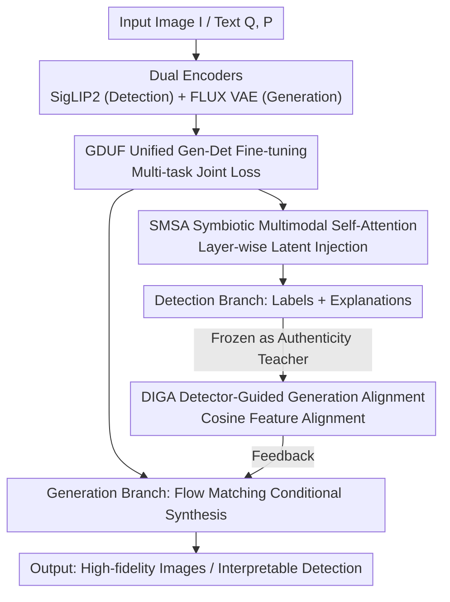

# UniGenDet: A Unified Generative-Discriminative Framework for Co-evolutionary Generation and Detection

**Conference**: CVPR 2026  
**arXiv**: [2604.21904](https://arxiv.org/abs/2604.21904)  
**Code**: https://github.com/Zhangyr2022/UniGenDet (Available)  
**Area**: Image Generation / Generated Image Detection / Unified Multimodal  
**Keywords**: Generation-Detection Co-evolution, Unified Framework, Symbiotic Self-Attention, Detector-Guided Alignment, AIGI Detection

## TL;DR
UniGenDet integrates "faking" (image generation) and "fake-detecting" (AI-generated image detection) into a single unified multi-modal model for two-stage joint training. By employing Symbiotic Multimodal Self-Attention to inject the generator's understanding of image distributions into the detector, and using a frozen detector as an "authenticity teacher" to reversely align generator features, the framework facilitates mutual advancement in a closed loop. Consequently, detection accuracy (98.0% Acc on FakeClue) and generation fidelity (FID 22.9 $\rightarrow$ 17.5) are simultaneously improved.

## Background & Motivation

**Background**: Image generation (GAN/VAE/Diffusion/Autoregressive) and generated image detection have progressed rapidly along distinct technical paths—generation relies on generative networks, while detection prefers discriminative frameworks. Recently, both sides have begun leveraging "adversarial information" (generation using discriminative signals, detection using generative knowledge), suggesting potential for synergy.

**Limitations of Prior Work**: Most detectors are **statically trained** on generator snapshots at a specific point in time, treating forgery as a stationary target rather than a co-evolving process. Consequently, detectors overfit to transient clues, suffer from significant domain gaps against unseen generators, and fail to capture the underlying generation logic. This leads to a reactive "detection lag" where defense cannot keep pace with the complexity of new forgery methods.

**Key Challenge**: Generators aim solely for perceptual realism without forensic constraints, thus leaving discernable traces like physical inconsistencies. Detectors passively learn from fixed or outdated forged samples. Despite both fields converging (generation beginning to use discriminative priors and detection using large models for generalization), a **unified framework for the simultaneous and collaborative optimization of both** remains absent.

**Goal**: Construct a unified generative-discriminative framework where (1) generation tasks enhance the interpretability of authenticity detection, and (2) authenticity criteria conversely guide the generator to produce higher-fidelity images.

**Key Insight**: Citing Richard Feynman's "What I cannot create, I do not understand," the authors argue that generation and discrimination are fundamentally symbiotic. Since unified multimodal models (such as BAGEL) can support both generation and understanding within one architecture, the detector should **understand the logic behind forgery** to grasp the essence of the boundary between real and fake.

**Core Idea**: Utilizing a unified model with two-stage training, generation and detection provide **bi-directional feedback**: forwardly, distribution understanding from the generator is injected into the detector (SMSA); reversely, forensic knowledge from the detector is injected into the generator (DIGA), forming a closed loop of co-evolution.

## Method

### Overall Architecture
UniGenDet utilizes the unified generation-understanding model **BAGEL** (a multimodal Mixture-of-Transformers that supports both image generation and VQA) as its foundation to simultaneously address image detection, textual explanation, and image generation. The process follows a **two-stage training paradigm**: The first stage, GDUF, involves joint fine-tuning of detection and generation targets, using the SMSA module to inject generative latent variables into the detector layer-by-layer. The second stage, DIGA, freezes the trained detector and uses it as an "authenticity teacher" to adversarially optimize the generator.

Specifically, the input image passes through two encoders: the detection encoder SigLIP2 provides detection features $h_{\text{det}}^{(0)}$, and the generative encoder FLUX VAE provides latent variables $z_{\text{gen}}^{(0)}$; textual instructions are encoded as $h_{\text{text}}^{(0)}$. In stage one, SMSA performs tri-modal interaction at each layer of the detection backbone. The detection branch outputs authenticity labels and textual explanations, while the generation branch performs conditional synthesis via Flow Matching. In stage two, the frozen detector performs cosine alignment on the generator's intermediate features to instill forensic knowledge—knowledge of "which features are less detectable"—into the generator.

### Key Designs

**1. SMSA Symbiotic Multimodal Self-Attention: Injecting Generator Knowledge into the Detector**

To address the issue where detectors only learn surface clues and lack understanding of forgery logic, the authors leverage the rich modeling of image distribution, semantics, and structure found in the latent space of generative models (specifically diffusion models). SMSA is designed to feed generative latents into the detection features **layer-by-layer**. Each layer first concatenates the three modalities $h_{\text{concat}}^{(l)}=[z_{\text{gen}}^{(l)};h_{\text{det}}^{(l)};h_{\text{text}}^{(l)}]$, then performs multi-head cross-attention where the query comes from detection features and the key/value from the concatenated features: $Q=W_Q h_{\text{det}}^{(l)}$, $K=W_K h_{\text{concat}}^{(l)}$, $V=W_V h_{\text{concat}}^{(l)}$, and $\text{Attention}(Q,K,V)=\text{softmax}(QK^\top/\sqrt{d_k})V$. Detection features are updated layer-by-layer as $h_{\text{det}}^{(l+1)}=\text{SMSA}(h_{\text{det}}^{(l)},h_{\text{text}}^{(l)},z_{\text{gen}}^{(l)})$. Finally, the detection head outputs the authenticity label $\hat{D}$ and the explanation $\hat{E}$. This progressive interaction allows the detector to perceive the characteristics of the generative distribution rather than just surface artifacts. Ablation studies show that removing SMSA causes Acc to drop from 98.0% to 95.0% and ROUGE-L to drop by 5.4 points.

**2. GDUF Unified Generative-Discriminative Fine-tuning: Joint Optimization**

This is the first training stage. Detection, explanation, and generation tasks are **fine-tuned with full parameters** on the BAGEL base, maintaining a 1:1 ratio between generated and understanding data in each batch. The total loss is a weighted sum $\mathcal{L}=\lambda_{\text{det}}\mathcal{L}_{\text{det}}+\lambda_{\text{exp}}\mathcal{L}_{\text{exp}}+\lambda_{\text{fm}}\mathcal{L}_{\text{fm}}$ (all weights set to 1). Detection uses binary cross-entropy $\mathcal{L}_{\text{det}}$, explanation uses autoregressive language modeling $\mathcal{L}_{\text{exp}}=-\sum_t \log p_\theta(a_t|a_{<t},h_{\text{det}}^L,h_{\text{text}}^L)$, and generation uses Flow Matching $\mathcal{L}_{\text{fm}}=\mathbb{E}_{t,x_0,x_t}\|v_\theta(x_t,t,c)-(x_0-x_t)\|^2$. Critically, the condition $c$ for the generation branch includes **discriminative textual features** extracted by the detector, making the generation more "plausible." Joint optimization promotes knowledge transfer; removing GDUF (reverting to baseline BAGEL) results in an Acc of only 40.5%, proving its foundational necessity.

**3. DIGA Detector-Guided Alignment: Detector as Authenticity Teacher**

Generators typically do not know which of their features are easily detectable. Inspired by REPA (which uses pre-trained encoders like DINOv2 for feature alignment to accelerate training), the authors use a teacher more "expert in forensics"—the specialized detector $f_D$ from the first stage. This detector specifically captures frequency anomalies, texture inconsistencies, and imperceptible artifacts. DIGA freezes $f_D$ and forces the generator's intermediate features to **align with representations of "images perceived as completely real by the detector,"** thereby pushing the generator away from "easily detectable feature subspaces." Specifically, for a ground truth image $x_{\text{GT}}$, patch features $z_D$ are extracted from $f_D$'s last Transformer block, while intermediate features $z_G=g_\theta^{(l)}(z_t,t)$ are extracted from the generator's $l$-th layer (layer 8 in implementation). A lightweight projection $h_\phi$ bridges the dimensions, followed by cosine alignment:

$$\mathcal{L}_{\text{DIGA}}=\mathbb{E}_{x_{\text{GT}},z_t,t}\left[1-\frac{h_\phi(g(z_t,t))\cdot f_D(x_{\text{GT}})}{\|h_\phi(g(z_t,t))\|\,\|f_D(x_{\text{GT}})\|}\right]$$

The total loss is $\mathcal{L}_{\text{total}}=\mathcal{L}_{\text{flow}}+\lambda\mathcal{L}_{\text{DIGA}}$ ($\lambda=0.5$). This enables the generator to internalize forensic awareness, improving both visual realism (FID drops from 19.4 to 17.5) and robustness against forensic analysis.

### Loss & Training
Training occurs in two stages on 8×A100 GPUs: GDUF stage (~12 hours, 1000 steps, batch size $16384 \times 8$ tokens) and DIGA stage (~6 hours, 500 steps, $\lambda=0.5$). The AdamW optimizer is used with a learning rate of $1 \times 10^{-4}$ and weight decay of $1 \times 10^{-2}$ over 2 epochs. Generation data uses the LAION high-aesthetic subset (80K), and detection data uses FakeClue. Inference utilizes 50-step diffusion sampling and textual parameters: temperature 0.7, top-p 0.8, top-k 20, and repetition penalty 1.05.

## Key Experimental Results

### Main Results

FakeClue Detection + Explanation (Acc/F1 for discrimination, ROUGE-L for explanation match, CSS for semantic consistency):

| Method | Acc ↑ | F1 ↑ | ROUGE-L ↑ | CSS ↑ |
|------|-------|------|-----------|-------|
| Qwen2-VL-72B | 57.8 | 56.5 | 17.5 | 54.4 |
| AIDE* | 85.9 | 94.5 | - | - |
| NPR* | 90.2 | 91.6 | - | - |
| FakeVLM*† | **98.6** | **98.1** | 32.2 | 59.5 |
| **Ours*** | 98.0 | 97.7 | **56.3** | **79.8** |

UniGenDet outperforms the strongest open-source LMM, Qwen2-VL-72B, by 40.2% Acc. Compared to NPR trained on FakeClue, it improves Acc by 7.8%. While Acc is 0.6 points lower than FakeVLM, explanation metrics (ROUGE-L 56.3 vs 32.2) are significantly higher, demonstrating the advantages of the unified architecture in interpretability.

Cross-dataset Generalization (using original weights):

| Dataset | Metric | Ours | Prev. SOTA | Gain |
|--------|------|-----------|----------|------|
| DMimage | Overall Acc / F1 | 98.6 / 99.1 | SIDA 91.8 / 92.4 | +6.8 / +6.7 |
| ARForensics | Mean Acc | 98.1 | FakeVLM 97.1 | +1.0 |

In the zero-shot setting of ARForensics (latest autoregressive generators), UniGenDet maintains an Acc of 98.1% without external classifiers, showing robustness against evolving generation paradigms.

Generation Quality (FID calculated on 5000 LAION prompts):

| Model | FID ↓ |
|------|-------|
| BAGEL | 22.9 |
| BAGEL + GDUF | 19.4 |
| **Ours (GDUF+DIGA)** | **17.5** |

GenEval Text-to-Image Alignment: Ours scores 0.86, nearly equal to original BAGEL (0.87), indicating that generation quality is maintained while gaining strong detection capabilities.

### Ablation Study

| Configuration | Acc ↑ | F1 ↑ | ROUGE-L ↑ | CSS ↑ | Note |
|------|-------|------|-----------|-------|------|
| w/o GDUF | 40.5 | 34.1 | 23.9 | 46.2 | No unified fine-tuning (Zero-shot) |
| w/o SMSA | 95.0 | 94.6 | 50.9 | 77.7 | GDUF without SMSA |
| **Ours** | **98.0** | **97.7** | **56.3** | **79.8** | Full model |

### Key Findings
- **GDUF is the Foundation**: Removing it results in an Acc of only 40.5%, showing that joint multi-task training is the primary source of performance.
- **SMSA Enhances Precision & Interpretability**: Removing it reduces Acc by 3.0 and ROUGE-L by 5.4, proving that layer-wise latent injection effectively utilizes generative distribution knowledge.
- **DIGA Improves Fidelity**: FID improves from 22.9 (baseline) to 19.4 (GDUF) and finally 17.5 (DIGA), as the authenticity teacher reduces artifacts.
- **Bidirectional Closed-Loop is Effective**: Detection feedback improves generation, while generative knowledge improves detection. This synchronization mitigates tradition "detection lag."

## Highlights & Insights
- **Framework-level realization of "Symbiosis"**: Unlike previous static or one-way approaches, UniGenDet implements a bi-directional closed loop within a unified model during training.
- **Asymmetric Query for Modal Injection**: SMSA uses queries solely from detection features to "borrow" information from generation and text modality, focusing the interaction more effectively than simple concatenation.
- **Teacher-Student Forensic Alignment**: By replacing general encoders (like DINOv2) with specialized detectors as teachers, the alignment target shifts from "semantic consistency" to "authenticity consistency."
- **Interpretability Bonus**: The unified framework allows the detector to produce textual explanations, outperforming specialized discriminative models in forensic scenarios.

## Limitations & Future Work
- **Multi-task Trade-offs**: GenEval scores indicate slight trade-offs in attribute alignment to maintain detection performance.
- **Dependency on Unified Base**: The method relies on the BAGEL architecture; its transferability to non-unified architectures remains unverified.
- **Training Data Diversity**: While zero-shot performance is strong, the model might still be influenced by the specific distribution of the FakeClue dataset.
- **Serial vs. Iterative Evolution**: The current stages are serial (GDUF $\rightarrow$ DIGA). A multi-round iterative adversarial evolution could be more robust.
- **Authenticity Subspace**: DIGA aligns with "real" features as seen by the current detector; its robustness against even stronger, unknown detectors requires further evaluation.

## Related Work & Insights
- **vs. DIRE / LARE²**: These methods use reconstruction error from generative models for detection ("generation knowledge for detection"), but are model-specific. UniGenDet adds interpretability and generalization through SMSA.
- **vs. LEGION**: LEGION uses discriminative refinement during **inference** (high latency). UniGenDet internalizes forensic knowledge into the parameters during **training**.
- **vs. FakeVLM / ForgeryGPT**: These use LMMs for detection and explanation but keep generation decoupled. UniGenDet achieves comparable accuracy with significantly better explanation metrics through its unified design.
- **vs. REPA**: Extends the idea of feature alignment from semantic representation to authenticity representation.

## Rating
- Novelty: ⭐⭐⭐⭐⭐ 
- Experimental Thoroughness: ⭐⭐⭐⭐ 
- Writing Quality: ⭐⭐⭐⭐ 
- Value: ⭐⭐⭐⭐⭐ 

<!-- RELATED:START -->

## Related Papers

- [\[CVPR 2026\] RDF-MIG: A Robust Diffusion Framework for Masked Image Generation to Augment Semantic Segmentation and Change Detection](rdf-mig_a_robust_diffusion_framework_for_masked_image_generation_to_augment_sema.md)
- [\[CVPR 2026\] Adapter Shield: A Unified Framework with Built-in Authentication for Preventing Unauthorized Zero-Shot Image-to-Image Generation](adapter_shield_a_unified_framework_with_built-in_authentication_for_preventing_u.md)
- [\[ICLR 2026\] PosterCraft: Rethinking High-Quality Aesthetic Poster Generation in a Unified Framework](../../ICLR2026/image_generation/postercraft_rethinking_high-quality_aesthetic_poster_generation_in_a_unified_fra.md)
- [\[CVPR 2026\] UniVerse: A Unified Modulation Framework for Segmentation-Free, Disentangled Multi-Concept Personalization](universe_a_unified_modulation_framework_for_segmentation-free_disentangled_multi.md)
- [\[CVPR 2026\] A Temporal and Content Co-Awareness Latent Diffusion for Controllable Hand Image Generation](a_temporal_and_content_co-awareness_latent_diffusion_for_controllable_hand_image.md)

<!-- RELATED:END -->
