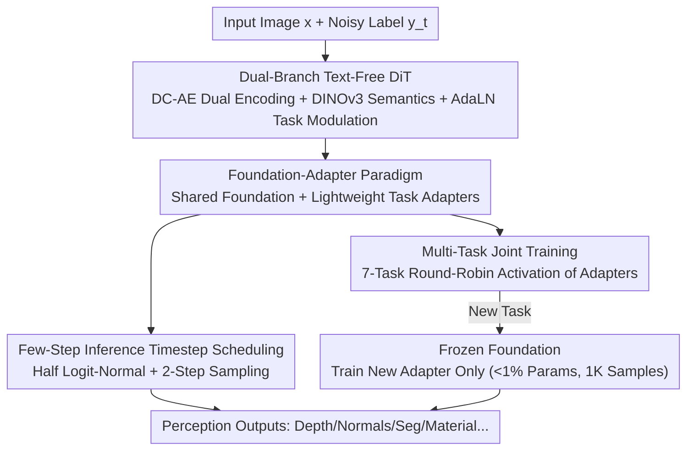

# UniPercept: A Unified Diffusion Model for Generalizable Visual Perception

**Conference**: CVPR 2026  
**Paper**: [CVF Open Access](https://openaccess.thecvf.com/content/CVPR2026/html/Zhao_UniPercept_A_Unified_Diffusion_Model_for_Generalizable_Visual_Perception_CVPR_2026_paper.html)  
**Code**: Project Page https://VIPL-GENUN.github.io/Project-UniPercept (Code to be confirmed)  
**Area**: Diffusion Models / Visual Perception  
**Keywords**: Diffusion Models, Visual Perception, Foundation-Adapter, Parameter-Efficient Fine-Tuning, Rectified Flow

## TL;DR
UniPercept transforms a DiT diffusion model into a universal visual perception framework using a "shared foundation + lightweight adapters." The foundation learns general perception priors through joint training on 7 tasks (depth, normals, albedo, segmentation, etc.). New tasks can be efficiently adapted by training a small adapter (<1% parameters) with only 1,000 samples. Across 14 tasks, it mostly outperforms unified generative models and approaches the performance of task-specific models.

## Background & Motivation
**Background**: Diffusion models excel at generation and capturing fine structural and semantic information. Recently, they have been widely adopted as "perception backbones"—recasting tasks like depth estimation, normal estimation, semantic segmentation, and intrinsic image decomposition (albedo/shading) as "image-to-image generation" problems, fine-tuning pretrained diffusion models for specific outputs (e.g., Marigold, Lotus, RGB2X, Diception).

**Limitations of Prior Work**: Existing diffusion-based perception methods fall into two suboptimal categories. The first trains a separate model for each task, leading to linear increases in GPU, data, and energy costs as tasks multiply. The second uses a single unified model for multiple tasks (e.g., Diception, OmniGen, OneDiffusion), which saves parameters but is structurally rigid—relying primarily on **text prompts** to distinguish tasks. This locks model generalization to "predefined text instructions," requiring full retraining or full-parameter fine-tuning to add new perception targets (e.g., roughness or metallicity in PBR materials).

**Key Challenge**: There is a tension between "unification" and "scalability." Text conditions allow multiple tasks to fit into one model but fix the task set. Supporting arbitrary new tasks without re-architecting the network is difficult because general perception knowledge (structure, semantics, geometry) and task-specific output formats are coupled within the same parameters, lacking a decoupled interface.

**Goal**: To create a "train once, adapt everywhere" framework where a foundation learns universal perception capabilities while new tasks are attached via minimal parameters and data with rapid convergence, without disrupting existing tasks.

**Key Insight**: The authors draw inspiration from parameter-efficient fine-tuning (adapters/LoRA) and ControlNet-style transfer (CTRL-Adapter)—placing "general knowledge" in a frozen large foundation and "task characteristics" in pluggable small modules. A key observation is that visual information alone suffices for perception; text conditions are redundant and less flexible than "adapters + task modulation."

**Core Idea**: Propose a foundation–adapter paradigm—a shared diffusion foundation captures cross-domain general perception representations, with each task equipped with a lightweight adapter (<1% parameters). For new tasks, the foundation remains frozen, and only the new adapter is trained.

## Method

### Overall Architecture
UniPercept models perception tasks as a **Rectified Flow**. For the $m$-th task, an ODE trajectory $dy^m_t = v_{\phi,\psi_m}(y^m_t, x, t)\,dt$ is established between Gaussian noise $y^m_1 \sim \mathcal{N}(0,I)$ and target labels $y^m_0$, conditioned on input image $x$. The velocity field $v_{\phi,\psi_m}$ is parameterized by a **shared foundation $\phi$** and a **task adapter $\psi_m$**. During inference, the ODE is solved from $t=1$ to $t=0$ to recover the labels. The system consists of three parts: a dual-branch DiT diffusion foundation (input image branch + label branch), a set of task-activated lightweight adapters, and a timestep sampling strategy aligned for few-step inference. The foundation is jointly trained on 7 base tasks to learn universal priors, while new tasks adapt by inserting a single new adapter.

### Key Designs

**1. Foundation–Adapter Paradigm: Decoupling "General Perception Knowledge" and "Task Characteristics"**

To address the issue of unified models being locked to specific tasks by text prompts, UniPercept splits the network: a **shared diffusion foundation $\phi$** handles cross-task general representations, and a set of **task adapters $\{\psi_m\}$** handles specific output characteristics. During foundation training, $\phi$ and all adapters are jointly optimized using the Flow Matching objective:

$$\min_{\phi,\psi_{1:M}}\ \mathbb{E}_{x,m,y^m_0,\epsilon,t}\big\|v_{\phi,\psi_m}(y^m_t,x,t)-(\epsilon-y^m_0)\big\|_2^2,\quad y^m_t=(1-t)y^m_0+t\epsilon.$$

When adapting to a new task, the foundation is frozen, and only a new adapter $\psi_\star$ is introduced and optimized via $\min_{\psi_\star}\mathbb{E}\|v_{\phi_{\text{frozen}},\psi_\star}(y^\star_t,x,t)-(\epsilon-y^\star_0)\|_2^2$. This is effective because the foundation extracts universal structural/semantic/geometric priors from 7 diverse tasks. New tasks do not learn perception from scratch; they converge on a single RTX 4090 with <1% parameters and ~1,000 samples. Ablations show that fine-tuning the Sana baseline on the DIS task takes 30,000 steps to match the performance UniPercept achieves in 1,000 steps.

**2. Dual-Branch Text-Free DiT Architecture: Visual-to-Visual without Redundant Text Conditions**

The foundation allows "images" and "labels" to interact within a DiT. Using Sana (DiT + compressed autoencoder + linear attention) as the backbone, it is modified into a **dual-branch** structure: image and label branches are encoded into latents via DC-AE, with domain-invariant positional encoding ensuring spatial alignment. High-level semantic features from a pretrained DINOv3 are injected into the image branch. Each DiT block uses **linear attention** for efficient cross-domain interaction and includes a Mix-FFN. A key decision is the **removal of text cross-attention**; the authors argue visual information is sufficient for perception. Task conditioning is implemented via **AdaLN-Zero**: for the $m$-th task, image branch embeddings $r_0$, label branch embeddings $r_m$, and timestep embeddings $e_t$ are combined to predict modulation parameters $(\gamma_m,\beta_m,\alpha_m)=\text{MLP}_{t}(e_t)+\text{MLP}_{r}(r_m)$. Feature normalization adapts to both the denoising stage and task condition. Adapters are bottleneck residual modules inserted within the linear attention and Mix-FFN: $h_{out}=h_{in}+\text{SiLU}(h_{in}W_{down})W_{up}$ with $W_{down}\in\mathbb{R}^{d\times r}$ and $W_{up}\in\mathbb{R}^{r\times d}$. With a bottleneck ratio $d/r=64$, new parameters are <1%.

**3. Multi-Task Joint Training + Unified RGB Label Representation: Sharing Supervision Sigals**

To address the vast differences in output formats across perception tasks, UniPercept does two things. First, **Unified Representation**: all labels are converted to a consistent 3-channel RGB format (e.g., single-channel depth is replicated; discrete labels like segmentation are rendered as color-coded RGB maps). Second, **Multi-Objective Joint Training**: the foundation is trained on 7 diverse base tasks (depth, normals, albedo, irradiance, semantic segmentation, line art, human skeleton). At each step, a task-specific adapter is dynamically activated in a round-robin fashion while foundation parameters are shared. This "feeds" the foundation a full spectrum of perception signals, forcing it to learn common cross-task representations. Ablations confirm this is not merely stacking tasks: higher task diversity improves generalization, and joint training leads to **positive synergy** rather than negative transfer (e.g., training on 7 tasks reduced depth AbsRel from 8.4 to 7.3 compared to depth-only training).

**4. Timestep Scheduling for Few-Step Inference: Aligning Training Distribution with Practical Usage**

The authors observed a counter-intuitive phenomenon: although models are trained for progressive denoising, **fewer inference steps often yield better quantitative results**. Standard timestep sampling during training does not match this few-step inference behavior, wasting modeling capacity in high-noise regions. The solution is **improved half logit-normal sampling**: sampling from the lower half $(0,0.5]$ of a logit-normal distribution and linearly mapping it back to the full $(0,1]$ interval. This "truncation + rescaling" concentrates training samples in high-noise regions ($t\to 1$), allowing the model to learn stronger global denoising dynamics early in the trajectory. This results in more stable and accurate 2-step sampling during inference. Evaluation uses **2-step sampling** with an ensemble of 6 noise initializations, allowing 1024×1024 resolution inference in 2.7s per image—significantly faster than RGB2X (15.4s) or PixWizard (43.3s).

### Loss & Training
The foundation uses the CAME-8bit optimizer with BF16 mixed precision, trained on 8×A6000 for 120K steps with a total batch size of 32. The learning rate is $1\times10^{-4}$ for the first 90K steps and decays to $1\times10^{-5}$ for the final 30K. New task adaptation takes 30K steps on a single RTX 4090 with a batch size of 4, training only the bottleneck-64× adapter. Images are scaled to ~1024px maintaining aspect ratios.

## Key Experimental Results

### Main Results
On foundation tasks, UniPercept is generally the best among unified frameworks and outperforms some specialized models. For normal estimation (lower mean angular error and higher accuracy are better):

| Dataset/Metric | UniPercept | OmniGen | PixWizard | Diception | Jodi | Specialized Lotus-G |
|--------|------|------|------|------|------|------|
| NYUv2 mean↓ | **17.2** | 28.9 | 23.5 | 18.3 | 21.1 | 16.5 |
| NYUv2 11.25°↑ | **55.6** | 18.1 | 33.9 | 52.5 | 47.7 | 59.4 |
| ScanNet mean↓ | **16.8** | 28.9 | 26.6 | 19.3 | 24.3 | 15.1 |
| iBims mean↓ | **17.9** | 31.3 | 22.5 | - | 20.1 | 17.2 |

UniPercept leads extensively among unified methods and even surpasses specialized models like StableNormal and Marigold. For depth tasks, it is the best unified framework and beats many specialized methods on DIODE (outdoor). For albedo/irradiance, it matches RGB2X using significantly fewer GT samples (23K vs 90K).

### Ablation Study
The "diversity" of foundation tasks determines generalization and task synergy:

| Config | Depth AbsRel↓ | Depth δ1↑ | Normal mean↓ | Normal 11.25°↑ |
|------|---------|---------|---------|---------|
| Depth Only | 8.4 | 92.7 | – | – |
| Normal Only | – | – | 18.5 | 49.3 |
| Depth+Normal+Albedo | 7.9 | 93.4 | 18.3 | 49.8 |
| All 7 Tasks | **7.3** | **94.8** | **17.4** | **54.4** |

In terms of data efficiency, new tasks approach full-training performance with only 1,000 samples. On edge detection (BSDS500), 1K data achieved an ODS of 0.810, surpassing the full-data score of 0.806 and the specialized PiDiNet (0.807). Training requires only 12.7M parameters, whereas competitors typically require >800M.

### Key Findings
- **Multi-tasking yields positive synergy**: Moving from single-task to 7-task joint training improved indicators across depth, normals, and albedo, proving tasks provide complementary supervision for a robust shared representation.
- **Foundation as a "Convergence Accelerator"**: On the DIS task, UniPercept converged in 1,000 steps, while fine-tuning the Sana baseline took 30,000 steps—a 30× efficiency gain from pretrained priors.
- **Wider adapter bottlenecks improve accuracy**: PSNR/SSIM improved as the bottleneck ratio moved from 16× to 128×, though even the widest adapters remain significantly smaller than competitor parameter counts.
- **Few-step inference is fast and accurate**: 2-step sampling with ensemble achieves 2.7s per 1024² image, 5~16× faster than RGB2X or PixWizard due to the aligned timestep scheduling.

## Highlights & Insights
- **"Removing Text Conditions" unlocked scalability**: Existing unified models use text as a task switch, locking the task set. UniPercept's text-free dual-branch approach with AdaLN modulation turns "adding a task" from a full-network overhaul into a "plug-in" operation, a clean application of PEFT to perception.
- **Foundation as a "Perception Prior Bank"**: Joint pretraining on 7 diverse tasks embeds structural, semantic, and geometric priors into the frozen foundation. New tasks (even distant ones like PBR roughness) can be mastered with 1K samples.
- **Engineering the "Few-step accuracy" paradox**: Converting the observation that fewer steps work better into a training-side half logit-normal scheduler is a simple but effective alignment trick for Rectified Flow perception models.

## Limitations & Future Work
- **Not a total replacement for specialized models**: In tasks like albedo (PSNR 16.8 vs Marigold's 18.2) or DIS segmentation (.896, far below BiRefNet), specialized SOTA models still maintain an edge.
- **Dependency on pseudo-label quality**: The foundation is pretrained using pseudo-labels from existing predictors like Depth Anything V2. The perception upper bound is effectively capped by these "teachers."
- **Lack of mechanistic explanation for "Few-step accuracy"**: The paper treats it as an empirical phenomenon without deep theoretical analysis.
- **Scalability limits of task modulation**: While 14 tasks work, the paper does not stress-test the foundation's capacity as the number of tasks/adapters continues to grow.

## Related Work & Insights
- **vs Diception / OmniGen / OneDiffusion**: These use a single model but rely on text prompts, making expansion costly. UniPercept's frozen foundation + lightweight adapters provide significantly higher flexibility and data efficiency.
- **vs Marigold / Lotus / RGB2X**: These specialize per task, leading to linear cost growth. UniPercept shares a foundation to amortize costs while matching or beating many specialized models.
- **vs CTRL-Adapter / LoRA / Adapter**: UniPercept adapts the idea of "adapters for transferability" from generation to visual perception, proving the PEFT paradigm can support a scalable general perception foundation.

## Rating
- Novelty: ⭐⭐⭐⭐ Introducing the foundation–adapter/PEFT paradigm into diffusion visual perception via a text-free dual-branch architecture is a clear new perspective.
- Experimental Thoroughness: ⭐⭐⭐⭐ Covers 14 tasks compared against multiple SOTAs. Includes extensive ablations on synergy, diversity, and efficiency.
- Writing Quality: ⭐⭐⭐⭐ Logical flow from motivation to architecture. Clear formulas and tables.
- Value: ⭐⭐⭐⭐ Provides a practical paradigm for low-cost adaptation to any dense prediction task, especially valuable for label-scarce scenarios.

<!-- RELATED:START -->

## Related Papers

- [\[ICLR 2026\] Reconciling Visual Perception and Generation in Diffusion Models](../../ICLR2026/image_generation/reconciling_visual_perception_and_generation_in_diffusion_models.md)
- [\[CVPR 2026\] Visual Diffusion Models are Geometric Solvers](visual_diffusion_models_are_geometric_solvers.md)
- [\[ICML 2026\] A Unified Framework for Diffusion Model Unlearning with f-Divergence](../../ICML2026/image_generation/a_unified_framework_for_diffusion_model_unlearning_with_f-divergence.md)
- [\[CVPR 2026\] GenErase: Generalizable and Semantically-Aware Concept Erasure in Diffusion Models](generase_generalizable_and_semantically-aware_concept_erasure_in_diffusion_model.md)
- [\[CVPR 2026\] RegionRoute: Regional Style Transfer with Diffusion Model](regionroute_regional_style_transfer_with_diffusion_model.md)

<!-- RELATED:END -->
