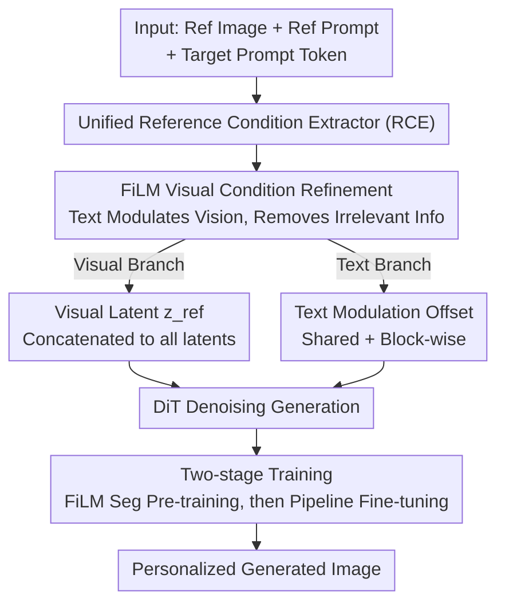

# UniVerse: A Unified Modulation Framework for Segmentation-Free, Disentangled Multi-Concept Personalization

**Conference**: CVPR 2026  
**Paper**: [CVF Open Access](https://openaccess.thecvf.com/content/CVPR2026/html/Phung_UniVerse_A_Unified_Modulation_Framework_for_Segmentation-Free_Disentangled_Multi-Concept_Personalization_CVPR_2026_paper.html)  
**Code**: To be confirmed (authors promised open-source code and pre-trained models)  
**Area**: Image Generation / Multi-concept Personalization  
**Keywords**: Subject-driven generation, Multi-concept personalization, Diffusion Transformer, Modulation, Segmentation-free

## TL;DR
UniVerse utilizes a unified "Reference Condition Extractor (RCE)" to simultaneously extract visual condition latent variables and text modulation offsets from **unsegmented in-the-wild photos** based on reference prompts. This achieves segmentation-free, disentangled, and composable multi-concept personalized generation on Diffusion Transformer, outperforming existing methods on XVerseBench and the newly proposed UniVerseBench.

## Background & Motivation

**Background**: Text-to-image personalization has evolved from early methods requiring per-subject fine-tuning (e.g., DreamBooth, Textual Inversion) to tuning-free methods like IP-Adapter, PhotoMaker, and PuLID, which directly inject visual features of reference images into the diffusion process. Recently, with the rise of Diffusion Transformers (DiT), unified transformer models such as OmniGen, UNO, and DreamO have emerged, capable of composing multiple concepts within a single image.

**Limitations of Prior Work**: Unified transformer models often suffer from **feature entanglement**, where attributes of one subject leak into another (concept leakage). Furthermore, their common use of global visual feature injection tends to degrade overall image quality. To mitigate entanglement, the latest "modulation" methods (TokenVerse, Mod-Adapter, XVerse) apply offsets only to the **text conditioning stream**, achieving high-precision, disentangled multi-subject control by refining text embeddings.

**Key Challenge**: However, these modulation methods introduce a critical limitation — they **almost entirely require clean, pre-segmented reference images**. In contrast, real-world "in-the-wild" photos are cluttered, multi-object, and unsegmented. A long-overlooked issue is that extracting the correct concept from a cluttered reference image cannot rely on a generalized word label (e.g., "person" cannot specify "the man on the left" in a group photo) nor on a segmentation mask (as abstract concepts like artistic style, texture, or material cannot be segmented).

**Goal**: To achieve truly segmentation-free in-the-wild subject-driven generation that can (i) accurately localize/disentangle target concepts in cluttered images, (ii) support both concrete objects and abstract attributes (style, pose, material), and (iii) both decompose and recompose concepts.

**Key Insight**: Previous works either focus solely on visual conditions, solely on text modulation, or loosely concatenate the two. The authors' key observation is that visual appearance and text semantics **should be collaboratively produced and semantically aligned by the same module, guided by a reference prompt**, ensuring consistent constraints on the generation process.

**Core Idea**: Use a unified Reference Condition Extractor (RCE) to simultaneously produce "visual condition latents $z_{ref}$ (managing appearance)" and "text modulation offsets $\tilde\Delta$ (managing semantics)" under the guidance of a reference prompt. These are semantically aligned, enabling segmentation-free disentanglement and recomposition of multiple concepts.

## Method

### Overall Architecture
UniVerse is built upon the modulation mechanism of DiT. In DiT, conditioning information (e.g., CLIP text embeddings, timestep $t$) is injected via Adaptive LayerNorm (AdaLN), where an MLP maps the context into a vector $y=\text{MLP}(t, f(p))$, which is then split into scale and shift parameters to modulate network activations. TokenVerse innovated by learning a personalized offset $\Delta$ for **each text token**, making $\tilde y_i = y + \tilde\Delta_i$; XVerse further used a general adapter to generate offsets $\tilde\Delta_i$ zero-shot from reference images $I_i$.

UniVerse extends this with two features: ① The input includes not only the reference image $I_i$ and corresponding token $p_i$, but also a **reference prompt $r_i$** to tell the model "which concept to extract from this reference image" (e.g., if a man is "sitting on the grass" in the reference image but the target prompt requires him to "ride a horse," the reference prompt helps decouple the concept from the action). ② The RCE outputs two branches of conditions — text offsets $\tilde\Delta_i$ are injected into the modulation path, while visual latents $z_{ref}$ are concatenated to all latent inputs for denoising. This process is implemented through two-stage training.

### Key Designs

**1. Reference Condition Extractor (RCE): Simultaneous production of semantically aligned visual and text conditions**

To address the issue of misaligned visual and text conditions, RCE unifies both branches within a single module guided by the same reference prompt. Specifically, a CLIP image encoder extracts reference image features $F=f_V(I)\in\mathbb{R}^{N\times D}$, and a CLIP text encoder extracts reference prompt features $x=f_T(r)\in\mathbb{R}^{D}$. These are first fused in the visual refinement module (see Design 2) before splitting into visual latent and text offset paths. The resulting conditions are naturally aligned because they originate from the same refined features anchored to the "concept specified by the reference prompt," rather than loosely concatenating visual features and text modulation. This is the root of UniVerse's ability to "extract the right concept" in cluttered images and its prerequisite for being segmentation-free: the reference prompt replaces the localization role of a mask.

**2. FiLM Visual Refinement: Letting text tell vision "what to keep and what to discard"**

Visual features from cluttered reference images contain substantial information irrelevant to the target concept (background, other objects), which can cause leakage if injected directly. UniVerse uses Feature-wise Linear Modulation (FiLM) to let text features modulate visual features: for each visual vector $F_j$,

$$\text{FiLM}(F_j, x) = g_i(x) F_j + h_i(x)$$

where the scale function $g(\cdot)$ and shift function $h(\cdot)$ are generated from the text feature $x$, performing channel-wise scaling/shifting of visual vectors to suppress non-target information and retain target information. The refined visual features are then projected by an MLP into the DiT latent space as $z_{ref}$. Compared to using raw CLIP visual features, this step acts as a "text-guided soft segmentation," eliminating the need for actual segmentation masks.

**3. Dual-Offset Text Modulation: Splitting into "Shared + Block-wise" offsets based on XVerse**

For text conditioning, UniVerse follows XVerse's approach by using a Perceiver layer to inject visual features into the T5 embeddings of token $p_i$, with two modifications: first, the features injected are the FiLM-refined visual features; second, it learns **two** modulation offsets for each reference token — a **shared** offset $\tilde\Delta_i^s$ across all DiT blocks, and a **block-exclusive** offset $\tilde\Delta_i^j$. The final modulation vector for the $i$-th token in the $j$-th block is:

$$\tilde y_i^j = y + \tilde\Delta_i^s + \tilde\Delta_i^j$$

The shared offset maintains a consistent concept identity across layers, while the block-wise offset handles fine-grained adaptation at different depths. Their combination provides finer control than a single offset while preserving identity. This is reflected in the two-step training process (see Training Strategy).

**4. Two-stage Training + Cross-Reference Augmentation: Learn to localize, then learn to generate**

Training "concept localization" and "image generation" simultaneously is difficult for convergence. UniVerse splits this into two stages: **Stage 1 (RCE Pre-training)** trains only the FiLM module on the large-scale referring expression dataset PhraseCut, using an additional CLIPSeg decoder supervised by a binary cross-entropy segmentation loss $\mathcal{L}_{seg}$. This forces FiLM to learn to "localize a coarse mask of the concept based on text." **Stage 2 (Fine-tuning)** freezes all encoders, initializes FiLM with Stage 1 weights, and trains the remaining RCE components from scratch, adding rank=128 LoRA to the DiT. It uses the standard diffusion loss $\mathcal{L}_{diff}$ for joint training on a self-constructed multi-concept dataset. Additionally, because multi-concept samples are scarce, the authors **horizontally stitch** multiple reference images into one to force the model to learn concept extraction from mixed images, termed **Cross-Reference** augmentation. Ablations show that removing either pre-training or Cross-Reference causes performance drops, proving that the localization-then-generation decomposition and augmentation are necessary.

### Loss & Training
- Stage 1: Only trains FiLM + CLIPSeg decoder, loss is segmentation BCE $\mathcal{L}_{seg}$; 10 epochs, lr $1\times10^{-4}$, cosine schedule, best epoch selected by validation IoU.
- Stage 2: Trains entire RCE + DiT (encoders frozen), loss is diffusion loss $\mathcal{L}_{diff}$; total 150K steps (first 100K for shared offset, last 50K for joint shared + block-wise); lr $5\times10^{-6}$, AdamW, batch size 16, 8×A100. DiT uses LoRA (rank 128) to adapt to new conditions.

## Key Experimental Results

### Main Results
On XVerseBench (comprehensive metrics including DPG/ID-S/IP-S/AES via VLM-as-judge), UniVerse achieves the highest total average scores for both single and multi-subject settings:

| Setting | Metric | UniVerse | Runner-up (XVerse) | Description |
|------|------|----------|--------------|------|
| Single subject | Avg↑ | **78.14** | 74.36 | Leads 2nd place by >3 points; ID-S/IP-S significantly strongest |
| Multi-subject | Avg↑ | **70.18** | 67.93 | Leads all baselines by >2 points |
| Overall | Overall↑ | **74.16** | 71.15(XVerse) | Ranks first overall |

On the self-constructed UniVerseBench (specifically testing "disentangling co-occurring concepts in the same reference image" using IP-S/AES), it also leads across the board:

| Setting | Metric | UniVerse | Runner-up | Description |
|------|------|----------|------|------|
| Single subject | Avg↑ | **53.06** | 51.72(MS-Diffusion) | |
| Multi-subject | Avg↑ | **48.64** | 48.21(OmniGen) | |
| Overall | Overall↑ | **51.05** | 50.49(MS-Diffusion) | Strongest ability to disentangle co-occurring concepts |

UniVerseBench consists of 20 reference images and 200 prompts, each reference image containing two co-occurring subjects, forcing the model to extract correct concepts under ambiguous conditions—a dimension insufficiently covered by existing benchmarks.

### Ablation Study
On UniVerseBench multi-object settings (Avg 48.64 is the full model):

| Config | Avg↑ | ΔAvg | Description |
|------|------|------|------|
| Baseline (Full) | 48.64 | 0.00 | Full model |
| w/o RCE Pre-training | 47.89 | -0.75 | Removed Stage 1 localization pre-training |
| w/o Cross-Reference | 47.90 | -0.74 | Removed horizontal stitching augmentation |
| w/o Visual Latent (Inf) | 47.14 | **-1.50** | Not using $z_{ref}$ during inference; largest drop |

### Key Findings
- **Visual Latent $z_{ref}$ contributes most**: Removing it during inference leads to a 1.50 drop, far exceeding the impact of removing pre-training (-0.75) or Cross-Reference (-0.74). This confirms that text modulation alone is insufficient and visual conditions are vital for appearance fidelity—validating the "dual-path unified" design over "text-only modulation."
- **Auxiliary designs each contribute ~0.75 points**: RCE pre-training and Cross-Reference augmentation show similar positive impacts, verifying that both the localization-then-generation decomposition and data augmentation are essential.
- **Composition capacity has a ceiling**: UniVerse reliably maintains identity fidelity for up to 6 subjects; when the number of objects increases to 7–9, identity crosstalk or instance omission occurs, representing the current capability ceiling.
- **Generalization to abstract concepts**: Beyond discrete objects, UniVerse can disentangle/combine abstract attributes like pose and material (the only method in Table 1 supporting both "concept decomposition" and "abstract concepts").

## Highlights & Insights
- **"Reference prompt replaces segmentation mask" is the core insight**: Using natural language descriptions to localize concepts allows for specifying "the person on the left" in a group photo and handling unsegmentable abstract concepts like style/material. This bypasses the reliance of modulation methods on pre-segmentation—the true key to enabling in-the-wild scenarios.
- **Single module producing semantically aligned dual conditions**: Previously, "visual injection" and "text modulation" were two separate mechanisms. UniVerse ties them together with an RCE guided by the same reference prompt, ensuring that visual appearance and text semantics point to the same concept and avoiding inconsistencies from loose concatenation. This "unified extraction" idea is transferable to any controllable generation task requiring multi-modal condition collaboration.
- **FiLM as "soft segmentation" is clever**: Interpreting the FiLM modulation of visual features by text as a learnable, mask-free content filter is a clean way to replace segmentation supervision with modulation mechanisms.
- **Shared + Block-wise dual offsets**: Decoupling "cross-layer consistent identity" and "layer-wise fine-grained adaptation" into two offsets and mapping them to two-stage training steps is a simple yet effective upgrade over XVerse's single offset.

## Limitations & Future Work
- **Lack of segmentation-free multi-reference benchmarks**: The authors acknowledge the field lacks a comprehensive benchmark for "3+ concepts with multiple attributes per concept." UniVerseBench is still relatively small (20 images / 200 prompts).
- **Concept interference not fully resolved**: The model is not perfectly robust against concept leakage; restrictive prompts like "just the cat" are sometimes needed. Performance drops with vague or meaningless prompts, and the model occasionally overfits to a single reference subject.
- **Composition count limits**: Crosstalk/omissions occur beyond 6 objects, making it unreliable for high-density multi-subject scenes (e.g., large group photos, complex product images).
- **Potential improvements**: ① Pinpoint whether the composition bottleneck is in latent concatenation dilution or offset superposition interference to perform targeted scaling; ② Replace CLIPSeg supervision with stronger open-vocabulary localizers to improve localization of long-tail/fine-grained concepts; ③ Construct larger-scale, multi-attribute-labeled, segmentation-free multi-reference benchmarks.

## Related Work & Insights
- **vs XVerse / TokenVerse (Modulation methods)**: These rely on pure text token modulation for disentangled personalization but require clean, pre-segmented reference images. UniVerse adopts the modulation idea but adds "segmentation-free localization + visual appearance conditions" via the reference prompt + FiLM refinement + visual latent, enabling in-the-wild operation and higher appearance fidelity (XVerse is runner-up on both benchmarks).
- **vs UNO / DreamO / OmniGen (Unified Transformers)**: These use attention conditioning to compose multiple concepts but suffer from feature entanglement and quality degradation from global injection. UniVerse's unified dual-condition + FiLM soft segmentation significantly reduces leakage, leading in multi-subject scores.
- **vs IP-Adapter / PhotoMaker / PuLID (U-Net injection methods)**: These are based on U-Net with weaker text encoders, limiting complex composition and fine-grained semantic control. UniVerse's modulation directly on DiT provides better scalability and multi-concept capabilities.
- **Insight**: The paradigm of "using a reference prompt instead of a segmentation mask for concept localization" can be extended to controllable editing, compositional generation, and any stage in 3D/video personalization that requires "picking the target from cluttered inputs."

## Rating
- Novelty: ⭐⭐⭐⭐ "Unified module producing semantically aligned visual+text dual conditions" and "reference prompt replacing masks" represent substantial breakthroughs for modulation methods, though components like FiLM, Perceiver, and two-stage training are clever combinations of existing techniques.
- Experimental Thoroughness: ⭐⭐⭐⭐ Uses two public benchmarks plus the custom UniVerseBench, including ablation and composition capacity analysis; however, UniVerseBench is small, and DreamBench++ results were moved to the supplementary material.
- Writing Quality: ⭐⭐⭐⭐ Clear motivation chain (fine-tuning → tuning-free → unified Transformer → modulation → segmentation-free). Method diagrams correspond well with the text, though some details (Perceiver specifics, dataset construction) are in the supplement.
- Value: ⭐⭐⭐⭐ Directly addresses the high-value practical pain point of in-the-wild multi-concept personalization. The combination of segmentation-free and abstract concept support is highly significant for real-world applications. Promised open-source.

<!-- RELATED:START -->

## Related Papers

- [\[ICLR 2026\] Mod-Adapter: Tuning-Free and Versatile Multi-concept Personalization via Modulation Adapter](../../ICLR2026/image_generation/mod-adapter_tuning-free_and_versatile_multi-concept_personalization_via_modulati.md)
- [\[CVPR 2026\] Unified Customized Generation by Disentangled Reward Modeling](unified_customized_generation_by_disentangled_reward_modeling.md)
- [\[CVPR 2026\] UniVerse: Empower Unified Generation with Reasoning and Knowledge](universe_empower_unified_generation_with_reasoning_and_knowledge.md)
- [\[CVPR 2026\] A Training-Free Style-Personalization via SVD-Based Feature Decomposition](a_training-free_style-personalization_via_svd-based_feature_decomposition.md)
- [\[CVPR 2026\] Omni-Attribute: Open-vocabulary Attribute Encoder for Visual Concept Personalization](omni-attribute_open-vocabulary_attribute_encoder_for_visual_concept_personalizat.md)

<!-- RELATED:END -->
