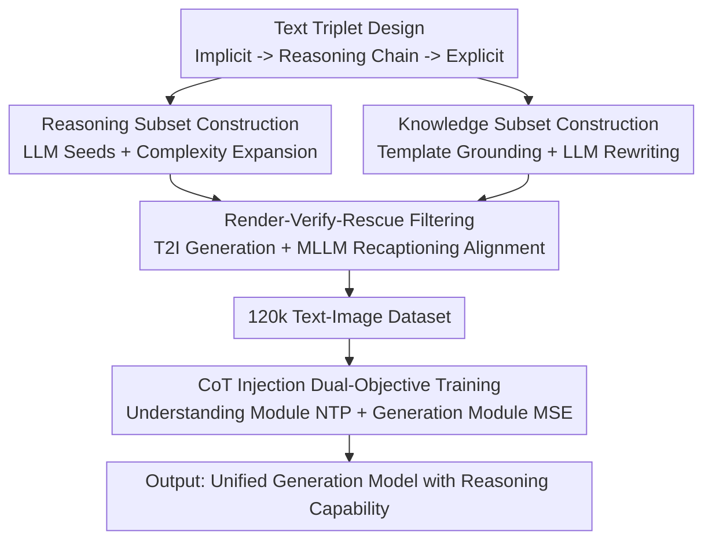

# UniVerse: Empower Unified Generation with Reasoning and Knowledge

**Conference**: CVPR 2026  
**Paper**: [CVF Open Access](https://openaccess.thecvf.com/content/CVPR2026/html/Sun_UniVerse_Empower_Unified_Generation_with_Reasoning_and_Knowledge_CVPR_2026_paper.html)  
**Code**: https://github.com/KaiyueSun98/UniVerse  
**Area**: Image Generation  
**Keywords**: Unified Multimodal Model, Text-to-Image (T2I), Reasoning Enhancement, Chain-of-Thought (CoT), Dataset

## TL;DR
Addressing the issue where unified multimodal models "understand complex prompts but fail to generate correctly," this paper constructs UniVerse—a dataset of 120k samples consisting of "implicit prompt → reasoning chain → explicit prompt" triplets paired with ground-truth images. By proposing CoT injection training to explicitly integrate the reasoning process into the generation pipeline, the authors significantly and consistently improve the reasoning and knowledge-based generation of Bagel on WISE and R2I-Bench.

## Background & Motivation
**Background**: Unified Multimodal Models (UMM, e.g., Bagel) integrate "understanding" and "generation" into a single framework, theoretically enabling them to both interpret complex intentions and visualize them.

**Limitations of Prior Work**: In practice, a gap exists between these two capacities—models can parse implicit intentions on the understanding side but fail to generate correctly, especially when prompts require multi-step reasoning (arithmetic, spatial constraints, causality) or specialized knowledge (physics, chemistry, entity features). For instance, given "draw the integer part of Euler’s number $e$ pillows," models often draw many pillows without calculating $\lfloor e \rfloor = 2$.

**Key Challenge**: Existing "reasoning-oriented" datasets often mistake "linguistic complexity" for "genuine reasoning." The implicit prompts in such data can often be understood without deep reasoning; the so-called explicit prompts are merely verbose expansions of the original input. The task degrades into paraphrasing rather than logical deduction. This paper terms this "pseudo-reasoning."

**Goal**: (1) Construct a large-scale dataset that genuinely forces models to perform logical deduction and knowledge retrieval; (2) Develop a training method that explicitly injects the reasoning process into the generation chain rather than only testing the model during evaluation.

**Key Insight**: The authors hypothesize that bridging the gap between implicit intention and faithful imagery requires a "progressive reasoning chain." Consequently, they organize each sample into a text triplet of "implicit prompt + reasoning chain + explicit prompt," mandating that the data contains elements where "failure to reason leads to failure to generate."

**Core Idea**: Use "implicit → reasoning chain → explicit" triplet data with a dual-objective CoT injection training to explicitly transfer reasoning capabilities from the understanding side to the generation side.

## Method

### Overall Architecture
UniVerse consists of two parts: a meticulously constructed dataset and a training methodology to utilize it. On the data side, 120k samples are divided into two categories based on capabilities: a **Reasoning Subset** (65k samples covering arithmetic, spatial-attribute constraints, deduction, and abduction) and a **Knowledge Subset** (55k samples covering disciplines, entities, and spatio-temporal facts). Each sample is an "implicit prompt → reasoning chain → explicit prompt" triplet paired with a ground-truth image. These are produced via different pipelines: the reasoning subset is LLM-driven (seeds + complexity expansion), while the knowledge subset utilizes template grounding + LLM rewriting (to prevent LLM hallucinations regarding professional knowledge). Both streams converge into a "Render-Verify-Rescue" filtering pipeline to ensure text-image alignment. Once ready, **CoT Injection Training** is performed on Bagel: the understanding module learns to generate reasoning chains + explicit prompts from implicit ones (NTP loss), while the generation module reconstructs the ground-truth image conditioned on this CoT (MSE loss).

### Key Designs

**1. Text Triplets: Embedding "Reasoning" into the Data Itself**

To address "pseudo-reasoning," the authors require that each sample must satisfy the condition: "failure to reason makes the implicit prompt incomprehensible." Each segment of the triplet serves a specific function: the implicit prompt $p_{imp}$ hides the answer within premises, rules, constraints, or knowledge (e.g., "6 items with 17 wheels, 1 more bicycle than shopping carts"); the reasoning chain $r$ provides the logical trajectory from premises to conclusion (solving $b+t+c=6, 2b+3t+4c=17, b=c+1$ to find 2 bicycles, 3 tricycles, 1 shopping cart); and the explicit prompt $p_{exp}$ provides the clear, direct visual description. Crucially, **knowledge** and **reasoning** are decoupled at the design level. While knowledge acts as a premise, "applying logic to satisfy constraints and construct explanations" is an independent capability. Thus, the two subsets are evaluated separately.

**2. Reasoning Subset: Controlled Expansion via LLM Seeds + Complexity Inflation**

Reasoning samples must be both diverse and difficult. The authors use a two-stage "seed + inflation" process: for each subcategory and complexity level, 2-3 seed prompts are handwritten with instructions. An LLM first generates hundreds of base samples to ensure diversity. Then, an iterative expansion strategy uses these as exemplars to guide the generation of more samples at the same level, expanding the pool to approximately $10^3$ per subcategory. Complexity is controlled via explicit parameters (e.g., steps in arithmetic, number of objects in spatial constraints), ensuring controllable coverage rather than random generation.

**3. Knowledge Subset: Template Grounding + LLM Rewriting**

Generating knowledge-based prompts directly from LLMs is prone to factual errors or hallucinations (especially in math and science). The authors use a hybrid "template grounding" method: they design structured templates for each knowledge category (disciplines, spatio-temporal, entities), anchoring abstract knowledge in variable contexts (e.g., specific chemical reactions, historical dates/locations). Legitimate, manually verified elements are then programmatically rolled into these templates. To overcome the rigidity of templates, an LLM rewrites the text using high-temperature sampling to create creative, synonymous expressions while preserving core facts. Finally, the same LLM produces the corresponding reasoning chains and explicit prompts.

**4. Render-Verify-Rescue Pipeline: Ensuring Alignment via MLLM Closed-Loop**

To ensure faithful ground-truth images, the authors render all triplets using SOTA T2I models (e.g., Nano-Banana, HunyuanImage-3.0) and perform two-level verification. First, an MLLM recaptions the generated image and calculates the semantic similarity between the recaption and the original explicit prompt. Samples with high alignment are kept. For misaligned samples, the MLLM evaluates image quality; if quality is acceptable, the **implicit prompt and reasoning chain are adjusted** to align with the MLLM's recaption, which becomes the new explicit prompt. This "rescues" samples that would otherwise be discarded.

**5. CoT Injection Dual-Objective Training: Explicitly Connecting Reasoning to Generation**

Bagel supports both "with thought" (generating CoT before drawing) and "without thought" modes. The authors inject their CoT into the generation chain and optimize two objectives in parallel. The **Understanding Module** calculates a Next-Token-Prediction loss $\mathcal{L}_{NTP}$ by taking the implicit prompt as input and the "reasoning chain $\oplus$ explicit prompt" as the target. The **Generation Module** uses the generated CoT content as condition input to reconstruct the ground-truth image using an MSE loss $\mathcal{L}_{MSE}$. The total loss is:

$$\mathcal{L}_{total} = \lambda_{NTP}\,\mathcal{L}_{NTP} + \lambda_{IMG}\,\mathcal{L}_{MSE}$$

Experimentally, $\lambda_{NTP}=0.1$ and $\lambda_{IMG}=1$ are used. This allows the model to learn detailed reasoning through text supervision while generating more faithful images through CoT.

### Loss & Training
Beyond the $\mathcal{L}_{total}$ mentioned above, the authors emphasize two engineering points: (1) thorough data shuffling across all batches to ensure stable convergence and prevent overfitting to specific categories; and (2) a learning rate schedule with a long warm-up (approximately 20% of total steps) to allow the model to adapt to dual-objective optimization before LR decay.

## Key Experimental Results

### Main Results
Using Bagel as the base model, evaluations were conducted on WISE (world knowledge) and R2I-Bench (multi-step reasoning) under both "without thought" and "with thought" modes. The table below shows the Overall scores (higher is better):

| Mode | Model | WISE Overall | R2I-Bench Overall |
|------|------|------|------|
| Without Thought | BAGEL Baseline | 0.52 | 0.36 |
| Without Thought | w/o CoT Training | 0.55 | 0.40 |
| Without Thought | **w/ CoT Training (Ours)** | **0.56** | **0.44** |
| With Thought | BAGEL Baseline | 0.70 | 0.48 |
| With Thought | w/o CoT Training | 0.74 | 0.51 |
| With Thought | **w/ CoT Training (Ours)** | **0.77** | **0.54** |

The improvement on R2I-Bench is most significant: +0.08 (0.36→0.44) without thought and +0.06 (0.48→0.54) with thought. The Causal (CA) category saw a massive jump from 0.35 to 0.69, indicating the model learned "why" to draw things rather than just "what" to draw.

### Ablation Study
Table 2 compares training effects using different data categories on WISE (With Thought):

| Training Data | WISE Score | Notes |
|------|---------|------|
| Arithmetic | 0.72 | Arithmetic reasoning only |
| Arithmetic (No Rescue) | 0.71 | Removing rescued samples drops performance by 0.01 |
| Spatial-Attr | 0.72 | Spatial-attribute constraints only |
| Discipline | 0.73 | Discipline knowledge only |
| Reasoning Subset | 0.74 | Entire reasoning subset |
| Knowledge Subset | 0.73 | Entire knowledge subset |
| **All Data** | **0.77** | Full UniVerse dataset |

### Key Findings
- **CoT injection yields the highest returns in "With Thought" mode**: The gap between Ours and the baseline widens when thinking is enabled, suggesting the training fosters a generalizable reasoning mechanism.
- **Full data exceeds any single category**: While single categories improve performance (0.72~0.74), the full collection reaches 0.77, indicating complementarity.
- **Rescued samples are not noise**: Including samples rescued by the MLLM outperforms discarding them, validating the quality and utility of the correction pipeline.

## Highlights & Insights
- **Accurate identification of "pseudo-reasoning"**: Distinguishing between linguistic complexity and actual reasoning, and using hard constraints (requiring reasoning to decode prompts) to ensure data quality, is the sharpest insight of this work.
- **Data-Training Closed-Loop**: The method doesn't just provide data but offers a paradigm for *how* to use reasoning chains (NTP for the chain, MSE conditioned on it), internalizing the "thought mode" into the training phase.
- **Targeted Construction Pipelines**: Using LLMs for reasoning and template grounding for knowledge shows a sophisticated understanding of data engineering—choosing the right tool for the specific trait of the information.

## Limitations & Future Work
- **Dependence on the base model's internal thinking capability**: Gains are highest in Bagel's "thought mode." Portability to models without explicit CoT support remains unverified.
- **Ground-truth images are synthetic**: Since the 120k images come from other T2I models, the ceiling is limited by those models' biases and capabilities.
- **Absolute scores remain low**: R2I-Bench only reaches 0.54, and math (MT) is still near 0.30, showing that complex reasoning in generation is far from "reliable."
- **Future Directions**: Exploring multi-judge ensembles for filtering, curriculum learning for varying reasoning lengths, and validation on stronger UMMs with native long CoT support.

## Related Work & Insights
- **vs. Commonsense-T2I / WISE / R2I-Bench**: These are evaluation benchmarks that "test" models; this work provides the large-scale annotated data to "teach" them.
- **vs. Multi-modal CoT Guidance**: While similar in using CoT, this work internalizes the CoT as a training target for both understanding and generation modules, rather than just using it at inference.
- **vs. RLHF / DPO**: While preference optimization aligns models with human signals, this data-centric approach activates the understanding modality's internal knowledge to assist generation.

## Rating
- Novelty: ⭐⭐⭐⭐ Critique of "pseudo-reasoning" + triplet design + CoT injection training is solid and addresses a genuine problem.
- Experimental Thoroughness: ⭐⭐⭐⭐ Dual benchmarks, two reasoning modes, and thorough ablation/rescue validation, though limited to one base model.
- Writing Quality: ⭐⭐⭐⭐ Clear motivation and well-explained pipelines.
- Value: ⭐⭐⭐⭐ Provides reusable data assets and training paradigms for unified models, pushing the boundary of reasoning-oriented T2I.

<!-- RELATED:START -->

## Related Papers

- [\[CVPR 2026\] Thinking-while-Generating: Interleaving Textual Reasoning throughout Visual Generation](thinking-while-generating_interleaving_textual_reasoning_throughout_visual_gener.md)
- [\[CVPR 2026\] UniVerse: A Unified Modulation Framework for Segmentation-Free, Disentangled Multi-Concept Personalization](universe_a_unified_modulation_framework_for_segmentation-free_disentangled_multi.md)
- [\[CVPR 2026\] ParaUni: Enhance Generation in Unified Multimodal Model with Reinforcement-driven Hierarchical Parallel Information Interaction](parauni_enhance_generation_in_unified_multimodal_model_with_reinforcement-driven.md)
- [\[CVPR 2026\] Evaluating Reasoning Fidelity in Visual Text Generation](evaluating_reasoning_fidelity_in_visual_text_generation.md)
- [\[CVPR 2026\] ReasonEdit: Towards Reasoning-Enhanced Image Editing Models](reasonedit_towards_reasoning-enhanced_image_editing_models.md)

<!-- RELATED:END -->
