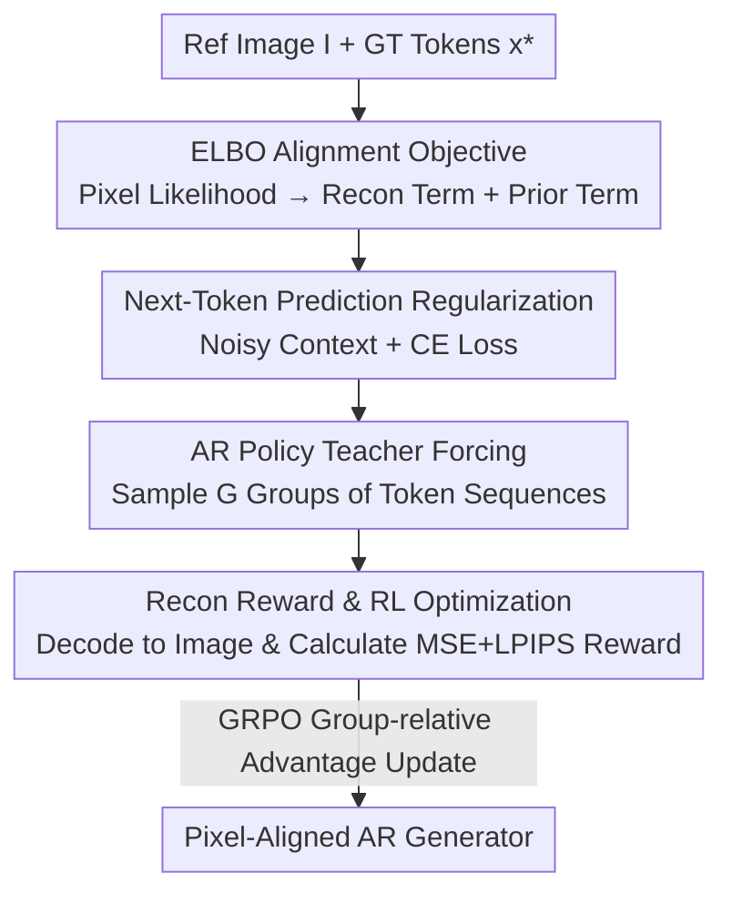

# VA-π: Variational Policy Alignment for Pixel-Aware Autoregressive Generation

**Conference**: CVPR 2026  
**Paper**: [CVF Open Access](https://openaccess.thecvf.com/content/CVPR2026/html/Liao_VA-p_Variational_Policy_Alignment_for_Pixel-Aware_Autoregressive_Generation_CVPR_2026_paper.html)  
**Code**: https://github.com/LilShake/VA-Pi  
**Area**: Image Generation / Autoregressive Generation / RL Alignment  
**Keywords**: Autoregressive image generation, tokenizer alignment, pixel-space alignment, ELBO, GRPO

## TL;DR
In autoregressive (AR) image generation, the training objectives for the tokenizer and the generator are disconnected (one learns pixel reconstruction, the other learns token likelihood). VA-π formulates their alignment as a variational objective (ELBO) and utilizes reinforcement learning to treat "whether decoding can reconstruct the original image" as a pixel-level reward to fine-tune the AR generator. Using only 1% of ImageNet data for 25 minutes, it reduces the FID of LlamaGen-XXL from 14.36 to 7.65.

## Background & Motivation

**Background**: Modern AR visual generation follows a two-stage pipeline. The first stage trains a discrete tokenizer: an encoder $\mathcal{E}$ compresses the image into a sequence of discrete tokens, and a decoder $\mathcal{D}$ reconstructs the image from these tokens. The second stage trains an AR model $\pi_\theta$ to fit the distribution of these discrete tokens. During inference, tokens are sampled autoregressively one by one and passed to the decoder to recover the image. This paradigm naturally fits the LLM architecture and is the mainstream route for unified multimodal models (such as Janus-Pro).

**Limitations of Prior Work**: The optimization objectives of the two stages are misaligned. The tokenizer is trained to "reconstruct a clean image given ground-truth tokens," while the AR generator is only optimized for "token sequence likelihood." **The entire training process lacks pixel-space supervision signals**. Consequently, the AR generator can produce token sequences with high likelihood that decode into images full of artifacts and poor perceptual quality. The authors refer to these as **off-manifold token sequences**, which deviate from the real image manifold and result in incoherent visual structures.

**Key Challenge**: Previous works either modify the generator (injecting noise into the token context or shuffling token order to enhance robustness) or modify the tokenizer (making the decoder more tolerant of "dirty" tokens sampled from the generator). However, these are workarounds. Injecting noise merely makes the model more robust to corrupted sequences without directly eliminating pixel-level misalignment. Tokenizer modifications only make the decoder more "forgiving" but do not prevent the AR generator from generating off-manifold sequences in the first place; furthermore, excessive noise can over-smooth the token-to-pixel mapping, leading to blurrier reconstructions.

**Goal**: Can an objective function be designed to directly align token-level modeling with pixel-level distributions, thereby suppressing off-manifold sequences at the root?

**Key Insight**: The discrete token sequence generated by the AR model can be viewed as a **latent variable** of the pixel-level image. This allows the image likelihood to be expressed as a tractable Evidence Lower Bound (ELBO): the pixel reconstruction term produced by the tokenizer decoder corresponds to the reconstruction term of the ELBO, and the likelihood objective of the AR model corresponds to the prior term for maintaining the token distribution—unifying both into a single objective.

**Core Idea**: Treat "how well the tokens sampled by the AR generator under teacher forcing can be decoded back to reconstruct the original image" as an **intrinsic pixel-level reward**. Maximize this using reinforcement learning while using a prior regularization term to tether the policy to the original AR distribution. In short: **Supplement the AR generator with pixel-level supervision it never had, using pixel reconstruction rewards + RL.**

## Method

### Overall Architecture
VA-π is a **lightweight post-training framework**: it does not retrain the tokenizer or introduce external reward models, but only fine-tunes the existing AR generator. Starting from the intractable goal of "directly maximizing pixel-space likelihood," it derives an ELBO split into two trainable signals—a pixel-space reconstruction objective and a token-level regularization to maintain the AR prior. Since the reconstruction term is non-differentiable (quantization and discrete sampling block gradients), it is treated as a **reward** for reinforcement learning. The regularization term degrades into a next-token prediction loss with noisy contexts. Finally, GRPO is used to integrate both into a stable training workflow.

Data flow for one iteration: Given a reference image $I$ and its ground-truth tokens $\mathbf{x}^*=\mathcal{Q}(\mathcal{E}(I))$, noise is added to the context to obtain $\tilde{\mathbf{x}}^*$. The AR policy calculates logits under teacher forcing and samples $G$ token sequences. Each sequence is decoded back into an image to calculate the reconstruction reward $R=-(\mathcal{L}_{\text{MSE}}+\lambda_p\mathcal{L}_p)$. Simultaneously, a cross-entropy (CE) regularization branch constrains the token distribution. Policy updates are performed using the group-relative normalized advantages of GRPO.

### Key Designs

**1. Formulating Tokenizer–Generator Alignment as ELBO: Unifying Pixel Reconstruction and Token Likelihood**

The problem is the lack of pixel supervision in the two-stage pipeline. The authors resolve this by treating the discrete token sequence $\mathbf{x}$ as a latent variable of the image $I$, so the pixel likelihood to be maximized is $p(I;\theta,\phi)=\sum_{\mathbf{x}} p_\phi(I\mid\mathbf{x})\,\pi_\theta(\mathbf{x})$, where $\pi_\theta$ is the token likelihood from the AR model and $\phi$ is the pixel likelihood from the frozen decoder. This integral over the token space is intractable, so a variational posterior learned by the AR model under **teacher forcing** is introduced:

$$q_{\psi,\theta}(\mathbf{x}\mid I)=\prod_{i=1}^{N}\pi_\theta(\mathbf{x}_i\mid \mathbf{x}^*_{1:i-1}),\quad \mathbf{x}^*=\mathcal{Q}(\mathcal{E}_\psi(I))$$

Crucially, each token uses the **ground-truth prefix** $\mathbf{x}^*_{1:i-1}$ rather than the model's own output—this concentrates the posterior on sequences that can faithfully decode back to $I$, whereas free-running sampling would quickly drift off-manifold due to error accumulation. This yields the ELBO:

$$\log p(I;\theta,\psi,\phi)\ge \underbrace{\mathbb{E}_{q}[\log p_\psi(I\mid\mathbf{x})]}_{\text{Reconstruction Term}}-\underbrace{\mathrm{KL}(q_{\psi,\theta}\,\|\,\pi_\theta)}_{\text{Prior Regularization Term}}$$

For stability, only the AR generator $\pi_\theta$ is updated, while the tokenizer remains frozen. This formula provides a principled objective for "alignment": the reconstruction term forces tokens generated under teacher forcing to reconstruct the original image (introducing pixel supervision), and the prior term preserves the original token distribution.

**2. Maximizing Reconstruction Reward with RL instead of STE: Distributing Gradients to All Sampled Sequences**

In the ELBO reconstruction term, both quantization $\mathcal{Q}$ and discrete teacher-forcing sampling are non-differentiable, blocking pixel loss backpropagation. Traditional methods use STE (Straight-Through Estimator) + Gumbel-Softmax for a continuous surrogate gradient path. However, STE **only passes gradients along the ground-truth path** and ignores sampling probabilities over class distributions, leading to biased objectives and learning restricted to observed token sequences. The authors switch to policy optimization: treating the AR model as a policy that produces token sequences to maximize the reconstruction reward, which is defined as the negative reconstruction loss:

$$R(\mathbf{x},\mathbf{x}^*)=-\big(\mathcal{L}_{\text{MSE}}(\hat{I},I)+\lambda_p\mathcal{L}_p(\hat{I},I)\big)$$

where $\hat{I}=\mathcal{D}(\mathbf{x})$ is the image decoded from sampled tokens, and $\mathcal{L}_p$ measures perceptual similarity using LPIPS. Unlike STE, RL **allocates gradients to all sampled sequences according to their respective pixel rewards**, allowing for broader exploration of the token space and rapid convergence toward pixel consistency under limited data/compute. To avoid multiple forwards, sampling directly reuses the noisy sequence $\tilde{\mathbf{x}}^*$ from the regularization branch.

**3. Next-Token Prediction Regularization with Context Noise: Grounding the Prior Term as "Eliminating Exposure Bias"**

The prior regularization term $\mathrm{KL}(q_{\psi,\theta}\,\|\,\pi_\theta)$ measures the gap between the teacher-forced distribution and the free-running distribution—which is precisely **exposure bias** (the discrepancy between using ground-truth prefixes during training and the model's own samples during inference). The authors' insight is that minimizing this KL is equivalent to directly minimizing exposure bias. In practice, they follow the reAR approach by injecting perturbations $\xi$ into the context and applying a next-token prediction cross-entropy loss:

$$\mathcal{L}_{\text{prior}}(\pi_\theta,\mathbf{x}^*,\tilde{\mathbf{x}}^*)=-\frac{1}{N}\sum_{t=1}^{N}\log\pi_\theta(\mathbf{x}^*_t\mid\tilde{\mathbf{x}}^*_{<t})$$

where $\tilde{\mathbf{x}}^*\sim K_\xi(\cdot\mid\mathbf{x}^*)$ is the sequence perturbed by a noise kernel. This branch tethers the policy to the pre-trained distribution during RL exploration, preventing policy collapse caused by solely chasing reconstruction rewards (without it, FID would worsen from 14.36 to approximately 38).

**4. Integrating into a Unified Objective with GRPO: Recon Reward as Reward, CE Regularization as KL Penalty**

The authors observe that the two terms naturally correspond to the "policy optimization objective + KL penalty" in RL, so they integrate them using GRPO. $G$ teacher-forced samples are taken for each reference image, and group-relative normalized advantages $\hat{A}_i=\frac{r_i-\mathrm{mean}}{\mathrm{std}}$ are calculated. The final objective is:

$$\mathcal{J}_{\text{VA-}\pi}(\theta)=\mathbb{E}\Big[\frac{1}{G}\sum_{i=1}^{G}\min(\rho_i A_i,\,\mathrm{clip}(\rho_i,1-\epsilon,1+\epsilon)A_i)-\beta\,\mathcal{L}_{\text{prior}}\Big]$$

where $\rho_i=\pi_\theta(\mathbf{x}_i\mid\tilde{\mathbf{x}}^*)/\pi_{\theta_{\text{old}}}(\mathbf{x}_i\mid\tilde{\mathbf{x}}^*)$ is the importance ratio and $\beta$ controls regularization strength. Compared to standard AR-GRPO, there are three advantages: ① CE regularization replaces the independent reference model, **requiring no extra storage**; ② All terms are derived from teacher-forcing trajectories, **eliminating expensive free-running rollouts**; ③ Performance exceeds GRPO models optimized with external reward models, indicating that pixel-level alignment itself is the key.

## Key Experimental Results

### Main Results: Class-Conditional Image Generation (C2I, ImageNet-1k)

VA-π improves both fidelity (FID) and diversity (IS) on LlamaGen while maintaining lower training costs than baselines. Results on ImageNet-1k val set (50k images), with 384×384 generated images resized to 256×256 for evaluation:

| Model | Ext. Reward | Time (min)↓ | FID↓ (w/o cfg) | IS↑ (w/o cfg) | FID↓ (w/ cfg) | IS↑ (w/ cfg) |
|------|------|------|------|------|------|------|
| LlamaGen-XL (775M) | – | – | 15.55 | 79.16 | 2.79 | 286.88 |
| + AR-GRPO | ✓ | 149 | – | – | 3.63 | 293.07 |
| **+ VA-π** | × | **20** | **9.23** | **111.59** | 2.94 | **299.63** |
| LlamaGen-XXL (1.4B) | – | – | 14.36 | 86.55 | 2.37 | 252.16 |
| + Post-train Tokenizer | × | 18 | 14.26 | 86.70 | 2.72 | 246.97 |
| + STE Post-train AR | × | 381 | 11.46 | 102.21 | 4.17 | 267.34 |
| **+ VA-π** | × | **25** | **7.65** | **116.70** | **2.28** | 273.53 |

On LlamaGen-XXL, FID is nearly halved (14.36→7.65) and IS increases by 30.16 in just 25 minutes (8×A100); compared to STE post-training (381 minutes), it is both faster and better, achieving approximately 15× speedup. Notably, VA-π improves both FID and IS simultaneously, whereas previous methods often traded one for the other.

### Text-to-Image Generation (T2I, GenEval)

| Model | Ext. Reward | Color↑ | Counting↑ | Two Obj.↑ | Overall↑ |
|------|------|------|------|------|------|
| LlamaGen-XL | – | 0.550 | 0.197 | 0.263 | 0.306 |
| + AR-GRPO | ✓ | 0.593 | 0.228 | 0.263 | 0.324 |
| **+ VA-π** | × | 0.606 | 0.238 | 0.328 | **0.339** |
| Janus-Pro 1B | – | 0.902 | 0.531 | 0.801 | 0.725 |
| **+ VA-π** | × | 0.912 | 0.540 | 0.835 | **0.744** |

Without training on any text alignment or human preference rewards, VA-π still outperforms AR-GRPO (which uses external rewards) in GenEval overall score (0.324→0.339). The improvement in two-object composition (+0.065) is particularly significant. Migrating to the unified multimodal model Janus-Pro 1B also raised the total score from 0.725 to 0.744, with attribute binding increasing by +0.045, demonstrating that pixel-level alignment generalizes across architectures. Additionally, on CLIP/HPS v2, VA-π surpasses AR-GRPO without specific fine-tuning.

### Ablation Study

Reward component ablation (C2I, w/o CFG) reveals that both signals are indispensable:

| $\mathcal{L}_{\text{MSE}}$ | $\mathcal{L}_p$ | $\mathcal{L}_{\text{prior}}$ | FID↓ | IS↑ |
|------|------|------|------|------|
| – | – | – | 14.36 | 86.55 |
| ✓ | | | 38.76 | 49.78 |
| ✓ | ✓ | | 38.63 | 48.14 |
| | | ✓ | 14.17 | 88.78 |
| ✓ | ✓ | ✓ | **7.65** | **116.70** |

Noise perturbation ratio ablation (T2I, GenEval Overall): $\xi=0$ yields 0.302, $\xi=0.25$ yields 0.315, **$\xi=0.5$ is optimal at 0.339**, $\xi=0.75$ is 0.332, and $\xi=0.95$ is 0.329.

### Key Findings
- **Prior Regularization as a Stabilizer**: Using only reconstruction rewards (MSE/LPIPS) without regularization causes FID to crash from 14.36 to 38+ because the policy deviates from the pre-trained token distribution. Only the combination of reconstruction rewards and prior regularization achieves the optimal 7.65.
- **Regularization Form and Intensity**: CE regularization consistently outperforms KL regularization for FID/IS. An intensity of $\beta=0.1$ is the best trade-off—no regularization leads to rapid divergence (FID 38.63), while $\beta=1.0$ over-smooths gradients and suppresses diversity.
- **Moderate Noise is Optimal**: $\xi=0.5$ is best. Absence of noise or excessive perturbation ($\xi>0.75$) degrades performance, supporting the interpretation that "prior term = suppressing exposure bias."
- **Incredible Efficiency**: Using only ~1% of pre-training data and 13.4% of AR-GRPO's compute, total training costs are reduced by 86.6%, requiring no external reward models or free-running sampling.

## Highlights & Insights
- **Formulating the two-stage pipeline disconnection as an ELBO** is the most elegant step: it allows the tokenizer and generator, previously treated as independent modules, to be unified under a single objective at the probabilistic modeling level. Reconstruction term = pixel supervision; Prior term = exposure bias constraint. Both engineering requirements gain principled explanations.
- **The argument for using RL instead of STE is solid**: The authors point out that STE only passes gradients along the ground-truth path and ignores sampling probabilities, whereas RL distributes gradients to all sampled sequences based on pixel rewards. This is the key "why RL" justification, rather than simply following a trend.
- **Reusing noisy sequences for teacher-forcing rewards** eliminates free-running rollouts, which is the root cause of why VA-π is an order of magnitude faster than AR-GRPO. This trick is transferable to other discrete generation RL scenarios where rewards require decoding/rendering.
- **Surpassing baselines that use external reward models without needing one** strongly suggests that for AR visual generation, addressing the pixel-level alignment deficiency is more fundamental than stacking external preference rewards.

## Limitations & Future Work
- **Dependency on Frozen High-Quality Tokenizers**: All pixel supervision comes from the decoder's reconstruction quality. If the tokenizer itself has a limited reconstruction ceiling, the reward signal is also capped. The paper notes that joint fine-tuning of AR + tokenizer is unstable, so it only modifies the AR side, leaving the tokenizer's inherent limitations unaddressed.
- **Reward = Teacher-Forcing Reconstruction**: The reward measures "whether it can reconstruct the original image given ground-truth prefixes," which still has a gap with true free-running generation quality during inference. The paper uses prior regularization to bridge exposure bias, but this is an indirect method rather than direct alignment of the free-running distribution.
- **Hyperparameter Sensitivity**: $\beta$ and $\xi$ both have clear "middle optimal" ranges (0.1 / 0.5). They would likely need to be re-searched when changing datasets or models; the paper does not provide an adaptive scheme across settings.
- **Evaluation Scale**: Primarily validated on the LlamaGen series + Janus-Pro 1B. Performance on larger scale UMMs or stronger tokenizers (e.g., continuous/1D tokenizers) remains to be verified.

## Related Work & Insights
- **vs. Tokenizer-centric methods (e.g., enhancing decoder robustness)**: These make the decoder more "forgiving" of off-manifold tokens but do not prevent the AR generator from producing them. VA-π adds pixel supervision to the generator side to suppress off-manifold sequences at the source; experiments show that tokenizer post-training yields almost no gain (FID 14.36→14.26).
- **vs. Generator-centric noise/shuffling (e.g., reAR)**: These only enhance robustness via noise without pixel-level supervision. VA-π reuses reAR's noisy CE regularization but positions it as the prior term of an ELBO, superimposed with the pixel reconstruction reward.
- **vs. STE-based post-training**: STE only passes gradients through the ground-truth path, has a biased objective, and is slow (381 min). VA-π uses RL to distribute gradients to all sampled sequences, being both faster and better.
- **vs. AR-GRPO (External reward RL)**: AR-GRPO relies on external reward models + free-running rollouts to align with human preferences. VA-π requires no external rewards, no reference model, and no rollouts, yet it outperforms on alignment metrics by using intrinsic pixel reconstruction rewards.

## Rating
- Novelty: ⭐⭐⭐⭐⭐ Formulating tokenizer–generator alignment as ELBO and optimizing pixel reconstruction rewards with RL is a fresh and self-consistent perspective.
- Experimental Thoroughness: ⭐⭐⭐⭐ Covers C2I/T2I/UMM tasks with multiple ablations, though model scale and tokenizer type coverage is somewhat narrow.
- Writing Quality: ⭐⭐⭐⭐⭐ The derivation logic from intractable likelihood to ELBO to RL is clear, and the "why RL instead of STE" argument is well-reasoned.
- Value: ⭐⭐⭐⭐⭐ Significant improvement in AR generation quality with 1% data and 25 minutes makes it a highly practical post-training plugin.

<!-- RELATED:START -->

## Related Papers

- [\[CVPR 2026\] VAR RL Done Right: Tackling Asynchronous Policy Conflicts in Visual Autoregressive Generation](var_rl_done_right_tackling_asynchronous_policy_conflicts_in_visual_autoregressiv.md)
- [\[ICLR 2026\] Discrete Variational Autoencoding via Policy Search](../../ICLR2026/image_generation/discrete_variational_autoencoding_via_policy_search.md)
- [\[ICLR 2026\] Group Critical-token Policy Optimization for Autoregressive Image Generation](../../ICLR2026/image_generation/group_critical-token_policy_optimization_for_autoregressive_image_generation.md)
- [\[CVPR 2026\] SRA 2: Variational Autoencoder Self-Representation Alignment for Efficient Diffusion Training](sra_2_variational_autoencoder_self-representation_alignment_for_efficient_diffus.md)
- [\[CVPR 2026\] Seeing What Matters: Visual Preference Policy Optimization for Visual Generation](seeing_what_matters_visual_preference_policy_optimization_for_visual_generation.md)

<!-- RELATED:END -->
