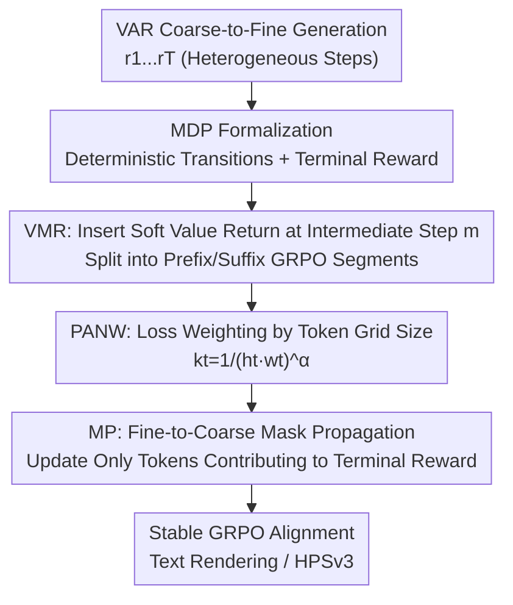

# VAR RL Done Right: Tackling Asynchronous Policy Conflicts in Visual Autoregressive Generation

**Conference**: CVPR 2026  
**Paper**: [CVF Open Access](https://openaccess.thecvf.com/content/CVPR2026/html/Sun_VAR_RL_Done_Right_Tackling_Asynchronous_Policy_Conflicts_in_Visual_CVPR_2026_paper.html)  
**Code**: https://github.com/ByteVisionLab/NextFlow  
**Area**: Image Generation / Reinforcement Learning Alignment  
**Keywords**: Visual Autoregressive (VAR), GRPO, Text Rendering, Credit Assignment, KL-regularized RL  

## TL;DR
To address the issue where the number of query tokens per step fluctuates drastically during multi-scale generation in Visual Autoregressive (VAR) models—causing asynchronous policy conflicts when directly applying GRPO—this paper modifies GRPO with a three-component suite: Value as Middle Return (VMR), Per-Action Normalization Weighting (PANW), and Mask Propagation (MP). It boosts Nextflow's word accuracy from 0.55 to 0.78 in text rendering tasks and achieves SOTA on HPSv3 among diffusion-based baselines.

## Background & Motivation
**Background**: Visual generation has three major paradigms: autoregressive (AR, raster-scan token-by-token), diffusion, and visual autoregressive (VAR). VAR adopts "next-scale prediction": representing an image as a sequence of coarse-to-fine discrete token grids $r_1, r_2, \dots, r_T$, and parallelly generating a whole token grid of resolution $h_t \times w_t$ at step $t$ for step-by-step refinement. Although this coarse-to-fine design aligns well with high-resolution backbones and enables rapid sampling, it introduces severe challenges during RL alignment.

**Limitations of Prior Work**: The input structures of different generation steps in VAR are **heterogeneous**. As shown in Figure 1 of the paper, the number of query tokens to be predicted in a single step fluctuates across orders of magnitude from coarse to fine scales (e.g., from dozens of tokens to thousands of tokens). Since the RL phase involves far fewer samples than pre-training, this massive step-wise discrepancy leads to unstable training, slow convergence, and poor alignment. The paper also observes an anomalous phenomenon (Figure 2): performing supervised RL on "partial prefix" scales unexpectedly outperforms optimizing the "full scale" directly, indicating that full-sequence optimization is instead dragged down by heterogeneity.

**Key Challenge**: The authors name this issue **asynchronous policy conflict**. Vanilla GRPO is bandit-style (relying on a single terminal reward and treating the entire sequence as a single action), whereas VAR features a multi-scale structure with parallel grid generation at each step. When the task similarity between different steps varies dramatically and the gradient magnitudes of high-resolution steps are naturally much larger, feeding all steps into a single bandit objective causes the high-resolution steps to dominate the updates, leading to chaotic credit assignment.

**Goal**: This is decomposed into three sub-problems: (1) how to provide denser, lower-variance feedback for early (coarse-scale) decisions; (2) how to balance gradient magnitudes across different steps; and (3) how to precisely assign credit to tokens that actually affect the final reward.

**Key Insight**: The authors first formalize VAR generation as a **deterministic MDP** (state = generated partial sequence, action = generating the next-scale grid, deterministic transition, and terminal reward only), and then leverage the classical optimal solution theory of KL-regularized RL to design a "structure-preserving" reward shaping mechanism that alleviates conflicts **without altering the optimal policy**.

**Core Idea**: Instead of using a single bandit reward for the entire sequence, a soft value return is inserted at an intermediate step to split the full RL process into prefix and suffix optimization phases. This is combined with token-count normalized weighting and spatiotemporal mask propagation to stabilize GRPO on VAR.

## Method

### Overall Architecture
The method is built upon formalizing VAR as a deterministic MDP: action space $a_t = r_{t+1}$ (generating the next-scale grid), state $s_t = (r_1, \dots, r_t)$, deterministic transition, and the environment only provides a terminal return $R(s_T)$. Under KL-regularized RL, the optimal policy takes the form $\pi^*(a_t \mid s_t) \propto \pi_{\text{old}}(a_t\mid s_t)\exp\big(\tfrac{1}{\beta}Q^*(s_t,a_t)\big)$. Since transitions are deterministic, the optimal $Q$-function can be expressed as $Q^*(s_t,a_t)=\beta\ln\mathbb{E}_{\pi_{\text{old}}}[\exp(\tfrac{1}{\beta}R(s_T))\mid s_t,a_t]$. This theory guarantees that the following three components can be applied without breaking optimality.

On top of this, the authors modify GRPO using three synergistic components: **VMR** inserts a soft value return at an intermediate step $m$, splitting the entire optimization into prefix and suffix segments trained separately with GRPO (solving sparse/high-variance feedback and cross-step conflicts); **PANW** multiplies each step's loss by a normalized weight based on the token grid size (balancing step-wise gradient magnitudes); and **MP** maintains a spatiotemporal mask that propagates backward from fine to coarse scales, applying rewards/gradients only to tokens that truly contribute to the final return (refining spatiotemporal credit assignment). All three components are integrated into the same GRPO training pipeline.

### Key Designs

**1. VMR (Value as Middle Return): Inserting a soft value at an intermediate step to split the full RL process into prefix and suffix segments without breaking optimality**

Vanilla GRPO treats the entire VAR sequence as a single bandit action with only a terminal reward. For VAR with dozens of steps and vast scale discrepancies, feedback for early coarse-scale decisions is sparse and has high variance, causing the most severe-conflicts. VMR defines a **soft value at an intermediate step** $V^*_m(s_m)=\beta\log\mathbb{E}_{\pi_{\text{old}}}\big[\exp(\tfrac{1}{\beta}R(s_T))\mid s_m\big]$, and splits the objective into two segments optimized separately under local KL penalties: the suffix segment $\max_{\pi_{m:T-1}}\mathbb{E}[R(s_T)\mid s_m]-\beta\,\mathrm{KL}(\pi_{m:T-1}\Vert\pi_{\text{old}})$, and the prefix segment which treats $V^*_m(s_m)$ as the **sole reward** $\max_{\pi_{1:m-1}}\mathbb{E}[V^*_m(s_m)]-\beta\,\mathrm{KL}(\pi_{1:m-1}\Vert\pi_{\text{old}})$.

The key benefit of this decomposition is that token sequence lengths within each segment are closer, and the prefix segment receives dense, low-variance feedback. The authors prove via Theorem 2 (Two-Stage Invariance) that under the VAR policy family $\mathcal{M}_\theta$, concatenating the prefix optimal $\pi^\dagger_{1:m-1}$ and the suffix optimal $\pi^\dagger_{m:T-1}$ solved independently **uniquely** maximizes the full-sequence objective $J(\pi)$. In other words, this is a structure-preserving reward shaping method that simplifies optimization without shifting the optimal solution itself. In practice, instead of fitting a step-wise critic like PPO, they directly estimate the risk-sensitive return on-policy: by sampling $K$ rollouts, $V_m(s_m)=\beta\log\big(\tfrac{1}{K}\sum_k\exp(\tfrac{1}{\beta}R^{(k)}(s_T))\big)$ is robust enough with $\beta=1, K=2$ in the experiments. Training alternates according to Eq.(5): one suffix GRPO update for every three prefix GRPO updates.

**2. PANW (Per-Action Normalization Weighting): Normalizing step-wise losses by token grid size to suppress gradient dominance from high-resolution steps**

Another aspect of asynchronous conflict is the imbalance in gradient magnitudes: high-resolution steps predict thousands of tokens at once, making their losses and gradients naturally much larger than those of coarse-scale steps, thereby dominating updates and overwhelming early-stage decisions. PANW multiplies the loss at each step $t$ by a normalized weight $k_t=\dfrac{1}{(h_t w_t)^\alpha}$, where $h_t\times w_t$ is the token grid size of that step, and $\alpha$ is a decay exponent, followed by step-level normalization. This prevents steps with many tokens from disproportionately affecting the learning process, balancing the KL budget and gradient scale across steps. $\alpha$ should not be too aggressive—excessive values overly suppress high-resolution updates. In experiments, $\alpha\in[0.6,0.8]$ is the most stable, with $\alpha=0.6$ yielding the best Word Accuracy/NED and $\alpha=0.8$ achieving the highest CLIPScore.

**3. MP (Mask Propagation): Constructing a spatiotemporal mask and propagating it from fine to coarse scales to attribute credit only to tokens that truly determine rewards**

Even with segmentation and balanced gradients, the reward (e.g., text quality recognized by OCR) is actually determined by only a small region in the image (e.g., the bounding box containing the text). Updating all tokens across the entire image equally introduces significant irrelevant variance. MP first constructs an initial mask from the "output components that directly determine the reward" (such as predicted text boxes), and then **propagates this mask backward from fine to coarse scales** along the model's multi-scale hierarchy (Figure 4 of the paper) to gate intermediate rewards and gradients. Consequently, credit assignment focuses on causally relevant regions, reducing variance across space and time while simultaneously improving cross-scale balance. Removing MP in ablation studies degrades the training curve, demonstrating its solid contribution to convergence quality.

### Loss & Training
The backbone is Nextflow (7B) for 1024×1024 generation. On-policy training is used, with a group size of 16 (16 candidate rollouts per prompt) and a batch size of 16 (16 prompts per update), for up to 1200 updates (approximately 19,200 unique prompts/tasks). The optimizer is AdamW with learning rate $10^{-5}$, $\beta_1=0.9$, $\beta_2=0.95$, and weight decay of 0.05. Optimization alternates according to Eq.(5): one suffix update is paired with every three prefix GRPO updates. Classifier-free guidance (CFG) is disabled during training; during sampling, CFG=5, top-k=2, and top-p=0.9 are used. The text rendering reward is composed of PaddleOCRv5 detections: $\text{Reward}=\text{Comp}+\text{Sim}-\text{Pen}$, where Comp is confidence-aware completeness (taking the minimum confidence for duplicate predictions to penalize hallucination), Sim is similarity calculated using Normalized Levenshtein Distance $\mathrm{LD}(x,y)=1-\tfrac{\mathrm{EditDist}(x,y)}{\max\{|x|,|y|\}+\epsilon}$ weighted by matching confidence, and Pen is a multiset length mismatch penalty coefficient (set to 0.6) for over- or under-generation.

## Key Experimental Results

### Main Results
On the text rendering task over CVTG-2K (Table 1), Nextflow-RL consistently outperforms the Nextflow backbone and leads among diffusion-type models:

| Model | #Params | Word Acc.↑ | NED↑ | CLIPScore↑ |
|------|---------|-----------|------|-----------|
| FLUX.1 dev | 12B | 0.4965 | 0.6879 | 0.7401 |
| SD3.5 Large | 8B | 0.6548 | 0.8470 | 0.7797 |
| TextCrafter (SD3.5) | 8B | 0.7600 | 0.9038 | 0.8023 |
| Qwen-Image | 20B | 0.8288 | 0.9116 | 0.8017 |
| GPT Image 1 [High] (Closed-source) | - | 0.8569 | 0.9478 | 0.7982 |
| Nextflow (Backbone) | 7B | 0.5536 | 0.7816 | 0.8068 |
| **Nextflow-RL (Ours)**| 7B | **0.7841** | **0.9081** | **0.8224** |

Word accuracy improved by +0.2305 absolute (+41.6% relative), NED improved by +0.1265 (+16.2% relative), and CLIPScore rose from 0.8068 to 0.8224—indicating that character-level fidelity was significantly boosted without sacrificing semantic alignment.

In terms of human preference (HPSv3, Table 2), the overall score improved from 8.43 to 10.64 (+2.21), achieving diffusion-based SOTA across multiple categories including All, Architecture, Animals, Natural Scenery, Plants, Food, and Others, while Characters (11.72) is only slightly behind Kolors (11.79).

### Ablation Study

| Configuration | Key Metrics | Description |
|------|---------|------|
| $m=128$ | Word Acc. 0.6677 / NED 0.8501 / CLIP 0.8142 | Slightly higher performance |
| $m=256$ (Default) | 0.6565 / 0.8429 / 0.8133 | Close to 128, but more computationally efficient for VMR estimation and more compatible with the masking mechanism |
| $m=512/1024$ | Significant drop | $m$ is too late, leading to high-variance and poor early credit assignment |
| $\alpha=0.6$ | Best Word Acc./NED | Lower bound of the optimal PANW decay exponent sweet spot |
| $\alpha=0.8$ | Best CLIPScore | Upper bound of the optimal sweet spot |
| w/o MP | Worse training curve | Convergence and quality degrade without mask propagation |

### Key Findings
- **The gains primarily arise from applying RL to the prefix (early coarse scales)**, making the choice of intermediate step $m$ crucial. Steps corresponding to $128 \times 128$ and $256 \times 256$ resolutions represent the sweet spot; placing $m$ too late (e.g., 512/1024) degrades performance, confirming that an earlier VMR insertion leads to lower variance and better early-stage credit assignment.
- The decay exponent $\alpha$ in PANW has a robust sweet spot within $[0.6, 0.8]$. A value too large overly suppresses high-resolution updates, while a value too small fails to counteract high-resolution step dominance.
- The anomaly observed in Figure 2 (where partial-prefix supervised RL outperforms full-scale) is direct evidence of asynchronous conflicts, which serves as the core motivation for the two-segment VMR design.

## Highlights & Insights
- **Identifying and formalizing the overlooked structural issue of step-wise heterogeneity in VAR as a deterministic MDP**: While prior works directly apply GRPO as a bandit solver to generative models, this paper demonstrates that VAR's multi-scale parallel actions invalidate the bandit assumption, which is a valuable diagnostic contribution.
- **VMR is a "structure-preserving reward shaping" mechanism**: Most elegant is the use of KL-regularized RL optimal solution theory to prove that inserting intermediate returns does not alter the optimal policy (Theorem 2). This achieves dense, low-variance feedback without shifting the target, offering a more theoretically sound approach than empirical reward shaping, which can transfer to other long-horizon, phased generative RL tasks.
- **The three components address distinct pain points and are orthogonal**: VMR resolves sparse/conflicting feedback, PANW addresses gradient scale imbalances, and MP combats credit dilution. They complement rather than substitute for each other, making them easily reusable in engineering pipelines.
- **MP translates the observation that "rewards are determined by local regions" into mask propagation**, serving as a practical variance-reduction trick. This is easily extendable to any vision-based RL where final rewards are spatially localized (e.g., bounding box rewards, local editing).

## Limitations & Future Work
- Detailed ablations were primarily conducted on a single task (**text rendering**). While HPSv3 was used to verify generalization, these rewards heavily rely on explicitly definable targets (OCR, preference scores); whether this generalizes stably to more subjective/open-ended generation goals remains to be verified.
- The intermediate step $m$ in VMR and the exponent $\alpha$ in PANW are hyperparameters requiring tuning. Though the sweet spot is robust, it remains task-dependent and may require recalibration for different backbones or resolutions.
- MP depends on back-propagating from output components that determine the reward (e.g., bounding boxes). When the reward is global and cannot be spatially localized to a specific region, constructing the mask is not straightforward.
- Experiments used only the Nextflow (7B) VAR backbone; transferability across different VAR implementations (such as Infinity) has not been fully explored.

## Related Work & Insights
- **vs. Vanilla GRPO (Bandit-style)**: GRPO treats the entire sequence as a single action with terminal-only rewards. This paper points out that this leads to asynchronous conflicts in the multi-scale parallel structure of VAR, and explicitly manages these conflicts using two-segment VMR + PANW + MP, significantly improving stability and alignment quality.
- **vs. AR-GRPO / SimpleAR / T2I-R1 (Raster-scan AR RL)**: These works apply GRPO to token-by-token AR sampling, which does not face the VAR-specific challenge of parallel multi-token generation with step-wise lengths spanning orders of magnitude. This work is, to the best of their knowledge, the **first to systematically study RL for text-to-image VAR** frameworks.
- **vs. PPO-style Critic**: Instead of fitting a step-wise value network/critic, they directly use on-policy terminal rewards for risk-sensitive VMR estimation (achieved with just $K=2$), circumventing the training overhead and bias of a critic.
- **vs. Diffusion Alignment (Flow/Diffusion + GRPO)**: Diffusion steps are structurally homogeneous, avoiding the step-wise heterogeneity issues unique to VAR. This work's primary contribution lies in bringing RL alignment to structurally heterogeneous VAR and resolving its unique failure modes.

## Rating
- Novelty: ⭐⭐⭐⭐⭐ First systematic text-to-image VAR RL framework, formalizing asynchronous policy conflicts with structure-preserving theoretical guarantees.
- Experimental Thoroughness: ⭐⭐⭐⭐ Comprehensive text-rendering ablations, HPSv3 validation for generalization, though the task scope remains somewhat narrow and tied to a single backbone.
- Writing Quality: ⭐⭐⭐⭐ Clear motivation, diagnostic-to-theory-to-method flow, and well-positioned components; some symbols in the PDF conversion were slightly cluttered.
- Value: ⭐⭐⭐⭐⭐ Fills the missing puzzle piece of RL alignment for the fast-generating VAR paradigm; the positive orthogonal three-component suite is highly reusable in engineering.

<!-- RELATED:START -->

## Related Papers

- [\[CVPR 2026\] Seeing What Matters: Visual Preference Policy Optimization for Visual Generation](seeing_what_matters_visual_preference_policy_optimization_for_visual_generation.md)
- [\[CVPR 2026\] VA-π: Variational Policy Alignment for Pixel-Aware Autoregressive Generation](va-p_variational_policy_alignment_for_pixel-aware_autoregressive_generation.md)
- [\[CVPR 2025\] Panorama Generation From NFoV Image Done Right](../../CVPR2025/image_generation/panorama_generation_from_nfov_image_done_right.md)
- [\[CVPR 2026\] UniGen-1.5: Enhancing Image Generation and Editing through Reward Unification in RL](unigen-15_enhancing_image_generation_and_editing_through_reward_unification_in_r.md)
- [\[CVPR 2026\] Mirai: Autoregressive Visual Generation Needs Foresight](mirai_autoregressive_visual_generation_needs_foresight.md)

<!-- RELATED:END -->
