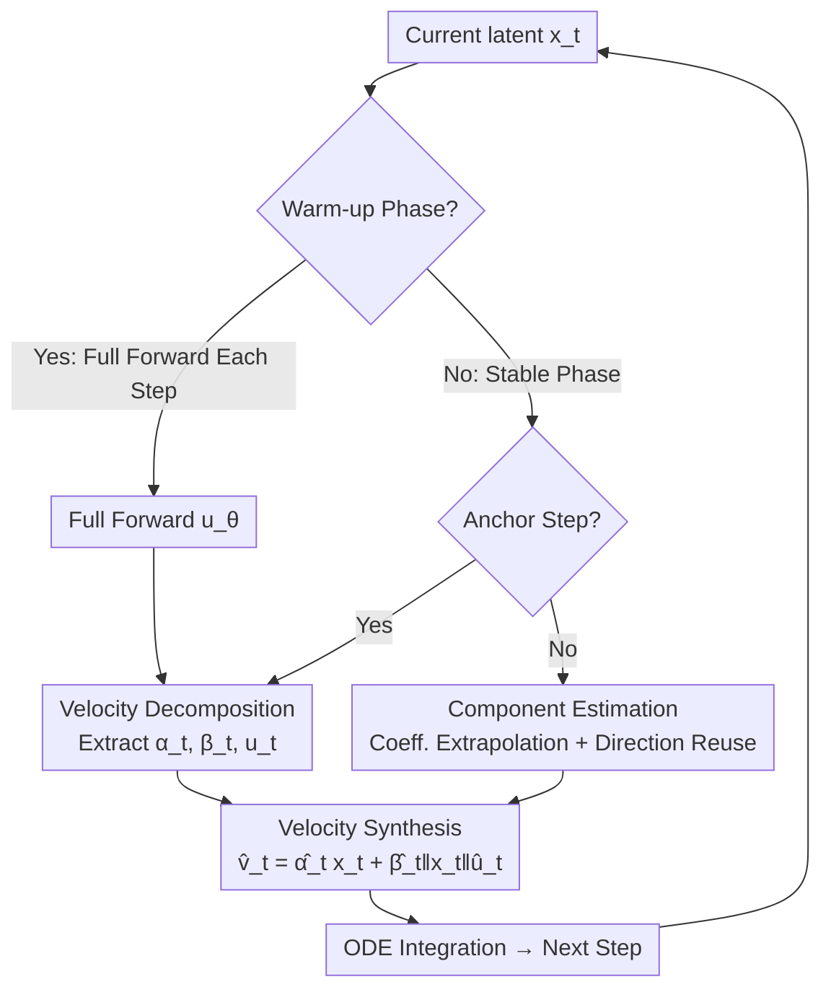

# VDE: Training-Free Accelerating Rectified Flow Model via Velocity Decomposition and Estimation

**Conference**: CVPR 2026  
**arXiv**: [2605.23381](https://arxiv.org/abs/2305.23381)  
**Code**: https://github.com/Tan-Junwen/VDE  
**Area**: Diffusion Models / Generation Acceleration  
**Keywords**: Rectified Flow, Training-Free Acceleration, Velocity Decomposition, Cache Mismatch, Input-Adaptive Estimation

## TL;DR
To address slow sampling in Rectified Flow (RF) models, this paper proposes VDE: decomposing the predicted velocity at each step into parallel and orthogonal components relative to the current input. By leveraging the observation that "scalar coefficients are approximately linear over time and orthogonal directions remain nearly constant in the short term," the method uses linear extrapolation and direction reuse to estimate velocity directly from the current input during most steps, skipping model forward passes. This achieves 2.04–3.22× speedup on FLUX/Qwen-Image/Wan2.1 with almost no quality loss (e.g., LPIPS on Qwen-Image is reduced by 52.2% compared to the strongest baseline).

## Background & Motivation

**Background**: Rectified Flow models represent generative modeling as an ODE velocity field integration process—starting from noise $x_0$, the network $u_\theta(x_t,c,t)$ predicts the instantaneous velocity $v_t$ at each step, and numerical integration is performed along $\frac{dx_t}{dt}=v_t$ to reach data sample $x_1$. While achieving SOTA results in image, video, and 3D generation, inference requires dozens of iterations, leading to high latency that hinders deployment in real-time or resource-constrained scenarios.

**Limitations of Prior Work**: Most training-free acceleration methods follow the "**cache-and-reuse**" paradigm—storing certain intermediate features (attention outputs, Transformer block residuals, or full model residuals) from previous steps and reusing them directly to skip redundant computation (e.g., DeepCache, TeaCache, EasyCache, PAB). Although these methods use change-rate metrics to decide when to trigger reuse, they essentially reuse **static old features**.

**Key Challenge**: During sampling, the input $x_t$ evolves dynamically, while the reused cache is static. There is an inevitable "**cache-input mismatch**." This mismatch propagates to the output, causing an "output-input mismatch"—where the approximated output fails to respond accurately to the current input state, resulting in softened textures, lost high-frequency details, and structural distortion.

**Goal**: Develop a lightweight estimation function $\hat v_t=f_{\text{est}}(x_t,t,I_{\text{hist}})$ that **directly estimates velocity from the current input** $x_t$ without training or model modification, eliminating the output-input mismatch at its source.

**Key Insight**: By performing orthogonal decomposition of velocity $v_t$ relative to the current input $x_t$, the authors found two strong and stable temporal laws in the "stable phase": scalar coefficients evolve smoothly and locally linearly, and orthogonal directions remain nearly constant in the short term. This implies velocity can be analytically "propagated" without full model forwards at every step.

**Core Idea**: Shift the acceleration paradigm from "cache-reuse" to "**decompose-and-estimate**": Velocity at each step = Parallel component + Orthogonal component. Coefficients are estimated via linear extrapolation of historical values, and the orthogonal direction is reused. These are then re-synthesized with the **current input** to obtain velocity—since the synthesis explicitly depends on $x_t$, the estimation is naturally input-adaptive.

## Method

### Overall Architecture
VDE addresses the problem of "how to accurately calculate the velocity at a given step without a full forward pass." Its core observation is that the network output $v_t$ can be **uniquely orthogonally decomposed** into a "parallel component along $x_t$" and an "orthogonal component perpendicular to $x_t$," both of which exhibit high predictability during the mid-stages of sampling. Consequently, VDE divides sampling into two phases: the **warm-up phase**, where every step performs a full forward pass (allowing the model to stabilize the global contour), and the **stable phase**, which switches to "**anchor-estimation**" mode. Full forward passes and decomposition are only performed at periodic anchor steps to obtain the ground-truth triplet $(\alpha_t,\beta_t,u_t)$, while non-anchor steps use analytical estimation without calling the model.

The pipeline is: Input current latent $x_t$ → Determine if in warm-up or stable phase → If an anchor step, perform full forward pass and decomposition, then cache coefficients and orthogonal direction → If a non-anchor step, perform linear extrapolation using coefficients from the two most recent anchors and reuse the orthogonal direction from the latest anchor → Synthesize velocity $\hat v_t$ using the extrapolated coefficients, reused direction, and **current** $x_t$ → Numerical integration to obtain the next latent, repeat until finished.

### Key Designs

**1. Velocity Orthogonal Decomposition: Decoupling Response to Input**

This is the mathematical foundation, addressing the problem that high-dimensional velocity vectors are difficult to predict as a whole. VDE performs a unique orthogonal decomposition of velocity $v_t$ relative to the current latent $x_t$:

$$v_t=\alpha_t x_t+\beta_t\lVert x_t\rVert u_t$$

Where $\alpha_t,\beta_t\in\mathbb{R}$ are scalar coefficients, and $u_t\in\mathbb{R}^d$ is a unit orthogonal direction satisfying $u_t^\top x_t=0$. Given $v_t$ from a forward pass, the components are calculated analytically: parallel coefficient $\alpha_t=\frac{\langle v_t,x_t\rangle}{\lVert x_t\rVert^2}$; orthogonal residual $r_t=v_t-\alpha_t x_t$; and normalized direction $u_t=\frac{r_t}{\lVert r_t\rVert}$ with coefficient $\beta_t=\frac{\lVert r_t\rVert}{\lVert x_t\rVert}$. The triplet $(\alpha_t,\beta_t,u_t)$ fully characterizes $v_t$ relative to $x_t$. Crucially, this explicitly includes the "current input $x_t$" in the parameterization. When re-synthesizing velocity with a new $x_t$, the estimate automatically adapts—this is the fundamental difference from cache-reuse methods.

**2. Two Temporal Laws: Local Linearity and Directional Stability**

Empirical analysis of 500 trajectories across various models reveals two laws after the initial warm-up: (1) **Predictable Coefficients**: $\alpha_t, \beta_t$ evolve smoothly and exhibit strong local linearity between adjacent steps, allowing reliable estimation via extrapolation. (2) **Stable Orthogonal Direction**: The unit direction $u_t$ remains nearly constant over short intervals, with cosine similarities typically $>0.99$. Quantitatively, linear extrapolation results in very low errors (e.g., $\alpha$ error 0.80%–1.53%), and direction reuse error is only 0.08%–0.51%. The transition to the stable phase is identified when the linear extrapolation of steps $i, i+1$ accurately predicts step $i+2$ within thresholds $\epsilon$ and $\delta$.

**3. Anchor-Estimation Mechanism: Anchoring with Sparse Forwards**

The stable phase is divided into "anchor + non-anchor" segments. Anchor steps perform a full forward pass to get ground-truth $(\alpha_t,\beta_t,u_t)$. For non-anchor steps $t$ between anchors $t_1 > t_2$, coefficients are linearly extrapolated:

$$\hat\alpha_t=\alpha_{t_1}+\frac{\alpha_{t_2}-\alpha_{t_1}}{t_2-t_1}(t-t_1),\quad \hat\beta_t=\beta_{t_1}+\frac{\beta_{t_2}-\beta_{t_1}}{t_2-t_1}(t-t_1)$$

The orthogonal direction is reused $\hat u_t=u_{t_2}$, and velocity is synthesized: $\hat v_t=\hat\alpha_t x_t+\hat\beta_t\lVert x_t\rVert\hat u_t$. The **anchor interval $n$ controls the speed-quality trade-off**. Periodic anchors prevent error accumulation by re-anchoring the model state.

### Loss & Training
VDE is a **training-free** method. It requires no training objectives, fine-tuning, or offline profiling. The only hyperparameters are the warm-up step count and anchor interval $n$. In implementation: FLUX.1 [dev] runs the first 7 and last 1 steps, with intervals of 2/3/4; Qwen-Image runs the first 11 and last 1 steps; Wan2.1 runs the first 11 or 9 steps followed by the last step.

## Key Experimental Results

### Main Results
Image generation on FLUX.1 [dev] and Qwen-Image using 1,000 samples from MS-COCO 2017 val set at $512 \times 512$. Baseline is $T=50$ steps.

| Model | Method | Gain | NFE | SSIM↑ | PSNR↑ | LPIPS↓ | ImageReward↑ |
|------|------|------|-----|-------|-------|--------|--------------|
| FLUX.1 | $T=50$ Baseline | 1.00× | 50 | - | - | - | 0.976 |
| FLUX.1 | EasyCache-fast | 2.91× | - | 0.7240 | 19.59 | 0.3197 | 0.986 |
| FLUX.1 | **VDE-fast** | 3.01× | 16 | **0.8267** | **23.19** | **0.1997** | 0.969 |
| FLUX.1 | EasyCache-slow | 2.09× | - | 0.7428 | 19.81 | 0.2793 | 0.980 |
| FLUX.1 | **VDE-slow** | 2.21× | 22 | **0.8877** | **25.81** | **0.1243** | 0.978 |
| Qwen-Image | $T=50$ Baseline | 1.00× | 100 | - | - | - | 1.295 |
| Qwen-Image | EasyCache-slow | 1.97× | - | 0.8708 | 23.83 | 0.1445 | 1.282 |
| Qwen-Image | **VDE-slow** | 2.04× | 48 | **0.9362** | **28.58** | **0.0691** | **1.295** |

Key findings: VDE-fast achieves SSIM 0.8267 and LPIPS 0.1997 at similar latency to EasyCache-fast (NFE 16). VDE-slow marks a significant improvement over EasyCache-slow: SSIM +19.5%, PSNR +30.3%, and LPIPS −55.4%. On Qwen-Image, VDE-slow LPIPS (0.0691) is 52.2% lower than the best baseline.

Video generation on Wan2.1-1.3B (81 frames, $832 \times 480$):

| Method | Gain | NFE | SSIM↑ | PSNR↑ | LPIPS↓ | VBench(%)↑ |
|------|------|-----|-------|-------|--------|------------|
| $T=50$ Baseline | 1× | 100 | - | - | - | 81.30 |
| TeaCache | 2.00× | - | 0.8057 | 22.57 | 0.1277 | 81.04 |
| EasyCache | 2.54× | - | 0.8337 | 25.24 | 0.0952 | 80.49 |
| **VDE-fast** | 2.50× | 40 | **0.8658** | 24.69 | **0.0754** | 80.43 |
| **VDE-slow** | 2.08× | 48 | **0.8902** | **25.92** | **0.0554** | 80.32 |

VDE consistently outperforms PAB/TeaCache/EasyCache in structural and perceptual metrics.

### Ablation Study
Table 3: Effect of replacing components with ground truth in FLUX.1.

| Config | SSIM↑ | PSNR↑ | LPIPS↓ | Note |
|------|-------|-------|--------|------|
| True $u_t$ (Coeff. estim. only) | 0.9893 | 40.79 | 0.0132 | Coeff. extrapolation is near-lossless |
| True $\beta_t$ | 0.9262 | 28.76 | 0.0874 | Only $\beta$ is insufficient |
| True $\alpha_t$ | 0.9263 | 28.78 | 0.0860 | Only $\alpha$ is insufficient |
| True $u_t, \beta_t$ | 0.9916 | 41.79 | 0.0100 | Best |
| True $\alpha_t, \beta_t$ (Estim. direction) | 0.9265 | 28.78 | 0.0874 | Direction reuse is the main error source |
| **Full Estimation = VDE** | 0.8931 | 26.15 | 0.1198 | Online estimation remains faithful |

### Key Findings
- **Direction Reuse is the Primary Error Source**: Estimating only coefficients (True $u_t$) yields an SSIM of 0.9893, while reusing the direction drops it significantly.
- **Sweet Spot at $n=2$**: As $n$ increases from 1 to 5, speedup rises from 1.69× to 3.22×, but LPIPS rises from 0.0801 to 0.2168. $n=2$ balances both.
- **Robustness**: VDE's performance is stable across different resolutions ($256 \times 256$ to $1024 \times 1024$) and aspect ratios.

## Highlights & Insights
- **Paradigm Shift**: The transition from "static feature reuse" to "dynamic synthesis via decomposition" addresses the root cause of quality degradation in cache-based methods.
- **Dimensionality Reduction**: Decomposing high-dimensional velocity into "2 scalars + 1 direction" reveals predictable temporal patterns that are otherwise hidden.
- **Zero-cost Integration**: Fully training-free and engineer-friendly, requiring only basic arithmetic additions to the inference pipeline.
- **Error Control**: The use of periodic anchors serves as a "circuit breaker" for error accumulation, allowing short-term laws to be applied to long trajectories safely.

## Limitations & Future Work
- **Dependence on Stable Phase**: Effectiveness assumes a stable phase exists; if warm-up is long, speedup is reduced.
- **Directional Approximation**: Direction reuse is the main bottleneck for fidelity; future work could explore inexpensive ways to estimate directional evolution.
- **Hyperparameter Tuning**: Current settings are fixed per model; end-to-end adaptive switching between phases is a potential improvement.
- **Moderate Speedup**: While hitting 2–3×, it does not reach the extreme speed of distillation methods, positioning itself as a "high-fidelity" rather than "ultra-fast" solution.

## Related Work & Insights
- **vs. TeaCache / EasyCache**: These methods reuse static features (e.g., residual blocks), leading to cache-input mismatch. VDE's analytical synthesis using the current $x_t$ eliminates this mismatch.
- **vs. Training-based Methods**: VDE is plug-and-play and does not sacrifice generalization, though it provides more conservative speedup ratios compared to distillation or quantization.
- **vs. Naive Step Reduction**: Reducing steps (e.g., to $T=18$) severely degrades quality. VDE utilizes the trajectory structure more intelligently than simple skipping.

## Rating
- Novelty: ⭐⭐⭐⭐⭐ 
- Experimental Thoroughness: ⭐⭐⭐⭐ 
- Writing Quality: ⭐⭐⭐⭐⭐ 
- Value: ⭐⭐⭐⭐ 

<!-- RELATED:START -->

## Related Papers

- [\[CVPR 2026\] A Training-Free Style-Personalization via SVD-Based Feature Decomposition](a_training-free_style-personalization_via_svd-based_feature_decomposition.md)
- [\[CVPR 2026\] Delta Rectified Flow Sampling for Text-to-Image Editing](delta_rectified_flow_sampling_for_text-to-image_editing.md)
- [\[CVPR 2026\] CaReFlow: Cyclic Adaptive Rectified Flow for Multimodal Fusion](careflow_cyclic_adaptive_rectified_flow_for_multimodal_fusion.md)
- [\[ICLR 2026\] Free Lunch for Stabilizing Rectified Flow Inversion](../../ICLR2026/image_generation/free_lunch_for_stabilizing_rectified_flow_inversion.md)
- [\[CVPR 2026\] D2C: Accelerating Diffusion Model Training under Minimal Budgets via Condensation](d2c_diffusion_dataset_condensation.md)

<!-- RELATED:END -->
