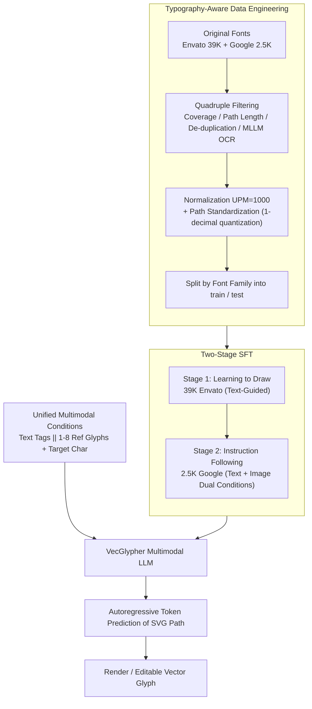

# VecGlypher: Unified Vector Glyph Generation with Language Models

**Conference**: CVPR 2026  
**arXiv**: [2602.21461](https://arxiv.org/abs/2602.21461)  
**Code**: [https://xk-huang.github.io/VecGlypher](https://xk-huang.github.io/VecGlypher)  
**Area**: Image Generation  
**Keywords**: Font Generation, Vector Graphics, SVG, Multimodal Language Models, Typography

## TL;DR
VecGlypher is proposed as the first unified language model for both text- and image-guided vector glyph generation. Through two-stage training (large-scale SVG syntax learning + expert label alignment), it directly generates editable SVG paths autoregressively without intermediate raster steps or vectorization post-processing.

## Background & Motivation
**Background**: Vector glyphs are the atomic units of digital typography. However, existing learning methods remain primarily image-guided—generating vector outlines for remaining characters given a few reference glyph images—relying on meticulously prepared reference sheets and raster-to-vector post-processing.

**Limitations of Prior Work**: (a) Image guidance requires users to first create or collect reference glyphs, creating a bottleneck for non-professional users; (b) intermediate raster steps introduce vectorization artifacts, reducing editability; (c) general SVG generation LLMs fail completely on glyph generation because fonts have extremely strict requirements for coordinate precision, topological correctness, and stylistic consistency.

**Key Challenge**: Natural language is a more universal interface for font design, and SVG paths themselves are text sequences naturally suited for language modeling. However, this requires (a) large-scale font training data to teach the model to "draw characters" and (b) typography-aware data engineering to handle coordinate normalization and path standardization.

**Goal**: Support both text descriptions and image exemplars as conditions within a single multimodal LLM to directly generate high-fidelity, editable SVG glyphs.

**Key Insight**: Utilize two-stage training—first learning to draw SVGs on large-scale noisy fonts, then learning instruction following on small-scale expert-annotated fonts.

**Core Idea**: Formalize vector glyph generation as a multimodal language modeling problem. Use 39K Envato fonts to learn SVG syntax and 2.5K Google fonts to learn style alignment, generating correct SVG paths in a single forward pass.

## Method

### Overall Architecture
VecGlypher fits the entire vector glyph generation process into a language modeling framework: instead of "drawing a raster image first and then vectorizing," it allows a multimodal LLM to output SVG paths directly as text sequences. The model is fed a set of conditions—either text labels (e.g., "high-contrast, serif, art-deco") or 1–8 reference glyph images—plus a target character identity (e.g., "A"). The model autoregressively predicts the SVG path of this character token-by-token. The decoded result is a valid path that can be rendered directly and edited manually. There are no raster denoisers, vector post-optimizers, or contour simplifiers in the pipeline; all geometric decisions occur during token prediction. This approach is made possible by two prerequisites: cleaning diverse font data into a unified format for learning, and a two-stage training process that transforms a general LLM into a typography expert.

### Key Designs

**1. Typography-Aware Data Engineering: Standardizing Messy Fonts into Unified Sequences**

A root cause for general SVG-LLMs failing on glyphs is that font data is inherently "dirty"—different sources use different coordinate systems, units per em (UPM), and path writing conventions. Training directly on this accumulates errors during long-sequence decoding. This step performs quadruple filtering: character coverage filters out incomplete fonts, path length filters out overly complex outlines, de-duplication removes near-identical fonts, and MLLM OCR checks verify that the glyph actually matches its claimed character. After filtering, all coordinates are normalized to a $1000 \times 1000$ (UPM=1000) canvas, and paths are standardized by retaining command letters (M/L/C, etc.) and quantizing numerical values to one decimal place. This quantization is a deliberate trade-off: higher precision would bloat sequence length and cause decoding drift, while lower precision would cause distortion. Finally, the data is split by font family rather than individual characters, ensuring that the model faces unseen styles during testing to evaluate true generalization.

**2. Two-Stage SFT: Learning SVG Syntax before Instruction Following**

Fine-tuning a general Qwen3-VL directly on small-scale expert fonts is insufficient—the model is asked to follow fine-grained style instructions before mastering the difficult task of "drawing a geometrically correct glyph path." VecGlypher splits this into two stages. Stage 1 (Learning to Draw) performs text-guided SFT on 39K noisy Envato fonts with a single goal: learning SVG syntax, predicting long coordinate sequences exceeding 1000 tokens, and generating corresponding geometry based on character identity. Stage 2 (Instruction Following) then switches to 2.5K expert-labeled Google fonts for text + image dual-condition SFT, aligning geometric capability with instructions on "how the appearance/style should look." This sequence is isomorphic to the "large-scale pre-training + instruction tuning" paradigm in NLP. Stage 1 is decisive: ablation shows that removing it and training only on Google data causes the Cross-Family OOD FID to deteriorate from 31.2 to 58.7.

**3. Unified Multimodal Conditions: One Model Handling Both Text and Images**

In font design, text and images are often separate interfaces—text is more general, while images are more precise. VecGlypher integrates both into the same generation process. Text conditions use style tags plus the target character processed by the tokenizer. Image conditions render 1–8 reference glyphs into $192 \times 192$ images for the vision encoder. These conditions are mutually exclusive options at the input stage (marked as `||`) but share the same downstream autoregressive decoding. This does more than just save a model—it unlocks a practical progressive workflow: users first generate a few reference glyphs using text descriptions and then use these generated images as exemplars to guide the model in completing the entire font set.

### Loss & Training
The training objective is the standard next-token prediction cross-entropy loss for SVG path text. The Envato stage is trained for 1 epoch, and the Google Fonts stage for 3 epochs. Evaluation uses greedy decoding to measure raw generative capability. The base models are the Qwen3-VL series, covering 4B, 27B, and 70B scales to observe scaling behavior.

## Key Experimental Results

### Main Results (Google Fonts Cross-Family OOD)

| Method | Type | FID↓ | L1↓ | SSIM↑ |
|------|------|------|-----|-------|
| DeepVecFont-v2 | Image-ref | 45.2 | 0.089 | 0.82 |
| DualVector | Image-ref | 38.6 | 0.075 | 0.85 |
| StarVector | SVG-LLM | 89.4 | 0.142 | 0.68 |
| GPT-5.2 | General LLM | 92.1 | 0.158 | 0.61 |
| **Ours-4B (text-ref)** | **LLM** | **52.3** | **0.095** | **0.79** |
| **Ours-4B (image-ref)** | **LLM** | **31.2** | **0.065** | **0.88** |

### Ablation Study

| Configuration | FID↓ | L1↓ | Description |
|------|------|-----|------|
| Stage 2 only (Google) | 58.7 | 0.102 | No Envato pre-training |
| Stage 1 only (Envato) | 43.5 | 0.081 | No Google fine-tuning |
| Stage 1 + Stage 2 | **31.2** | **0.065** | Full two-stage training |
| 4B model | 31.2 | 0.065 | - |
| 27B model | 26.8 | 0.054 | model scale↑ = quality↑ |
| 70B model | **24.1** | **0.048** | Further improvement |
| Relative coords | 35.8 | 0.072 | Relative coordinates |
| Absolute coords | **31.2** | **0.065** | Absolute coordinates are superior |

### Key Findings
- VecGlypher outperforms all specialized baselines (including DeepVecFont-v2 and DualVector) in image-guided generation.
- General LLMs (GPT-5.2) and SVG-LLMs (StarVector) fail completely at glyph generation, proving that typography-specific training is irreplaceable.
- Model scale is the core driver of vector fidelity—the 70B model’s FID is approximately 23% lower than the 4B model's.
- OOD gains from Stage 1 large-scale pre-training are significant—FID dropped from 58.7 to 31.2 compared to training on expert data alone.
- Absolute coordinate serialization outperforms relative coordinates, likely because absolute coordinates provide a more direct spatial reference for the model.

## Highlights & Insights
- **Unified Language Modeling Paradigm**: Shifts font design from an "image problem" to a "code generation problem," effectively leveraging the code generation capabilities of LLMs. This paradigm is extensible to any parameterizable design task (e.g., logos, icons, UI components).
- **Two-Stage Data Strategy**: The pattern of learning syntax from noisy data followed by learning semantics from refined data mirrors the NLP pre-training + instruction tuning paradigm, and its success in visual generation is noteworthy.
- **Practical Workflow**: The progressive design flow (text → initial glyphs → image-ref → full font) significantly lowers the entry barrier for font creation.

## Limitations & Future Work
- Currently supports only 62 characters (0-9, a-z, A-Z); large character sets like Chinese are not yet supported.
- Greedy decoding limits diversity; beam search or nucleus sampling might generate more stylistically rich variants.
- Quality may degrade in long-sequence generation (some glyphs exceed 1000 tokens), requiring better long-sequence modeling.
- Fine-grained conditional control (e.g., independent control over stroke thickness, serif style, width ratio) has not been explored.

## Related Work & Insights
- **vs DeepVecFont-v2**: DVF-v2 uses a specialized encoder-decoder + geometric post-optimizer. VecGlypher uses a single LLM + a single forward pass, offering a simpler architecture with better results.
- **vs StarVector**: StarVector targets general SVG icons. VecGlypher uses customized data and training schemes for glyphs, solving font-specific constraints that the former cannot handle.

## Rating
- Novelty: ⭐⭐⭐⭐⭐ First successful application of multimodal LLMs to vector glyph generation, unifying dual-condition inputs.
- Experimental Thoroughness: ⭐⭐⭐⭐⭐ Comprehensive evaluation across multiple model scales, cross-domain scenarios, and detailed ablations.
- Writing Quality: ⭐⭐⭐⭐⭐ Detailed description of data engineering and clear paradigm comparisons.
- Value: ⭐⭐⭐⭐⭐ A practical tool that lowers the barrier to font design with strong industrial potential.

<!-- RELATED:START -->

## Related Papers

- [\[CVPR 2026\] Unified Vector Floorplan Generation via Markup Representation](unified_vector_floorplan_generation_via_markup_representation.md)
- [\[CVPR 2026\] Rethinking Glyph Spatial Information in Font Generation](rethinking_glyph_spatial_information_in_font_generation.md)
- [\[CVPR 2026\] UniVerse: Empower Unified Generation with Reasoning and Knowledge](universe_empower_unified_generation_with_reasoning_and_knowledge.md)
- [\[CVPR 2026\] Unified Customized Generation by Disentangled Reward Modeling](unified_customized_generation_by_disentangled_reward_modeling.md)
- [\[CVPR 2026\] Omni2Sound: Towards Unified Video-Text-to-Audio Generation](omni2sound_towards_unified_video-text-to-audio_generation.md)

<!-- RELATED:END -->
## Related Papers

- [\[CVPR 2026\] Unified Vector Floorplan Generation via Markup Representation](unified_vector_floorplan_generation_via_markup_representation.md)
- [\[CVPR 2026\] Rethinking Glyph Spatial Information in Font Generation](rethinking_glyph_spatial_information_in_font_generation.md)
- [\[CVPR 2026\] UniVerse: Empower Unified Generation with Reasoning and Knowledge](universe_empower_unified_generation_with_reasoning_and_knowledge.md)
- [\[CVPR 2026\] Unified Customized Generation by Disentangled Reward Modeling](unified_customized_generation_by_disentangled_reward_modeling.md)
- [\[CVPR 2026\] Design Your Ad: Personalized Advertising Image and Text Generation with Unified Autoregressive Models](design_your_ad_personalized_advertising_image_and_text_generation_with_unified_a.md)

<!-- RELATED:END -->
