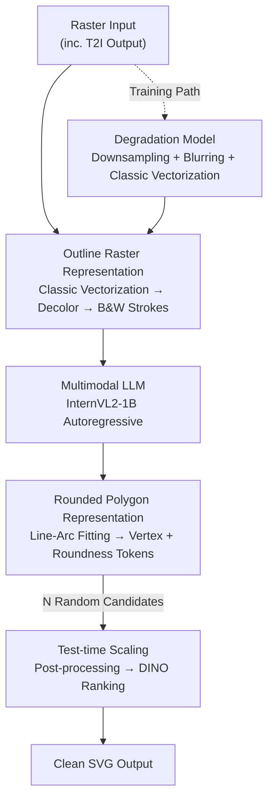

# VectorArk: Learning Practical Image Vectorization with Rounded Polygon Representation

**Conference**: CVPR 2026  
**arXiv**: [2605.24398](https://arxiv.org/abs/2605.24398)  
**Code**: None  
**Area**: Image Generation / Image Vectorization / Multimodal LLM  
**Keywords**: Image Vectorization, SVG Generation, Rounded Polygon Representation, Degradation Model, Test-time Scaling

## TL;DR
VectorArk redesigns the "Raster to Vector (SVG)" task into a generative-model-friendly rounded polygon representation. Combined with outline-based input, vectorization-driven degradation training, and DINO-ranked test-time scaling, a multimodal LLM with only 1B parameters significantly outperforms StarVector and OmniSVG in geometric completeness and artifact removal on real-world tasks (including T2I outputs).

## Background & Motivation
**Background**: Converting raster images into vector graphics is a classic task in computer graphics, as vector representations are resolution-independent, compact, and easy to edit. Recent works (StarVector, OmniSVG, LLM4SVG) finetune multimodal LLMs to learn artist-designed SVG data, capturing human preferences in control point placement and layer structures with impressive results.

**Limitations of Prior Work**: These methods are evaluated almost exclusively on **synthetic benchmarks**—rasterizing clean SVGs at high resolution and converting them back. Performance collapses in real-world scenarios due to: (1) high sensitivity to different rasterization backends (e.g., CairoSVG vs. Skia); (2) distribution shift caused by T2I model outputs, which contain distorted shapes and visual features distinct from SVG rendering; (3) unreliability caused by the stochastic nature of autoregressive models.

**Key Challenge**: The root cause lies in the **choice of representation**. Previous works directly use SVG command sequences as generation targets. While suitable for visualization, this representation is neither compact nor canonical—a single shape can be written in infinite SVG variations, and long sequences allow coordinate errors to accumulate and amplify. Furthermore, using colored raster inputs feeds appearance noise into the model, harming generalization.

**Goal**: Build a practical vectorization model robust to real-world inputs (including T2I results) by simultaneously addressing "difficult representation learning," "input distribution shift," and "unreliable output."

**Key Insight**: The authors reduce degrees of freedom by using segments and arcs (rounded polygons), which require only 3 parameters compared to the 4 parameters of a cubic Bézier curve with fixed endpoints. This naturally leads to piecewise constant curvature and smoother curves. Geometry and coloring are decoupled: the model predicts canonical geometry, while colors are recovered during post-processing.

**Core Idea**: Replace SVG commands with a compact **rounded polygon representation**, use **outline rasters** instead of colored inputs for normalization, employ a **vectorization degradation model** to simulate real-world flaws, and use **test-time scaling** to select the best candidates, creating a "geometry-first" robust vectorization pipeline.

## Method

### Overall Architecture
The input is a raster image (potentially from a T2I model), and the output is a clean SVG. The model is finetuned from a pretrained multimodal LLM (InternVL2-1B) to autoregressively generate tokenized vector representations. The pipeline follows a "geometry first, color later" approach: the input image is **decolored into a black-and-white outline raster** before being fed into the model. The model predicts geometric tokens for **rounded polygons**, and colors/Z-orders are restored from the original image during post-processing.

The training and inference paths address "how to learn" and "how to stabilize," respectively: During training, clean SVGs are converted into ground-truth rounded polygon tokens via line-arc fitting. Simultaneously, a **degradation model** (downsampling, blurring, and classic vectorization) creates flawed outline rasters as inputs, teaching the VLM to "predict clean geometry from dirty inputs." During inference, $N$ candidates are randomly decoded for a single input, post-processed for color, and ranked by a frozen DINO-ViT based on cosine similarity to the original image—this is **test-time scaling**.

### Key Designs

**1. Rounded Polygon Representation: Compressing heterogeneous SVG into canonical "Vertex + Roundness" sequences**

Previous works used SVG commands, but SVG primitives are diverse (Bézier, circle, ellipse, rect, polyline...), leading to non-unique representations and long sequences where errors accumulate. VectorArk converts each path into a rounded polygon: paths are sampled equidistantly and fitted using the Cornucopia algorithm into **segments and circular arcs** while maintaining $G^1$ continuity. These are then represented as polygons: line segment endpoints become vertices; for an arc $\wideparen{DE}$, the tangents $\overrightarrow{DB}$ and $\overrightarrow{EB}$ are extended to their intersection $B$, defining $D, B, E$ as vertices. Each vertex is encoded with a roundness $d_i$: for intersection $B$, $d_i$ is defined as the distance $BD$, with the radius recovered by $r_i = d_i\tan(\alpha_i/2)$ (where $\alpha_i$ is the interior angle $\angle DBE$). For non-intersection vertices, $d_i = -1$ marks a segment/arc endpoint.

Parameterizing with "distance $BD$" rather than radius is critical: radii for nearly flat arcs can become extremely large and unstable for quantization, while distances remain bounded. Edge cases are handled smoothly: arcs with negligible curvature degrade to segments, and large-angle arcs (e.g., parallel tangents) are subdivided into segments $< 120^\circ$. Each path is a sequence of $\{(x_i,y_i,d_i)\}$ triplets, normalized to a $128\times128$ viewBox and quantized to two decimals. This representation is canonical, compact, and saves 27.9%–46.6% tokens compared to OmniSVG.

**2. Outline Raster Representation: Normalizing colored inputs into black-and-white strokes**

Appearance variance is a generalization killer—T2I outputs differ significantly from SVG renderings. If a model sees colored images directly, it learns appearance noise. Ours does the opposite: it uses classic vectorization tools (e.g., Adobe Illustrator Image Trace or VTracer) to convert the input to vector, **discards color**, and renders it as a black-and-white outline raster at a fixed stroke width. While classic tools might produce sub-optimal geometry, they reconstruct structure faithfully. Using only the rendered outlines maps any input to a **canonical view**, eliminating appearance mismatch. The model is trained to "predict colorless output from colorless input," simplifying learning and improving generalization.

**3. Vectorization Degradation Model: Simulating real flaws to prevent noise mimicry**

Models trained on clean SVG renderings tend to faithfully replicate input flaws. Simple random noise on control points generalizes poorly. Ours proposes a **vectorization-based degradation model**: for each training vector image, it is rendered at a random low resolution ($224\times224$ to $336\times336$) with Gaussian blur, then processed by a classic vectorizer. Since classic vectorizers are resolution-sensitive, low-resolution inputs produce poor outlines. Ours **utilizes this property** to obtain outlines with realistic flaws. The model learns to "recover clean geometry from flawed outlines" rather than replicating artifacts.

**4. Test-time Scaling: Random decoding + DINO ranking**

Autoregressive models can succeed or fail on the same input under different seeds. VectorArk decodes $N$ candidate vector images, restores color/Z-order, renders them back to rasters, and encodes them alongside the original input using a frozen DINO-ViT-B/16. The candidate with the **highest cosine similarity** to the input is selected. DINO proves to be highly reliable for ranking.

### Loss & Training
The model is finetuned end-to-end from InternVL2-1B, with the ViT encoder processing $448\times448$ outline rasters. It uses a next-token prediction objective with **cross-entropy loss**. Optimization uses AdamW with cosine decay, initial $lr = 10^{-4}$, batch size 256, and 250K iterations. Training data consists of ~5M SVGs (icons, logos, flat graphics) with random rotation and scaling. All parameters (including ViT) are updated. Generating a single SVG takes 33–44s on an A100.

## Key Experimental Results

### Main Results
Evaluated on two SVG benchmarks (SArena, SVGenius) across Easy/Medium/Hard difficulties using SSIM↑, LPIPS↓, MSE↓, and DINO↑. Despite having fewer parameters than some baselines, VectorArk consistently and significantly leads across all metrics and difficulties.

| Dataset/Difficulty | Metric | OmniSVG | StarVector | Ours |
|--------------------|--------|---------|------------|------|
| SArena Hard        | SSIM ↑ | 0.518   | 0.626      | **0.857** |
| SArena Hard        | LPIPS ↓| 0.324   | 0.252      | **0.093** |
| SArena Hard        | MSE ↓  | 0.123   | 0.101      | **0.022** |
| SArena Hard        | DINO ↑ | 0.898   | 0.902      | **0.975** |
| SVGenius Hard      | SSIM ↑ | 0.638   | 0.672      | **0.83**  |
| SVGenius Easy      | SSIM ↑ | 0.84    | 0.89       | **0.944** |

### Ablation Study
| Configuration              | Metric (SVGenius Hard) | Description |
|----------------------------|------------------------|-------------|
| Rounded Polygon (Full)     | SSIM 0.83 / DINO 0.958 | Complete representation |
| Use OmniSVG Rep            | SSIM 0.743 / DINO 0.923| Significant drop on Medium/Hard cases |
| Use StarVector Rep         | SSIM 0.628 / DINO 0.866| Native SVG format suffers most |
| Colored Input (Hard)       | SSIM 0.697 / LPIPS 0.165| Performance drops as difficulty rises |
| Outline Input (Hard)       | SSIM 0.83 / LPIPS 0.12 | Consistently superior |
| w/o Degradation Model      | Worse qualitatively    | Mimics artifacts on T2I inputs |

**Token Efficiency**: Rounded polygons save 27.9%–46.6% tokens compared to OmniSVG across all difficulties (e.g., 5046→2694 for SVGenius Medium), with nearly lossless reconstruction (DINO > 0.99).

### Key Findings
- **Representation is the primary contributor**: Simply switching to rounded polygons results in massive gains on Hard samples compared to OmniSVG/StarVector.
- **Outline normalization helps most on difficult cases**: Decoloring eliminates train-test appearance mismatch.
- **Degradation determines practical usability**: Without it, the model lacks the "denoising" capability required for T2I inputs.

## Highlights & Insights
- Decoupling geometry and color is effective: Moving the error-prone coloring process out of the generative core allows a 1B model to outperform larger baselines, proving that **representation matters more than parameter count**.
- Using **distance $BD$ instead of radius** is a clever quantization trick that ensures numerical stability for near-flat curves.
- **Inverting the weakness of classic tools**: Instead of avoiding the artifacts produced by classic vectorizers at low resolution, the authors use them as a realistic source of "dirty" training data.

## Limitations & Future Work
- **Complexity limits**: Highly detailed illustrations or complex gradients are simplified; dense local structures remain challenging.
- **Dependency on classic tools**: The normalization depends on tools like Image Trace; if they fail fundamentally on an input type, the pipeline is compromised.
- **Post-processing for color**: Strictly decoupling geometry and appearance prevents end-to-end optimization of appearance fidelity.

## Related Work & Insights
- **vs. StarVector/OmniSVG**: These operate in the traditional path-command vocabulary, leading to long sequences and error accumulation. VectorArk is robust to real-world inputs where baselines fail.
- **vs. Classic Vectorization (Potrace/VTracer)**: Classic methods are fast but sensitive to noise and lack semantic understanding. VectorArk uses them as parts (preprocessing/degradation) while providing stronger geometric priors.
- **vs. Test-time Scaling**: Unlike RL-based methods, VectorArk uses a pragmatic multi-candidate + DINO ranking approach to suppress autoregressive unreliability.

## Rating
- **Novelty**: ⭐⭐⭐⭐⭐ A systematic reconstruction of vectorization via rounded polygons, degradation, and normalization.
- **Experimental Thoroughness**: ⭐⭐⭐⭐⭐ Comprehensive evaluation across multiple benchmarks and difficulty levels.
- **Writing Quality**: ⭐⭐⭐⭐ Clear logic, though some color recovery details are relegated to the supplement.
- **Value**: ⭐⭐⭐⭐⭐ Highly practical for real-world applications by bridging the gap between synthetic benchmarks and T2I outputs.

<!-- RELATED:START -->

## Related Papers

- [\[CVPR 2026\] Omni IIE Bench: Benchmarking the Practical Capabilities of Image Editing Models](omni_iie_bench_benchmarking_the_practical_capabilities_of_image_editing_models.md)
- [\[CVPR 2026\] Erasing Thousands of Concepts: Towards Scalable and Practical Concept Erasure for Text-to-Image Diffusion Models](erasing_thousands_of_concepts_towards_scalable_and_practical_concept_erasure_for.md)
- [\[CVPR 2026\] SketchAssist: A Practical Assistant for Semantic Edits and Precise Local Redrawing](sketchassist_a_practical_assistant_for_semantic_edits_and_precise_local_redrawin.md)
- [\[CVPR 2026\] Diversity over Uniformity: Rethinking Representation in Generated Image Detection](diversity_over_uniformity_rethinking_representation_in_generated_image_detection.md)
- [\[CVPR 2026\] MeanFlow Transformers with Representation Autoencoders](meanflow_transformers_with_representation_autoencoders.md)

<!-- RELATED:END -->
