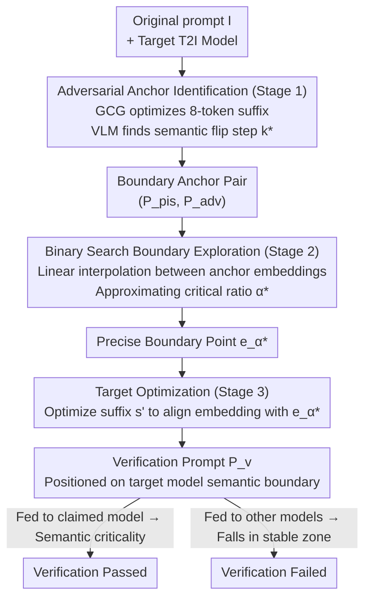

# Verify Claimed Text-to-Image Models via Boundary-Aware Prompt Optimization

**Conference**: CVPR 2026 Findings  
**arXiv**: [2603.26328](https://arxiv.org/abs/2603.26328)  
**Code**: None  
**Area**: Image Generation  
**Keywords**: Model verification, semantic boundary, adversarial prompt optimization, T2I model fingerprinting, intellectual property

## TL;DR

BPO proposes a white-box T2I model verification method without reference models. Through a three-stage pipeline (adversarial anchor identification → binary search boundary exploration → target optimization), it identifies model-specific semantic boundary regions. The generated verification prompts achieve an average accuracy of 96% and a 0.93 F1 score across 5 T2I models, performing 2x faster than the TVN method.

## Background & Motivation

1. **Background**: The commercial value of T2I models (e.g., Stable Diffusion series) makes model ownership authentication a critical requirement. It is necessary to verify if a publicly deployed T2I model is indeed the claimed model to prevent unauthorized rebranding or theft.
2. **Limitations of Prior Work**: (1) The TVN method relies on comparison with multiple reference models, which is hard to maintain and scale; (2) Random or greedy prompt methods achieve only 17-23% accuracy as generic prompts fail to distinguish similar models; (3) Existing methods suffer from low computational efficiency.
3. **Key Challenge**: Although different T2I models share similar text encoders and generators (mostly fine-tuned from the same architectures), their semantic boundaries—regions in the embedding space where output semantics undergo abrupt jumps—are model-specific.
4. **Goal**: Directly leverage the semantic boundary characteristics of the target model itself to generate verification prompts without any reference models.
5. **Key Insight**: Analogous to the decision boundaries of a classifier, each model has unique semantic boundary locations. By precisely locating these boundaries and generating prompts close to them, different models can be distinguished.
6. **Core Idea**: A three-stage process—adversarial attack to find semantic flip points → binary search for precise boundary localization → GCG optimization to generate verification prompts oriented toward the boundary.

## Method

### Overall Architecture

The core problem BPO addresses is: how to confirm a deployed T2I model is the claimed one without reference models? The authors use "semantic boundaries" as the entry point. By treating the target model as a classifier, its text encoder contains positions in the embedding space where a slight prompt shift causes a semantic mutation in the generated image (e.g., from "cat" to "dog"). The location of such boundaries is unique to each fine-tuned model and difficult to forge, thus serving as a model fingerprint.

The pipeline precisely locates this boundary and creates a prompt adjacent to it: The original prompt $I$ undergoes Stage 1 adversarial attack, moving away from the original semantics to capture a pair of anchors $(P_{pis}, P_{adv})$ on either side of the semantic flip. Stage 2 performs a binary search between these anchor embeddings to tighten the rough boundary interval to a precise boundary point $e_{\alpha^*}$. Stage 3 then optimizes a suffix so the final prompt $P_v$ embedding lands exactly on this boundary point. $P_v$ sits at the "semantic critical point" for the target model; when fed to other models, it most likely falls into a stable region, leading to different semantic outputs and thus verifying the model.

### Key Designs

**1. Adversarial Anchor Identification (Stage 1): Hitting the boundary via adversarial trajectories**

Searching blindly for boundaries in a massive embedding space is impractical. The authors leverage GCG (Greedy Coordinate Gradient) adversarial attacks. Since the essence of an attack is to move "away from the original semantics," the path almost inevitably crosses a semantic boundary. Specifically, an 8-token suffix $s$ is optimized with the objective $\min_s \cos(E_t(I+s), E_t(I))$ to move the text embedding away from the original. A VLM determines if the semantics have flipped at each step, finding the first step $k^*$ where a flip occurs. The prompts before and after the flip, $P_{pis} = P_{k^*-1}$ and $P_{adv} = P_{k^*}$, are used as anchors.

**2. Binary Search Boundary Exploration (Stage 2): Approximating the real boundary between anchors**

Stage 1 only provides a coarse interval. The authors perform linear interpolation between anchor embeddings $e_\alpha = (1-\alpha)e_{pis} + \alpha e_{adv}$ and use binary search to find the critical ratio $\alpha^*$—the smallest $\alpha$ where the semantics $S(G_t(e_{\alpha^*}))$ diverge from the original image semantics $S(M_t(I))$, with a precision threshold $\epsilon = 0.001$. This relies on the assumption that the embedding space is locally linear near the boundary. Binary search complexity $O(\log(1/\epsilon))$ is significantly more efficient than grid traversal.

**3. Target Optimization (Stage 3): Pinning the verification prompt to the boundary**

With the precise boundary point $e_{\alpha^*}$ identified, the final step creates a usable verification prompt. The authors re-optimize the suffix $s'$ based on $P_{adv}$ with the objective $\max_{s'} \cos(E_t(I+s'), e_{\alpha^*})$ to align the new prompt embedding with the boundary point. After 100 GCG iterations (batch size 256), the resulting $P_v$ sits exactly on the semantic boundary of the target model. Slight perturbations cause semantic flips. Since this boundary is unique to the target model, $P_v$ will likely fall into a "semantic stable zone" in other models, yielding different results.

### Loss & Training

The method involves no training and relies entirely on inference-time optimization. GCG attacks handle suffix searching in Stages 1 and 3, while a VLM (qwen-vl-max) handles all semantic flip judgments. For each verification task, 10 images are generated to evaluate consistency, with a score $C = |2r - 1|$ (where $r$ is the semantic match ratio; $C$ closer to 1 indicates higher stability).

## Key Experimental Results

### Main Results

| Method | SD v1.4 | SD v2.1 | SDXL | Dreamlike | Openjourney | Avg Acc |
|------|---------|---------|------|-----------|-------------|----------|
| Normal | 0.17 | 0.17 | 0.17 | 0.17 | 0.17 | 0.17 |
| Random | 0.33 | 0.20 | 0.17 | 0.33 | 0.17 | 0.23 |
| TVN | 0.50 | 1.00 | 0.83 | 0.50 | 0.17 | 0.60 |
| **BPO** | **1.00** | **0.80** | **1.00** | **1.00** | **1.00** | **0.96** |

### Ablation Study

| Prompt Variant | Avg Acc | Avg F1 | Description |
|------------|---------|---------|------|
| $P_{pis}$ (Pre-boundary) | 0.80 | 0.78 | Insufficiently close to boundary |
| $P_{adv}$ (Post-boundary) | 0.84 | 0.80 | Already crossed the boundary |
| **$P_v$ (Optimized)** | **0.96** | **0.93** | Precise boundary localization |

### Key Findings

- BPO achieves an average accuracy of 96%, exceeding TVN (60%) by 36 percentage points without requiring reference models.
- Efficiency is improved by 2x: BPO averages 159s vs TVN 321s (5x speedup on SD v1.4: 108s vs 553s).
- Generating 10 images is sufficient to reach plateau accuracy (0.96); more images provide no significant gain.
- Suffix lengths of 8-9 tokens are optimal; shorter lengths lack information, while longer ones may overfit.
- VLM choice has a minor impact: qwen-vl-max = 0.96, gemini-2.5-flash = 0.92, gpt-5 = 0.92.

## Highlights & Insights

- **Semantic Boundary as Model Fingerprint**: An ingenious analogy to classifier decision boundaries—semantic boundaries are intrinsic, non-replicable features of a model, making them harder to forge than traditional watermarks.
- **Progressive Refinement Design**: The transition from adversarial attack → binary search → target optimization is grounded in both mathematical logic and experimental validation.
- **Entirely Reference-Free**: Eliminates the maintenance cost of reference model sets, allowing the method to scale to any new model.

## Limitations & Future Work

- Requires white-box access to the target model's text encoder (gradient calculation), making it unsuitable for pure black-box API services.
- Only 5 open-source models were tested; generalization to latest proprietary models (e.g., DALL-E 3, Midjourney) remains unknown.
- Models with high adversarial robustness might have "fuzzy" semantic boundaries, making localization harder.
- Regularization techniques might make boundaries less distinctive, reducing verification accuracy.
- Future work could explore black-box versions (boundary detection via API queries).

## Related Work & Insights

- **vs TVN**: TVN requires a set of reference models to compare inconsistency rates; BPO utilizes intrinsic model properties directly, which is more elegant and effective.
- **vs Model Watermarking**: Watermarking requires insertion during training; BPO is a post-hoc verification method applicable to already deployed models.
- **vs GCG Adversarial Attack**: BPO transforms GCG from an "attack" tool into a "diagnostic" tool, serving a completely different purpose.

## Rating

- Novelty: ⭐⭐⭐⭐⭐ The concept of semantic boundaries as model fingerprints is highly innovative.
- Experimental Thoroughness: ⭐⭐⭐⭐ Covering 5 models with ablations and efficiency analysis, though the scale is relatively small.
- Writing Quality: ⭐⭐⭐⭐ Clear description of the three stages with rigorous formalization.
- Value: ⭐⭐⭐⭐ Addresses real-world IP protection needs with a fresh perspective.

<!-- RELATED:START -->

## Related Papers

- [\[CVPR 2025\] Minority-Focused Text-to-Image Generation via Prompt Optimization](../../CVPR2025/image_generation/minority-focused_text-to-image_generation_via_prompt_optimization.md)
- [\[CVPR 2026\] Decision Boundary-aware Generation for Long-tailed Learning](decision_boundary-aware_generation_for_long-tailed_learning.md)
- [\[CVPR 2026\] Compositional Text-to-Image Generation Via Region-aware Bimodal Direct Preference Optimization](compositional_text-to-image_generation_via_region-aware_bimodal_direct_preferenc.md)
- [\[CVPR 2026\] Mitigating Memorization in Text-to-Image Diffusion via Region-Aware Prompt Augmentation and Multimodal Copy Detection](mitigating_memorization_in_texttoimage_diffusion_v.md)
- [\[CVPR 2026\] Rethinking Prompt Design for Inference-time Scaling in Text-to-Visual Generation](rethinking_prompt_design_for_inference-time_scaling_in_text-to-visual_generation.md)

<!-- RELATED:END -->
