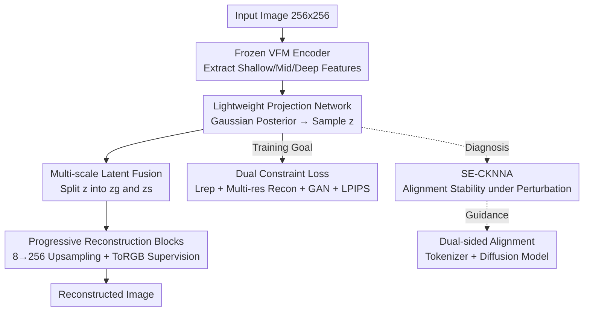

# VFM-VAE: Vision Foundation Models Can Be Good Tokenizers for Latent Diffusion Models

**Conference**: CVPR 2026  
**arXiv**: [2510.18457](https://arxiv.org/abs/2510.18457)  
**Code**: None  
**Area**: Diffusion Models / Vision Tokenizer / Representation Learning  
**Keywords**: Vision Foundation Models, Latent Diffusion, VAE Tokenizer, Representation Alignment, Frozen Encoder  

## TL;DR
A frozen Vision Foundation Model (VFM, such as SigLIP2-Large) is directly utilized as the VAE encoder for Latent Diffusion Models (LDMs), paired with a dedicated multi-scale decoder to reconstruct semantic features into realistic images. This approach bypasses the representation degradation caused by "distillation alignment." Consequently, on ImageNet $256 \times 256$, it achieves a gFID (without CFG) of 2.22 in only 80 epochs (approximately $10\times$ faster than previous tokenizers) and further reaches 1.62 at 640 epochs.

## Background & Motivation
**Background**: Latent Diffusion Models (LDMs) follow a two-stage paradigm: first training a vision tokenizer (usually a VAE) to compress images into a compact latent space, then learning diffusion within that space. The quality of latent representations directly determines the upper bound of downstream generation. Many recent works (VA-VAE, REPA-E, etc.) attempt to infuse strong semantics from VFMs (like DINOv2 or SigLIP2) into the tokenizer via **distillation alignment**, forcing the VAE's latent codes to mimic VFM features.

**Limitations of Prior Work**: Using the feature similarity metric CKNNA, the authors found that these distilled tokenizers score high on clean images but collapse sharply under **semantic-preserving perturbations** (noise, scaling, 90°/180° rotations). For instance, the CKNNA of VA-VAE drops by 33.2% under perturbation. This indicates that the distillation process loses critical VFM information, learning only a fragile pseudo-alignment.

**Key Challenge**: Distillation inherently involves using a small, scratch-trained network to approximate a large model's representation; approximation errors are inevitable. Thus, there is a trade-off between **semantic robustness** and **reconstruction fidelity**. Since VFM semantics are already strong and stable, why put so much effort into mimicking them?

**Goal**: (1) Enable tokenizers to truly inherit VFM semantic robustness rather than a distilled duplicate; (2) Maintain pixel-level reconstruction fidelity; (3) Understand how tokenizer latent quality affects representation evolution inside diffusion models.

**Key Insight**: Inspired by VFM success in dense prediction tasks, the authors hypothesize that a **frozen VFM encoder, combined with a suitable decoder architecture, can fully support high-fidelity reconstruction**. The challenge is that VFM features are optimized for "semantic understanding," featuring coarse spatial resolution and highly anisotropic channel distributions, which standard VAE decoders struggle to recover details from.

**Core Idea**: Instead of training a VAE to mimic a VFM, **directly use the frozen VFM as the encoder frontend** and train only a multi-scale decoder tailored for it. Representation degradation is eliminated at the source.

## Method

### Overall Architecture
VFM-VAE addresses how to transform a frozen, semantic-optimized VFM into a high-fidelity tokenizer for LDMs. It maintains the VAE encoder-decoder structure but replaces the encoder with a frozen VFM. The decoder is a brand-new design: given a $256 \times 256$ image, the frozen VFM extracts multi-scale features from shallow, middle, and deep layers. These are compressed into a diagonal Gaussian posterior via a lightweight projection network and sampled to obtain a compact latent code $\mathbf{z}$. The decoder splits $\mathbf{z}$ into "global style components + multi-scale spatial components," followed by a series of progressive reconstruction blocks ($8 \to 16 \to \dots \to 256$ resolution) for step-by-step upsampling, with pixel supervision at each stage. Training uses a set of losses constraining both "semantic alignment" and "reconstruction fidelity." Finally, a diagnostic metric, SE-CKNNA, is proposed to measure the alignment stability between the tokenizer and the VFM, guiding a **dual-sided alignment** strategy for the tokenizer and diffusion model.

### Key Designs

**1. Frozen VFM Encoder + Multi-scale Feature Projection: Eliminating Distillation Degradation**

To solve the issue of information loss in distillation, the authors use a pre-trained VFM (default: SigLIP2-Large) as the encoder $\Phi$ and keep it **frozen throughout**, without any alignment fine-tuning. Essential semantic robustness is preserved. As the best features for reconstruction are not necessarily in the last layer, features from different depths $\{\mathbf{f}_{\text{shallow}}, \mathbf{f}_{\text{middle}}, \mathbf{f}_{\text{final}}\} = \Phi(\mathbf{x})$ are extracted, channel-concatenated, and fed into a lightweight projection network $\mathcal{C}$ to output the mean and log-variance of the diagonal Gaussian posterior:

$$\boldsymbol{\mu}, \log\boldsymbol{\sigma}^2 = \mathcal{C}(\text{Concat}[\mathbf{f}_{\text{shallow}}, \mathbf{f}_{\text{middle}}, \mathbf{f}_{\text{final}}])$$

The latent code $\mathbf{z}$ is then sampled using the reparameterization trick. The projection network maps high-dimensional VFM features to an LDM-friendly compact latent space (following VA-VAE's f16d32 configuration). Unlike previous methods where the VAE learns to be like the VFM, here the VFM **is** the encoder; alignment scores vary by only $+1.6\%$ under perturbation rather than collapsing by $-33.2\%$.

**2. Multi-scale Latent Fusion: Decoupling Latent Codes into "Global Style + Multi-scale Spatial" Control**

VFM feature resolution is coarse and channel distribution is anisotropic, which standard decoders cannot easily process. The authors decouple $\mathbf{z}$ into two parts: a global component $\mathbf{z}_g = \text{GlobalPool}(\mathbf{z}) \in \mathbb{R}^c$, which is invariant to spatial layout and carries global descriptions like style/tone; and a set of spatial components $\{\mathbf{z}_s^{(i)} \in \mathbb{R}^{c\times h_i\times w_i}\}_{i=1}^N$, created via pixel shuffle/unshuffle operations at different scales. The global component is fed into **every** decoder block to ensure style consistency, while spatial components are **only injected into preliminary low-resolution blocks** ($i \le 4$) to build the structural foundation, allowing high-resolution blocks ($5 \le i \le 6$) to focus purely on fine details.

**3. Progressive Reconstruction Blocks (Modulated ConvNeXt + Stage-wise ToRGB): Stable Back-mapping to Pixels**

The decoder consists of $N$ blocks $\{\mathcal{B}_i\}_{i=1}^N$, with resolution doubling step-by-step ($8\to16\to32\to64\to128\to256$). The core building block is a **modified ConvNeXt**: global style $\mathbf{z}_g$ produces channel-wise scaling factors via block-specific affine transformations $\gamma_i$, applied as modulated convolutions at the first $1 \times 1$ pointwise convolution to inject style info:

$$\mathcal{B}_i(\mathbf{h}_{\text{in}}, \mathbf{z}_g) = \text{ModConv}(\mathbf{h}_{\text{in}}, \gamma_i(\mathbf{z}_g)) + \mathbf{h}_{\text{in}}$$

To ensure each stage learns "scale-appropriate" features and avoids mode collapse, each block has a lightweight $\text{ToRGB}_i$ head outputting an image $\hat{\mathbf{x}}_i$ at that resolution, incorporating **feature-space residuals** where fine-scale supervision is guided by coarse-scale structures:

$$\hat{\mathbf{x}}_i = \begin{cases} \text{ToRGB}_i(\mathbf{h}^{(1)}, \mathbf{z}_g) & i=1 \\ \text{ToRGB}_i(\mathbf{h}^{(i)} + \text{Upsample}(\mathbf{h}^{(i-1)}), \mathbf{z}_g) & i>1 \end{cases}$$

This ensures the $\text{ToRGB}_i$ head receives both new details $\mathbf{h}^{(i)}$ and stable structures $\mathbf{h}^{(i-1)}$. Stage-wise RGB supervision stabilizes training and forces each block to specialize.

**4. SE-CKNNA: Robust Diagnostic Metric for Detecting "Pseudo-alignment"**

Standard CKNNA fails to distinguish between "true robust alignment" and "fragile pseudo-alignment" on clean images. The authors extend it to **Semantic-Equivariant CKNNA (SE-CKNNA)** by performing Monte Carlo averaging over a distribution of semantic-preserving perturbations $\mathcal{T}$:

$$\text{SE-CKNNA} = \frac{1}{|\mathcal{T}|}\sum_{T\in\mathcal{T}} \text{CKNNA}(T)$$

The perturbation set includes additive noise (stds 0.05/0.10/0.15/0.20), scale interpolation (ratios 0.25/0.50/0.75/1.0), and discrete rotations (0°/90°/180°/270°). A tokenizer that truly inherits VFM semantics should remain stable under these transformations. VFM-VAE shows only a +1.6% relative change, whereas VA-VAE collapses by -33.2%.

## Loss & Training
The total loss constrains both semantic preservation and reconstruction fidelity:

$$\mathcal{L}_{\text{total}} = \lambda_{\text{rep}}\mathcal{L}_{\text{rep}} + \sum_{i=1}^N \lambda_i \mathcal{L}_{\text{recon}}^{(i)} + \lambda_{\text{GAN}}\mathcal{L}_{\text{GAN}} + \lambda_{\text{LPIPS}}\mathcal{L}_{\text{LPIPS}}$$

- **Representation Regularization $\mathcal{L}_{\text{rep}} = \mathcal{L}_{\text{KL}} + \mathcal{L}_{\text{VF}}$**: KL divergence regularizes the latent distribution; VF loss (from VA-VAE, including cosine similarity + matrix distance) ensures compressed $\mathbf{z}$ remains semantically aligned with VFM $\mathbf{f}_{\text{final}}$ without over-compression.
- **Multi-resolution Reconstruction Loss $\mathcal{L}_{\text{recon}}^{(i)} = \lVert \mathrm{f}_{r_i}(\mathbf{x}) - \hat{\mathbf{x}}_i \rVert_1$**: L1 supervision at each block's resolution to prevent mode collapse.
- **Adversarial Loss $\mathcal{L}_{\text{GAN}}$**: Uses a DINOv2 backbone discriminator to enhance realism.
- **LPIPS Perception Loss $\mathcal{L}_{\text{LPIPS}}$**: Ensures reconstructions are perceptually close to the human eye.

The models are trained on ImageNet $256 \times 256$. Downstream evaluation uses: (1) LightningDiT-XL and (2) REG (SiT-XL backbone + extra alignment loss). The **dual-sided alignment** strategy involves the tokenizer inheriting VFM semantics (VFM-VAE) while the diffusion side uses REG to align shallow patch features and inject global semantics via class tokens.

## Key Experimental Results

### Main Results
ImageNet $256 \times 256$ system-level generation comparison (selected from Table 2, lower gFID is better):

| Tokenizer + Generator | Epochs | gFID (w/o CFG) | gFID (w/ CFG) | gIS (w/ CFG) |
|--------|------|------|------|------|
| VA-VAE + LightningDiT | 800 | 2.17 | 1.35 | 295.3 |
| SD-VAE + REG | 480 | 2.20 | 1.40 | 296.9 |
| E2E-VAE + REPA | 800 | 1.83 | 1.26 | 314.9 |
| **VFM-VAE + LightningDiT** | 64 | **2.42** | 2.03 | 261.7 |
| **VFM-VAE + LightningDiT** | 560 | **2.06** | 1.57 | 254.4 |
| **VFM-VAE + REG** | 80 | **2.22** | — | — |
| **VFM-VAE + REG** | 640 | **1.62** | **1.31** | 300.2 |

Key points: VFM-VAE + REG reaches 2.22 gFID in just 80 epochs, **matching REG at 480 epochs** (approx. $10 \times$ speedup). Even without diffusion-side alignment, VFM-VAE improves over the VA-VAE version by ~1.34 gFID.

Tokenizer reconstruction/alignment comparison (Table 1):

| Tokenizer | #Images | rFID↓ | gFID↓ (64ep) | Top-1 Acc↑ | CKNNA | SE-CKNNA | Rel. Change |
|--------|------|------|------|------|------|------|------|
| SD-VAE | 108M | 0.62 | 7.13 | 8.0 | 0.004 | 0.005 | — |
| VA-VAE | 160M | 0.30 | 5.14 | 31.9 | 0.202 | 0.135 | −33.2% |
| **VFM-VAE** | **44M** | 0.52 | **3.80** | **43.2** | 0.188 | **0.191** | **+1.6%** |

VFM-VAE uses ~1/4 the training data of VA-VAE but improves linear probing Top-1 from 31.9% to 43.2%, with SE-CKNNA remaining stable.

### Ablation Study
Stepwise addition of components (Table 5):

| Configuration | rFID↓ | rIS↑ | Note |
|------|------|------|------|
| SD-VAE style baseline | 19.69 | 74.9 | Simplest SigLIP2-L version |
| + Multi-scale Fusion | 14.35 | 93.6 | Adds spatial control, rFID ↓ ~27% |
| + Modern Blocks (Mod-ConvNeXt) | 1.08 | 194.6 | Significant jump with modulated blocks |
| + Encoder Refinement | 0.71 | 206.8 | Aggregates shallow/mid/deep features |

### Key Findings
- **Modern decoder blocks contribute the most**: The jump from multi-scale fusion (rFID 14.35) to Modulated ConvNeXt blocks (1.08) is the largest, indicating the block architecture is the bottleneck for decoding frozen VFM features.
- **High-quality tokenizer representations facilitate diffusion learning**: Diffusion models driven by VFM-VAE show higher average and peak CKNNA across layers.
- **Dual-sided alignment has synergistic gains**: Integrating REG's shallow alignment with VFM-VAE leads to more uniform and higher alignment across all diffusion layers.
- **Blindly scaling data is counterproductive**: Increasing data for the SD-VAE baseline lowered performance, whereas every VFM-VAE component added improves results, proving architecture-VFM matching is more critical than data volume.

## Highlights & Insights
- **"Using the body directly instead of distilling" is counter-intuitive but brilliant**: While the field defaults to distilling VFM knowledge into a VAE, this work points out distillation is the source of degradation. Freezing the VFM as the encoder and only training the decoder simplifies the problem and is more efficient (44M vs 160M images).
- **SE-CKNNA is a reusable diagnostic tool**: High scores on clean data do not guarantee robust representations. SE-CKNNA helps expose pseudo-alignment in any scenario involving teacher-student alignment evaluation.
- **Global/Spatial latent decoupling + Stage-wise ToRGB**: Borrowing from StyleGAN, this recipe for VAE decoders (multiresolution L1 + style modulation) successfully recovers details from coarse semantic features.
- **Tokenizer quality propagates to diffusion internals**: The study provides empirical evidence linking tokenizer latent quality with diffusion representation strength, bridging tokenizer design and representation learning.

## Limitations & Future Work
- **Frozen VFM sacrifices some high-frequency fidelity**: The rFID (0.52) is slightly higher than pure reconstruction optimizations like E2E-VAE (0.28). VFM features are semantically biased, leading to loss in high-frequency textures.
- **Complex training objectives**: Managing multiple weights for KL, VF, multi-resolution L1, GAN, and LPIPS losses is challenging.
- **SE-CKNNA is a relative metric**: Scores depend on the chosen teacher model and are not directly comparable across different teachers.
- **VFM choice inconsistency**: While DINOv2-Large gave the best gFID (4.00), SigLIP2-Large (5.59) was the default. The logic for VFM selection between reconstruction and generation needs clarification.

## Related Work & Insights
- **vs VA-VAE**: VA-VAE distills VAE latents to align with DINOv2; Ours freezes the VFM as the encoder. VA-VAE's alignment is fragile (-33.2%), whereas Ours is stable (+1.6%) and achieves better gFID with less data.
- **vs REPA-E**: REPA-E jointly trains VAE and diffusion; Ours decouples alignment into tokenizer (frozen VFM) and diffusion (REG) stages, achieving more stable results.
- **vs REPA / REG**: These inject VFM supervision into the diffusion model assuming a stable tokenizer; Ours first ensures the tokenizer's latent space is robust before adding REG for synergy.

## Rating
- Novelty: ⭐⭐⭐⭐⭐ "Frozen VFM as encoder + dedicated decoder" flips the distillation paradigm, complemented by the SE-CKNNA metric.
- Experimental Thoroughness: ⭐⭐⭐⭐ Extensive testing on ImageNet 256/512 and T2I; however, some rFID scores still lag behind pure reconstruction models.
- Writing Quality: ⭐⭐⭐⭐ Clear logic from motivation to method; equations are well-presented though some details are moved to supplementary materials.
- Value: ⭐⭐⭐⭐⭐ $10\times$ faster training and robust semantic latents provide significant insights for accelerating LDM training.

<!-- RELATED:START -->

1. **VA-VAE**: "Vision-Aligned Visual Autoencoder via Semantic-Augmented Representation" (CVPR 2024)
2. **REPA**: "Representation Alignment for Information-Dense Visual Generation" (2024)
3. **SigLIP 2**: "Multilingual Vision-Language Encoders with Sigmoid Loss" (2025)

<!-- RELATED:END -->

## Related Papers

- [\[CVPR 2026\] Vision Foundation Models Can Be Good Tokenizers for Latent Diffusion Models](vision_foundation_models_can_be_good_tokenizers_for_latent_diffusion_models.md)
- [\[CVPR 2026\] Probing and Bridging Geometry–Interaction Cues for Affordance Reasoning in Vision Foundation Models](probing_and_bridging_geometry-interaction_cues_for_affordance_reasoning_in_visio.md)
- [\[CVPR 2026\] Taming Sampling Perturbations with Variance Expansion Loss for Latent Diffusion Models](taming_sampling_perturbations_with_variance_expansion_loss_for_latent_diffusion_.md)
- [\[CVPR 2026\] DA-VAE: Plug-in Latent Compression for Diffusion via Detail Alignment](da-vae_plug-in_latent_compression_for_diffusion_via_detail_alignment.md)
- [\[CVPR 2026\] OpenDPR: Open-Vocabulary Change Detection via Vision-Centric Diffusion-Guided Prototype Retrieval for Remote Sensing Imagery](opendpr_open-vocabulary_change_detection_via_vision-centric_diffusion-guided_pro.md)

<!-- RELATED:END -->
