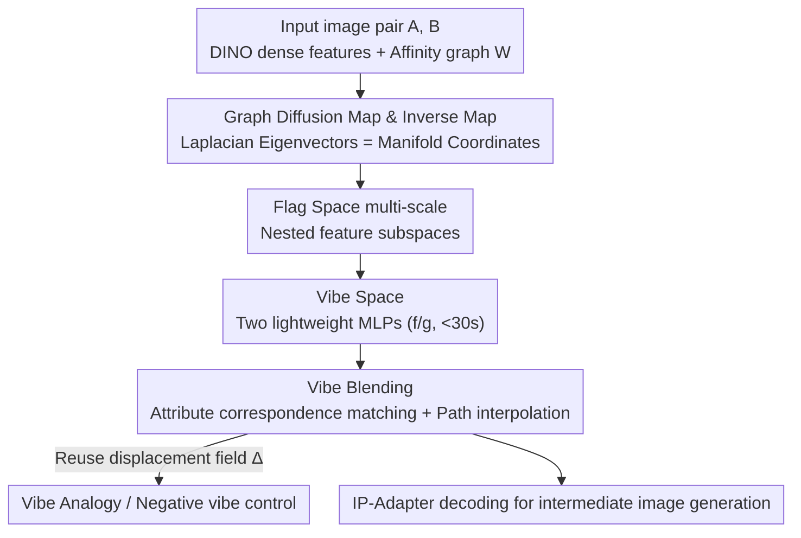

# Vibe Spaces for Creatively Connecting and Expressing Visual Concepts

**Conference**: CVPR 2026  
**Paper**: [CVF Open Access](https://openaccess.thecvf.com/content/CVPR2026/html/Yang_Vibe_Spaces_for_Creatively_Connecting_and_Expressing_Visual_Concepts_CVPR_2026_paper.html)  
**Area**: Image Generation / Creative Blending  
**Keywords**: Image blending, Manifold geometry, Graph diffusion maps, Creativity metrics, IP-Adapter

## TL;DR
This paper proposes the **Vibe Blending** task (fusing two images into a coherent hybrid based on their "most relevant shared attributes"—the so-called "vibe") and the **Vibe Space** method. By using graph diffusion maps to learn a low-dimensional "small-world" manifold in the CLIP/DINO feature space, it transforms originally curved geodesics into linearly interpolatable paths, generating creative blends that are more human-recognized than those from GPT or Gemini.

## Background & Motivation
**Background**: Fusing two semantically distant images (image morphing/blending) typically involves interpolation in the latent space of GANs or diffusion models, or finding semantic directions in noise/weight/text embedding spaces. Recently, Multi-modal Large Language Models (GPT Image, Gemini) have also been used to "imagine" blended images.

**Limitations of Prior Work**: Taking a violinist and a guitarist as an example, the ideal blend should reside in the "instrument and performance style." However, existing methods either perform pixel interpolation (leading to ghosting and incoherent intermediate frames), style transfer, or local part splicing—they **fail to identify which attributes are critical** and **cannot follow non-linear paths** that connect distant concepts. The paper defines this ability to "identify and fuse the most relevant shared attributes" as Vibe Blending. Fusing the vibe of a violin and a guitar should result in a lute (played like a guitar but sized like a violin), rather than a pixel-level overlay of the two.

**Key Challenge**: High-dimensional feature spaces are highly non-linear and filled with "holes"—regions corresponding to distorted or low-quality images. The paper hypothesizes that these holes arise because the **intrinsic dimensionality of the data manifold is much lower than that of the latent space**. Naive linear interpolation in such a space inevitably passes through these holes, producing fragmented intermediate images.

**Key Insight**: Instead of roaming aimlessly through the full high-dimensional feature space, one can learn a **compact low-dimensional manifold** (a "small world") from a few context images. Moving in a straight line within this small world corresponds to a coherent transition that stays close to the manifold in the original space. This step is implemented using the classic **graph diffusion map**—notably, this involves eigenvector construction in manifold learning and is unrelated to "diffusion model image generation."

**Core Idea**: Use graph Laplacian eigenvectors to "flatten" the curved manifold into a linearly interpolatable diffusion space. Then, use a lightweight MLP with only 1M parameters—trainable in 30 seconds—to approximate this geodesic in closed form. Finally, a frozen IP-Adapter renders the path into images.

## Method

### Overall Architecture
Given two input images $I_A, I_B$, the goal is to generate a sequence of coherent intermediate blends $\{I_\alpha\}_{\alpha\in[0,1]}$. The pipeline is as follows: extract DINO dense features from both images as graph nodes and compute the token-to-token affinity graph $\mathbf{W}$; solve for the generalized eigenvectors of the graph Laplacian to obtain **manifold coordinates** (flattening the curved manifold); use **flag spaces** to nest eigenvectors across multiple scales, avoiding the difficulty of choosing a fixed number of eigenvectors; train two lightweight MLPs online (Encoder $f$: DINO $\to$ Vibe, Decoder $g$: Vibe $\to$ CLIP) to compress this mapping into a closed form; use **correspondence matching** via semantic segmentation to determine which pairs of attributes from A and B should be fused, yielding the blending direction $\Delta_{A\to B}$; perform linear interpolation along this direction in Vibe Space, decode back to CLIP, and pass the embeddings to a frozen **IP-Adapter** for point-by-point image generation. Feature extraction and eigenvector computation take milliseconds, while encoder-decoder training completes within 30 seconds.

### Key Designs

**1. Graph Diffusion and Inverse Mapping: Flattening curved manifolds into linearly interpolatable geodesics**

To address the issue where linear interpolation in high-dimensional space falls into "holes," this paper does not move in the original space. Instead, it "flattens" the manifold first. By constructing the Laplacian of the feature similarity graph $\mathbf{L} = \mathbf{D} - \mathbf{W}$ (where $\mathbf{D}$ is the degree matrix), the $m$ eigenvectors $\psi_2,\dots,\psi_{m+1}$ corresponding to the smallest non-zero eigenvalues are taken as new coordinates, denoted as the diffusion map $\Psi$. The brilliance of this is that the diffusion distance (the probability of connecting two points in $t$ steps of a random walk) is exactly equal to the Euclidean distance in the embedding space:

$$D_t(\mathbf{x}_i, \mathbf{x}_j) = \| \mathbf{\Psi}_t(\mathbf{x}_i) - \mathbf{\Psi}_t(\mathbf{x}_j) \|_2,\quad \mathbf{\Psi}_t(\mathbf{x}_i) = (\lambda_1^t\psi_1(i),\dots,\lambda_m^t\psi_m(i))$$

Thus, the originally curved manifold path becomes approximately a straight line in the diffusion space. To obtain the path in the original space, an **inverse mapping** is performed: first, linearly interpolate in the diffusion space $\Psi_t(\mathbf{x}_\alpha)=(1-\alpha)\Psi_t(\mathbf{x}_A)+\alpha\Psi_t(\mathbf{x}_B)$, then solve $\gamma(\alpha)=\arg\min_{\mathbf{x}^*}\|\Psi_t(\mathbf{x}^*)-\Psi_t(\mathbf{x}_\alpha)\|_2^2$ to "pull it back" to the manifold. This optimization is solvable because the Jacobian is given in closed form by eigenvalue perturbation theory, and Nyström approximation allows for efficient updates of $\Psi_t(\mathbf{x}^*)$ under small perturbations—resulting in a path that sticks to the data manifold without passing through holes.

**2. Flag Space: Resolving the "how many eigenvectors to keep" dilemma using nested multi-scale subspaces**

Laplacian eigenvectors are naturally hierarchical: early ones describe global structures, while later ones encode local variations. Truncating to a fixed $\Psi_{1:m}$ is equivalent to choosing a single scale—too large and the path focuses on irrelevant attributes, too small and details are lost. This paper utilizes **flag spaces**: a sequence of nested embeddings $\Psi_{1:m_1}\subset\Psi_{1:m_2}\subset\cdots\subset\Psi_{1:m_M}$, accommodating both coarse and fine manifold structures simultaneously. The inverse mapping is modified to minimize the average reconstruction error across a set of scales $\mathcal{M}$:

$$\gamma(\alpha)=\arg\min_{\mathbf{x}^*}\frac{1}{|\mathcal{M}|}\sum_{m_k\in\mathcal{M}}\big\|\Psi_t^{1:m_k}(\mathbf{x}^*)-\Psi_t^{1:m_k}(\mathbf{x}_\alpha)\big\|_2^2$$

The resulting path is consistent across global and local geometries, meaning it **does not fail due to an incorrect choice of the number of eigenvectors**—replacing a sensitive hyperparameter with a robust average across scales.

**3. Vibe Space: Two lightweight MLPs compressing multi-scale geodesics into a 30s-trainable closed-form representation**

Solving the inverse mapping point-by-point is too slow. Therefore, the paper trains two small MLPs (~1M parameters) online. The encoder $f: \text{DINO} \to \text{Vibe}$ maps each token to a very low-dimensional (typically $d \approx 6$) latent representation $\mathbf{z}=f(\mathbf{x})$, and the decoder $g: \text{Vibe} \to \text{CLIP}$ maps it back to the CLIP space. The training objective is to align the geometry of Vibe Space with the multi-scale structure of the Flag Space diffusion map—specifically by matching the Gram matrix $\mathbf{z}\mathbf{z}^\top$ with the Flag Space kernel $\mathbf{S}(\Psi(\mathbf{x}))$:

$$\mathcal{L}_{\text{flag\_enc}}(f)=\big\|\mathbf{z}\mathbf{z}^\top-\mathbf{S}(\Psi(\mathbf{x}))\big\|_2^2,\quad \mathcal{L}_{\text{flag\_dec}}(f,g)=\big\|\mathbf{z}\mathbf{z}^\top-\mathbf{S}(\Psi(g(\mathbf{z})))\big\|_2^2$$

where $\mathbf{S}(\Psi(\mathbf{x}))_{ij}=\frac{1}{|\mathcal{M}|}\sum_{m_k}\Psi^{1:m_k}(\mathbf{x}_i)\Psi^{1:m_k}(\mathbf{x}_j)^\top$ aggregates the inner products of each scale. To generalize to unseen regions, an extrapolation regularization $\mathcal{L}_{\text{sample}}$ is added (constraining kernel consistency for random samples $\mathbf{z}_{\text{sample}}$), along with a reconstruction loss $\mathcal{L}_{\text{recon}}=\|\mathbf{x}^{\text{clip}}-g(f(\mathbf{x}^{\text{dino}}))\|_2^2$ to bridge DINO's semantic richness to CLIP's conditional generation. Once $\mathbf{z}\mathbf{z}^\top\approx\mathbf{S}(\Psi(\mathbf{x}))$, **walking in a straight line in Vibe Space is approximately equal to following multi-scale inverse diffusion geodesics**—replacing expensive point-by-point optimization with a single forward decoding pass. DINO is used as input because its features are semantically finer, while outputting to CLIP allows for direct utilization of the IP-Adapter.

**4. Vibe Blending Pipeline and Attribute Correspondence Matching (including Vibe Analogy, Negative Control)**

With Vibe Space, blending involves four steps (Algorithm 1): train Vibe Space $\to$ identify attribute pairs to fuse $\to$ interpolate in Vibe Space $\to$ decode and generate. "Identifying which attribute pairs to fuse" is critical: because two concepts rarely align at the pixel level, this paper uses k-way NCut to cluster DINO tokens of each image into semantic segments, then uses the Hungarian algorithm for **segment-level correspondence**, yielding a bijection $\pi:I_B\leftrightarrow I_A$. The blending direction is $\Delta_{A\to B}=\pi(\mathbf{z}_B)-\mathbf{z}_A$. Interpolation follows $\mathbf{z}_\alpha=\mathbf{z}_A+\alpha\Delta_{A\to B}$, followed by $g$ decoding and generation via the **IP-Adapter** (no fine-tuning required). This displacement field can be reused: **Vibe Analogy** applies the learned $\Delta_{A\to B}$ to a new related image $I_{A'}$, extrapolating a "similar vibe" $I_{B'}$ (e.g., turning Leonardo da Vinci's face into a playing card). **Negative Vibe Control** works in reverse: given a set of negative samples defining attributes to remove, Flag Space orthogonalization $\Psi_{\text{filtered}}=\Psi_{\text{pos}}-\beta\cdot\Psi_{\text{neg}}(\Psi_{\text{neg}}^\top\Psi_{\text{pos}})$ projects positive attributes away from the negative direction, allowing the fusion of "rotation" without bringing along "style."

**5. Cognitive-Inspired Creativity Metric Framework: PNS + Human/LLM Preference**

Creativity lacks an objective ground truth. The paper builds a metric framework using clues from cognitive psychology. The core is the **Path Nonlinearity Score (PNS)**: psychology suggests that when humans fuse distant concepts, they take "detours" through intermediate associations (apple $\to$ tree $\to$ wood $\to$ house). In feature space, this corresponds to more curved paths. Thus, by sampling $n$ points along the CLIP path $\gamma(\alpha)$ decoded from Vibe Space, two things are quantified: $\textit{length ratio}=\gamma_{\text{curved}}/\gamma_{\text{linear}}$ (how much longer the curved path is compared to the straight line) and $\textit{direction change}=\frac{1}{n-2}\sum_i\cos^{-1}\frac{\langle\delta_i,\delta_{i+1}\rangle}{\|\delta_i\|\|\delta_{i+1}\|}$ (average angle between adjacent segments). The normalized average yields the PNS. A higher PNS represents more distant concepts that are harder to fuse. In experiments, PNS shows 80% consistency with human-labeled "blend difficulty" on high-consensus samples. The other half of the framework includes human studies (pairwise comparisons along axes of "Creative Potential" and "Blend Difficulty") and using GPT-5 as an LLM judge to verify if LLMs can approximate human judgment.

### Loss & Training
The total objective for Vibe Space = Encoder Flag Space loss $\mathcal{L}_{\text{flag\_enc}}$ + Decoder Flag Space loss $\mathcal{L}_{\text{flag\_dec}}$ + Extrapolation regularization $\mathcal{L}_{\text{sample}}$ + DINO $\to$ CLIP reconstruction $\mathcal{L}_{\text{recon}}$. Each of the two MLPs has approximately 1M parameters and is trained online for each pair (or group) of input images, converging within 30 seconds. The IP-Adapter remains frozen throughout and requires no fine-tuning.

## Key Experimental Results

### Main Results
Human preference studies were conducted on "Totally Looks Like" (44 humorously similar image pairs, categorized by human-rated blend difficulty as High/Medium/Low) and a self-curated "Architecture" dataset (300 pairs of architectural design images). These were compared against GPT Image 1, Gemini 2.5 Flash Image, and CLIP Avg (averaging CLIP embeddings then feeding to IP-Adapter). The table below shows the percentage of times each method was selected as the best by humans:

| Dataset / Difficulty | CLIP Avg | Gemini | GPT | Ours |
|----------------------|----------|--------|-----|------|
| TLL High Difficulty | 13.3% | 6.67% | 20.0% | **60.0%** |
| TLL Mid Difficulty  | 21.4% | 7.14% | 21.4% | **50.0%** |
| TLL Low Difficulty  | 26.7% | 6.67% | **40.0%** | 26.7% |
| Architecture         | 39.0% | 5.00% | 14.0% | **42.0%** |

Ours human preference is approximately 3× that of the runner-up GPT on high-difficulty samples and 2.4× on medium-difficulty samples; the advantage becomes more pronounced as the blending difficulty increases. On simple image pairs, the preference for GPT/CLIP Avg increases, which also explains the narrowing gap with CLIP Avg on the Architecture dataset where concepts are closer.

### Metrics & Consistency Analysis

| Metric | Result | Description |
|--------|--------|-------------|
| PNS vs. Human Difficulty Consistency | 80.0% | On high-consensus (≥66%) samples, PNS estimates perceived human difficulty |
| Human Pairwise Annotation Consistency | 63–77% (TLL) / 66–75% (Arch) | Humans remain relatively consistent even on subjective tasks |
| Human Top-1 vs. LLM | 35.7% (TLL) / 31.3% (Arch) | Random baseline 25%; LLM overlap with human best choice is limited |
| Human Top-2 vs. LLM | 55.1% (TLL) / 51.8% (Arch) | Relaxing to top-2, LLM tends to select a subset of human high-rated choices |

### Key Findings
- **Advantage concentrated in "Hard" samples**: The value of the method increases with blending difficulty, fitting the motivation of "taking detours to fuse distant concepts"; for simple concepts, the difference from CLIP average is marginal.
- **PNS as a useful difficulty proxy**: It is 80% consistent with human difficulty and can be used to automatically filter "more challenging and worthy" image pairs, providing a principled direction for dataset expansion.
- **LLM judges are semi-reliable**: GPT-5 also most frequently chose the proposed method on high-difficulty TLL and the entire Architecture dataset, but it failed in two ways: misidentifying shared attributes or correctly identifying them but overemphasizing irrelevant attributes (e.g., focusing on color/texture instead of hairstyle). Thus, it serves as an approximation rather than a replacement for human judgment.

## Highlights & Insights
- **Translating "creative blending" into "manifold geodesics"** is the most elegant step: using classic graph diffusion maps to flatten high-dimensional non-linear manifolds and then pulling back via inverse mapping avoids the old problem of linear interpolation passing through holes. The entire process requires no generator training—only 1M parameter MLPs.
- **Flag Space** solves the often-ignored "how many eigenvectors to keep" hyperparameter in manifold learning—using nested multi-scale subspaces for robust averaging. This concept is transferable to any task relying on spectral embeddings.
- **PNS uses path geometry to quantify "conceptual distance/difficulty"**, turning a subjective "how well do these images blend" question into a computable metric of curvature/length ratio, which is highly practical for dataset curation.
- **Displacement field reusability**: A single $\Delta_{A\to B}$ supports blending, analogy on new images, and negative control via orthogonalization—a unified representation for three creative operations.

## Limitations & Future Work
- **Evaluation still heavily relies on subjective judgment**: Creativity is ambiguously defined, human annotation is costly and carries ~25–37% inconsistency, and LLM judges can misidentify key attributes. Reliable, scalable automatic evaluation remains an open problem.
- **Difficulty in screening "good image pairs"**: Although PNS provides a principled direction, curating truly engaging and challenging input pairs remains an unsolved task.
- **Generation quality limited by frozen IP-Adapter**: The method only learns the path and does not touch the generator; rendering fidelity is capped by the IP-Adapter's ceiling. For extremely distant concept pairs with almost no shared attributes, a "vibe" might simply not exist.
- **Improvement Directions**: Making LLM judges better at "capturing key shared attributes" and using PNS to automatically expand more difficult datasets are two paths highlighted by the authors.

## Related Work & Insights
- **vs. Diffusion Morphing (DiffMorpher, Yu et al.)**: They perform pixel-level interpolation in the generator's latent space, causing ghosting and incoherence for distant concepts. This paper learns low-dimensional manifolds in DINO/CLIP space to follow geodesics, focusing on "attributes that should be fused" rather than pixels.
- **vs. AID (Attention Interpolation)**: AID fuses attention within the diffusion model but treats all attributes equally, relying on attention correspondence. This paper explicitly uses segmentation correspondence to find the "most relevant attributes" without needing to fine-tune the diffusion model.
- **vs. Multi-modal LLMs (GPT Image, Gemini)**: They rely on language descriptions for blending, which often degrades into local part splicing or style transfer, failing to capture fine-grained visual attributes. This paper operates directly in the image feature space, showing significantly higher human preference on difficult samples.
- **vs. Classic Diffusion Maps / Manifold Learning**: It borrows old tools like diffusion maps, Nyström, and eigenvalue perturbation, but innovatively connects them to IP-Adapter generation and handles multiple scales via Flag Space—turning spectral embedding from an "analytical tool" into a "generative engine for creativity."

## Rating
- Novelty: ⭐⭐⭐⭐⭐ Connecting graph diffusion manifold geometry + Flag Space multi-scale + lightweight MLPs to generation, while proposing a new Vibe Blending task and PNS metric, is a unique perspective.
- Experimental Thoroughness: ⭐⭐⭐⭐ Multidimensional verification using human studies, LLM judges, and PNS consistency, though the sample size is relatively small (44/300 pairs) and lacks quantitative fidelity metrics.
- Writing Quality: ⭐⭐⭐⭐⭐ The motivation (Violin ↔ Guitar → Lute) is vivid, the mathematical derivation and algorithm are clear, and the illustrations are helpful.
- Value: ⭐⭐⭐⭐ Provides a principled, lightweight, and controllable new paradigm for creative image blending. PNS and negative control are practical, though evaluation subjectivity limits direct deployment.

<!-- RELATED:START -->

## Related Papers

- [\[CVPR 2026\] Toward Diffusible High-Dimensional Latent Spaces: A Frequency Perspective](toward_diffusible_high-dimensional_latent_spaces_a_frequency_perspective.md)
- [\[CVPR 2026\] Erasing Thousands of Concepts: Towards Scalable and Practical Concept Erasure for Text-to-Image Diffusion Models](erasing_thousands_of_concepts_towards_scalable_and_practical_concept_erasure_for.md)
- [\[CVPR 2025\] Memories of Forgotten Concepts](../../CVPR2025/image_generation/memories_of_forgotten_concepts.md)
- [\[CVPR 2026\] Seeing What Matters: Visual Preference Policy Optimization for Visual Generation](seeing_what_matters_visual_preference_policy_optimization_for_visual_generation.md)
- [\[CVPR 2026\] Visual Personalization Turing Test](visual_personalization_turing_test.md)

<!-- RELATED:END -->
