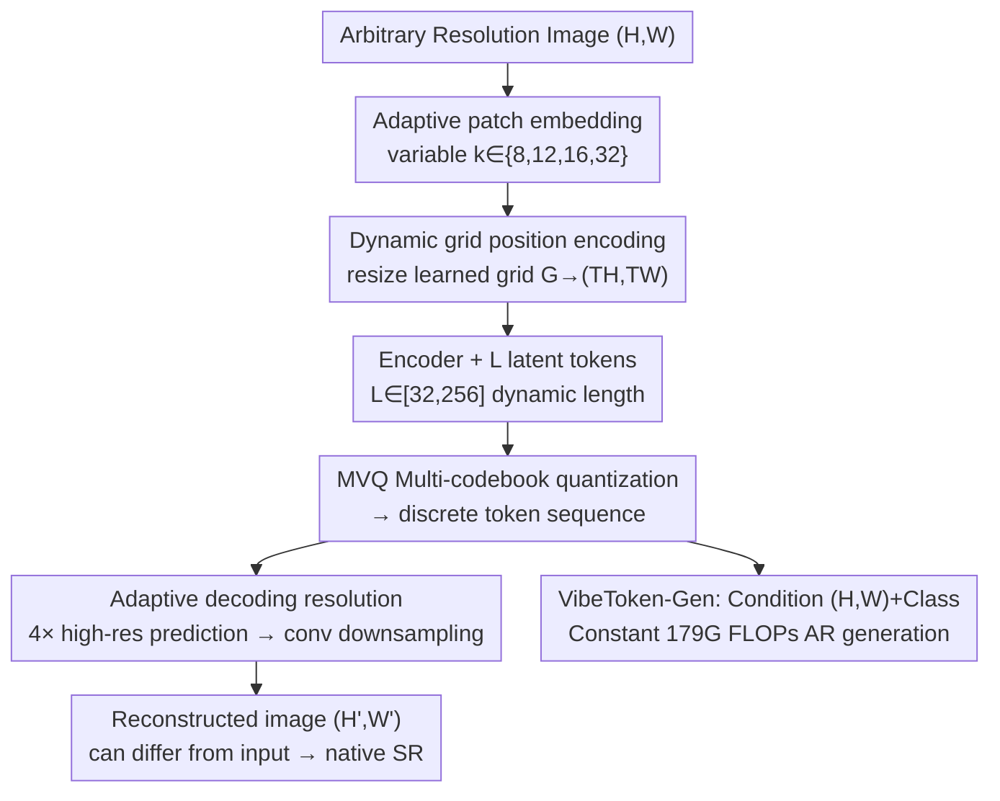

# VibeToken: Scaling 1D Image Tokenizers and Autoregressive Models for Dynamic Resolution Generations

**Conference**: CVPR 2026  
**Paper**: [CVF Open Access](https://openaccess.thecvf.com/content/CVPR2026/html/Patel_VibeToken_Scaling_1D_Image_Tokenizers_and_Autoregressive_Models_for_Dynamic_CVPR_2026_paper.html)  
**Code**: https://github.com/SonyResearch/VibeToken  
**Area**: Image Generation  
**Keywords**: 1D Image Tokenizer, Autoregressive Generation, Arbitrary Resolution, Dynamic Token Length, Computational Efficiency

## TL;DR
VibeToken proposes a "resolution-agnostic" 1D Transformer tokenizer that compresses images of arbitrary resolutions/aspect ratios into 32–256 dynamic-length discrete tokens. Paired with a constant-compute autoregressive generator, VibeToken-Gen, it generates 1024×1024 images (3.94 gFID) using only 64 tokens. The inference FLOPs are 63× lower than LlamaGen, flattening the AR generation compute curve from "quadratic growth with resolution" to a horizontal line.

## Background & Motivation

**Background**: Image generation is dominated by two paradigms: diffusion models and autoregressive (AR) models. Diffusion models naturally support arbitrary resolutions and aspect ratios, becoming the workhorse of industrial-grade generation. AR models (VQGAN+Transformer, LlamaGen, VAR, etc.), while achieving competitive quality at fixed resolutions, are rarely used in production environments.

**Limitations of Prior Work**: The fatal flaw of AR models is "resolution flexibility." Most AR works are trained only on fixed low resolutions like 256×256 or 512×512, failing when resolution changes. Common remedies involve appending a super-resolution module (SDXL/Flux upscaler), which introduces additional training complexity and computational overhead.

**Key Challenge**: The root of the problem lies in the **tokenizer**. Traditional 2D CNN tokenizers (e.g., VQGAN) produce a number of tokens that scales linearly with resolution—at $f=16$, a 256×256 image yields 256 tokens, while 1024×1024 explodes to 4096 tokens. Since AR model self-attention is $O(T^2)$, inference FLOPs undergo a quadratic explosion (LlamaGen requires ≈11 TFLOPs at 1024×1024). Recent 1D Transformer tokenizers (e.g., TiTok) offer higher compression but assume a fixed training resolution and lack the spatial inductive bias of 2D tokenizers, similarly failing to generalize across resolutions.

**Goal**: The authors simplify the problem into a single question: "Can we encode an image of arbitrary resolution into a **fixed and small** set of tokens and decode it back to any target resolution?" If possible, the AR generator could always be trained on a fixed, short sequence length, offloading all "resolution scaling" tasks to the tokenizer.

**Core Idea**: Transfer the scalability burden from the generator to the tokenizer by developing a resolution-agnostic, length-controllable 1D tokenizer (VibeToken). This allows the downstream AR generator to natively support arbitrary resolutions and aspect ratios under a constant compute budget.

## Method

### Overall Architecture

The core of VibeToken is a 1D Transformer encoder-decoder tokenizer. It takes an image of arbitrary resolution $(H,W)$, processes it using **adaptive patch embedding** (variable patch size $k$), and injects spatial inductive bias via **dynamic grid position encoding**. The encoder prepends $L$ learnable latent tokens to the patch sequence; after encoding, only these $L$ latents ($L\in[32,256]$ selected dynamically) are kept and quantized into discrete tokens via multi-codebook quantization (MVQ). The decoder takes these $L$ quantized latents plus $N$ mask tokens, predicts pixels at a $4\times$ higher resolution, and then adjusts to the target resolution $(H',W')$ via an **adaptive downsampling convolution**. This allows for native super-resolution since input and output resolutions can differ. During training, input resolution, target resolution, and latent length are randomly sampled to force the model to learn resolution-independent representations.

VibeToken-Gen is a LlamaGen-style class-conditional AR generator that takes the target resolution $(H,W)$ as an additional condition. Because the number of tokens $L$ is decoupled from resolution (always $\le 256$), AR inference FLOPs remain **constant** regardless of the target resolution.

### Key Designs

**1. Dynamic Grid Position Encoding: Enabling 1D Tokenizers beyond Interpolation**
Absolute position encodings (APE) trained on fixed grids fail when extrapolating to new resolutions, while learnable axial RoPE is computationally expensive at high resolutions (see Table 1, Learnable RoPE at 1024² is 445 GFLOPs). VibeToken maintains a learned grid embedding $G\in\mathbb{R}^{d\times T^{max}_H\times T^{max}_W}$ (where $T^{max}_H=T^{max}_W=32$). For an input image, the patch grid dimensions $T_H=\lceil H/k_h\rceil, T_W=\lceil W/k_w\rceil$ are calculated, and $G$ is **resized** to $(T_H,T_W)$ using differentiable bilinear/bicubic interpolation: $\widehat{G}=\operatorname{resize}(G;T_H,T_W)$. This allows position encoding to "stretch" with resolution rather than just interpolating, preserving spatial bias while removing fixed-length constraints. Compared to learnable axial RoPE, this reduces FLOPs by ~33% without quality loss.

**2. Adaptive Patch Embedding: One Set of Weights for Any Patch Size**
Sequence length $s$ grows linearly with the number of patches; large patches save compute but lose detail. Inspired by FlexiViT, VibeToken allows variable patch sizes $k\in[k_{min},k_{max}]$ during both training and inference. Only one set of base projection weights $W_{k_{max}}$ for the $k_{max}$ grid is learned. Weights for any other $k$ are derived online via a weight-scaling operator $R_{k\leftarrow k_{max}}$: $W_k=W_{k_{max}}R_{k\leftarrow k_{max}}$ (per-channel bilinear interpolation). Thus, only $W_{k_{max}}$ and bias $b$ are trained, ensuring feature consistency across different $k$ values. This design reduces 1024² reconstruction FLOPs from 131G to 5.38G (Table 1).

**3. Adaptive Decoding Resolution: Internalizing SR in the Decoder**
Traditional decoders predict a fixed $k$ number of pixels per mask token, locking the resolution. VibeToken's decoder first predicts a $4\times$ intermediate image $\tilde v\in\mathbb{R}^{3\times H'\times W'}$ at a fixed $k_{max}=4k$ (where $H'=T_H k_{max}, W'=T_W k_{max}$), followed by a lightweight learnable downsampling 2D convolution $\mathcal{D}_{H,W}$ to reach the target resolution: $\hat v=\mathcal{D}_{H,W}(\tilde v)\in\mathbb{R}^{3\times H\times W}$. Like adaptive patch embedding, the kernel size is adjustable, allowing for arbitrary target resolutions and **native 4× super-resolution** without an external upscaler.

**4. Dynamic Length Tokenization: Eliminating Quality Gaps**
Image complexity varies, making fixed latent lengths $L$ either wasteful or insufficient. Unlike prior methods that only drop tokens at inference, VibeToken trains both the encoder and decoder on uniformly sampled lengths $L\sim P(L), L\in[32,256]$. For a target $L$, the encoder produces exactly $L$ latents, and the decoder consumes exactly $L$ tokens without padding. This enables a powerful "quality-compression" trade-off (e.g., 64 tokens for 1024×1024) and seamless compute control at inference.

**5. VibeToken-Gen: Resolution-conditioned Constant-compute AR Generator**
Downstream, a LlamaGen-style AR model is used for generation. To prevent stretching artifacts when decoding to arbitrary $(H,W)$, the target resolution is explicitly fed as a condition: $c=\big[\operatorname{emb}(y)+\operatorname{MLP}((H,W)/\beta)\big]$, where $\operatorname{emb}$ projects the class label $y$ and $\operatorname{MLP}$ projects the normalized resolution ($\beta=1536$). Since $L$ is small and resolution-independent, the AR inference FLOPs are **constant**, fundamentally solving the quadratic compute explosion seen in LlamaGen.

### Loss & Training

The tokenizer is trained with a VAE+VQ reconstruction framework. Images are sampled between 256×256 and 512×512 with aspect ratios in $\{1{:}1, 1{:}2, 2{:}1, 2{:}3, 3{:}2\}$. Patch sizes $k\in\{8,12,16,32\}$ ensure spatial tokens $N\le1024$. Each sample independently picks input and target resolutions $(H_{in},W_{in})$ and $(H_{out},W_{out})$ to force cross-resolution learning. Latent length $L\in[32,256]$ is sampled uniformly. Quantization uses an MVQ variant with 8 codebooks of size 4096 each. Two variants, VibeToken-SL and VibeToken-LL, were trained on ImageNet1k for 600k steps.

## Key Experimental Results

### Main Results

Tokenizer reconstruction (rFID↓): VibeToken is the only method supporting both dynamic resolution and dynamic tokens.

| Tokenizer | Dynamic Res | Dynamic Token | 256² | 512² | 1024² | Arb. Ratio |
|-----------|-------------|---------------|------|------|-------|------------|
| IBQ (2D) | ✓ | ✗ | 0.97 | 0.40 | 1.26 | 1.42 |
| Open-MAGVIT-v2 (2D) | ✓ | ✗ | 1.17 | 0.50 | 1.32 | 1.52 |
| UniTok (1D) | ✗ | ✗ | **0.33** | – | – | – |
| **VibeToken-LL** | ✓ | ✓ | 0.40 | 0.51 | 2.40 | **3.60** |

Cross-resolution generation (gFID↓): VibeToken-Gen approaches multi-resolution diffusion baselines.

| Model | Type | 1024×1024 | Avg (512–1024 ratios) |
|-------|------|-----------|------------------------|
| NiT-XL | Diff. | 5.87 | 6.05 |
| **VibeToken-Gen (XXL)** | AR | **3.54** | **5.53** |

VibeToken-Gen-XXL achieves 3.54 gFID at 1024² using only 64 tokens, outperforming the diffusion SOTA NiT (5.87) while being 2.35× faster in terms of latency.

### Ablation Study

ImageNet 256×256 generation (GPT-B, 100 epochs):
- **Token Length**: 64 tokens yielded the best gFID (8.42). Increasing to 128/256 tokens actually degraded performance (9.02/9.81), suggesting that tokens useful for reconstruction rFID aren't necessarily best for generation gFID.
- **Adaptive Patch Embedding**: This single design reduced 1024² reconstruction FLOPs from 131G to 5.38G and significantly improved quality (rFID 5.38 vs 131.20).

### Key Findings
- **64 tokens are sufficient**: Increasing token count does not yield generation gains, allowing for extremely efficient final models.
- **Flattened Compute Curve**: While 2D tokenizer (IBQ) FLOPs increase from ~0.64T at 256² to ~10.30T at 1024², VibeToken remains at ~1.04T. VibeToken-Gen maintains constant 179G FLOPs, whereas LlamaGen requires ≈11T at 1024².
- **Generalization vs. Specialization**: When restricted to a single resolution (e.g., 256²), VibeToken-Gen slightly lags behind dedicated baselines (RAR-XXL 1.48 vs Ours 3.62), as its compute budget is spread across all resolutions.

## Highlights & Insights
- **Shifting "scalability burden" to the tokenizer**: This is the most significant architectural design. Instead of forcing the AR model to handle variable-length sequences, the tokenizer compresses any resolution into a fixed-length budget.
- **"Resize weights/grids, not features"**: A unified approach of resizing the learned grid $G$ for position encoding, resizing kernel $W_{k_{max}}$ for patch embedding, and resizing the downsampling kernel for decoding provides an elegant solution for resolution adaptation.
- **In-decoder Super-resolution**: By internalizing 4× prediction and adaptive downsampling, SR becomes a "free gift" of the tokenizer rather than an external module.
- **Reconstruction Tokens ≠ Generation Tokens**: The insight that fewer tokens can lead to better generation gFID despite worse reconstruction rFID is counter-intuitive but highly practical for defining token budgets.

## Limitations & Future Work
- **Absolute quality lag**: On specific fixed resolutions, VibeToken-Gen does not yet match the quality of specialized AR models like RAR.
- **High-res reconstruction loss**: rFID at 1024² (2.40) is notably higher than at 256² (0.40), indicating a loss ceiling when using very few tokens for high-resolution compression.
- **KV cache costs**: Reported FLOPs are per forward pass. Total generation cost still scales with sequence length $L$.
- **Stretching artifacts**: While mitigated by conditioning on $(H,W)$, OOD aspect ratios may still exhibit artifacts.

## Related Work & Insights
- **vs. LlamaGen**: LlamaGen's compute explodes quadratically with resolution. VibeToken fixes this by making token count independent of resolution, shifting the scaling responsibility.
- **vs. TiTok / One-D-Piece**: These 1D tokenizers lack spatial inductive biases and resolution flexibility. VibeToken introduces dynamic grid PE and variable-length training to solve these issues.
- **vs. NiT / FiT-v2**: These diffusion models generalize by modifying the DiT architecture. VibeToken provides a path for AR models to achieve similar or better efficiency and quality.

## Rating
- Novelty: ⭐⭐⭐⭐⭐ First 1D Transformer tokenizer with native arbitrary resolution support.
- Experimental Thoroughness: ⭐⭐⭐⭐ Extensive reconstruction and generation tests, though slightly behind specialized AR models in pure quality.
- Writing Quality: ⭐⭐⭐⭐⭐ Clear motivation, consistent logic, and honest about limitations.
- Value: ⭐⭐⭐⭐⭐ Flattens the AR generation compute curve, offering significant engineering value for production-level high-resolution AR generation.

<!-- RELATED:START -->

## Related Papers

- [\[CVPR 2026\] Prompt Yourself: Awakening Textual Semantics in 1D Visual Tokenizers](prompt_yourself_awakening_textual_semantics_in_1d_visual_tokenizers.md)
- [\[CVPR 2026\] Progress by Pieces: Test-Time Scaling for Autoregressive Image Generation](progress_by_pieces_test-time_scaling_for_autoregressive_image_generation.md)
- [\[ICML 2026\] Image Restoration via Diffusion Models with Dynamic Resolution](../../ICML2026/image_generation/image_restoration_via_diffusion_models_with_dynamic_resolution.md)
- [\[CVPR 2026\] DPAR: Dynamic Patchification for Efficient Autoregressive Visual Generation](dpar_dynamic_patchification_for_efficient_autoregressive_visual_generation.md)
- [\[ICML 2026\] End-to-End Autoregressive Image Generation with 1D Semantic Tokenizer](../../ICML2026/image_generation/end-to-end_autoregressive_image_generation_with_1d_semantic_tokenizer.md)

<!-- RELATED:END -->
