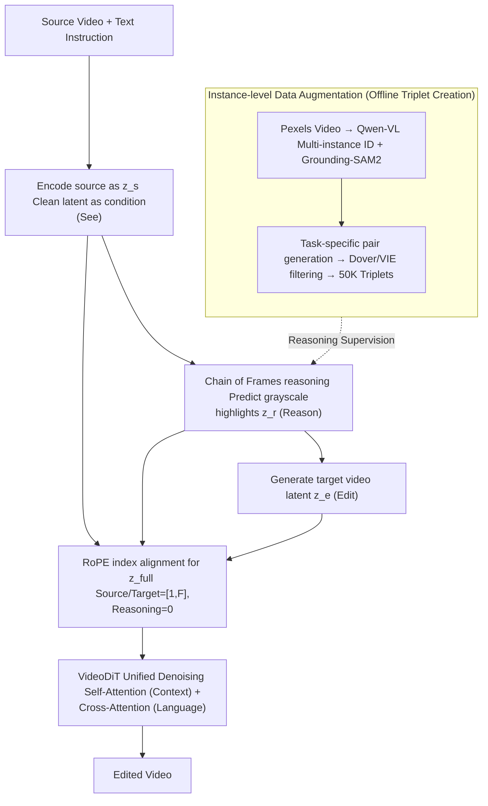

# VideoCoF: Unified Video Editing with Temporal Reasoner

**Conference**: CVPR 2026  
**arXiv**: [2512.07469](https://arxiv.org/abs/2512.07469)  
**Code**: [https://github.com/knightyxp/VideoCoF](https://github.com/knightyxp/VideoCoF)  
**Area**: Diffusion Models / Video Editing  
**Keywords**: Video editing, Chain-of-Frames, Video diffusion models, Reasoning frames, Length extrapolation  

## TL;DR

VideoCoF is proposed as a Chain-of-Thought inspired "see → reason → edit" video editing framework. By requiring the video diffusion model to first predict reasoning tokens (grayscale highlighted latents of the editing region) before generating target video tokens, it achieves precise instruction-region alignment without user-provided masks. It reaches SOTA performance with only 50K video pair training and supports video length extrapolation up to 16 times the training length.

## Background & Motivation

1. **Background**: Current video editing methods are primarily categorized into two types: expert models (adapters + external masks, precise but dependent on extra inputs and task-specific) and unified temporal context learning models (concatenating source video tokens and noisy edit tokens along the temporal axis, mask-free but lacking explicit spatial cues).

2. **Limitations of Prior Work**: Unified models suffer from weak instruction-region mapping due to a lack of explicit spatial guidance, leading to poor precision in multi-instance recognition or spatial reasoning scenarios. While expert models are precise, they require user-provided masks or per-task training, failing to handle diverse editing tasks in a unified manner.

3. **Key Challenge**: The trade-off between precision and unification—can the positioning accuracy of expert models be maintained while keeping the mask-free convenience of unified models?

4. **Goal**: (1) Achieve precise editing region localization without mask input; (2) Handle multi-instance editing tasks within a unified framework; (3) Enable the model to extrapolate to video lengths exceeding that of the training data during inference.

5. **Key Insight**: Drawing an analogy to the multi-step reasoning of Chain-of-Thought in LLMs—allowing video generation models to perform "visual chain-of-thought reasoning" by predicting the editing region before execution. Observation shows that video diffusion models (VDM) inherently possess reasoning capabilities (as proven by VDMs solving visual puzzles), which can be stimulated by explicitly modeling reasoning tokens.

6. **Core Idea**: By inserting "reasoning frames" (grayscale highlighted latents of the editing region) between the source and edited videos, the diffusion model is forced to "see, then think, then do," achieving precise mask-free video editing.

## Method

### Overall Architecture

VideoCoF builds a unified video editing framework based on VideoDiT (e.g., WAN-14B). The inputs are a source video and a text editing instruction; the output is the edited video. The process is divided into three stages: first, the source video is encoded into latents as the "seeing" basis; second, the model predicts reasoning latents (grayscale highlighted frames marking the edit area) as the "reasoning" step; finally, the edited video latents are generated based on the reasoning results. The three sets of latents are concatenated along the temporal dimension into a unified sequence $\mathbf{z}_{full}$, processed by VideoDiT through self-attention (in-context learning) and cross-attention (linguistic control). A RoPE index alignment strategy assigns temporal positional encodings to these three sets of tokens during concatenation. During training, noise is applied only to reasoning frames and target frames to supervise velocity field prediction, while the "source-reasoning-target" triplets required for training are generated offline via an instance-level data augmentation pipeline.

### Key Designs

**1. Chain of Frames (CoF): Forcing the model to "visualize" the edit region before execution without mask inputs**

Previous temporal in-context learning methods (ICVE, UNIC, etc.) directly concatenate source video latents and noisy target latents. Without constraints mapping instructions to specific areas, edits often fall on the wrong objects in multi-instance or spatial reasoning scenarios. CoF inserts "reasoning frames" between the source and target videos. The triplet $\{\mathbf{s}, \mathbf{r}, \mathbf{e}\}$ is encoded into $z_s, z_r, z_e$ and concatenated. During training, source latents remain clean (timestep=0) as conditions, while reasoning and target frames are jointly denoised. Crucially, the ground truth for reasoning frames is a grayscale translucent highlight of the edit area—the model must reconstruct this frame, forcing it to learn the "instruction → region" mapping before generation. The highlight opacity is a progressive gradient (0% to 75%) rather than a fixed value; this smooth transition outperforms pure black or red masks (improving Success Ratio from 52% to 76%), as diffusion models are more sensitive to grayscale highlights in latent space than extreme pixel values.

**2. RoPE Index Alignment: Using a displaced temporal index to solve both "extrapolation failure" and "first-frame contamination"**

VideoDiT relies on 3D decomposed RoPE for spatiotemporal positional encoding. Naive concatenation (source at $[0, F-1]$, target at $[F, 2F-1]$) causes the model to memorize fixed mappings, leading to failure when video length changes. Conversely, repeating indices $[0, F-1]$ causes collisions where source, reasoning, and target frames share index=0, creating artifacts. VideoCoF sets both source and target to $[1, F]$ and places reasoning frames at index $0$. This isolates reasoning tokens, preventing interference with the first frame while ensuring motion alignment between source and target via shared indices. Since $F$ serves as a variable that can be scaled during inference, models trained on 33 frames successfully extrapolate to 141 (4x) or even 513 (16x) frames, whereas baseline schemes suffer from blurriness and motion misalignment at 81 frames.

**3. Instance-level Data Augmentation Pipeline: Constructing training pairs for complex spatial editing**

Existing datasets mostly feature simple single-instance edits, which fail to support spatial reasoning tasks like "replace the person on the left." VideoCoF builds its own pipeline: collecting diverse videos from Pexels, using Qwen-VL 72B for multi-instance recognition and Grounding-SAM2 for precise segmentation. Tasks are generated accordingly: removal/addition via Minimaxremover, and replacement/local style transfer via VACE-14B inpainting. Creative instructions are generated by GPT-4o. Finally, low-quality samples are filtered using Dover and VIE Scores, and a high-quality subset is distilled from Señorita 2M, totaling 50K samples. This structured data allows the model to outperform ICVE (trained on 1M+ data) across all GPT-4o metrics, proving that structured learning signals are more effective than brute-force scaling.

### Loss & Training

The training utilizes a Flow Matching objective: velocity field $\mathbf{v} = \boldsymbol{\varepsilon} - \mathbf{z}_{full}^{(0)}$, supervising the MSE loss only for reasoning and target frames:  
$$\mathcal{L} = \frac{1}{L+F}\sum_{i=F}^{2F+L-1}\|\mathbf{v}_i - \hat{\mathbf{v}_i}\|_2^2$$  
During inference, an ODE solver evolves latents from Gaussian noise, while source latents remain fixed. Combined with DMD-LoRA, inference requires only 4 steps, editing 33 frames in approx. 10 seconds on a single H100.

## Key Experimental Results

### Main Results

Comparison on VideoCoF-Bench (200 videos, 4 categories including instance-level editing):

| Method | Instruct Follow↑ | Preservation↑ | Quality↑ | Success Ratio↑ | CLIP-T↑ |
| :--- | :--- | :--- | :--- | :--- | :--- |
| ICVE (1M Pretrained + 150K Fine-tuned) | 7.79 | 8.06 | 8.14 | 57.76% | 27.49 |
| VACE-14B | 7.47 | 5.82 | 7.61 | 26.60% | 27.02 |
| Lucy Edit | 5.24 | 6.50 | 6.37 | 29.64% | 26.98 |
| **Ours (50K)** | **8.97** | **8.20** | **7.77** | **76.36%** | **28.00** |

With only 50K training samples, the model surpasses ICVE (1M+ data) in GPT-4o ratings, with an 18.6% improvement in Success Ratio.

### Ablation Study

| Configuration | Instruct Follow | Success Ratio | CLIP-T |
| :--- | :--- | :--- | :--- |
| Naive temporal [0,2F-1] w/o CoF | 8.11 | 72.41% | 26.88 |
| Index overlap [0,F-1] w/o CoF | 8.06 | 65.52% | 27.09 |
| **Ours [1-F,0,1-F] + CoF** | **8.97** | **76.36%** | **28.00** |

Reasoning frame format ablation:

| Format | Instruct Follow | Success Ratio |
| :--- | :--- | :--- |
| Black mask (0%) | 7.51 | 52.17% |
| Red mask (50%) | 7.81 | 60.33% |
| Gray mask (50%) | 8.15 | 68.45% |
| **Progressive Gray (0-75%)** | **8.97** | **76.36%** |

### Key Findings

- Inclusion of CoF reasoning frames improves Instruct Follow by +10.65% and Success Ratio by +5.46%, proving explicit reasoning is vital for precision.
- RoPE alignment enables scaling from 33-frame training to 513-frame inference (16x); naive schemes degrade severely by 81 frames.
- Progressive grayscale masks significantly outperform black/red masks as they are better suited for latent space representation in diffusion models.
- Superiority of the 50K dataset over 1M+ models highlights that data quality and structural design outweigh raw data volume.

## Highlights & Insights

- **Chain-of-Frames Reasoning Paradigm**: A clever migration of CoT from the linguistic to the visual generation domain. The "see → reason → edit" workflow mirrors human cognitive patterns, potentially applicable to image or 3D editing.
- **RoPE Index Isolation Strategy**: Uses a simple index offset (reasoning=0, video=[1,F]) to solve both index collision and extrapolation issues. This elegant design can be used as a general trick for concatenating heterogeneous token sequences in diffusion models.
- **Data Efficiency**: The 50K vs 1M results emphasize that structured learning signals (supervision via reasoning frames) are more effective than brute-force data accumulation.

## Limitations & Future Work

- Ground truth for reasoning frames relies on Grounding-SAM2 segmentation quality; failures may introduce noise.
- Current reasoning frames are static grayscale highlights, which may struggle with edits requiring frame-varying changes (e.g., modifying motion trajectories).
- While 50K samples are efficient, diversity may be limited compared to larger datasets for complex natural scenes.
- Attention visualization has not yet been explored to verify if reasoning frames truly drive regional attention.

## Related Work & Insights

- **vs ICVE**: ICVE uses naive temporal concatenation for unified editing with 1M+ data but lacks explicit spatial guidance. VideoCoF fills this gap via CoF reasoning frames.
- **vs VACE**: VACE is a strong base model but requires masks for inpainting. VideoCoF enhances editing precision within a mask-free unified framework.
- **vs EditVerse**: EditVerse explores unified in-context learning based on LLaMA-style DiT. VideoCoF implements similar functionality on standard video diffusion models more generally.

## Rating

- Novelty: ⭐⭐⭐⭐⭐ Chain-of-Frames is a pioneering exploration of CoT reasoning in video diffusion.
- Experimental Thoroughness: ⭐⭐⭐⭐ Comprehensive ablations (CoF, RoPE, formats), though primarily evaluated on a custom benchmark.
- Writing Quality: ⭐⭐⭐⭐⭐ Clear methodology and the CoT analogy makes for a compelling narrative.
- Value: ⭐⭐⭐⭐⭐ The reasoning frame + RoPE alignment design is broadly transferable to other visual generation tasks.

<!-- RELATED:START -->

## Related Papers

- [\[CVPR 2026\] Omni2Sound: Towards Unified Video-Text-to-Audio Generation](omni2sound_towards_unified_video-text-to-audio_generation.md)
- [\[CVPR 2026\] UniEdit-I: Training-free Image Editing for Unified VLM via Iterative Understanding, Editing and Verifying](uniedit-i_training-free_image_editing_for_unified_vlm_via_iterative_understandin.md)
- [\[CVPR 2026\] Cross-Modal Emotion Transfer for Emotion Editing in Talking Face Video](cross-modal_emotion_transfer_for_emotion_editing_in_talking_face_video.md)
- [\[CVPR 2026\] NOVA: Sparse Control, Dense Synthesis for Pair-Free Video Editing](nova_sparse_control_dense_synthesis_for_pair-free_video_editing.md)
- [\[ICLR 2026\] ChronoEdit: Towards Temporal Reasoning for In-Context Image Editing and World Simulation](../../ICLR2026/image_generation/chronoedit_towards_temporal_reasoning_for_in-context_image_editing_and_world_sim.md)

<!-- RELATED:END -->
