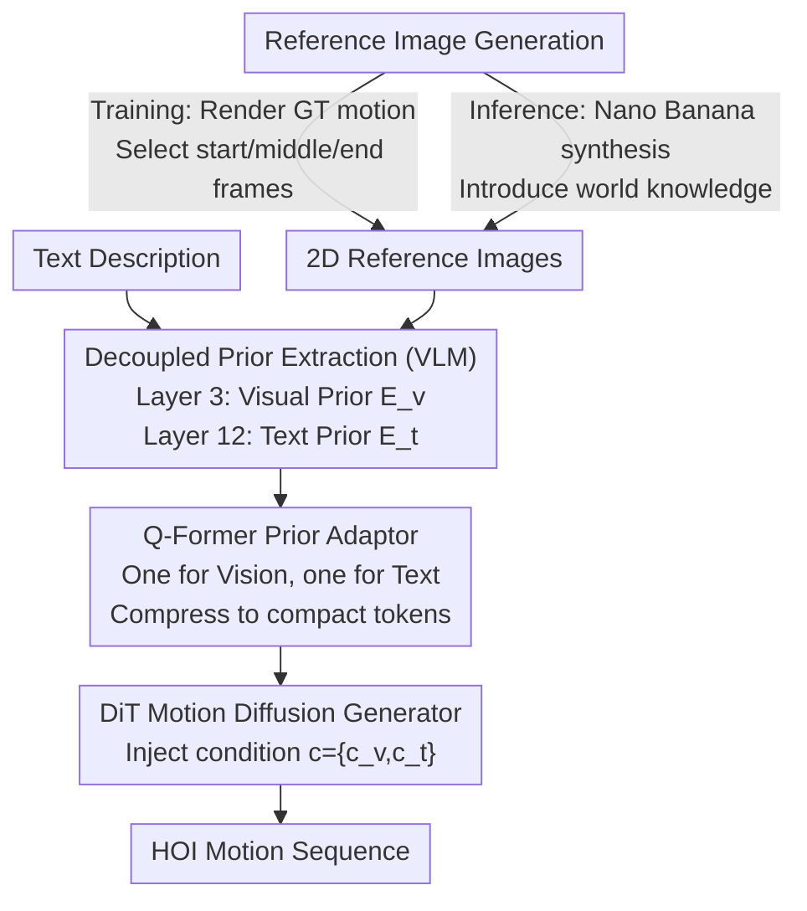

# ViHOI: Human-Object Interaction Synthesis with Visual Priors

**Conference**: CVPR 2026  
**arXiv**: [2603.24383](https://arxiv.org/abs/2603.24383)  
**Code**: [https://github.com/MPI-Lab/ViHOI](https://github.com/MPI-Lab/ViHOI)  
**Area**: Image Generation / Motion Generation  
**Keywords**: Human-Object Interaction Generation, Visual Priors, Diffusion Models, VLM, Q-Former

## TL;DR

Ours proposes ViHOI, a plug-and-play framework that leverages VLMs to extract decoupled visual and textual priors from 2D reference images. These are compressed into compact conditional tokens via Q-Formers to enhance the HOI motion generation quality of diffusion models. During inference, it utilizes text-to-image models to synthesize reference images, achieving strong generalization to unseen objects.

## Background & Motivation

1. **Background**: 3D Human-Object Interaction (HOI) motion generation aims to synthesize realistic and physically plausible interaction sequences between humans and objects, with significant applications in VR, animation, and robotics. Recently, diffusion models have been widely used for HOI generation tasks.

2. **Limitations of Prior Work**: The generation quality of existing methods is limited by the quality of conditional signals. The HOI process involves continuous spatial state changes and plausible interaction relationships, but text annotations in datasets usually provide only abstract descriptions (e.g., "pick up a box"), lacking geometric spatial priors regarding object shape, size, and human pose. This forces models to face complex "one-to-many" learning problems.

3. **Key Challenge**: Existing enhancement methods follow two paths: semantic enhancement (LLM-extended text descriptions) and physical constraints (contact points, kinematic priors). The former still lacks structured knowledge to precisely couple motion with object geometry, while the latter often focuses only on local interaction regions, ignoring the global dynamics and coherence of full-body motion.

4. **Goal**: How to effectively utilize the rich visual interaction priors (object shape, scale, human-object spatial relations) available in easily accessible 2D images to enhance the fidelity and physical plausibility of HOI motion generation.

5. **Key Insight**: The authors argue that 2D images provide a rich set of visual interaction priors, including object shape, scale, and human-object spatial relationships. Utilizing VLMs to simultaneously extract image and text information naturally ensures semantic alignment between the two modalities.

6. **Core Idea**: Use VLMs to extract decoupled visual and textual priors from 2D reference images, compress them via Q-Formers, and inject them into a motion diffusion model. During training, GT motion-rendered images ensure semantic alignment; during inference, text-to-image models synthesize reference images to achieve generalization.

## Method

### Overall Architecture

ViHOI consists of two core components: a VLM-based Prior Extractor and a Vision-aware HOI Generator. Inputs include a set of 2D reference images and a text description. The VLM (Qwen2.5-VL) extracts visual and textual priors from different layers, which are compressed into compact tokens via two Q-Former-based Prior Adaptors. These are then injected as conditions into a DiT-based motion diffusion model through a self-attention mechanism to guide HOI motion synthesis. The training phase uses images rendered from GT motion, while the inference phase uses reference images synthesized by a text-to-image model.

### Key Designs

**1. Layer-Decoupled Prior Extraction: Utilizing shallow layers for geometry and deep layers for semantics.**

Text annotations only provide abstract descriptions like "pick up a box," lacking geometric cues such as object shape, scale, and human-object spatial relations—elements precisely contained in 2D images. The problem is how to cleanly extract both visual and semantic information from the VLM. The authors observed that different depths of the VLM have different focuses: shallow layers retain rich visual details, while deeper layers have stronger text encoding capabilities but abstract away visual details. Thus, they extract information across layers: visual priors $E_v$ from Layer 3 of Qwen2.5-VL (preserving geometric spatial cues) and textual priors $E_t$ from Layer 12 (capturing motion semantics). A structured prompt is designed to explicitly guide the VLM to observe interaction vitals like object shape, size, and contact regions, ensuring the extracted priors are task-aware. Ablations show that pushing the visual layer deeper (V12, V24) significantly degrades FID, confirming that "shallow layers retain details"—V3-T12 proved optimal.

**2. Q-Former Prior Adaptor: Distilling variable-length high-dimensional VLM features into a compact token.**

VLMs output high-dimensional, variable-length token sequences that are too redundant and long to be used directly as diffusion conditions. The Q-Former performs compression: first, dimensions are aligned via linear projection $Z_v = \text{LayerNorm}(\text{Linear}(E_v))$, then a set of learnable queries $q_v$ interact with the mapped features through two layers of cross-attention to extract useful information into fixed-dimension compact tokens:

$$c_v = \text{CrossAttention}(q_v, Z_v, Z_v)$$

Independent Q-Formers are used for visual and textual paths. The cross-attention mechanism adaptively selects parts most relevant to HOI synthesis rather than averaging indiscriminately. Ablation results show that replacing this with simple average pooling causes FID to jump from 0.68 to 26.03, proving the compression mechanism is critical for performance.

**3. Reference Image Generation: Rendering for alignment during training, synthesis for knowledge during inference.**

Visual priors require image sources, but the methods of obtaining them differ between training and inference. During training, 2D images are rendered directly from GT motion sequences, and three keyframes (start, middle, end) are selected using contact labels. This ensures the visual priors are strictly aligned with the target motion at low cost. During inference, without GT, a text-to-image model (Nano Banana) synthesizes three temporally coherent HOI reference images, utilizing its embedded world knowledge to cover objects unseen during training. Despite the gap between clean rendered images and synthesized images, the VLM extracts underlying motion-related features rather than surface style, maintaining generalization performance on unseen objects.

### Loss & Training

- The training objective is the standard diffusion reconstruction loss: $\mathcal{L} = \mathbb{E}_{t,x_0}[\|x_0 - f_\theta(x_t, t, c)\|^2]$
- VLM parameters are frozen during training; only the two Q-Former Prior Adaptors and the HOI Generator are jointly trained.
- The condition $c = \{c_v, c_t\}$ contains both visual and textual compact prior tokens.

## Key Experimental Results

### Main Results

| Dataset | Metric | CHOIS+ViHOI (Ours) | CHOIS | Gain |
|--------|------|------|----------|------|
| FullBodyManipulation | FID↓ | 0.68 | 0.77 | -11.7% |
| FullBodyManipulation | R-Precision Top-3↑ | 0.79 | 0.73 | +8.2% |
| FullBodyManipulation | MPJPE↓ | 14.97 | 15.43 | -3.0% |
| FullBodyManipulation | $C_{F_1}$↑ | 0.75 | 0.70 | +7.1% |
| BEHAVE | FID↓ | 2.02 | 4.99 | -59.5% |
| BEHAVE | MPJPE↓ | 14.58 | 15.42 | -5.4% |
| Unseen Objects | FID↓ | 2.02 | 4.99 | -59.5% |

### Ablation Study

| Configuration | R-Precision Top-3 | FID↓ | MPJPE↓ | Note |
|------|---------|------|------|------|
| ViHOI (Full, V3-T12) | 0.79 | 0.68 | 14.97 | Optimal combo |
| ViHOI-Pool (Avg Pooling) | 0.32 | 26.03 | 22.62 | Q-Former→Pool, performance crash |
| ViHOI-CLIP (CLIP Text) | 0.75 | 0.69 | 17.57 | VLM Text→CLIP, performance drop |
| T12-only (Text Prior Only) | 0.72 | 1.28 | 17.49 | No visual prior, significant degradation |
| V12-T12 | 0.75 | 0.87 | 15.90 | Visual layer too deep, detail loss |
| V24-T24 | 0.61 | 3.15 | 16.94 | Both layers too deep, poor results |

### Key Findings

- **Q-Former is critical**: Replacing it with simple pooling causes FID to surge from 0.68 to 26.03, indicating that an effective prior compression mechanism is indispensable.
- **Visual priors outperform text-only priors**: Adding visual priors reduces MPJPE from 17.49 to 14.97, proving the importance of geometric spatial information in 2D images for motion generation.
- **VLM text priors outperform CLIP**: Text embeddings extracted from VLMs are richer than CLIP, reducing MPJPE from 17.57 to 14.97.
- **Strong generalization on unseen objects**: Leveraging world knowledge from text-to-image models, ViHOI generates plausible motions even on unseen objects and the 3D-FUTURE dataset.
- **Plug-and-play capability**: Successfully enhances the performance of three different baseline models: MDM, ROG, and CHOIS.

## Highlights & Insights

- The "Image as motion prior" paradigm is elegant—utilizing easily obtained 2D images to provide the geometric spatial priors needed for 3D motion generation, avoiding complex physical constraint modeling.
- The separated reference image strategy for training and inference cleverly solves the data bottleneck: training uses rendered images for alignment, while inference uses T2I models to introduce world knowledge for generalization.
- The use of Q-Former to compress variable-length high-dimensional VLM features into fixed-dimension tokens is a universal design pattern for connecting large foundation models to downstream tasks.
- The plug-and-play design allows it to directly enhance any existing HOI motion diffusion model.

## Limitations & Future Work

- **Hand data limitation**: The datasets used lack fine-grained hand annotations, preventing the generation of detailed finger motion sequences.
- **Dependency on T2I quality**: The plausibility of reference images during inference directly affects the quality of synthesized motion.
- **Temporal sparsity**: Using only three keyframes might be insufficient to represent complex, long-duration interaction processes.
- **Video priors**: The potential of video generation models as prior sources remains unexplored; videos provide richer temporal dynamics than static images.

## Related Work & Insights

- **vs SemGeoMo**: SemGeoMo uses LLMs for text enhancement and affordance maps as geometric priors, performing well on contact quality but lacking full-body motion accuracy. ViHOI improves both contact quality and joint accuracy through visual priors, better balancing local precision and global consistency.
- **vs CHOIS**: CHOIS uses sparse object landmarks as global path priors. ViHOI provides richer visual priors, outperforming CHOIS across FID and MPJPE.
- **vs Video Gen + 3D Recovery**: These methods rely on 2D-3D pose estimation, suffering from jitter and temporal inconsistency. ViHOI encodes visual priors as compact tokens to implicitly guide generation, avoiding explicit pose recovery.

## Rating

- Novelty: ⭐⭐⭐⭐ The paradigm of images as motion priors is novel; the VLM layer-decoupled extraction strategy is inspiring.
- Experimental Thoroughness: ⭐⭐⭐⭐ Two datasets, three baseline models, generalization to unseen objects, and detailed ablations.
- Writing Quality: ⭐⭐⭐⭐ Clear logic with a well-structured methodology.
- Value: ⭐⭐⭐⭐ The plug-and-play framework is highly practical, and the paradigm innovation is transferable.

<!-- RELATED:START -->

## Related Papers

- [\[CVPR 2026\] OneHOI: Unifying Human-Object Interaction Generation and Editing](onehoi_unifying_human-object_interaction_generation_and_editing.md)
- [\[ICLR 2026\] VMDiff: Visual Mixing Diffusion for Limitless Cross-Object Synthesis](../../ICLR2026/image_generation/vmdiff_visual_mixing_diffusion_for_limitless_cross-object_synthesis.md)
- [\[CVPR 2026\] Stability-Driven Motion Generation for Object-Guided Human-Human Co-Manipulation](stability-driven_motion_generation_for_object-guided_human-human_co-manipulation.md)
- [\[CVPR 2026\] Object-WIPER: Training-Free Object and Associated Effect Removal in Videos](object-wiper_training-free_object_and_associated_effect_removal_in_videos.md)
- [\[ICCV 2025\] ScoreHOI: Physically Plausible Reconstruction of Human-Object Interaction via Score-Guided Diffusion](../../ICCV2025/image_generation/scorehoi_physically_plausible_reconstruction_of_human-object_interaction_via_sco.md)

<!-- RELATED:END -->
