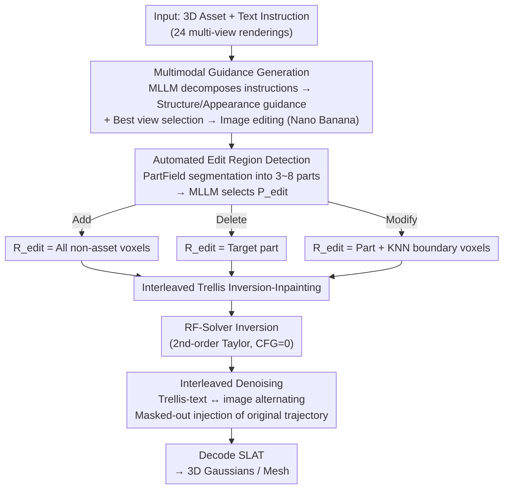

# Vinedresser3D: Agentic Text-guided 3D Editing

**Conference**: CVPR 2026  
**arXiv**: [2602.19542](https://arxiv.org/abs/2602.19542)  
**Area**: Image Generation  
**Keywords**: 3D Editing, Text-guided, Agent, Trellis, Flow Model Inversion  

## TL;DR

Vinedresser3D is proposed as a 3D editing agent centered on Multimodal Large Language Models (MLLMs). It eliminates the need for user-provided 3D masks by automatically parsing editing intent, locating editing regions, and generating multimodal guidance. By executing inversion-based in-painting in the latent space of a native 3D generative model (Trellis), high-quality text-guided editing of 3D assets is achieved.

## Background & Motivation

Text-guided 3D editing is a fundamental problem in 3D computer vision with applications in digital content creation, VR/AR, and robotics. Despite advances in 3D generation, high-quality editing still relies heavily on professional artists and manual tools, leading to low efficiency and high barriers to entry.

Existing 3D editing methods face three primary challenges:

**Key Challenge**:
1. **Insufficient Semantic Understanding**: Difficulty accurately interpreting complex editing requests.
2. **Automated Localization Difficulty**: Inability to automatically detect precise 3D editing regions from text alone.
3. **Poor Editing Fidelity**: Difficulty in strictly following editing instructions while maintaining unedited regions.

**Limitations of Prior Work**:
- **SDS-based methods** (Score Distillation Sampling): Optimize 3D representations via 2D diffusion gradients. Computationally expensive, requires per-scene optimization, and prone to unintended global changes.
- **"2D Edit + 3D Reconstruction" pipelines**: Edit multi-view images before reconstruction. Limited by multi-view inconsistency and information loss from occlusions.
- **Native 3D Editing** (e.g., VoxHammer): Directly edit in 3D latent space, yet still requires manual 3D masks and fails to understand complex requests.

**Goal**: To build a 3D editing agent capable of understanding high-level text instructions, automatically locating editing regions, and coordinating multiple tools.

## Method

### Overall Architecture

Vinedresser3D aims to edit 3D assets using single text instructions without manual 3D masking. An MLLM (Gemini-2.5-flash) serves as the core "brain" to coordinate tools for image editing, 3D segmentation, and 3D generation. The pipeline consists of four steps: MLLM parses intent to generate guidance, automatically locates the target region in the 3D asset, performs inversion-based in-painting in the Trellis latent space, and finally decodes the edited SLAT into 3D Gaussians or meshes.

### Key Designs

**1. MLLM-based Multimodal Guidance Generation: Decomposing vague instructions**

Addressing complex instructions, Vinedresser3D uses multi-step prompting: 
- Step 1: Analyzes renderings + instructions to describe the original asset, identify target parts, and classify the edit type (Add/Modify/Delete).
- Step 2: Predicts the full edited description while constraining the MLLM to preserve unedited region descriptions.
- Step 3: Extracts standalone descriptions for new/modified parts.
- Step 4: Splits descriptions into structural (Trellis Stage 1 geometry) and appearance (Stage 2 features) components. 
For image guidance, the MLLM selects the view where the target is most visible for an image editing model (Nano Banana) to generate a reference.

**2. Automated Edit Region Detection: Removing manual 3D masks**

This replaces manual masking through a segmentation + MLLM selection workflow. PartField segments the asset into $S \in [3,8]$ semantic parts. The MLLM selects the region $P_{\text{edit}}$ based on renderings and segmented maps. The final voxel set $R_{\text{edit}}$ is defined by the edit type:

$$R_{\text{edit}} = \begin{cases} C \backslash A & \text{Add (all non-asset voxels)} \\ P_{\text{edit}} & \text{Delete (remove target part)} \\ P_{\text{edit}} \cup (C \backslash bbox_{\text{pres}}) \cup V & \text{Modify (includes KNN boundary logic)} \end{cases}$$

Where $V = \{v \mid v \in bbox_{\text{pres}} \backslash A, \text{PropKNN}(v) > \tau\}$. The KNN threshold helps preserve empty space belonging to the preserved region, preventing unintended artifacts above edited areas.

**3. Interleaved Trellis Inversion-Inpainting: Balancing semantics and detail**

The original asset is losslessly inverted to structured noise using an RF-Solver (2nd-order Taylor expansion) with CFG set to 0 to minimize reconstruction error:

$$X_{i-1} = X_i + (t_{i-1} - t_i) v_\theta(X_i, t_i) + \frac{1}{2}(t_{i-1} - t_i)^2 v_\theta^{(1)}(X_i, t_i)$$

The editing stage introduces an Interleaved Trellis module, alternating between Trellis-text (strong instruction following) and Trellis-image (high detail fidelity). Latent features outside the mask are injected from the original inversion trajectory at each step. Stage 1 masks are downsampled to $16^3$, while Stage 2 employs soft masks to blend boundary voxels and eliminate floating artifacts.

### Loss & Training

This is a inference-only method. The agent autonomously explores combinations of positive/negative prompts and supports multi-round iterative editing.

## Key Experimental Results

### Main Results: Quantitative Comparison (57 assets, including Add/Modify/Delete)

| Method | Manual Mask | CLIP-T↑ | CD↓ | PSNR↑ | SSIM↑ | LPIPS↓ | FID↓ |
|------|:------:|---------|-----|-------|-------|--------|------|
| Instant3dit | ✓ | 0.227 | 0.027 | 20.86 | 0.851 | 0.153 | 80.35 |
| VoxHammer | ✓ | 0.235 | 0.027 | 24.36 | 0.890 | 0.087 | 34.95 |
| Trellis | ✓ | 0.247 | 0.010 | 37.35 | 0.984 | 0.017 | 31.10 |
| **Ours (Auto Mask)** | **✗** | **0.252** | 0.016 | 29.45 | 0.953 | 0.045 | **29.49** |
| **Ours + Manual Mask** | ✓ | **0.252** | **0.008** | **37.69** | **0.984** | **0.015** | **27.38** |

### User Study (Human Preference)

| Comparison | Text Alignment Win Rate | Background Preservation Win Rate | 3D Quality Win Rate |
|----------|:-----------:|:-------------:|:---------:|
| vs. Trellis | 92.5% | 82.0% | 90.8% |
| vs. VoxHammer | 89.8% | 79.3% | 90.2% |

### Ablation Study

| Configuration | PSNR↑ | SSIM↑ | LPIPS↓ | FID↓ |
|------|-------|-------|--------|------|
| **Full Method** | **29.45** | **0.953** | **0.045** | **29.49** |
| w/o Trellis-text (image only) | 28.06 | 0.943 | 0.054 | 30.59 |
| w/o Edit region mask | 25.65 | 0.921 | 0.068 | 33.95 |

### Key Findings

- Even without manual masks, Vinedresser3D outperforms baselines in CLIP-T (0.252) and FID (29.49).
- With manual masks, the method achieves optimal performance across all metrics, with PSNR improving from 29.45 to 37.69.
- Use of the Interleaved Trellis design and automated region detection significantly contributes to final quality.
- Using only Trellis-image results in distortions or illogical outputs in occluded areas.

## Highlights & Insights

1. **Agentic Paradigm Innovation**: First use of MLLM as a "brain" for 3D editing, coordinating specialized models for segmentation, image editing, and 3D generation.
2. **3D Reasoning via 2D MLLM**: Despite 2D training, MLLMs implicitly understand 3D spatial semantics through multi-view renderings.
3. **Closing the Automation Gap**: Automated detection outperforms manual-mask baselines in text alignment and overall quality.
4. **Interleaved Denoising Strategy**: Alternating between text and image guidance effectively compensates for the weaknesses of each modality.

## Limitations & Future Work

1. **Non-Native 3D Input for MLLM**: Reliance on multi-view renderings leads to potential information loss compared to native 3D inputs.
2. **Dependency on External Tools**: Imperfections in PartField segmentation can impact region accuracy.
3. **High Inference Cost**: Multiple MLLM calls, renderings, and model executions lead to significant latency and overhead.
4. **Coupling with Trellis**: The inversion and editing modules are deeply integrated with the Trellis architecture, making migration to other models complex.

## Rating

⭐⭐⭐⭐ (4/5)

Utilizing an MLLM agent for 3D editing is a compelling direction. The design is robust, with experimental results showing clear leadership in text alignment and user preference. Automated mask detection significantly enhances usability. Limitations include the computational cost and narrow evaluation scale.

<!-- RELATED:START -->

## Related Papers

- [\[CVPR 2026\] Agentic Retoucher for Text-To-Image Generation](agentic_retoucher_for_texttoimage_generation.md)
- [\[CVPR 2026\] OctoT2I: A Self-Evolving Agentic Text-to-Image Router](octot2i_a_self-evolving_agentic_text-to-image_router.md)
- [\[CVPR 2026\] BiMotion: B-spline Motion for Text-guided Dynamic 3D Character Generation](bimotion_b-spline_motion_for_text-guided_dynamic_3d_character_generation.md)
- [\[CVPR 2025\] InterEdit: Navigating Text-Guided Multi-Human 3D Motion Editing](../../CVPR2025/image_generation/interedit_navigating_text-guided_multi-human_3d_motion_editing.md)
- [\[CVPR 2026\] Pico-Banana-400K: A Large-Scale Dataset for Text-Guided Image Editing](pico-banana-400k_a_large-scale_dataset_for_text-guided_image_editing.md)

<!-- RELATED:END -->
