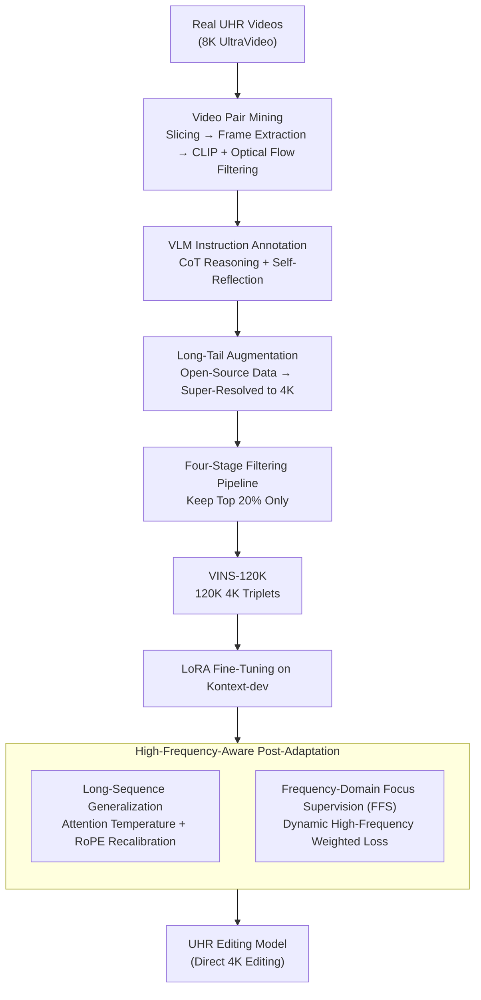

# VINS-120K: Ultra High-Resolution Image Editing with A Large-Scale Dataset

**Conference**: CVPR 2026  
**Paper**: [CVF Open Access](https://openaccess.thecvf.com/content/CVPR2026/html/Chen_VINS-120K_Ultra_High-Resolution_Image_Editing_with_A_Large-Scale_Dataset_CVPR_2026_paper.html)  
**Code**: None  
**Area**: Image Editing / Diffusion Models  
**Keywords**: Ultra-High-Resolution Editing, Instruct Editing Dataset, High-Frequency Supervision, Long-Sequence Attention, Post-Adaptation

## TL;DR
This paper constructs VINS-120K, the first large-scale dataset for 4K ultra-high-resolution (UHR) instruction-guided image editing, featuring 120K "instruction-original-edited" triplets mined from real UHR videos. It further proposes a "high-frequency-aware post-adaptation" strategy: using resolution-aware attention and RoPE recalibration to stabilize long sequences, combined with a frequency-domain focus loss to recover high-frequency details. This pipeline adapts an NHR editing model (FLUX.1-Kontext) pre-trained on 1K resolution to 4K, reducing pFID by 28% compared to the commercial Seedream 4.0.

## Background & Motivation
**Background**: Current instruction-guided image editing models (e.g., InstructPix2Pix, various DiT+MLLM/MoE approaches) have achieved robust instruction-following and precise editing capabilities. However, almost all of them are designed and trained for "non-high-resolution" (NHR, $\le 1024 \times 1024$) images.

**Limitations of Prior Work**: Feeding 4096×4096 UHR images directly into these models leads to degradation, resulting in noisy, distorted outputs. Commercial workarounds usually adopt a "downsample $\rightarrow$ edit at low resolution $\rightarrow$ super-resolve (SR)" pipeline (referred to as Kontext+SR in the paper). However, the high-frequency textures lost during downsampling cannot be recovered by subsequent super-resolution, leading to blurriness and weakened instruction following.

**Key Challenge**: The fundamental bottlenecks of UHR editing are twofold. First is **data**—no publicly available dataset supports editing at resolutions above 1.5K (see comparison table below), and the explosive increase in high-frequency details in 4K data makes collection and cleaning extremely difficult. Second is **models**—NHR pre-trained models lack the capacity to represent UHR textures, and self-attention suffers from instability over ultra-long token sequences.

**Goal**: (1) To construct the first large-scale, high-quality 4K instruction-guided image editing dataset; (2) To find a low-cost path to "post-adapt" existing NHR editing models to UHR without training from scratch.

**Key Insight**: The authors observe that **real-world UHR videos are natural sources of high-fidelity editing pairs**. Videos are continuous observations of reality, inherently containing fine-grained visual changes (object movement, lighting variation, perspective translation) between adjacent frames, and their resolution is not capped by any image-to-image pipeline.

**Core Idea**: "Pair mining from videos + multi-stage filtering for dataset construction" combined with "resolution-aware recalibration + frequency-domain focus supervision for post-adaptation." This allows NHR models to handle UHR editing at minimal cost.

## Method

### Overall Architecture
This paper presents a dual contribution of both a dataset and an adaptation method. First is the **VINS-120K dataset construction pipeline**: frames are extracted from real UHR video clips to form candidate pairs, filtered by CLIP similarity and optical flow scores to exclude "near-identical" or "excessive motion without semantic matching" pairs. Gemini-2.5-Pro is then used for structured reasoning to generate editing instructions. To address long-tail editing types (text, style, attributes) that are rare in videos, samples are augmented from open-source datasets and super-resolved to 4K. Finally, a four-stage filtering pipeline (file check $\rightarrow$ image quality $\rightarrow$ instruction following $\rightarrow$ aesthetic evaluation) retains only the top 20% highest quality samples. Second is **High-Frequency-Aware Post-Adaptation**: using FLUX.1-Kontext-dev as the backbone and LoRA fine-tuning, the method introduces attention/RoPE recalibration and frequency-domain focus loss to handle the two major bottlenecks of UHR—long-sequence degradation and high-frequency detail loss.

### Key Designs

**1. Mining High-Fidelity Editing Pairs from Real UHR Videos: Bypassing the Resolution Ceiling of Image-to-Image Pipelines**

Traditional editing datasets rely on fixed image-to-image pipelines to generate pairs, restricted by the lowest resolution model (e.g., FLUX) in the pipeline, making it impossible to reach 4K. This paper shifts the paradigm by leveraging real UHR videos as pair sources. The process involves three steps: first, PySceneDetect segmentizes videos into content-consistent clips; second, frames are sampled from each clip to form candidate pairs; third, CLIP Score is used to measure semantic similarity, while optical flow estimation measures motion magnitude. This rejects "near-identical" pairs (high CLIP, no change) and "excessive motion without semantic correspondence" pairs (high optical flow, e.g., optical flow of 173.1 in the paper). The remaining pairs retain real visual changes while preserving video-native fine-grained textures, breaking through the 4K data ceiling.

**2. Structured CoT + Self-Reflective VLM Instruction Annotation: Translating Unconstrained Video Dynamics into Precise Editing Instructions**

Frame-to-frame variations in videos are highly unconstrained (anything can change). Asking a VLM to describe them directly yields vague or incorrect instructions. The authors use Gemini-2.5-Pro for annotation, enforcing a structured chain-of-thought (CoT): first perform a comprehensive visual analysis of the image pair $\rightarrow$ systematically reason about "what transition occurred" $\rightarrow$ and finally output precise editing instructions. A specific action space is defined (color/tone, camera/subject motion, object modifications, etc.) to guide the model from global structures to local details. A self-reflection mechanism is added to verify and correct generated instructions via visual consistency checks, reducing falsehoods. This covers 13 editing categories, grouped into local editing, global editing, camera motion, and personalized generation.

**3. Four-Stage Quality Filtering + Long-Tail Augmentation: Keeping Only the Top 20% and Completing Underrepresented Video Editing Types**

Certain editing types (text modification, style transfer, attribute editing) are naturally scarce in videos. An uneven distribution harms generalization. The authors augment long-tail samples using open-source datasets like X2Edit and Nano-Consistent (which undergo the same filtering and are then super-resolved to 4K to avoid learning super-resolution artifacts). Meanwhile, all triplets go through a four-stage filtering pipeline: ① Preliminary check (corrupt files, MD5 deduplication, abnormal aspect ratios); ② Image quality (Tenengrad gradient for sharpness, brightness for exposure, HSV saturation for color realism, GLCM for texture richness); ③ Instruction following filtering; ④ Aesthetic assessment (LAION Aesthetic + Artimuse dual models). The pipeline preserves only the highest-quality 20%, leading to an average resolution of 4656×4138 for VINS-120K, and an ImageJudge quality score of 4.45 (the highest among compared datasets). The instruction-following filter uses a **cascaded scheme**: a VLM first extracts the source and target objects involved in editing, and a detection/segmentation tool locates the generated mask to split the image pair into "edited areas" and "static areas". CLIP similarity is calculated in the edited area to measure instruction alignment, while L2 distance is calculated in the static area to measure content preservation. The joint evaluation avoids solely relying on unreliable VLM scores.

**4. Long-Sequence Generalization: Resolution-Aware Attention Temperature & RoPE Recalibration to Stabilize Ultra-Long UHR Tokens**

UHR editing drastically increases the token sequence length, which compromises both attention and RoPE. The first issue is **entropy drift**: longer sequences flatten the attention distribution and weaken discriminative responses. The authors introduce a resolution-aware temperature $\tau > 1$ to recalibrate attention scores:

$$w'_{m,n}=\frac{\exp\!\big(\tau\cdot q_m^T k_n/\sqrt{d}\big)}{\sum_{j=1}^{N}\exp\!\big(\tau\cdot q_m^T k_j/\sqrt{d}\big)},\quad \tau=\log\sqrt{N_{\text{UHR}}/N_{\text{NHR}}}$$

where $N_{\text{UHR}}$ and $N_{\text{NHR}}$ are the sequence lengths for UHR and native resolutions respectively. The temperature increases as the sequence length grows, "sharpening" the flattened attention map back. The second issue is **RoPE extrapolation**: longer sequences introduce rotation angles unseen during training, preventing successful extrapolation. Borrowing from NTK-aware scaled RoPE, the authors recalibrate the rotation base $b$ as $b'=b\cdot\sqrt{N_{\text{UHR}}/N_{\text{NHR}}}$, compressing the rotation angles of longer sequences back to the native range to maintain positional discriminability. Ablation studies show that removing RoPE recalibration leads to semantic drift or severe local repetition.

**5. Frequency-Domain Focus Supervision (FFS): Dynamically Weighting High Frequencies in the Spectrum to Recover Details Overlooked by Standard Diffusion Loss**

Standard diffusion/flow-matching losses treat high and low frequencies equally, whereas high-frequency textures are crucial for UHR realism. FFS is introduced as an auxiliary term to the main loss. Applying an orthogonal 2D discrete Fourier transform on both the predicted edited image $\hat y$ and the ground truth $y$, the spectral difference is computed as $\Delta F=|\text{DFT}(\hat y)-\text{DFT}(y)|$, and a dynamic frequency weighting function is applied to amplify high frequencies:

$$W(\Delta F,\alpha_t)=\frac{(\Delta F+\varepsilon)^{\alpha_t}}{\max(\Delta F+\varepsilon)^{\alpha_t}},\quad \alpha_t=\alpha_{\min}+(\alpha_{\max}-\alpha_{\min})(1-t)^{\gamma}$$

Crucially, the focus strength $\alpha_t$ dynamically adapts to the noise level. As denoising approaches closer to the clean image ($t$ decreases), $\alpha_t$ increases, emphasizing high frequencies. This aligns with the physical intuition that "details emerge in the late stage of denoising." The frequency-domain loss is defined as $L_{\text{freq}}=\frac{1}{UV}\sum_{u,v}W(\Delta F_{uv},\alpha_t)\cdot\Delta F_{uv}$, and the total objective is $L=L_{\text{FM}}+\lambda L_{\text{freq}}$.

### Loss & Training
The backbone is FLUX.1-Kontext-dev, fine-tuned with a rank-32 LoRA. All training images are processed at 4096×4096 using AdamW with a learning rate of $5\times10^{-6}$. The main loss is the flow-matching loss $L_{\text{FM}}=\|\nu(z_t,c,t)-(\epsilon-y)\|_2^2$ (rectified flow formulation, where $z_t=(1-t)x+t\epsilon$). The frequency-domain loss hyperparameters are set to $\gamma=2$, $\alpha_{\min}=0.2$, $\alpha_{\max}=1.2$, and $\lambda=1$.

## Key Experimental Results

### Dataset Comparison (VINS-120K vs. Existing Editing Datasets)

| Dataset | Scale | Categories | W×H | ImageJudge-Avg |
|--------|------|--------|-------|----------------|
| OmniEdit | 5.2M | 7 | 1374×982 | 4.19 |
| ImgEdit | 1.2M | 13 | 1800×1200 | 4.35 |
| X2Edit | 3.7M | 14 | 1096×1088 | 3.98 |
| **VINS-120K** | 120K | 13 | **4656×4138** | **4.45** |

Despite its smaller scale, the resolution and quality of VINS-120K are top-tier: it is the only editing dataset to break the 4K barrier, and it scores the highest in quality.

### Main Results (VINS-4KEval, 509 4K Test Samples)

| Method | ImageJudge↑ | VIEScore↑ | pFID↓ |
|------|-------------|-----------|-------|
| Seedream 4.0 (Commercial, native 4K) | 4.70 | 8.03 | 12.82 |
| Kontext-dev | 4.41 | 7.43 | 12.66 |
| **Kontext-dev + Post-Adaptation (Ours)** | **4.47** | 7.44 | **9.15** |
| AnyEdit | 3.57 | 5.71 | 18.44 |
| Omnigen2 | 4.34 | 7.29 | 18.73 |

Post-adaptation maintains or slightly improves editing capabilities while reducing pFID from 12.66 to 9.15. Compared to commercial Seedream 4.0 (pFID 12.82), it achieves a reduction of approximately 28%, significantly leading in texture fidelity (though slightly lagging in editing strength, which the authors attribute to the training data scale gap).

### Ablation Study & Generalization (VINS-4KEval)

| Configuration | ImageJudge↑ | VIEScore↑ | pFID↓ | Description |
|------|-------------|-----------|-------|------|
| Kontext + Post-Adaptation | 4.47 | 7.44 | 9.15 | Full Model |
| w/o Post-Adaptation | 3.98 | 5.15 | 15.01 | Naive fine-tuning; collapse in both editing and fidelity |
| w/o Data Selection | 4.33 | 7.29 | 13.17 | Same scale without curated UHR data |
| Real Video Frames Only | 4.39 | 7.30 | 8.96 | Optimal pFID but narrower task coverage |
| Qwen + SR | 4.67 | 7.93 | 18.33 | Alternative backbone + two-stage super-resolution |
| Qwen + Post-Adaptation | 4.69 | 7.97 | 11.38 | Post-adaptation transferred to Qwen backbone |

### Key Findings
- **Post-adaptation is necessary**: Naive fine-tuning (w/o Post-Adaptation) drops the ImageJudge score from 4.47 to 3.98, and increases pFID from 9.15 to 15.01, demonstrating that direct UHR fine-tuning is infeasible—relying on attention/RoPE recalibration is essential to stabilize long sequences.
- **Details are preserved jointly by attention sharpening and RoPE recalibration**: Attention score recalibration yields more discriminative responses on target edit regions; removing RoPE recalibration leads to semantic drift and severe local repetition.
- **Quality is driven by a balance of "curation + real videos" rather than scaling**: Using real video frames alone yields the lowest pFID (8.96) but limits task coverage. Mixing curated data marginally compromises pFID (9.15) for much stronger editing capability (4.47/7.44 vs 4.39/7.30), forming a better trade-off.
- **Method is backbone-agnostic**: Direct transition to QwenImage-Edit without hyperparameter tuning reduces pFID from 18.33 (Qwen+SR) to 11.38, showing post-adaptation is a generalizable strategy.

## Highlights & Insights
- **"Video as natural editing pairs" is a clever data perspective**: This bypasses the resolution limit imposed by synthetic pipelines. Videos have native high resolutions and realistic transitions, yielding higher-fidelity pairs than any image-to-image pipeline.
- **Frequency-domain focus loss embeds "late-emergent detail" into weight scheduling**: Scaling $\alpha_t$ based on denoising progression aligns with the physical mechanics where high frequencies are synthesized in late denoising stages. This trick is highly transferable to other diffusion tasks demanding detail preservation.
- **Post-adaptation instead of training from scratch**: Overcoming 4K constraints with a rank-32 LoRA and two lightweight modifications to a 1K model in an engineering-efficient way makes it accessible to compute-limited researchers.
- **Reusable cascaded instruction-following filter**: Separating edited and static regions using VLM parsing, detection, and segmentation allows decoupled evaluation of "instruction execution" (via CLIP in edit mask) and "background preservation" (via L2), proving far more reliable than single VLM scoring.

## Limitations & Future Work
- **Editing strength still falls short of commercial Seedream 4.0** (ImageJudge 4.47 vs. 4.70), which the authors attribute to training data scale. Scaling up UHR data is an obvious direction.
- **Reliance on multiple external heavy models**: Annotations rely on Gemini-2.5-Pro, aesthetics on LAION+Artimuse, and long-tail augmentation on super-resolution models. The performance ceiling of the entire pipeline is constrained by these dependencies, raising reproduction barriers.
- **Post-adaptation upper bound is constrained by the base model**: Being essentially a LoRA adaptation limits the model from recovering UHR feature distributions that the base models (Kontext/Qwen) have never seen. Whether pre-training a native UHR model from scratch is structurally superior remains unverified.
- **Heuristically derived scaling factors**: The scaling factors for temperature/RoPE ($\sqrt{N_{\text{UHR}}/N_{\text{NHR}}}$) lack systematic optimization sweeps across different resolutions or backbones.

## Related Work & Insights
- **vs. Kontext+SR (Downsample-Edit-SR)**: Both target UHR editing, but the SR path permanently loses high frequencies during downsampling that cannot be recovered, leading to blurriness and weakened instruction-following. This work performs direct editing in 4K space, offering vastly superior texture realism (pFID 9.15 vs. 12.66).
- **vs. UltraEdit / OmniEdit / ImgEdit dataset variants**: While they prioritize scale and diversity, their resolutions are capped at ~1.5K. VINS-120K is the first editing dataset to break 4K, taking a "high-quality + real video sources" direction.
- **vs. Seedream 4.0 (Commercial native 4K)**: This is an open-source, fully reproducible alternative that outperforms the commercial model in texture fidelity (pFID) but lags in editing capacity due to dataset scale limits, serving as a low-cost bridge to push open-source NHR models to UHR.

## Rating
- Novelty: ⭐⭐⭐⭐ The combination of video-based pair mining for 4K data, resolution-aware recalibration, and frequency-domain supervision is highly practical and well-executed, though individual components lean more on engineering integration.
- Experimental Thoroughness: ⭐⭐⭐⭐ Complete main tables, multi-dimensional ablation, and cross-backbone generalization are provided, though some minor ablation analyses are appended to the supplementary material.
- Writing Quality: ⭐⭐⭐⭐ Clear explanations of both the data pipeline and the adaptation method, accompanied by complete formulations and sufficient graphical evidence.
- Value: ⭐⭐⭐⭐⭐ Fills the data gap in UHR instruction-guided editing. The dataset, benchmark, and lightweight adaptation method deliver direct value to the community.

<!-- RELATED:START -->

## Related Papers

- [\[CVPR 2026\] Pico-Banana-400K: A Large-Scale Dataset for Text-Guided Image Editing](pico-banana-400k_a_large-scale_dataset_for_text-guided_image_editing.md)
- [\[CVPR 2026\] Low-Resolution Editing is All You Need for High-Resolution Editing](low-resolution_editing_is_all_you_need_for_high-resolution_editing.md)
- [\[CVPR 2026\] PixelRush: Ultra-Fast, Training-Free High-Resolution Image Generation via One-step Diffusion](pixelrush_ultrafast_trainingfree_highresolution_im.md)
- [\[ICLR 2026\] Latent Wavelet Diffusion for Ultra-High-Resolution Image Synthesis](../../ICLR2026/image_generation/latent_wavelet_diffusion_for_ultra_high-resolution_image_synthesis.md)
- [\[CVPR 2026\] HierEdit: Region-Aware Hierarchical Diffusion for Efficient High-Resolution Editing](hieredit_region-aware_hierarchical_diffusion_for_efficient_high-resolution_editi.md)

<!-- RELATED:END -->
