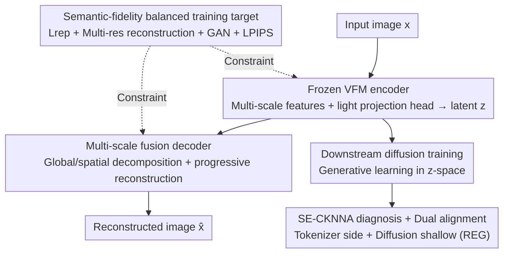

# Vision Foundation Models Can Be Good Tokenizers for Latent Diffusion Models

**Conference**: CVPR 2026  
**Paper**: [CVF Open Access](https://openaccess.thecvf.com/content/CVPR2026/html/Bi_Vision_Foundation_Models_Can_Be_Good_Tokenizers_for_Latent_Diffusion_CVPR_2026_paper.html)  
**Area**: Diffusion Models / Image Generation  
**Keywords**: Latent Diffusion Models, Vision Foundation Models, VAE tokenizer, Representation Alignment, High-fidelity Reconstruction

## TL;DR
This paper shifts away from using distillation to make a VAE "mimic" a Vision Foundation Model (VFM). Instead, it directly uses a **frozen VFM as the encoder for the LDM tokenizer**, paired with a multi-scale progressive decoder to reconstruct semantic-rich but spatially coarse VFM features back to pixels. Consequently, LightningDiT achieves a gFID of 2.22 on ImageNet 256 in just 80 epochs (approximately 10× faster than previous tokenizers) and reaches 1.62 after 640 epochs.

## Background & Motivation
**Background**: Latent Diffusion Models (LDM) are the current mainstream paradigm for visual generation. They operate in two stages: training a vision tokenizer (usually a VAE) to compress pixels into a compact latent, and then learning the diffusion process in this latent space. The quality of the latent produced by the tokenizer largely determines the performance ceiling of downstream diffusion training. A popular recent trend is to inject semantics from VFMs (e.g., DINOv2, SigLIP2) into the tokenizer: VA-VAE aligns VAE latents to DINOv2 features using similarity loss, while REPA-E achieves alignment by jointly training the VAE and the diffusion model.

**Limitations of Prior Work**: The authors performed a series of diagnostics using CKNNA (a metric for measuring the preservation of local neighbor structures between two representation spaces). They found that **all these distillation/alignment-based tokenizers suffer from representation degradation**. While they show high CKNNA scores on clean images, their CKNNA scores collapse significantly under "semantic-preserving" perturbations (noise, scaling, rotation). For instance, VA-VAE’s CKNNA drops by 33.2% under perturbation. This indicates that the distillation process loses critical information from the robust VFM representations, and the alignment is merely "surface-level."

**Key Challenge**: To maintain semantic robustness, it is best not to alter the VFM; however, VFMs are optimized for semantic understanding. Their feature maps have coarse spatial resolution and highly anisotropic channel distributions. Using them directly for pixel-level reconstruction creates a conflict with fidelity. That is, **there is a structural tension between "preserving VFM semantics" and "reconstructing clear pixels"**—which is precisely why previous work chose to "retrain a VAE for distillation" rather than "directly using the VFM."

**Goal**: To skip distillation and directly use a frozen VFM as the encoder while maintaining high-fidelity reconstruction, and to clarify how tokenizer representation quality affects representation learning within the diffusion model.

**Core Idea**: Instead of training a VAE to mimic a VFM, **directly integrate a frozen VFM into the VAE framework as the encoder and design a specialized pixel decoder for it**. This allows the latent to inherently inherit the robust semantics of the VFM rather than aligning them post-hoc.

## Method

### Overall Architecture
The skeleton of VFM-VAE remains a VAE: the encoder compresses the image into a low-dimensional latent $z$, the decoder restores $z$ into an image, and $z$ simultaneously serves as the training space for the downstream diffusion model. There are two key modifications: **the encoder is no longer trained but directly reuses a frozen pre-trained VFM** (with only a lightweight projection head attached to compress multi-scale features into a diagonal Gaussian posterior); **the decoder is redesigned** with multi-scale latent fusion and progressive reconstruction blocks to specifically address the challenge of "reconstructing clear pixels from semantic-strong but detail-weak VFM features." During training, a combination of losses is used to constrain both semantic preservation and pixel fidelity. Additionally, the authors propose the SE-CKNNA diagnostic metric and design a "dual-alignment" strategy involving the tokenizer side (VFM-VAE) and the diffusion side (REG shallow alignment).

### Key Designs

**1. Frozen VFM Encoder: Replacing "Distillation Mimicry" with "Direct Inheritance"**

Directly taking a pre-trained VFM $\Phi$ as the encoder and **keeping it frozen throughout** aims to fundamentally cure the representation degradation caused by distillation. Since VFM semantics are already robust, there is no need to train a VAE to approximate them and lose details. However, using only the final layer features is insufficient; fine-grained information needed for reconstruction is often hidden in shallow layers. Thus, the authors extract multi-scale features $\{\mathbf{f}_{\text{shallow}}, \mathbf{f}_{\text{middle}}, \mathbf{f}_{\text{final}}\} = \Phi(\mathbf{x})$ from different depths of the VFM. These are concatenated along the channel dimension and passed through a lightweight projection network $\mathcal{C}$ to output the mean and log-variance $\boldsymbol{\mu}, \log\boldsymbol{\sigma}^2 = \mathcal{C}(\text{Concat}[\mathbf{f}_{\text{shallow}}, \mathbf{f}_{\text{middle}}, \mathbf{f}_{\text{final}}])$ of the diagonal Gaussian posterior. Re-parameterization is then used to obtain $z$. The projection compresses the dimensions for diffusion learning and ensures that $z$ does not lose essential VFM information through the representation reconstruction loss. In terms of performance, this design results in a gap of only +1.6% between SE-CKNNA and CKNNA under perturbations, whereas VA-VAE drops by 33.2%—semantic robustness is "inherited," not "aligned."

**2. Multi-scale Fusion Decoder: Reconstructing Clear Pixels from Semantic-Strong, Detail-Weak Features**

The features provided by the frozen VFM are semantically rich but spatially coarse. A standard SD-VAE decoder (single latent → single image) struggles to restore details. The decoder performs two tasks. First, **multi-scale latent fusion**: $z$ is decomposed into a global component $z_g = \text{GlobalPool}(z)$ (capturing overall style, independent of spatial layout) and a set of spatial components $\{z_s^{(i)}\}$ at different scales (obtained via pixel shuffle/unshuffle rearrangement). Second, **progressive reconstruction blocks**: decoding follows progressive upsampling through resolutions $8\!\to\!16\!\to\!32\!\to\!64\!\to\!128\!\to\!256$. Each block $\mathcal{B}_i$ is a **Modulated ConvNeXt block**—the global style $z_g$ is modulated onto a $1{\times}1$ point-wise convolution for channel weighting via a block-specific affine $\gamma_i$, formulated as $\mathcal{B}_i(\mathbf{h}_{\text{in}}, z_g) = \text{ModConv}(\mathbf{h}_{\text{in}}, \gamma_i(z_g)) + \mathbf{h}_{\text{in}}$. Global control $z_g$ is supplied to **every block** to ensure consistent style, while spatial components are injected only into low-resolution early blocks ($i\le4$) to define the layout, freeing high-resolution blocks ($5\le i\le6$) to focus on texture details (experiments showed that high-resolution injection adds computation without significant gains). Each block also features a lightweight ToRGB head for direct supervision at that scale, with feature-level residuals allowing fine-scale supervision to inherit coarse-scale structures:

$$\hat{\mathbf{x}}_i = \begin{cases} \text{ToRGB}_i(\mathbf{h}^{(1)}, z_g) & i=1 \\ \text{ToRGB}_i(\mathbf{h}^{(i)} + \text{Upsample}(\mathbf{h}^{(i-1)}), z_g) & i>1 \end{cases}$$

This structure of "global style + progressive local refinement + level-wise supervision" is key to stably expanding coarse features into high-fidelity images.

**3. Semantic-Fidelity Balanced Training Target: Managing "Latent Semantics" and "Image Realism"**

The total loss $L_{\text{total}} = \lambda_{\text{rep}}L_{\text{rep}} + \sum_i \lambda_i L_{\text{recon}}^{(i)} + \lambda_{\text{GAN}}L_{\text{GAN}} + \lambda_{\text{LPIPS}}L_{\text{LPIPS}}$ is designed to resolve the aforementioned "semantics vs. fidelity" tension. Representation regularization $L_{\text{rep}} = L_{\text{KL}} + L_{\text{VF}}$ constrains the latent distribution with KL and forces $z$ into semantic alignment with $\mathbf{f}_{\text{final}}$ using a VF loss (cosine similarity + matrix distance) without excessively compressing its capacity. **Multi-resolution reconstruction loss** applies L1 supervision $L_{\text{recon}}^{(i)} = \|f_{r_i}(\mathbf{x}) - \hat{\mathbf{x}}_i\|_1$ to each block output ($f_{r_i}$ downsamples the ground truth to the corresponding resolution); this step is crucial for preventing early mode collapse and ensuring each level serves its purpose. Additionally, adversarial loss from a DINOv2 discriminator and LPIPS perceptual loss are added to enhance realism. Multi-resolution supervision is the most subtle but critical stabilizer in this target set.

**4. SE-CKNNA and Dual Alignment: Quantifying "Alignment Robustness" across Diffusion Internals**

Standard CKNNA scores are artificially high on clean images and fail to capture fragility under perturbation. The authors extend it to **Semantic-Equivariant CKNNA (SE-CKNNA)**: the Monte Carlo average is calculated over a distribution of semantic-preserving transformations $\mathcal{T}$ (noise {0.05, 0.10, 0.15, 0.20}, scaling {0.25, 0.50, 0.75, 1.0}, rotation {0°, 90°, 180°, 270°}), such that $\text{SE-CKNNA} = \frac{1}{|\mathcal{T}|}\sum_{T\in\mathcal{T}}\text{CKNNA}(T)$, reliably measuring alignment stability. Based on this, two patterns were found: high-quality tokenizer representations promote representation learning in all layers of the diffusion model; however, the diffusion side only improves deep alignment, leaving shallow layers weak. Thus, **dual alignment** is proposed—VFM-VAE serves as the foundation on the tokenizer side, while REG is superimposed on the diffusion side (aligning shallow layers with VFM patch features and injecting global semantics via class tokens). When both sides collaborate, CKNNA across all layers increases consistently, pushing generation quality to new heights (2.22 gFID at 80 epochs).

### Loss & Training
Training is conducted on ImageNet 256×256 using an f16d32 configuration consistent with VA-VAE; SigLIP2-Large is used as the default VFM. The loss follows the aforementioned $L_{\text{total}}$, combining KL + VF representation regularization, multi-resolution L1 reconstruction, adversarial (DINOv2 discriminator), and LPIPS. Downstream diffusion uses two settings: LightningDiT-XL (benchmarked against VA-VAE) and REG (SiT-XL backbone + additional shallow alignment loss).

## Key Experimental Results

### Main Results
Comparison across reconstruction, generation, and representation (ImageNet 256, gFID values are w/o CFG):

| Tokenizer | #Images | rFID↓ | Epochs | gFID↓ | Top-1 Acc.↑ | CKNNA | SE-CKNNA | Relative Change |
|-----------|---------|-------|--------|-------|-------------|-------|----------|-----------------|
| SD-VAE | 108M | 0.62 | 80 | 7.13 | 8.0 | 0.004 | 0.005 | — |
| VA-VAE | 160M | 0.30 | 64 | 5.14 | 31.9 | 0.202 | 0.135 | −33.2% |
| **VFM-VAE** | **44M** | 0.52 | 64 | **3.80** | **43.2** | 0.188 | 0.191 | **+1.6%** |

System-level generation comparison (representative items, ImageNet 256, gFID w/o CFG):

| Tokenizer + Generation Model | Epochs | gFID↓ | gIS↑ |
|----------------------|--------|-------|------|
| SD-VAE + REG | 480 | 2.20 | 219.1 |
| VA-VAE + LightningDiT | 800 | 2.17 | 205.6 |
| **VFM-VAE + LightningDiT** | 560 | 2.06 | 205.8 |
| **VFM-VAE + REG** | 80 | **2.22** | 218.8 |
| **VFM-VAE + REG** | 640 | **1.62** | 241.6 |

VFM-VAE + REG achieves a gFID of 2.22 at just 80 epochs, nearly matching the 480-epoch SD-VAE+REG, an approximately 10× speedup; it further reaches 1.62 (w/ CFG 1.31) at 640 epochs.

### Ablation Study
Evolution of reconstruction quality as modules are added (5M images, weak alignment, Table 5):

| Configuration | rFID↓ | rIS↑ | Description |
|---------------|-------|------|-------------|
| SD-VAE Style Baseline | 19.69 | 74.9 | Conv encoder/decoder + basic losses |
| + Multi-scale Fusion | 14.35 | 93.6 | Adding spatial control reduces rFID by ~27% |
| + Modern Decoding Blocks | 1.08 | 194.6 | Modulated ConvNeXt + Self-Attention; massive gain |
| + Encoder Improvements | **0.71** | **206.8** | Aggregate multi-layer VFM features + upgrade backbone |

Compatibility with different VFMs (Table 6, LightningDiT-L/1 @100k steps, w/o CFG):

| VFM | rFID↓ | gFID↓ | gIS↑ |
|-----|-------|-------|------|
| EVA-CLIP-Large | 1.35 | 4.40 | 146.4 |
| DINOv2-Large | 1.55 | 4.00 | 147.1 |
| SigLIP2-Large | 1.61 | 5.59 | 127.8 |

### Key Findings
- **"Modern decoding blocks" are the single largest contributor to reconstruction quality**: Dropping rFID from 14.35 (multi-scale fusion) to 1.08 shows that replacing upsampling blocks with Modulated ConvNeXt + low-resolution self-attention is key to expanding coarse VFM features into clear pixels.
- **Robustness from Frozen VFM comes at almost zero cost**: VFM-VAE uses only 44M training images (~27% of VA-VAE’s 160M), yet the SE-CKNNA vs. CKNNA gap is only +1.6%, and linear probing improves from 31.9% to 43.2%—semantic robustness is inherited.
- **Dual alignment exhibits synergistic effects**: When both the tokenizer and diffusion shallow layers (REG) are aligned, CKNNA across all depths increases consistently. Peak CKNNA in the diffusion side reaches 0.52, exceeding the 0.50 reference line between SigLIP2-Large and DINOv2-Giant.
- **Generalization to 512 resolution and T2I**: On ImageNet-512, VFM-VAE reduces gFID from 21.42 to 18.05. For T2I using BLIP3-o, DPG-Bench increases from 55.4 to 59.1, and MJHQ-30K gFID drops from 23.0 to 17.0.

## Highlights & Insights
- **The counter-intuitive decision to "reuse frozen VFMs instead of distilling" is the soul of the paper**: The industry default assumes VFMs cannot directly reconstruct, so they train VAEs to mimic them. This paper uses SE-CKNNA to prove "mimicry" itself loses information and shifts the problem from "how to align better" to "how to equip a frozen VFM with a better decoder," simplifying the issue immediately.
- **SE-CKNNA is a reusable diagnostic tool**: By quantifying alignment stability under semantic-preserving perturbations, it exposes the illusion that "high clean-image CKNNA equals a good representation," serving as a tool to evaluate the fragility of any representation alignment method.
- **The division of labor in the decoder—"global style for all, spatial details for early blocks"—is ingenious**: It is supported by empirical evidence (insufficient effective channels for high-resolution injection). This hierarchical "layout first, textures later" strategy is transferable to other generative decoder designs.
- **Training efficiency gains are substantial**: The 10× convergence speedup stems from a superior latent rather than a larger model, making it highly attractive for compute-constrained generative training.

## Limitations & Future Work
- The authors acknowledge that reusing a frozen VFM **sacrifices some high-frequency fidelity** (rFID 0.52 is worse than VA-VAE’s 0.30). This is the cost of prioritizing semantics. Although downstream gFID improves, pure reconstruction metrics are indeed impacted.
- Inheriting the complex training targets of previous work (REG, etc.) means **hyperparameter tuning for multiple loss terms is costly**, making implementation non-trivial.
- SE-CKNNA scores are **relative to the chosen alignment VFM**; absolute values across different VFMs are not directly comparable and require caution when used as a universal benchmark.
- Personal Observation: Experiments are concentrated on ImageNet and limited T2I settings; the reconstruction fidelity for higher resolutions and long-tail/real-world complex scenes still needs verification. A frozen VFM also implies that tokenizer capabilities are locked to the quality and biases of the upstream VFM.

## Related Work & Insights
- **vs VA-VAE / REPA-E (Distillation-based tokenizers)**: They train a VAE to align with/mimic VFM features, whereas Ours uses the frozen VFM as the encoder. The difference is that their "post-hoc alignment" degrades under semantic-preserving perturbations (CKNNA drops 33.2%), while Ours "inherently inherits" with almost no degradation (+1.6%) using ~27% of the training data.
- **vs REPA / REG (Diffusion-side representation alignment)**: They assume the tokenizer already provides stable semantic latents and perform VFM alignment within the diffusion process. Ours conversely studies how tokenizer latents affect diffusion representation evolution and merges both into a "dual alignment" strategy—REG serves as a complement on the diffusion side.
- **vs RAE / SVG (Concurrent work using high-dimensional VFM features)**: They do not perform latent space compression. Ours maintains LDM latent compression, making it **seamlessly compatible with existing diffusion frameworks** and easier to integrate into existing pipelines.

## Rating
- Novelty: ⭐⭐⭐⭐⭐ "Frozen VFM as tokenizer encoder + SE-CKNNA diagnostics" is a novel restructuring of the distillation paradigm supported by diagnostic evidence.
- Experimental Thoroughness: ⭐⭐⭐⭐ Covers reconstruction/generation/representation, multi-VFM compatibility, 512, and T2I generalization; only high-frequency fidelity is slightly weaker.
- Writing Quality: ⭐⭐⭐⭐ Motivation derived from CKNNA diagnostics is logical and clear; some details (block formulas, reshapes) are moved to the appendix.
- Value: ⭐⭐⭐⭐⭐ 10× convergence speedup + more robust latents provide direct practical value and methodological inspiration for LDM tokenizer design.

<!-- RELATED:START -->

## Related Papers

- [\[CVPR 2026\] VFM-VAE: Vision Foundation Models Can Be Good Tokenizers for Latent Diffusion Models](vfm-vae_vision_foundation_models_can_be_good_tokenizers_for_latent_diffusion_mod.md)
- [\[CVPR 2026\] Probing and Bridging Geometry–Interaction Cues for Affordance Reasoning in Vision Foundation Models](probing_and_bridging_geometry-interaction_cues_for_affordance_reasoning_in_visio.md)
- [\[CVPR 2026\] Taming Sampling Perturbations with Variance Expansion Loss for Latent Diffusion Models](taming_sampling_perturbations_with_variance_expansion_loss_for_latent_diffusion_.md)
- [\[CVPR 2026\] OpenDPR: Open-Vocabulary Change Detection via Vision-Centric Diffusion-Guided Prototype Retrieval for Remote Sensing Imagery](opendpr_open-vocabulary_change_detection_via_vision-centric_diffusion-guided_pro.md)
- [\[CVPR 2026\] VibeToken: Scaling 1D Image Tokenizers and Autoregressive Models for Dynamic Resolution Generations](vibetoken_scaling_1d_image_tokenizers_and_autoregressive_models_for_dynamic_reso.md)

<!-- RELATED:END -->
