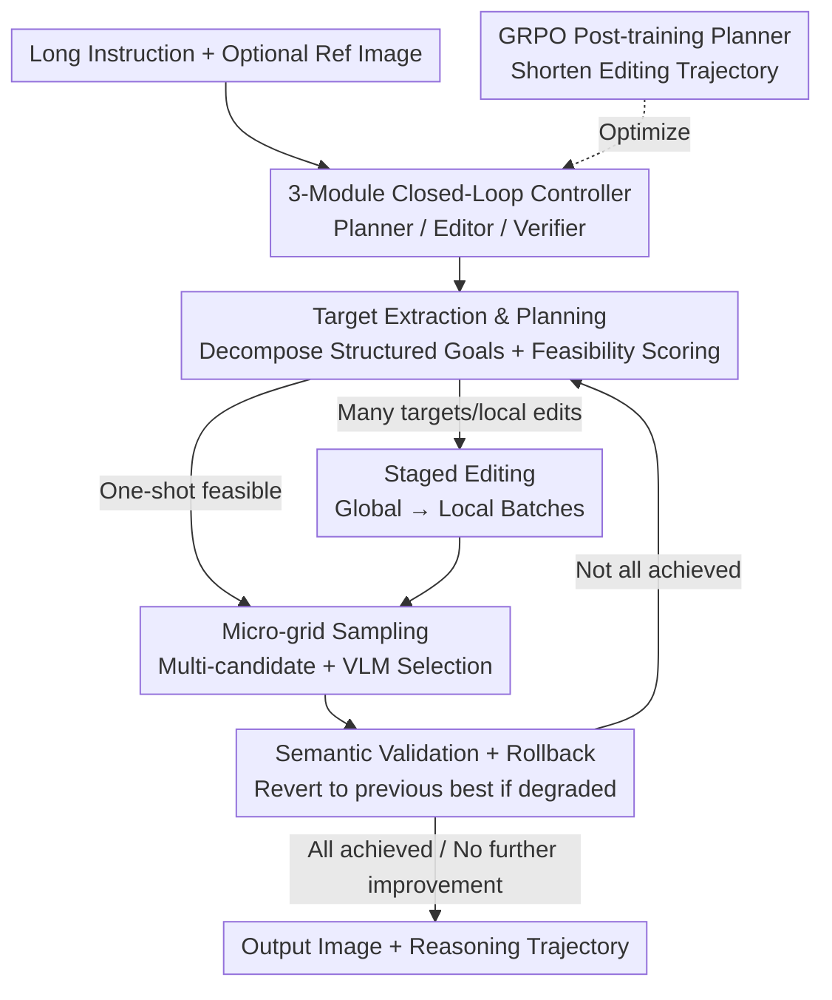

# VisionDirector: Vision-Language Guided Closed-Loop Refinement for Generative Image Synthesis

**Conference**: CVPR 2026  
**Paper**: [CVF Open Access](https://openaccess.thecvf.com/content/CVPR2026/html/Chu_VisionDirector_Vision-Language_Guided_Closed-Loop_Refinement_for_Generative_Image_Synthesis_CVPR_2026_paper.html)  
**Area**: Image Generation  
**Keywords**: Closed-Loop Refinement, VLM Agents, Long-Instruction Alignment, GRPO, Image Editing

## TL;DR
Addressing the frequent editing omissions of diffusion models in professional design tasks (where a single instruction contains 18–22 targets), this paper first constructs LGBench (2000 tasks, 29k annotated targets) to expose failures. It then proposes VisionDirector—a training-free "director-style" closed-loop controller: a VLM planner decomposes long instructions into structured goals, dynamically decides between single-shot generation or multi-stage editing, and performs micro-grid sampling with semantic validation/rollback at each step. Finally, GRPO is used to compress the planner's editing trajectory from 4.2 to 3.1 steps, achieving new SOTA results on GenEval (+7%) and ImgEdit (+0.07).

## Background & Motivation
**Background**: Diffusion models (such as Flux and Qwen-Image) can already generate photorealistic images, handling single-target instructions ("draw a cat") with high aesthetic quality.

**Limitations of Prior Work**: Real-world design briefs are not single sentences but long paragraphs: global artistic guidance plus a multitude of local constraints (pose, lighting, typography, logo placement), often involving dozens of coupled targets. The authors found that even the strongest open-source models satisfy less than 72% of targets in such long instructions, systematically missing "fine yet critical" edits like local text, logos, or specific lighting—Flux-Dev's success rate on text targets is as low as 0.8%.

**Key Challenge**: Existing benchmarks (DrawBench, TIFA, MagicBrush) mostly test only 1–2 explicit targets, "hiding" the brittleness of models in multi-target scenarios. Simultaneously, diffusion models essentially render all constraints at once in a single forward pass, lacking a "check-rollback-retry" mechanism; once a local target fails, there is no way to remedy it.

**Goal**: (1) Create a benchmark that realistically exposes failures in long instructions; (2) Enable models to address over ten targets sequentially without retraining the diffusion backbone, while maintaining aesthetic quality.

**Key Insight**: The authors redefine the problem as a decoupling of "Semantic Understanding vs. Pixel Rendering"—the diffusion model is responsible for drawing well but cannot parse complex semantics, so a VLM "director" layer is placed above it to handle planning, verification, and rollback, treating the diffusion backbone as a stateless executor.

**Core Idea**: Use a training-free VLM closed-loop controller to string together "long instruction $\rightarrow$ target decomposition $\rightarrow$ staged editing $\rightarrow$ verification/rollback" into an R1-style reasoning loop, then fine-tune the planner using GRPO to learn earlier STOP / VERIFY / EDIT signals.

## Method

### Overall Architecture
VisionDirector transforms generation/editing from "one-shot output" into a closed-loop "director-led refinement." The system consists of three modules communicating via natural language: the **planner VLM** (Qwen3-VL-8B, holding semantic authority, responsible for target decomposition, sequencing, and supervising revisions until convergence), **editors** (Qwen-Image / Qwen-Image-Edit, stateless executors that generate images based solely on planner instructions), and a **verifier VLM** (Qwen3-VL-32B, which labels each target as achieved/not achieved and decides when to stop). Since modules only exchange natural language messages, any component can be replaced with a stronger version without retraining the planner.

The control flow in the training-free phase is an eight-step deterministic loop inspired by DeepSeek-R1 reasoning but specifically customized for visual generation: instruction entry $\rightarrow$ planner extracts targets verbatim and assigns type/conflict/one-shot feasibility scores $\rightarrow$ decides between "single-shot generation" or "staged editing" $\rightarrow$ performs micro-grid multi-candidate sampling for each batch + VLM selection $\rightarrow$ verifier validates and rolls back if degradation occurs $\rightarrow$ decides whether to continue (using local inpainting or global scene-level regeneration) $\rightarrow$ loops until no further improvement, finally returning the image with the full reasoning trajectory.

### Key Designs

**1. LGBench: Forcing failures out with "Long Target Chains"**  
Existing benchmarks typically have 1–2 targets per prompt; even if a model misses many local constraints, the aggregate score remains high. This is the root cause of "models looking strong but failing real design tasks." LGBench maximizes task complexity with 2000 tasks (1000 T2I + 1000 I2I) and 29,252 per-target annotations. T2I tasks average 18.0 targets (covering 200 classes / 418 subclasses), and I2I tasks average 11.2 instructions. Construction involves using Claude 4.5 Sonnet as a "prompt composer": it reads structured goal lists, reasons over dependencies, and synthesizes long instructions with quantitative cues (e.g., "at moderate intensity (45%)"). For I2I, Claude observes real base images from Flux-Krea and writes 10–22 spatially consistent instructions for key areas. Evaluation uses Qwen3-VL-32B as a multimodal verifier to score structured targets; a task is a "success" only if $\ge 80\%$ of targets are met. Results show even Qwen-Image only finishes 71.8% of tasks, highlighting text/logos/lighting as "disaster zones."

**2. Three-Module Closed-Loop Controller: Separating Semantics from Rendering**  
The inherent flaw of diffusion models is rendering all constraints in one forward pass without a "regret" mechanism. VisionDirector breaks this by isolating responsibilities: the planner holds semantic dominance—it decomposes instructions into structured goals with types (global / local / text / layout), conflict flags, and a feasibility score $s$. It performs an **one-shot vs. staged** gating: if $s$ is high and the impacted area is small, it proceeds with full-image synthesis; otherwise, it schedules batches of 1–2 targets in a "global $\rightarrow$ local" order. The editor acts as a stateless executor, while the verifier provides feedback. This decoupling of "strong diffusion prior + lightweight reasoning agent" yields debuggable logs and aesthetic quality while making components hot-swappable.

**3. Micro-grid Sampling + Semantic Validation Rollback: Combating Randomness and Regression**  
Even with staging, diffusion sampling randomness causes inconsistent edits, and multi-round editing often accumulates hallucinations. This system uses two safeguard gates: **micro-grid sampling** (the planner sends precise instructions, generates multiple candidates with different seeds, and a lightweight VLM judge selects the best to suppress randomness) and **semantic validation rollback** (the verifier checks the pending list; if a new edit lowers overall alignment, the system reverts to the previous best image to avoid "digging a hole" on conflicting targets). These gates transform "blind forward editing" into "hill-climbing with validation."

**4. GRPO Post-training Planner: Compressing Trial-and-Error into High-yield Trajectories**  
While the training-free controller is effective, it requires multiple rounds to converge. Authors use GRPO post-training on the planner to help it learn when to STOP / VERIFY / EDIT earlier. Let $x$ be the multimodal prompt and $y=(y_1,\dots,y_T)$ be the interleaved Describe–Inspect–Revise actions. The training objective is a GRPO variant:

$$J_{\text{GRPO}}(\theta)=\mathbb{E}_{x,\{y^{(i)}\}}\!\left[\frac{1}{G}\sum_{i=1}^{G}\frac{1}{\sum_t I(y^{(i)}_t)}\sum_t I(y^{(i)}_t)\,\mathcal{L}_{\text{clip}}\!\big(\rho^{(i)}_t,\hat{A}^{(i)}_t\big)-\beta\,\mathrm{KL}\big(\pi_\theta\,\|\,\pi_{\text{ref}}\big)\right]$$

Where $I(\cdot)$ is a token mask that ignores tokens from external tools (editor/verifier) so gradients only update the planner's own text actions; $\hat{A}^{(i)}_t$ is the group-normalized advantage using the mean group reward as the baseline. Rewards are sourced from an independent alignment VLM scoring final images (0–5) based on typography, lighting, and layout. This reduces median editing rounds from 4.2 to 3.1 (~26% speedup) without losing accuracy.

## Key Experimental Results

### Main Results

GenEval (T2I Compositional Fidelity, VisionDirector using Qwen-Image backbone + GRPO planner):

| Model | Counting | Position | Attribute | Overall↑ |
|-------|---------|---------|-----------|----------|
| FLUX.1 [Dev] | 0.74 | 0.22 | 0.45 | 0.66 |
| Qwen-Image | 0.89 | 0.76 | 0.77 | 0.87 |
| **VisionDirector** | **0.96** | **0.88** | **0.95** | **0.94** |

ImgEdit (I2I Editing, GPT-4.1 as judge, 1–5 scale):

| Model | Replace | Remove | Hybrid | Overall↑ |
|-------|---------|--------|--------|----------|
| FLUX.1 Kontext [Pro] | 4.56 | 3.57 | 3.68 | 4.00 |
| Qwen-Image-Edit | 4.66 | 4.14 | 3.82 | 4.27 |
| **VisionDirector** | **4.83** | **4.41** | **4.05** | **4.35** |

Key gains are concentrated in attribute binding and relative spatial reasoning (GenEval Position 0.76 $\rightarrow$ 0.88), which correspond to the weaknesses exposed by LGBench.

### Ablation Study

Impact of GRPO on planning efficiency (LGBench):

| Planner | Steps↓ | Goal cov.↑ | Edits/task↓ |
|---------|--------|-----------|-------------|
| VisionDirector (no RL) | 4.2 | 0.74 | 3.3 |
| VisionDirector + GRPO | 3.1 | 0.78 | 2.5 |

Accumulation of optimization strategies (Baseline: Flux-Krea, units in %):

| Method | Goal Success | $\ge 80\%$ Task Ratio | Description |
|--------|--------------|-----------------------|-------------|
| Baseline (Flux-Krea) | 66.8 | 18.6 | One-shot prompt |
| + Reprompting | 69.0 | 22.7 | Rewrite prompts only |
| + Best-of-N (N=4) | 70.5 | 23.1 | Multi-candidate selection only |
| + Refinement | 71.2 | 29.5 | Iterative refinement only |
| **All Strategies** | **74.2** | **35.2** | Full combination |

### Key Findings
- **Rollback as a safety fuse**: Removing semantic rollback leads to hallucination accumulation, with goal coverage dropping from 0.78 to 0.74. Removing micro-grid sampling increases random conversion failure for layout instructions by 7%.
- **GRPO's value is efficiency**: It compresses the trajectory by 26% and reduces diffusion calls per task from 3.3 to 2.5 while improving goal coverage. The model learns to prioritize high-yield edits and terminate decisively.
- **Adaptive gating shows a clear phase transition**: For $\le 15$ targets, $>85\%$ use one-shot generation; at 30 targets, this drops to $<10\%$. This proves the planner switches strategies based on complexity rather than using a one-size-fits-all approach.
- **Non-linear strategy gains**: Reprompting, Best-of-N, and Refinement individually provide 2–5 percentage point gains, but the full combination reaches 74.2%, indicating synergistic benefits in the closed loop.

## Highlights & Insights
- **Paradigm of "measure before solving"**: LGBench proves that current models don't lack drawing ability but fail at semantic parsing of long instructions. This conclusion directly drives the decoupled design of VisionDirector.
- **Zero-cost upgrades for backbones**: Since the planner only issues natural language, the editor/verifier can be hot-swapped. Upgrading the generator is reduced from "training the agent" to "changing a config line."
- **GRPO token masking is critical**: Masking tokens from external tools during GRPO prevents the planner from mistakenly optimizing editor/verifier outputs as its own actions—a clean approach for applying RL to agents with external tools.
- **Micro-grid + Rollback = Hill climbing with verification**: Replacing "one-shot gambling" with "best-of-N selection + revert on degradation" adds monotonicity guarantees to stochastic generation.

## Limitations & Future Work
- **Heavy dependency on external VLMs**: Target extraction, selection, and rewards rely on Qwen3-VL/GPT-4.1. Blind spots in the verifier (e.g., subtle typography) become blind spots for the system, and costs for multiple VLM calls are high.
- **Closed-loop budget of 6 rounds**: Extremely complex tasks ($>20$ targets) may not converge within the budget; the paper lacks discussion on graceful degradation under budget constraints.
- **LLM-synthetic benchmark**: LGBench labels are LLM-generated and LLM-verified, creating a potential circular reasoning loop between the "test-setter" and "grader" without significant human verification.
- **Comparison caveats**: Performance gains on GenEval/ImgEdit involve multi-round editing vs. competitor one-shot outputs; gains shouldn't be interpreted strictly as "stronger core model architecture."

## Related Work & Insights
- **vs. One-shot Diffusion (Flux / Qwen-Image)**: These render all constraints simultaneously without fallback. Ours keeps these as editors but adds a planner layer for decomposition/monitoring, prioritizing fidelity over latency.
- **vs. Previous Benchmarks (GenEval / DPG)**: Previous benchmarks typically cap at 1–2 targets. LGBench provides 29k annotated goals across dual modalities to specifically expose long-instruction failures.
- **vs. Visual Agents (GenArtist / JarvisArt)**: Those focus more on tool-use or reasoning. VisionDirector focuses on "long-horizon multi-target visual creation," applying agent paradigms to reliable generation/refinement.
- **vs. Diffusion RLHF/PPO**: Ours does not fine-tune the diffusion backbone. It uses GRPO with token masking to fine-tune the planner's policy, optimizing trajectory planning rather than pixel values.

## Rating
- Novelty: ⭐⭐⭐⭐ The "benchmark-driven closed-loop + GRPO efficiency" chain is complete and self-consistent. The combination of rollback and token-masked GRPO is innovative.
- Experimental Thoroughness: ⭐⭐⭐⭐ Strong dual-benchmark results and ablation on gating/strategies. However, absolute token/latency costs are not fully disclosed.
- Writing Quality: ⭐⭐⭐⭐ Logical flow from motivation to method. Separation of responsibilities is well-explained.
- Value: ⭐⭐⭐⭐ LGBench is a valuable diagnostic tool, and the training-free controller has immediate utility for professional design and synthetic data construction.

<!-- RELATED:START -->

## Related Papers

- [\[CVPR 2026\] SynthRGB-T: Language-Vision Guided Image Translation for Diversity Synthesis](synthrgb-t_language-vision_guided_image_translation_for_diversity_synthesis.md)
- [\[CVPR 2026\] Language-Free Generative Editing from One Visual Example](language-free_generative_editing_from_one_visual_example.md)
- [\[CVPR 2026\] VOSR: A Vision-Only Generative Model for Image Super-Resolution](vosr_a_vision_only_generative_model_for_image_super_resolution.md)
- [\[CVPR 2026\] Closed-Form Concept Erasure via Double Projections](closed-form_concept_erasure_via_double_projections.md)
- [\[CVPR 2026\] Leveraging Verifier-Based Reinforcement Learning in Image Editing](leveraging_verifier-based_reinforcement_learning_in_image_editing.md)

<!-- RELATED:END -->
