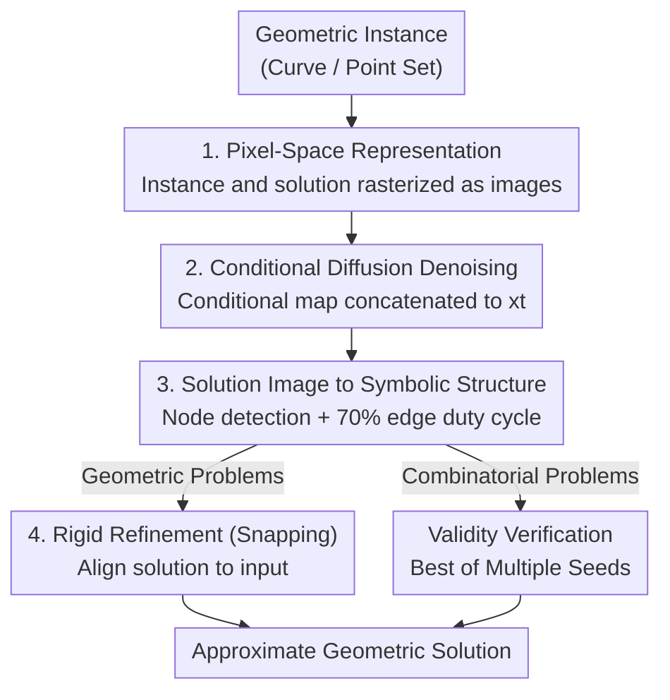

# Visual Diffusion Models are Geometric Solvers

**Conference**: CVPR 2026  
**Paper**: [CVF Open Access](https://openaccess.thecvf.com/content/CVPR2026/html/Goren_Visual_Diffusion_Models_are_Geometric_Solvers_CVPR_2026_paper.html)  
**Code**: TBD  
**Area**: Diffusion Models  
**Keywords**: Diffusion models, geometric solving, pixel-space reasoning, inscribed squares, Steiner trees

## TL;DR
The authors discover that a standard visual diffusion model (U-Net denoiser) can directly approximate a set of NP-hard geometric problems (Inscribed Square, Steiner Minimum Tree, Maximum Area Simple Polygon) in pixel space. By representing geometric challenges as images and treating diffusion sampling as the process of "generating a valid solution from noise," three distinct problems share the same architecture, differing only in training data.

## Background & Motivation
**Background**: Diffusion models have been explored for combinatorial/optimization problems (e.g., TSP, MIS), with representative works like DIFUSCO and T2T. However, these methods almost exclusively perform denoising in the **parameter space or graph structure** of the problem—encoding solutions as $\{0,1\}^N$ indicator vectors and learning a denoiser on the graph, which requires tailor-made representations and architectures for each problem type.

**Limitations of Prior Work**: Switching problems necessitates redesigning the solution-to-vector/graph encoding and the corresponding network. The few attempts in pixel space (e.g., drawing TSP instances as graphs and using differentiable renderers for stochastic optimization) still rely on **optimizing a parameterized solution for a single instance** rather than direct generation. Specifically, pixel-based diffusion for Sudoku requires assigning different noise levels to patches and sampling block-by-block in a learned order, deviating from the standard "parallel global denoising" paradigm.

**Key Challenge**: Geometric reasoning has long been treated as a "symbolic/algebraic" problem—either an exact algorithm exists or it doesn't, and solutions are independent across problem types. However, many geometric challenges naturally possess **multi-modal and multi-solution** structures (e.g., a curve may have multiple inscribed squares). This is precisely the distribution type diffusion models excel at modeling, yet it has not been approached as pure "image generation."

**Goal**: To demonstrate whether an **unmodified** standard visual diffusion model can denoise Gaussian noise into an image representing a "valid approximate solution" using only the **pixel-level representation** of the problem.

**Key Insight**: The authors observe that for many hard problems, **constructing a set of valid solutions is far easier than solving for a given instance** (e.g., first place a square, then generate a curve passing through its four vertices). Thus, massive amounts of (instance image, solution image) pairs can be generated, reframing the solving process as supervised image denoising.

**Core Idea**: Represent geometric problems as images and reformulate solving as conditional diffusion sampling—generating solution images from noise conditioned on problem images—followed by lightweight decoding to convert images back into symbolic structures.

## Method

### Overall Architecture
The paper presents the method as three "case studies" (Inscribed Square / Steiner Tree / Max Area Polygon), but all **three share the exact same pipeline**, differing only in training data and final decoding logic. The overall workflow consists of: rasterizing a geometric instance into an image → concatenating it as an extra channel to the noisy input for a standard conditional diffusion U-Net → sampling a "solution image" via iterative denoising → converting the solution image back to a symbolic structure (square vertices / tree edges and nodes / polygon rings) using deterministic image processing → performing rigid refinement (snapping) to align the solution with the input. The training trick is: solutions are easier to build than problems, so a large volume of valid solutions is procedurally generated first, from which corresponding instances are derived to form supervised pairs.

### Key Designs

**1. Pixel-Space Problem Representation: Reframing "Geometric Reasoning" as "Image Generation"**

This is the foundation of the work, addressing the pain point that "switching problems requires changing encodings/architectures." The authors no longer encode solutions as parameter vectors or graphs; instead, **both instances and solutions are rasterized into images** (e.g., $128 \times 128$ binary images for inscribed squares, grayscale for Steiner trees/polygons). For inscribed squares, the condition is a binary map of curve $C$, and the target $x_0$ is a binary map of the square. For Steiner trees, the condition is a grid map of terminal points, and the target is a solution map using grayscale to distinguish edges, nodes, and background. All problems are unified into "given a problem image, generate a solution image." The diffusion model remains unaware of "squares," "trees," or "polygons"; it simply learns a conditional image-to-image distribution. This works because diffusion is naturally suited for **multi-modal and ambiguous** distributions—multiple inscribed squares for one curve naturally correspond to solutions generated from different random seeds (Fig. 1, 4).

**2. Conditional Diffusion Denoising: Treating the Problem Map as an "Unnoised Color Channel"**

To ensure the model remains focused on the problem during generation, the authors use a simple condition injection: **concatenating the clean conditional image as an extra channel directly to the noisy input $x_t$ at each step**. The curve or point set acts as a "color channel" that is never noised. The backbone is a standard U-Net with self-attention (similar to Stable Diffusion), trained with a 100-step standard noise schedule and MSE objective to progressively denoise into a solution consistent with the condition. During sampling, each step predicts an estimate of $x_0$ (Fig. 3/6/9 visualize the evolution of $x_0$ from $t=T$ to $t=0$). A repeated observation is that **the global structure of the solution emerges very early in denoising**, while subsequent steps only refine details—suggesting that the "skeleton" of the solution resides in low-frequency geometric features and can be recovered quickly.

**3. Solution Image to Symbolic Structure: Deterministic Post-processing**

The diffusion model outputs a pixel map, but evaluation requires a symbolic solution. Thus, a non-learnable decoding stage is used. For **Steiner Trees / Polygons**, a two-stage "nodes-then-edges" approach is taken: the output is binarized, and centroids of connected components are used as nodes. Nodes within a small radius of an input terminal are "snapped" to that terminal. A complete graph is built on detected nodes, and for each candidate edge, the "foreground pixel ratio along the segment" is calculated. **Edges with over 70% duty cycle are retained**. For polygons, additional self-intersection checks are performed, and a simple cycle passing through all vertices is searched. This set of rules translates "lines in an image" back into precise graphs/polygons.

**4. Rigid Refinement (Snapping): Aligning Precision for Geometric Objects**

Inscribed squares require high precision; pure pixel generation inevitably has sub-pixel deviations. Therefore, a geometric refinement step is added. The **alignment score** is defined as the mean negative distance from the four vertices to the curve:

$$\mathcal{A}(S,C) = -\frac{1}{4}\sum_{p\in V(S)}\operatorname{dist}(p,C)$$

where $\operatorname{dist}(p,C)$ is the Euclidean distance from vertex $p$ to curve $C$. The authors apply a small rigid transformation $(R_\theta, t)$ to the predicted square $\hat S$ and perform a coarse grid search over rotation and translation to **maximize $\mathcal{A}$**. Evaluation reports metrics "Pre-snapping / Post-snapping / GT" to decouple the generation quality of the diffusion model from the refinement gains of snapping. For quality measurement, **Squareness** $\mathcal{Q}$ is defined:

$$\mathcal{Q}(S) = \frac{\operatorname{area}(S)}{w\cdot h}\cdot\exp\!\left(-2\left|\tfrac{\max(w,h)}{\min(w,h)}-1\right|\right)$$

where $\operatorname{area}(S)$ is the contour area and $(w,h)$ are the dimensions of the minimum bounding box. $\mathcal{Q} \in [0,1]$, reaching 1 only when $S$ tightly fills an approximately equilateral rectangle.

### Loss & Training
Standard diffusion framework: 100 denoising steps, standard noise schedule, MSE denoising objective. The true "strategy" lies in the data: **leveraging "solution construction is easier than solving" to create supervised data**. For inscribed squares, 1-5 squares are sampled, and a non-intersecting curve passing through their vertices is procedurally generated. For Steiner trees, the GeoSteiner exact solver is used on 10-20 random points. All tasks are trained only on these relatively simple instances.

## Key Experimental Results

### Inscribed Squares (Tab. 1, Alignment ↑ / Squareness ↑)

| Condition | Alignment $\mathcal{A}$ | Squareness $\mathcal{Q}$ |
|------|------|------|
| Pre-snapping | -1.60 | 0.892 |
| Post-snapping | -0.90 | 0.891 |
| GT (Dataset Truth) | -0.14 | 0.924 |

Key Finding: Diffusion generation already yields high squareness ($\mathcal{Q}=0.892$, close to GT 0.924). Snapping primarily improves **alignment** from -1.60 to -0.90, nearing the GT -0.14, indicating that residual offsets are mostly sub-pixel and inherent to pixel discretization.

### Steiner Tree (Tab. 2, Length Ratio closer to 1 is better)

| Input Points | Validity Rate | Ours (Ratio) | MST (Ratio) | Random (Ratio) |
|------|------|------|------|------|
| 10-20 | 0.996 | 1.0008±0.0005 | 1.036±0.012 | 1.834±0.236 |
| 21-30 | 0.986 | 1.0018±0.0011 | 1.041±0.009 | 1.904±0.182 |
| 31-40 | 0.834 | 1.0044±0.0035 | 1.047±0.007 | 1.898±0.165 |
| 41-50 | 0.334 | 1.0092±0.0055 | 1.052±0.007 | 1.860±0.142 |

Key Finding: Within the training distribution (10-20 points), the total length is nearly optimal (ratio 1.0008) and **significantly outperforms the classic MST baseline (1.036)**. The model generalizes to unseen point counts (ratio 1.004 at 31-40 points), though the validity rate drops significantly as points increase (to 0.334 at 41-50 points) due to the emergence of cycles in the generated images.

### Maximum Area Polygon (Tab. 3, Area Ratio closer to 1 is better)

| Input Points | Validity Rate | Ours (Ratio) | Random (Ratio) | Exact Optimality Rate |
|------|------|------|------|------|
| 7-12 | 0.953 | 0.988±0.020 | 0.771±0.136 | 0.574 |
| 13-15 | 0.620 | 0.962±0.041 | 0.477±0.271 | 0.062 |

Key Finding: Within training (7-12 points), 57.4% of instances **exactly hit the optimal polygon**, with an average area 98.8% of the optimum. Success drops as point count increases, as the problem's non-local constraints are highly sensitive.

## Highlights & Insights
- **"Solution construction is easier than solving" is the fulcrum**: Reframing NP-hard "solving" into supervised learning via "inverse construction" bypasses expensive online search/optimization. This can migrate to any problem where verification is easier than finding a solution.
- **Three vastly different geometric problems share one architecture with zero modifications**, changing only data and few lines of decoding logic—this "paradigm shift" is the core message: pixel space provides a universal framework.
- **Global structure emerges extremely early in denoising**, aligning with the human intuition of sketching a rough draft before filling in details. This suggests sampling budgets can be skewed toward earlier steps for acceleration.
- **Inference time is independent of input scale** (fixed denoising steps), whereas exact solvers grow polynomially or exponentially, suggesting a potential time advantage for large-scale instances.
- **Multiple solutions emerge naturally from different seeds**: Multiple inscribed squares or equivalent Steiner variations are generated as a side effect of diffusion sampling without any explicit enumeration mechanism.

## Limitations & Future Work
- **Discretization Ceiling**: Operating on a finite pixel grid caps solution precision. The authors argue many problems have "structural stability" (e.g., Steiner topology is stable under small terminal perturbations), but this may not hold for all problems.
- **Generalization Degradation with Scale**: Validity rates drop sharply beyond the training point counts, showing the model is far from a "universal solver."
- **No Claim of Beating Specialized Solvers**: For any specific problem, a custom algorithm is likely faster and more accurate; the contribution is the "unified framework" across problems.
- **2D Limitation**: Whether 3D problems can use voxel/video diffusion efficiently remains future work.
- Decoded structures rely on heuristics (70% duty cycle) which may lack robustness in complex scenarios—failures often result from the decoding stage misinterpreting image artifacts as invalid symbolic structures (cycles, missing points).

## Related Work & Insights
- **vs DIFUSCO / T2T**: These operate in graph/parameter space ($\{0,1\}^N$ vectors, energy-guided optimization) and require custom representations; this work operates purely in the visual domain for simplicity.
- **vs Pixel-space TSP [20]**: They use differentiable renderers for stochastic optimization of a parameterized solution; this work uses a **conditional model** for direct generation.
- **vs Pixel-space Sudoku [50]**: They use per-patch noise levels and sequential sampling; this work maintains the standard parallel global denoising paradigm.

## Rating
- Novelty: ⭐⭐⭐⭐⭐ Solidifies the "Geometric Reasoning = Image Generation" perspective.
- Experimental Thoroughness: ⭐⭐⭐⭐ Strong quantitative tables and custom metrics, though missing direct comparison with other learned solvers.
- Writing Quality: ⭐⭐⭐⭐ Clear case-study organization; highly readable.
- Value: ⭐⭐⭐⭐ Provides a simple, universal template for approximating hard problems with generative models, although precision remains a hurdle.

<!-- RELATED:START -->

## Related Papers

- [\[CVPR 2026\] UniPercept: A Unified Diffusion Model for Generalizable Visual Perception](unipercept_a_unified_diffusion_model_for_generalizable_visual_perception.md)
- [\[CVPR 2026\] RebRL: Reinforcing Discrete Visual Diffusion Models with Rebalanced Timestep Credits](rebrl_reinforcing_discrete_visual_diffusion_models_with_rebalanced_timestep_cred.md)
- [\[ICLR 2026\] Reconciling Visual Perception and Generation in Diffusion Models](../../ICLR2026/image_generation/reconciling_visual_perception_and_generation_in_diffusion_models.md)
- [\[ICML 2026\] Information-Geometric Adaptive Sampling for Graph Diffusion](../../ICML2026/image_generation/information-geometric_adaptive_sampling_for_graph_diffusion.md)
- [\[NeurIPS 2025\] Fast Solvers for Discrete Diffusion Models: Theory and Applications of High-Order Algorithms](../../NeurIPS2025/image_generation/fast_solvers_for_discrete_diffusion_models_theory_and_applications_of_high-order.md)

<!-- RELATED:END -->
