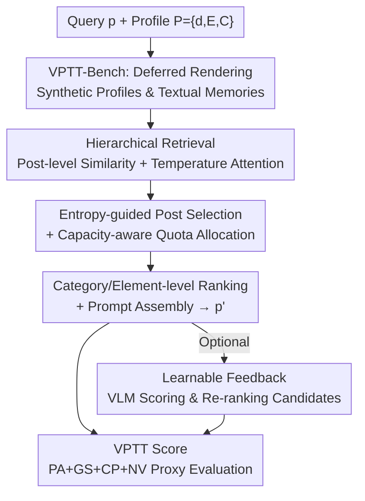

# Visual Personalization Turing Test

**Conference**: CVPR 2026  
**Paper**: [CVF Open Access](https://openaccess.thecvf.com/content/CVPR2026/html/Abdal_Visual_Personalization_Turing_Test_CVPR_2026_paper.html)  
**Code**: https://snap-research.github.io/vptt (Project Page)  
**Area**: Diffusion Models / Personalized Generation / Evaluation Benchmarks  
**Keywords**: Visual Personalization, Turing Test, Retrieval-Augmented Generation, Privacy-Safe Benchmark, Perceptual Proxy Metrics

## TL;DR
This work redefines "visual personalization" from "subject replication" to "Turing-style indistinguishability"—a model passes the VPTT if its generated image, video, or 3D content misleads a human or a calibrated VLM judge into believing it was created or shared by a specific user. Along with this concept, the authors introduce VPTT-Bench, a privacy-safe simulation benchmark of 10,000 user profiles; VPRAG, a training-free retrieval-augmented generation engine; and VPTT Score, a text-only proxy metric highly correlated with human judgment (Spearman $\rho \approx 0.68$).

## Background & Motivation
**Background**: Existing visual personalization methods (such as DreamBooth, LoRA, IP-Adapter, etc.) almost exclusively focus on "subject replication"—providing a few reference images of a specific person or object, and optimizing the model to recreate the appearance of this subject in various new scenarios.

**Limitations of Prior Work**: On one hand, these approaches are computationally expensive (taking minutes to hours for per-user fine-tuning). On the other hand, they only capture physical resemblance ("how something looks") while neglecting the broader context of personalization—how a person **perceives, appreciates, stylizes, and shares their world**. In other words, they replicate a face but fail to capture an individual's "visual language."

**Key Challenge**: Studying whether "generated content truly resembles something a specific person would make" requires thousands of diverse user profiles with distinct cultural/stylistic backgrounds and creation histories. However, real user data is inaccessible due to privacy constraints, fundamentally blocking academic research. Furthermore, there is a lack of evaluation protocols to measure "how much this resembles a specific person" at scale.

**Goal**: To decompose the problem into three sub-problems: (1) how to construct privacy-safe and scalable user profile data; (2) how to interpret the multifaceted styles from a user's history without training and transfer them to new generations; and (3) how to evaluate "the success of personalization" at scale with low cost.

**Key Insight**: Borrowing from the Turing test concept, the authors shift the question from "how well is the subject replicated" to "whether human/VLM judges can distinguish model-generated content from what the user would actually share." This elevates the goal from memorizing physical appearance to simulating a person's perspective.

**Core Idea**: To replace "subject replication" with "perceptual indistinguishability" as the definition of personalization success, and implement this at a scale of 10,000 users through a closed-loop framework of simulation $\rightarrow$ generation $\rightarrow$ judgment $\rightarrow$ optimization (consisting of a benchmark, a training-free RAG engine, and a proxy metric).

## Method

### Overall Architecture
The VPTT Framework is a unified system that chains "simulation-generation-judgment-optimization" into a closed loop, consisting of four interconnected components: a synthetic profile benchmark of 10,000 users (VPTT-Bench), a retrieval-augmented generation engine (VPRAG), an optional learnable feedback loop, and a differentiable proxy metric (VPTT Score).

Formally, each profile is defined as $P=\{d, E, C\}$: demographic information $d$, a structured asset library $E$, and textual memories describing historical creations $C$. Given a query $p$, the system outputs a personalized prompt $p'$ to make the generated image $G(p')$ perceptually closest to the user. This objective is formulated as a proxy objective that balances three competing demands through weighted trade-offs:

$$J(p';P)=\lambda_1\,\text{Align}(p',P)+\lambda_2\,\text{Fidelity}(p',C)+\lambda_3\,\text{Novelty}(p',C),\quad \sum_i\lambda_i=1.$$

An ideal system should simultaneously achieve high alignment, high fidelity, and high novelty, representing a trade-off that current models cannot easily satisfy. Rather than striving for a global optimum, this work proposes a training-free method to efficiently approximate this objective. Below is the multi-stage pipeline of the VPRAG engine (the generation core of the framework):

### Key Designs

**1. VPTT Task Formalization: Redefining Personalization as "Perceptual Indistinguishability"**

Addressing the fundamental limitation that "subject replication misses personal visual language," this work shifts away from pixel/appearance similarity. Instead, the VPTT is passed if the model output (image, video, or 3D asset) is perceptually indistinguishable to a human or calibrated VLM judge from "what the user would have originally created or shared." The corresponding proxy objective in Eq. (1) decomposes success into three competing metrics: **Alignment** (whether $p'$ fits the overall context of the profile), **Fidelity** (whether it falls within the semantic subspace spanned by the user's historical assets), and **Novelty** (whether it avoids verbatim copying of history). By explicitly recognizing this trade-off, a unified metric can be used to evaluate "who achieves the best balance" instead of unilaterally optimizing a single objective.

**2. VPTT-Bench: Building 10,000 Privacy-Safe Synthetic Profiles with "Deferred Rendering"**

To overcome the data barrier of inaccessible real-user data, the authors use Qwen2.5-72B-Instruct to generate 10,000 synthetic profiles, each represented as a triplet $P_i=\{d_i, E_i, C_i\}$. Drawing inspiration from the G-buffer concept in computer graphics, they express each individual's visual world **entirely in text as "deferred rendering"**—representing structured, attribute-rich intermediate concepts like lighting, materials, environment, actions, foreground/background, and appearance, thereby "deferring" actual pixel generation. The pipeline operates in four steps: sampling diverse cultural backgrounds $d_i$ from public PersonaHub text seeds; sampling and clustering atomic visual words (clothing, lighting, poses, etc.) based on $d_i$ into a structured lexicon $E_i$; generating scenarios and then producing 30 attribute-rich descriptions $C_i$ conditioned on $\{d_i, E_i\}$ (embedded using text-embedding-3-small); and actually rendering 1,000 of these profiles into image galleries (30 images per person). This "primarily text + auxiliary paired images" corpus allows for intensive supervision without privacy constraints, while enabling controlled studies across different computational budgets (from text-only to multimodal), making it far more scalable and reproducible than collecting real user data directly.

**3. VPRAG: White-Box, Controllable, and Training-Free Hierarchical Retrieval-Augmented Generation**

To extract and transfer multifaceted user styles without training, VPRAG introduces only a few hundred milliseconds of overhead during inference (compared to minutes or hours for per-user fine-tuning), conditioning the generation process directly on structured profile memories. It performs **two-level hierarchical retrieval**: post-level retrieval for capturing overall semantic intent, and element-level retrieval for capturing atomic styles. At the post level, the cosine similarity between the query and each memory caption is computed as $s_i=q^\top v_i$, then normalized using tempered softmax into weights $w_i=\frac{\exp(s_i/\tau)}{\sum_j\exp(s_j/\tau)}$. This serves as the maximum entropy solution for "expected semantic alignment" under temperature constraints, which is smooth and avoids fragile hard thresholding. Next, the entropy $H=-\sum_i w_i\log w_i$ and the effective number of relevant posts $n_{\text{eff}}=\exp(H)$ are used to measure query specificity: broad prompts (e.g., "in the park") yield high entropy to encourage diverse retrieval, while narrow prompts (e.g., "in Kashmiri traditional dress") yield low entropy to focus retrieval, truncated at $K=\min(\lfloor n_{\text{eff}}\rfloor, 2Q)$ to prevent over-retrieval. Then, **capacity-aware quota allocation** assigns a quota for each category $c'$ to each post: $q_i^{(c')}=\big\lfloor \frac{w_i\cdot n_i^{(c')}}{\sum_j w_j\cdot n_j^{(c')}}\cdot Q_{c'}\big\rfloor$, with remainders assigned to posts with the largest fractional parts—ensuring proportional fairness where high-weight posts are sampled more while low-weight posts still contribute to diversity. At the element level, a lightweight MiniLM encoder ranks categories and elements according to the prompt, extracting top-$q_i^{(k)}$ elements. Finally, the selected elements $E_p$ are combined with the persona summary $S_p$ within a length budget $L$ to assemble $p'$. The entire pipeline is **white-box and LLM-optional**. Compared to approaches like BRAG that stream raw history straight to a black-box LLM, VPRAG is controllable and interpretable at every step, allowing fine-grained control without blindly copying captions.

**4. VPTT Score: A Differentiable Text-Only Proxy Metric with High Human Correlation**

To address the pain point of expensive and challenging large-scale evaluations, this paper designs a **text-only, differentiable, and inexpensive** proxy metric as a convex surrogate for the personalization objective in Eq. (1). It consists of four interpretable components: **Persona Alignment (PA)** measures the semantic cosine similarity between $p'$ and the user profile: $\text{PA}=\cos(\text{Emb}(p'),\text{Emb}(P))$; **GS Reconstruction (GS)** performs Gram-Schmidt orthogonalization on the profile's caption embeddings to form a basis $B$, and computes $\text{GS}=\cos(v_p, B(B^\top v_p))$ to measure whether the generation falls within the semantic subspace spanned by the user's assets (subspace fidelity instead of simple pairwise similarity); **Cluster Proximity (CP)** clusters asset captions in the GS basis to obtain topic centroids $\{c_k\}$, measuring topic consistency via $\text{CP}=\exp(-\min_k\|v'_p-c_k\|^2)$ (using hard min for evaluation and tempered softmin for the differentiable version); and **Novelty (NV)** penalizes verbatim copying using trigram overlap: $\text{NV}=1-\max_i\frac{|\text{Tri}(p')\cap\text{Tri}(c_i)|}{|\text{Tri}(p')|}$. The overall score is a convex combination: $\text{VPTTscore}=0.20\,\text{PA}+0.30\,\text{GS}+0.30\,\text{CP}+0.20\,\text{NV}$ (with GS and CP weighted highest as they correlate best with human perceptual fidelity). In constrained settings like a "3-phrase budget", where NV becomes less meaningful, $\text{VPTTscore-c}=\frac13(\text{PA}+\text{GS}+\text{CP})$ is used instead. Its differentiable variant allows this metric to serve as a learnable objective for future personalization pipelines.

### Loss & Training
The core framework is training-free. The only learnable component is the **optional feedback loop**: given a profile $P$ and a generated prompt $p'$, a VLM judge outputs an alignment score $s_{\text{VLM}}\in[0,1]$. A cross-attention predictor $f_\theta$ is trained to estimate $\hat s_{\text{VLM}}=f_\theta(\text{Emb}(p'),\text{Emb}(P))$ and re-rank candidates via $p'^*=\arg\max_m f_\theta(\text{Emb}(p'_m),\text{Emb}(P))$. This serves as a small-scale proof of concept to encourage future closed-loop personalization research under the VPTT framework.

## Key Experimental Results

Experiments are organized around three progressive questions: Q1: Is the metric reliable? Q2: Do better prompts yield better images? Q3: Is the architecture robust at scale? They span various compute capabilities from open-source Qwen2.5-72B to GPT-4o-mini and Gemini-2.5-Pro, covering both generation and editing tasks.

### Main Results
For Q1, approximately 6,000 human annotations (4 methods $\times$ 3 LLMs $\times$ 2 tasks, evaluated by 20 annotators) are used to align three levels of evaluation. Across text-level VPTTscore-c, visual-level VLM, and perceptual-level Human metrics, the proposed VPRAG consistently leads:

| Method | VPTTscore-c (Text) Avg./Acc. | VLM (0-5) Avg./Acc. | Human (0-5) Avg./Acc. |
|------|------|------|------|
| Baseline (No Assets) | 0.329 / 0.0% | 2.41 / 4.6% | 1.64 / 0.7% |
| Persona Only (Demographics Only) | 0.400 / 7.3% | 3.32 / 19.2% | 2.51 / 16.0% |
| BRAG (Full Caption Access) | 0.420 / 19.3% | 3.52 / 21.6% | 2.69 / 21.3% |
| **VPRAG (Ours)** | **0.464 / 73.3%** | **4.32 / 54.6%** | **3.34 / 62.0%** |

Annotator agreement is high (Kendall's $W=0.651\pm0.141$ for generation, $0.564\pm0.209$ for editing). Regarding metric calibration, the Spearman $\rho$ correlation between VPTTscore-c and human scores is $0.68$ overall ($0.78$ for generation), achieving a Top-2 agreement accuracy of 99%. The correlation between VLM and humans is $\rho=0.67$ overall ($0.75$ for generation). The correlation is lower for editing tasks ($\rho \approx 0.5$, due to finer localized edits and perceptual loss during downsampling). This confirms that text-only VPTTscore-c is a reliable proxy for human perception.

### Scale & Ablation Analysis

For Q3, on the full benchmark of 10,000 profiles $\times$ 4 tasks, totaling 120,000 prompt evaluations (prompt limit of 150 words, budget of 3, and $\tau=0.1$), the table below reports the novelty-adjusted VPTTscore ($V$) and Cohen's $d$ effect size relative to the row-wise best method:

| Model | Baseline V/d | Persona Only V/d | BRAG V/d | VPRAG V/d | Comb. V/d |
|------|------|------|------|------|------|
| Qwen (Gen) | 0.316 / 11.9 | 0.389 / 8.3 | 0.581 / 1.1 | **0.631 / —** | 0.602 / 0.7 |
| 4o-mini (Gen) | 0.316 / 12.6 | 0.402 / 8.4 | 0.628 / 0.5 | 0.640 / 0.1 | **0.644 / —** |
| Gemini (Gen) | 0.316 / 9.8 | 0.379 / 7.1 | 0.616 / 0.3 | 0.625 / 0.2 | **0.632 / —** |
| Qwen (Edit) | 0.306 / 12.0 | 0.378 / 8.7 | 0.583 / 1.1 | **0.626 / —** | 0.586 / 1.0 |
| 4o-mini (Edit) | 0.306 / 12.0 | 0.384 / 8.8 | 0.596 / 0.9 | **0.626 / —** | 0.610 / 0.5 |
| Gemini (Edit) | 0.306 / 10.7 | 0.372 / 8.1 | 0.583 / 0.6 | 0.605 / 0.0 | **0.606 / —** |

### Key Findings
- **BRAG's failure mode is "caption overfitting"**: despite having access to all historical captions, it tends to copy them verbatim. While this yields a high alignment score, it suffers from low novelty, causing its overall score to fall behind. This is precisely what the NV term penalizes, illustrating the value of "white-box controllable retrieval" compared to letting a "black-box LLM swallow raw history."
- **VPRAG achieves the best "alignment-novelty" trade-off**: it yields the optimal overall VPTTscore across all LLM backbones, scales linearly with size, generalizes across models, and maintains perceptual authenticity without retraining.
- **VPRAG and Comb. each have their strengths**: Comb. (BRAG+VPRAG) performs slightly better on 4o-mini/Gemini, while VPRAG is stronger on Qwen. Cohen's $d$ shows that the gap between persona-based methods and the baseline constitutes a medium-to-large effect size ($d \ge 0.5$). ⚠️ For Q2 under the 3-phrase budget with 200 profiles, the $V\text{-}c$ correlation is $\rho=0.53$ ($0.66$ for generation); please refer to the original paper for exact details.
- **Feasibility of feedback simulation**: tested on 200 profiles with 10,000 annotations, a compact 128-dimensional, 4-head cross-attention regressor achieves a 73.8% overall accuracy (MAE 0.1259) and 91.6% accuracy on alignment preference prediction, with a train-test gap of only 0.7%. This demonstrates that small models can learn profile-specific perceptual preferences and generalize to unseen users.

## Highlights & Insights
- **A bold perspective redefining the task**: elevating personalization from "replicating physical appearance" to "Turing-style indistinguishability" exposes the upper bound of current methods—they can copy a face but cannot replicate "a person's visual language." Work that reconsiders the evaluation objective itself typically possesses more long-term value than minor performance boosts.
- **"Deferred rendering" is a clever workaround for privacy barriers**: using text-based structured intermediate representations (analogous to a G-buffer) instead of real user images ensures privacy safety and scalability up to tens of thousands of users. It also allows flexible compute allocation between text-only and multimodal regimes. This data construction strategy is transferable to any scenario where one desires to study real human behavior but cannot access raw user data.
- **Elegant entropy-guided retrieval**: using $n_{\text{eff}}=\exp(H)$ lets broad queries retrieve more context and narrow queries focus automatically, adaptively determining "how many historical records to retrieve" based on query specificity rather than hardcoding a fixed top-$k$.
- **Cost-effective and reliable text-only proxy metrics**: VPTTscore-c aligns with human perception ($\rho \approx 0.7+$) without rendering any images, making 120,000 large-scale evaluations feasible. The GS design, which measures "whether the generation lies within the user's semantic manifold" using subspace reconstruction rather than pairwise similarity, is highly instructive.

## Limitations & Future Work
- **Authors acknowledge**: the learnable feedback loop is only a small-scale proof of concept and was not integrated into the main evaluation; closed-loop optimization is left as future work.
- **Fidelity boundaries of synthetic profiles**: since VPTT-Bench is based on PersonaHub text seeds and LLM generation, a gap remains regarding whether these "synthetic personas" truly represent the "visual language of real users." The scale of 30 assets per person is also limited.
- **Weaker evaluation on editing tasks**: the correlation for editing tasks ($\rho \approx 0.5$) is significantly lower than for generation, showing that fine-grained consistency in local editing is still difficult to capture reliably via text-only or VLM metrics.
- **Caveat on horizontal comparability**: ⚠️ Since different tables (6,000 annotations / 200 profiles / 10,000 profiles) use different budgets, tasks, and model suites, the absolute values of $V$ and $V\text{-}c$ are not directly comparable across tables. The metric $V$ reported here is the novelty-adjusted version, which differs in definition from $V\text{-}c$ in Table 1.
- **Directions for improvement**: incorporating the differentiable VPTTscore as an optimization objective directly into VPRAG/diffusion models for end-to-end training; and extending "deferred rendering" to video or 3D assets to deliver on the full promise of "indistinguishable image/video/3D" personalization.

## Related Work & Insights
- **vs DreamBooth / LoRA / InstantBooth**: These methods focus on per-subject identity replication, require fine-tuning, and only ensure physical appearance fidelity. In contrast, ours is training-free and implicitly extracts preferences, culture, and visual patterns from user history to align overall visual context rather than replicate a specific subject.
- **vs ViPer / PPD / POET / Instant Preference Alignment**: These personalization preference methods rely on explicit feedback, pairwise comparisons, or a single reference image. In contrast, ours **implicitly** extracts and applies alignment from user history (simulated in VPTT-Bench, derived from real PersonaHub), and positions the VPTT as a holistic measure of visual context consistency beyond a simple preference score.
- **vs Tailored Visions / RealRAG / RAPO (Visual RAG)**: These works mostly use black-box LLMs to rewrite raw prompt history or retrieve external real images. VPRAG differs in that it: (1) runs on the structured synthetic VPTT-Bench to allow privacy-safe research, and (2) utilizes a principled, more transparent retrieval and synthesis architecture for fine-grained control instead of acting as a pure black box.

## Rating
- Novelty: ⭐⭐⭐⭐⭐ Redefines personalization as a Turing test, complemented by a benchmark + engine + metric triplet. This represents a paradigm-shifting contribution rather than incremental performance improvements.
- Experimental Thoroughness: ⭐⭐⭐⭐ Spans 3 classes of LLMs, dual tasks of generation/editing, 120,000 evaluations, and 6,000 human annotations, though the editing evaluation is weaker and the feedback loop is only a proof of concept.
- Writing Quality: ⭐⭐⭐⭐ Clear motivation and complete formulation; however, metrics across multiple tables have inconsistent conditions, requiring readers to exercise caution.
- Value: ⭐⭐⭐⭐⭐ The combination of privacy-safe deferred rendering data creation and a text-only perceptual proxy metric offers long-term utility for the scalable evaluation of personalized generation.

<!-- RELATED:START -->

## Related Papers

- [\[CVPR 2026\] Omni-Attribute: Open-vocabulary Attribute Encoder for Visual Concept Personalization](omni-attribute_open-vocabulary_attribute_encoder_for_visual_concept_personalizat.md)
- [\[ICLR 2026\] Mitigating Semantic Collapse in Generative Personalization with Test-Time Embedding Adjustment](../../ICLR2026/image_generation/mitigating_semantic_collapse_in_generative_personalization_with_test-time_embedd.md)
- [\[CVPR 2026\] A Training-Free Style-Personalization via SVD-Based Feature Decomposition](a_training-free_style-personalization_via_svd-based_feature_decomposition.md)
- [\[CVPR 2026\] From Scale to Speed: Adaptive Test-Time Scaling for Image Editing](from_scale_to_speed_adaptive_test-time_scaling_for_image_editing.md)
- [\[CVPR 2026\] Progress by Pieces: Test-Time Scaling for Autoregressive Image Generation](progress_by_pieces_test-time_scaling_for_autoregressive_image_generation.md)

<!-- RELATED:END -->
