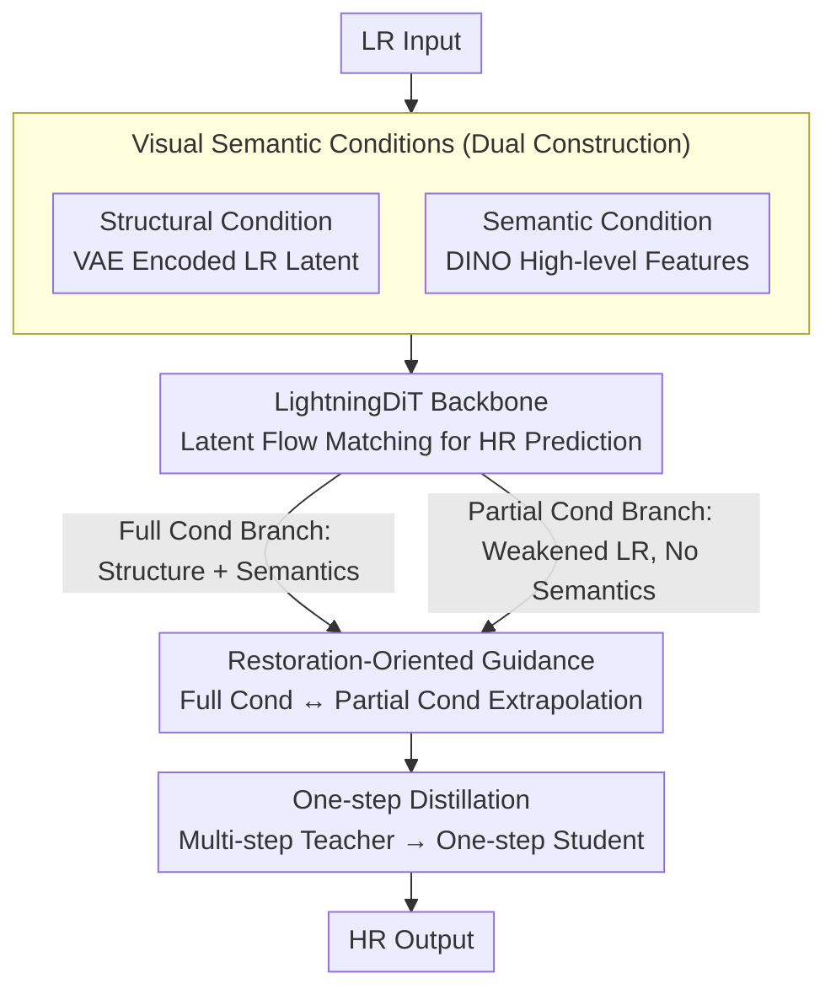

# VOSR: A Vision-Only Generative Model for Image Super-Resolution

**Conference**: CVPR 2026  
**arXiv**: [2604.03225](https://arxiv.org/abs/2604.03225)  
**Code**: [https://github.com/cswry/VOSR](https://github.com/cswry/VOSR)  
**Area**: Image Generation  
**Keywords**: super-resolution, vision-only, diffusion model, classifier-free guidance, one-step distillation

## TL;DR

This work proposes VOSR, the first to demonstrate that a vision-only trained generative super-resolution (SR) model can match or even surpass methods based on T2I pre-training. By utilizing visual semantic conditions and a restoration-oriented guidance strategy, VOSR achieves high-quality SR with training costs only 1/10 of T2I-based methods.

## Background & Motivation

The current generative image SR field is dominated by methods based on Text-to-Image (T2I) diffusion models (e.g., Stable Diffusion), which perform SR restoration by adapting pre-trained T2I generators. However, the authors point out a fundamental contradiction in this paradigm: SR is an image restoration task conditioned on low-resolution (LR) inputs, whereas T2I methods start from generic generators and introduce semantics via text or text-aligned representations, increasing the risk of detail hallucination.

**Core Problem**: Can a generative model trained exclusively on vision, without relying on multi-modal pre-training, match T2I-based SR methods?

The authors provide an affirmative answer through VOSR. VOSR requires only approximately 1/10 of the training cost of representative T2I-based SR methods, yet achieves competitive or superior results in terms of perceptual quality and fidelity.

## Method

### Overall Architecture

VOSR challenges the default assumption that "generative super-resolution must stand on the shoulders of T2I pre-training." It follows a vision-only route: using LightningDiT as the backbone with flow matching training in the latent space. Given an LR image, two complementary conditions are constructed—a structural condition (VAE-encoded LR latent representation) and a visual semantic condition (high-level features extracted by a DINO encoder). These are injected into the DiT to predict the HR image. During inference, a restoration-oriented guidance extrapolation is used, and a multi-step teacher is distilled into a single-step student for acceleration. The entire pipeline avoids any text/multi-modal pre-training, with training costs roughly 1/10 of representative T2I-based SR methods.

### Key Designs

**1. Visual Semantic Conditions: Extracting Semantics Entirely in the Visual Domain to Avoid Coarse Text Alignment**

Previous vision-only SR methods provided only LR structural conditions, lacking high-level semantics and leading to ambiguity in blurry areas. Conversely, T2I methods rely on text for semantics, risking hallucination. VOSR's compromise introduces a DINO pre-trained visual encoder for semantic features: structural conditions maintain fidelity via spatially aligned latent injection, while semantic conditions resolve ambiguity via cross-attention. Crucially, semantics remain entirely within the visual domain, avoiding the spatial coarseness issues inherent in text-aligned conditions.

**2. Restoration-Oriented Guidance: Replacing Unconditional Branches with Partial Conditioning Branches**

The authors re-examine the performance of Classifier-Free Guidance (CFG) on vision-only SR trained from scratch. They find that standard unconditional branches are difficult to learn and the guidance direction is unsuitable for restoration. Their modification replaces the unconditional branch with a partial conditioning branch—retaining weakened LR structural cues but removing semantic conditions. This anchors both branches to the input, directing guidance from "weakly anchored" to "strongly anchored." This leads to an interesting behavioral reversal: increasing the guidance scale moves closer to the full condition branch (higher fidelity), while decreasing it moves closer to the partial condition branch (stronger generative capability).

**3. One-step Distillation: Compressing Multi-step Teachers into Single-step Students with Constant Interfaces**

Multi-step sampling remains slow. VOSR distills the multi-step VOSR teacher into a single-step student, maintaining the same conditional interfaces and restoration-oriented guidance while only modifying sampling efficiency. Specifically, a variant of recursive consistency distillation is used to achieve an optimal balance between perceptual quality and structural fidelity.

### Loss & Training

The multi-step model uses a standard velocity-parameterized diffusion training objective, randomly switching between full and partial conditioning modes during training. The dataset comprises approximately 100 million web images, with LR-HR pairs synthesized using the Real-ESRGAN degradation pipeline. Two variants, 0.5B and 1.4B parameters, are provided.

## Key Experimental Results

### Main Results

| Dataset | Setting | Ours (VOSR-1.4B-ms) | T2I SOTA (SeeSR) | Notes |
|--------|------|-------------------|-----------------|------|
| RealSR | Multi-step | Highly competitive perceptual metrics | One of the comparison methods | VOSR is superior in fidelity metrics |
| ScreenSR | Multi-step | Best in multiple metrics | — | Newly constructed real-world test set |
| LSDIR | One-step | Surpasses OSEDiff, etc. | — | Efficiency comparable to T2I one-step methods |

### Ablation Study

| Configuration | Key Metric | Notes |
|------|---------|------|
| Without visual semantics | Perceptual quality drops | Semantic conditions are crucial for resolving ambiguity |
| Standard CFG (Null cond) | Poor performance | Unconditional branch is too hard to learn; direction unsuitable |
| Restoration-Oriented Guidance | Optimal | Partial condition branch maintains input anchoring |

### Key Findings

- A vision-only framework rivals T2I-based SR in perceptual quality for the first time, while offering superior fidelity and fewer hallucinations.
- The multi-step model is significantly more efficient than existing T2I-based SR systems; the one-step model matches the efficiency of the latest one-step T2I systems.
- Training costs are only about 1/10 of representative T2I methods.

## Highlights & Insights

- Fundamentally questions the necessity of T2I pre-training for SR, providing a strong counter-argument.
- The Restoration-Oriented Guidance strategy is ingeniously designed, and the semantic reversal of the guidance scale (large scale $\rightarrow$ fidelity, small scale $\rightarrow$ generation) is highly intriguing.
- The creation of the ScreenSR real-world paired test set provides a higher-quality reference for SR evaluation.
- Demonstrates that strong semantics can be obtained entirely within the visual domain without using text as an intermediary.

## Limitations & Future Work

- Still requires large-scale data and compute for training (though much less than T2I methods).
- May still lag behind the strong priors of T2I methods under certain extreme degradations.
- The pre-training of the visual encoder (DINO) itself requires substantial data.

## Related Work & Insights

- Compared to prior vision-only SR methods like ResShift and SinSR, VOSR significantly improves perceptual quality.
- The Restoration-Oriented Guidance strategy is potentially generalizable to other image restoration tasks.

## Rating

- Novelty: ⭐⭐⭐⭐⭐ — First to prove vision-only rivals T2I-based SR.
- Technical Depth: ⭐⭐⭐⭐⭐ — Precise guidance strategy design and deep theoretical analysis.
- Experimental Thoroughness: ⭐⭐⭐⭐⭐ — Very comprehensive; covers multiple scales, steps, and new datasets.
- Value: ⭐⭐⭐⭐⭐ — High practical utility with low training cost and high efficiency.

<!-- RELATED:START -->

## Related Papers

- [\[CVPR 2026\] DTG-Restore: Training-Free Diffusion Refinement for Generative Video Super-Resolution](dtg-restore_training-free_diffusion_refinement_for_generative_video_super-resolu.md)
- [\[CVPR 2026\] EMR-Diff: Edge-aware Multimodal Residual Diffusion Model for Hyperspectral Image Super-resolution](emr-diff_edge-aware_multimodal_residual_diffusion_model_for_hyperspectral_image_.md)
- [\[NeurIPS 2025\] Image Super-Resolution with Guarantees via Conformalized Generative Models](../../NeurIPS2025/image_generation/image_super-resolution_with_guarantees_via_conformalized_generative_models.md)
- [\[AAAI 2026\] GEWDiff: Geometric Enhanced Wavelet-based Diffusion Model for Hyperspectral Image Super-resolution](../../AAAI2026/image_generation/gewdiff_geometric_enhanced_wavelet-based_diffusion_model_for_hyperspectral_image.md)
- [\[CVPR 2026\] Bridging Fidelity-Reality with Controllable One-Step Diffusion for Image Super-Resolution](bridging_fidelity-reality_with_controllable_one-step_diffusion_for_image_super-r.md)

<!-- RELATED:END -->
