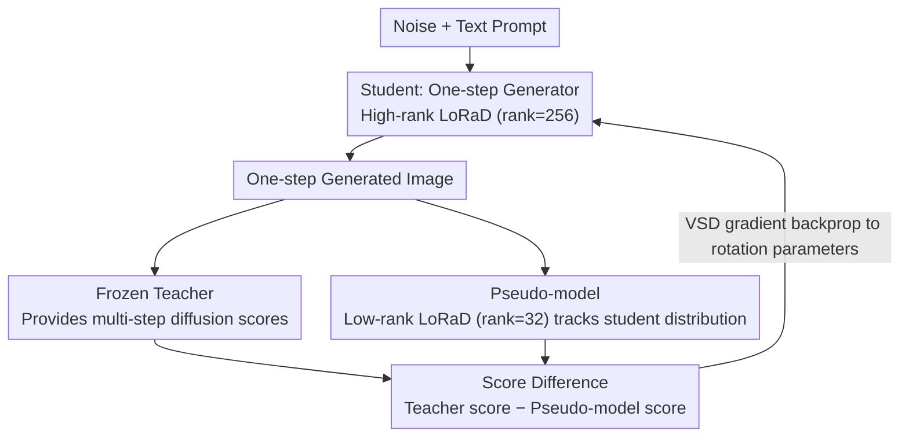

# WaDi: Weight Direction-aware Distillation for One-step Image Synthesis

**Conference**: CVPR 2026  
**arXiv**: [2603.08258](https://arxiv.org/abs/2603.08258)  
**Code**: [https://github.com/gudaochangsheng/WaDi](https://github.com/gudaochangsheng/WaDi)  
**Area**: Image Generation  
**Keywords**: Diffusion Distillation, Weight Direction, Low-Rank Rotation, One-step Synthesis, Parameter Efficiency

## TL;DR
Through analyzing the norm-direction decomposition of weight changes during distillation, it is discovered that direction change is the primary driver of distillation (change magnitude is $22\times$ larger than norm). The authors propose LoRaD (Low-Rank weight Direction rotation) adapter and integrate it into the VSD framework to form WaDi, achieving SOTA one-step FID on COCO with only ~10% trainable parameters.

## Background & Motivation
**Background**: Diffusion distillation methods compress multi-step diffusion into one-step generators. Mainstream methods are divided into Full-Parameter Fine-Tuning (FT) and LoRA fine-tuning, both based on the VSD (Variational Score Distillation) framework.

**Limitations of Prior Work**: Both FT and LoRA directly update parameters, optimizing weight norm and direction simultaneously—but the magnitudes of their changes differ significantly: the mean and standard deviation of direction changes are $22\times$ and $10\times$ those of norm changes, respectively. This coupling increases optimization difficulty.

**Key Challenge**: Distillation signals are primarily transmitted through direction adjustments, but existing adapters (LoRA/DoRA) are not specifically optimized for direction updates, leading to slow convergence, instability, and susceptibility to overfitting.

**Key Validation**: Replacing the direction of a one-step model with the teacher's direction worsens FID by 241; replacing the norm only changes FID by 0.7. The direction residual matrix recovers 93% of information with 30% of the rank, indicating a low-rank structure.

**Core Idea**: Since the essence of distillation is weight direction rotation, it is better to directly learn low-rank rotation matrices to adjust direction, rather than indirectly influencing it through LoRA.

## Method

### Overall Architecture
The problem WaDi addresses is how to update only the parts of weights that "truly carry the distillation signal" when distilling a multi-step diffusion model into a one-step generator. It follows the triangular structure of VSD: a frozen teacher $\epsilon_\psi$ provides multi-step diffusion scores, a one-step generator (student) $G_{\lambda}$ directly generates images from noise, and a pseudo-model $\epsilon_\phi$ tracks the student's current output distribution in real-time. The student's training gradient is derived from the score difference between the teacher and the pseudo-model. WaDi does not change this outer game but replaces the weight update mechanism in the student and pseudo-model from LoRA/FT to LoRaD: instead of additive modifications, it performs low-rank rotations on weight columns, adjusting only direction while keeping the norm fixed.

### Key Designs

**1. LoRaD: Using Low-Rank Rotation to Change Direction Only, Locking the Norm**

This design specifically targets the observation that distillation signals are almost entirely transmitted through direction rotation (replacing direction with teacher direction worsens FID by 241, while replacing the norm only changes it by 0.7). Additive updates in LoRA ($W+\Delta W$) disturb both norm and direction, wasting capacity on the useless norm. LoRaD applies an orthogonal rotation to each weight column: inspired by RoPE, dimensions are paired into $d/2$ two-dimensional subspaces, and each subspace rotates by an independent angle:

$$W_{ro} = R_{AB}W = \begin{bmatrix} \cos AB & -\sin AB \\ \sin AB & \cos AB \end{bmatrix} \begin{bmatrix} W_{\text{odd}} \\ W_{\text{even}} \end{bmatrix}$$

The angle matrix $\Theta = AB$ is low-rank parameterized with $A \in \mathbb{R}^{d/2 \times r}$ and $B \in \mathbb{R}^{r \times k}$, corresponding to the observation that direction residuals recover 93% information with 30% rank. Since $R$ is an orthogonal matrix, the norm of each column remains constant after rotation. This aligns perfectly with the "ignorable norm" finding, focusing update capacity entirely on the direction. Implementation-wise, the rotation matrix is sparse block-diagonal, requiring only element-wise multiplication and addition during the forward pass without introducing extra dense matrix multiplications.

**2. WaDi Training Framework: High-rank LoRaD for Student, Low-rank LoRaD for Pseudo-model**

After integrating LoRaD into VSD, the remaining question is how to allocate rotation capacity. The roles differ: the student $G_{\lambda_{\Theta^l}}$ needs to compress the multi-step teacher distribution into one step, requiring higher fitting capability, thus using high-rank LoRaD (rank=256). The pseudo-model $\epsilon_{\phi_{\Theta^s}}$ merely tracks the student's current distribution and does not require large capacity, using low-rank LoRaD (rank=32). Both are updated alternately during training, with the student's gradient following the VSD form but backpropagated to the rotation parameters:

$$\nabla_{\lambda_{\Theta^l}} \mathcal{L}_{\text{wadi}} = \mathbb{E}\big[\omega(t)(\epsilon_\psi - \epsilon_{\phi_{\Theta^s}}) \tfrac{\partial G_{\lambda_{\Theta^l}}}{\partial \lambda_{\Theta^l}}\big]$$

This asymmetric "heavy student, light pseudo-model" ratio was confirmed by ablation: increasing the student rank to 512 led to overfitting (FID rose from 10.79 to 12.75), while the pseudo-model rank mainly affected fidelity and had little impact on semantic alignment.

### Loss & Training
- Image-free training: No real images required, using only 1.4M JourneyDB text prompts.
- Student LR=1e-4, Pseudo-model LR=1e-2, AdamW optimizer, batch=128, CFG=1.5.
- 2 epochs of training, supporting SD1.5, SD2.1, and PixArt-$\alpha$ backbones.

## Key Experimental Results

### Main Results — COCO 2014 Zero-shot FID

| Method | Backbone | NFE | Trainable Params | FID↓ | CLIP↑ |
|------|------|-----|-----------|------|-------|
| SD 1.5 | U-Net | 25 | 860M | 8.78 | 0.30 |
| DMD2 | U-Net | 1 | 860M | 12.96 | 0.30 |
| SiD-LSG | U-Net | 1 | 860M | 14.27 | 0.30 |
| **Ours (WaDi)** | **U-Net** | **1** | **83.8M (9.7%)** | **10.79** | **0.31** |
| PixArt-$\alpha$ | DiT | 20 | 610M | 8.75 | 0.32 |
| **Ours (WaDi)** | **DiT** | **1** | **81.2M (13.3%)** | **18.99** | **0.30** |

### Ablation Study — Adapter Type Comparison

| Adapter | Parameters | FID↓ | Direction Mean Change |
|--------|--------|------|------------|
| LoRA | 120.9M | 25.27 | 0.83% |
| DoRA | 121.2M | 26.56 | 0.55% |
| DoRA (frozen norm) | 120.9M | 24.52 | 0.92% |
| FT (DMD2) | 860.0M | 23.30 | 2.21% |
| **LoRaD** | **83.8M** | **20.86** | **2.89%** |

### Ablation Study — Rank Configuration Impact (COCO 2014)

| Setting | Student Rank | Student Params | Pseudo-model Rank | FID↓ | CLIP↑ |
|------|----------|---------|------------|------|-------|
| A | 64 | 20.95M | 32 | 13.64 | 0.30 |
| B | 128 | 41.90M | 32 | 13.16 | 0.29 |
| **C** | **256** | **83.80M** | **32** | **10.79** | **0.31** |
| D | 512 | 167.59M | 32 | 12.75 | 0.30 |

### Key Findings
- LoRaD achieves the largest direction change (2.89%) and optimal FID (20.86) with the fewest parameters (83.8M vs 860M), perfectly validating the hypothesis that "direction is key to distillation."
- Rank=256 is the optimal configuration for the student; rank=512 leads to overfitting (FID rose from 10.79 to 12.75).
- Pseudo-model rank mainly influences fidelity (FID) and has little impact on semantic alignment (CLIP).
- WaDi can be directly applied to downstream tasks like ControlNet (inference speedup 86%), ReVersion (speedup 89%), and DreamBooth.
- In a user study, 57 participants consistently rated WaDi superior to existing baselines in image quality and text-to-image alignment.

## Highlights & Insights
- **Weight Norm-Direction Decomposition Analysis**: The first systematic study of the structure of weight changes in distillation—direction change >> norm change, and direction residuals are low-rank. This provides a new theoretical perspective for distillation.
- **Rotation Instead of Addition**: LoRA updates weights via addition $W + \Delta W$ (changing both norm and direction), while LoRaD uses rotation $R_{\Theta}W$ to change only direction—making it more precise and efficient.
- **Parameter Efficiency**: Achieving results better than full-parameter fine-tuning with only ~10% trainable parameters is highly valuable for resource-constrained scenarios.

## Limitations & Future Work
- The 2D subspace pairing in LoRaD is fixed (odd-even row pairing), which may not be the optimal grouping strategy.
- Although FID is better than DMD2, the difference in CLIP scores is small, indicating that direction rotation primarily improves image fidelity rather than semantic alignment.
- The FID gap on PixArt-$\alpha$ (DiT architecture) remains relatively large (18.99), potentially requiring specialized designs for the DiT architecture.
- Ablations were only conducted on COCO 2017; more dataset validations are needed.

## Related Work & Insights
- **vs DMD2**: DMD2 uses FT for distillation; WaDi uses only 10% of the parameters and achieves better FID—by precisely targeting the key variable of distillation (direction).
- **vs LoRA/DoRA**: LoRA's additive updates change both norm and direction but provide insufficient direction change (0.83%); DoRA separates the norm but still uses LoRA for direction; LoRaD rotates direction directly, yielding the maximum change (2.89%).
- **vs SwiftBrush**: SwiftBrush is also based on VSD but uses FT; WaDi combines VSD + LoRaD, far exceeding it in parameter efficiency.

## Rating
- Novelty: ⭐⭐⭐⭐⭐ The norm-direction analysis perspective is novel; LoRaD design is elegant with strong theoretical motivation.
- Experimental Thoroughness: ⭐⭐⭐⭐ Covers three backbones, downstream tasks, and user studies; detailed ablations, though dataset coverage could be broader.
- Writing Quality: ⭐⭐⭐⭐⭐ Motivation analysis is highly persuasive (replacement experiments + SVD analysis); logical reasoning is rigorous.
- Value: ⭐⭐⭐⭐⭐ Sets a new standard for parameter-efficient distillation; LoRaD is transferable to other fine-tuning scenarios.

<!-- RELATED:START -->

## Related Papers

- [\[CVPR 2026\] DUO-VSR: Dual-Stream Distillation for One-Step Video Super-Resolution](duo-vsr_dual-stream_distillation_for_one-step_video_super-resolution.md)
- [\[CVPR 2026\] Temporal Equilibrium MeanFlow: Bridging the Scale Gap for One-Step Generation](temporal_equilibrium_meanflow_bridging_the_scale_gap_for_one-step_generation.md)
- [\[CVPR 2026\] ChordEdit: One-Step Low-Energy Transport for Image Editing](chordedit_one-step_low-energy_transport_for_image_editing.md)
- [\[CVPR 2026\] FlowSteer: Guiding Few-Step Image Synthesis with Authentic Trajectories](flowsteer_guiding_few-step_image_synthesis_with_authentic_trajectories.md)
- [\[NeurIPS 2025\] Distilled Decoding 2: One-step Sampling of Image Auto-regressive Models with Conditional Score Distillation](../../NeurIPS2025/image_generation/distilled_decoding_2_onestep_sampling_of_image_autoregressiv.md)

<!-- RELATED:END -->
