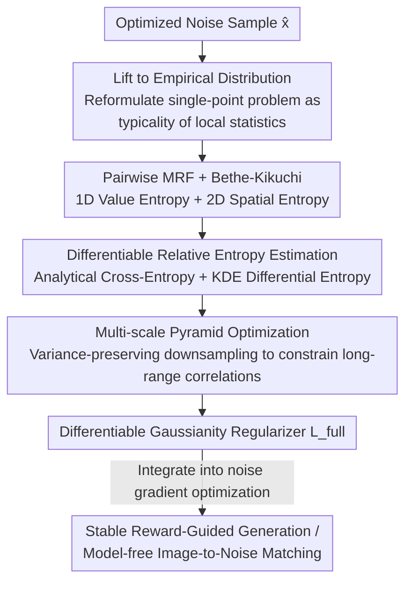

# What Is It Like to Be a Noise? An Entropy-based Gaussian Noise Regularization for Diffusion Models

**Conference**: CVPR 2026  
**Paper**: [CVF Open Access](https://openaccess.thecvf.com/content/CVPR2026/html/Chang_What_Is_It_Like_to_Be_a_Noise_An_Entropy-based_CVPR_2026_paper.html)  
**Code**: None  
**Area**: Diffusion Models / Image Generation  
**Keywords**: Noise Regularization, Inference-Time Optimization, Markov Random Field, KL Divergence, Reward Guidance

## TL;DR
Addressing the issue where optimizing the initial noise of diffusion models during inference-time deviates the latent from true Gaussian statistics, causing artifacts and reward hacking, this paper redefines the question of "whether a single sample resembles Gaussian noise" as a distribution matching problem. Specifically, it lifts a single sample to an empirical distribution induced by its local statistics, models it using a pairwise Markov Random Field (MRF), and derives a differentiable Gaussian regularization term (comprising a 1D marginal entropy, a 2D spatial entropy, and a multi-scale term) via Bethe–Kikuchi approximation. This significantly enhances the stability and generation quality of latent optimization.

## Background & Motivation

**Background**: Standard image diffusion models utilize high-dimensional Gaussian noise as a "maximum-entropy starting point"—an uninformative prior from which they learn to denoise toward the data distribution. Recently, numerous **inference-time methods** recycle pre-trained/pre-trained diffusion pipelines to achieve posterior objectives, such as reward guidance, generation quality enhancement, and controllable synthesis. The most common strategy directly performs gradient optimization on the initial noise latent to make the final denoised result align better with the objective.

**Limitations of Prior Work**: Once optimization pushes the latent away from the "statistical features of true Gaussian noise," the model is forced to denoise samples it has never encountered during training, resulting in **artifacts, fragile behaviors, and reward hacking** (where the optimizer exploits loopholes in the reward rather than genuinely improving generation). Consequently, regularizing the optimized latent becomes a tightrope walk: the sample must retain the changes brought by the objective while remaining a legitimate noise realization.

**Key Challenge**: To constrain "Gaussianity," the most natural metric is the KL divergence $D_{KL}(P \| G)$ between the data distribution $P$ and the Gaussian prior $G$. However, this is precisely what the authors refer to as the **"hard problem" of Gaussianity**—it perfectly conceptualizes what we want to measure, yet is practically unavailable because $P$ is unknown and cannot be inferred from a single sample. Existing regularization terms ($\ell_2$/MAP, KL, norm-guided) only crudely approximate $P$ as a Dirac delta, isotropic Gaussian, or uniform hypersphere shell, thereby matching only selected **global** characteristics while completely ignoring the **local joint statistics** of the sample.

**Goal**: Under the premise that the "hard problem" is unsolvable, the goal is to find a computationally tractable yet conceptually faithful metric of Gaussianity and integrate it into noise optimization as a differentiable regularization term.

**Key Insight**: Instead of asking "does this single point belong to a Gaussian distribution," it is better to ask "are the **local statistics** carried by this sample consistent with a typical Gaussian draw." This shifts the problem from single-point likelihood to the typicality of local statistics.

**Core Idea**: Lift a single sample to an empirical distribution $P_{\hat{x}}$ (induced by its own statistics), model it using a pairwise MRF, and apply the Bethe–Kikuchi approximation to obtain a Gaussianity regularization term that is **computable from a single sample and end-to-end differentiable**.

## Method

### Overall Architecture
The method addresses the question of "how to compute a differentiable scalar regularization term characterizing Gaussianity from a single optimized sample $\hat{x}$." The overall pipeline is a chain of computations: first, perform a **conceptual transformation** to lift $\hat{x}$ to an empirical distribution $P_{\hat{x}}$ induced by its local statistics, rewriting the objective as $D_G(\hat{x}) = D_{KL}(P_{\hat{x}} \| G)$ (Eq. 3); second, employ a **pairwise MRF** to factorize $P_{\hat{x}}$ on the pixel grid into node (unary) and edge (pairwise) potential functions, and use the **Bethe–Kikuchi approximation** to split the intractable global entropy into two parts: "1D value entropy + 2D spatial entropy" (Eq. 5); third, compute the KL divergence of each term via **differentiable estimation** (analytical cross-entropy + KDE differential entropy); finally, evaluate this objective on a **multi-scale pyramid** and sum them with weights (Eq. 11) to constrain longer-range correlations. The entire $L_{full}(\hat{x})$ is end-to-end differentiable with respect to the pixels of $\hat{x}$ and can be directly added as a regularization term in any noise gradient optimization.

### Key Designs

**1. Lifting a Single Sample to an Empirical Distribution: Shifting from 'Which Distribution the Point Belongs to' to 'Whether the Local Statistics Resemble'**

The "hard problem" of Gaussianity lies in the fact that the true distribution $P$ is unknown and cannot be inferred from a single sample, making direct computation of $D_{KL}(P \| G)$ infeasible. The authors' first contribution is a conceptual transformation: associating each optimized sample $\hat{x}$ with an empirical distribution $P_{\hat{x}}$ induced by its own statistics, and defining 

$$D_G(\hat{x}) = D_{KL}(P_{\hat{x}} \| G).$$

This step (Eq. 3) represents the core conceptual shift of the paper—instead of asking "does a single point $\hat{x}$ belong to the Gaussian prior," it asks "are the local statistics of $\hat{x}$ consistent with a typical Gaussian realization." Its brilliance lies in replacing an unavailable global likelihood problem with a "typicality" problem that can be estimated from a single sample. The paper also points out in the appendix that standard $\ell_2$ (MAP), KL, and norm-guided regularizations correspond to restricting $P_{\hat{x}}$ to a Dirac delta, a fitted isotropic Gaussian, or a uniform hypersphere shell, respectively—meaning they are all degenerate special cases of this framework that only match global features rather than local joint statistics.

**2. Pairwise MRF + Bethe-Kikuchi Approximation: Splitting Intractable Global Entropy into 1D Value Entropy + 2D Spatial Entropy**

With the definition of $P_{\hat{x}}$ established, the question "how to formulate $P_{\hat{x}}$ from a single sample" must be answered. Drawing inspiration from MRFs in classical computer vision, the authors model $\hat{x}$ as an **ergodic spatial process**: ergodicity + local neighborhood system + finite-order cliques allow the density to be factorized on the pixel grid $V$ as the product of unary potentials $\psi_i$ and pairwise potentials $\psi_{ij}$ (Eq. 4):

$$p_{\hat{x}}(x) = \frac{1}{Z}\prod_{i\in V}\psi_i(x_i)\prod_{(i,j)\in E}\psi_{ij}(x_i, x_j).$$

However, since the partition function $Z$ is generally analytically intractable, the objective remains unsolvable. The key breakthrough is that the MRF structure itself provides a principled approximation—the **Bethe-Kikuchi cluster expansion**, which approximates the intractable global entropy (and thus the KL divergence) of the cluster using the sum of the entropies of local clusters (unary + pairwise cliques) while correcting for their overlaps. Restricting the expansion to nodes and edges (i.e., the standard Bethe approximation) yields the final objective (Eq. 5):

$$D_{KL}(P_{\hat{x}} \| G) \approx \underbrace{D_{KL}(P_{\hat{x},S^{(2)}} \| G_{S^{(2)}})}_{\text{spatial entropy term}} + \gamma\,\underbrace{D_{KL}(P_{\hat{x},S^{(1)}} \| G_{S^{(1)}})}_{\text{value entropy term}},$$

where $\gamma$ is the over-counting correction term prescribed by the Bethe approximation (since a single pixel simultaneously belongs to multiple pairwise cliques). The two terms are complementary: the **value entropy term $S^{(1)}$** compares the empirical distribution of 1D pixel intensities with the target $\mathcal{N}(0,1)$ to align marginal statistics; the **spatial entropy term $S^{(2)}$** compares the 2D joint empirical distribution of neighboring pixel pairs with the target $\mathcal{N}(0, I_2)$ to penalize local statistical dependencies that should not exist in an ideal Gaussian field—this term is the core of capturing "typicality."

**3. Differentiable Relative Entropy Estimation: Analytical Cross-Entropy + KDE Differential Entropy with Binning for Linear Complexity**

Both KL terms in Eq. 5 must be estimated differentiably. The authors split each $D_{KL}(P_{\hat{x}} \| G)$ into cross-entropy minus differential entropy (Eq. 6): $D_{KL} = H(P_{\hat{x}}, G) - H(P_{\hat{x}})$. For $N$ $d$-dimensional vectors $V=\{v_i\}$ extracted from the sample ($d=1$ for pixel values in $S^{(1)}$, $d=2$ for neighboring pixel pairs in $S^{(2)}$):

- **Cross-entropy** is straightforward to compute because the target $G=\mathcal{N}(0,I_d)$ is analytical, $\log G(v) = -\frac{d}{2}\log(2\pi) - \frac{1}{2}\|v\|_2^2$, which can be directly averaged via Monte Carlo over the $N$ elements (Eq. 7-8), making it fully differentiable with respect to each component of $v_i$.
- **Differential entropy** is more challenging because $P_{\hat{x}}$ is only implicitly defined by the sample set $V$. The authors first approximate the continuous density using **Gaussian kernel KDE**: $\hat{p}(v)=\frac{1}{N}\sum_j K_\sigma(v - v_j)$ (where the bandwidth $\sigma$ is set heuristically via Scott's Rule etc.), and then apply Monte Carlo averaging of $\log\hat{p}(v_i)$ to obtain $H(P_{\hat{x}})$ (Eq. 9-10, adding a small constant $\epsilon$ for numerical stability).

Subtracting the two yields the end-to-end differentiable (with respect to original pixel values) KL divergence. While a naive implementation incurs $O(N^2)$ complexity (requiring distance calculations between all pairs of sample vectors), the authors point out that calculating pairwise distances against a **fixed set of bins (e.g., 128 bins)** achieves **linear complexity** with virtually no loss in quality (Table 1 uses this version). Since this overhead only occurs during sample-wise optimization rather than large-scale training, it is entirely tolerable.

**4. Multi-Scale Pyramid Optimization: Variance-Preserving Downsampling to Constrain Long-Range Correlations**

Pairwise MRFs only constrain local dependencies between adjacent pixels; thus, even if local statistics match $G$, **long-range correlations** may still persist in $\hat{x}$. The authors address this loophole with a multi-level scheme: they construct a sample pyramid $\{\hat{x}_k\}_{k=0}^{L-1}$, where $\hat{x}_0=\hat{x}$ is the full resolution, and each layer downsamples the previous layer via $2\times 2$ block mean pooling and then multiplies it by $\sqrt{n}$ (where $n$ is the number of aggregated pixels) to **preserve variance**—meaning $2\times 2$ pooling is multiplied by $\sqrt{4}=2$. This variance-preserving transformation ensures that the target distribution at each scale remains the standard normal $\mathcal{N}(0,I)$, allowing the KL objective in Eq. 6 to be evaluated at each scale to yield the final objective (Eq. 11):

$$L_{full}(\hat{x}) = \sum_{k=0}^{L-1}\alpha_k\, D_{KL}(P_{\hat{x}_k} \| G),$$

where $\alpha_k$ represents the weights balancing the KL terms across scales. Evaluating at coarser resolutions is equivalent to applying local pairwise constraints to progressively larger neighborhoods, thereby penalizing spatial correlations at larger scales and making $\hat{x}$ a more faithful representative of the Gaussian typical set. All examples in the paper use three scales ($L=3$).

## Key Experimental Results

> ⚠️ The main results of this paper (reward-guided generation quality/FID comparisons, reward curves) are primarily presented in figures (Figures 2–6) in the original paper; the CVF text version did not fully extract raw numerical tables. The quantitative results available in the table below indicate the per-step cost of each method (Table 1). The remaining evaluations are mostly qualitative; please refer to the original paper's figures for specific values.

### Main Results

Per-step latency of different methods (Table 1, in ms, lower is faster):

| Method | Time/step (ms) |
|------|----------------|
| KL | 0.4063 ± 0.0227 |
| Pix2Pix-Zero | 2.6374 ± 0.1207 |
| ReNO | 0.4553 ± 0.0025 |
| ReNoise | 3.0938 ± 0.2804 |
| Hwang et al. | 0.7148 ± 0.0075 |
| **Ours** | 15.0191 ± 0.1053 |

It is evident that the per-step overhead of our regularization term is significantly higher than that of simple KL/norm-like baselines (primarily due to the KDE differential entropy estimation), which represents the main cost of the method. However, because it only arises during sample-wise inference optimization and does not affect training, the authors argue that this is entirely acceptable for the target applications.

### Ablation Study

**Cumulative ablation** performed on a structured checkerboard input (Figure 2), incrementally adding components and comparing "with/without multi-scale":

| Configuration | Observation |
|------|------|
| + 1D Value Entropy | Successfully corrects the 1D marginal histogram and matches all first-order statistics; however, it fails to eliminate the strong spatial correlation of the input. |
| + 2D Spatial Entropy | Begins to break down local correlations at full resolution. |
| + Bethe Correction | Corrects for the over-counting of pairwise cliques to assemble the complete objective. |
| + Multi-scale | Generalizes local constraints to larger neighborhoods, further suppressing long-range correlations. |

### Key Findings
- **The value entropy term manages first-order statistics, whereas the spatial entropy term controls local correlations**: Relying solely on the 1D term only reshapes the histogram into a Gaussian profile, leaving strong spatial structures like the checkerboard completely unaffected. The 2D spatial entropy term is indispensable to dismantle local correlations—confirming that "typicality" resides primarily within spatial joint statistics.
- **Multi-scale is crucial for addressing long-range correlations**: Pairwise MRFs inherently only observe adjacent pixels, leaving long-range structures unpenalized. The pyramid resolves this by applying the exact same objective at coarser resolutions, thereby extending the constraints to larger neighborhoods.
- **Model-free image-to-noise matching** (Figure 5): Using the Pearson correlation with a target image as the reward alongside our regularization term, the method can recover a Gaussian latent that generates an image with a layout/structure highly resembling the target—**completely without querying the denoiser**. Furthermore, this latent is not overfitted to the source image; changing the prompt (e.g., to "a photo of a bird") still generates high-quality corresponding images, demonstrating that it remains a general-purpose Gaussian latent. The recovered noise can also be transferred across SD1.5 / SD2.1 / SD-Turbo. The authors claim this is the first demonstration of such an effect.

## Highlights & Insights
- **Reformulating 'Is it Gaussian noise' as a distribution matching problem**: The most illuminating aspect is the step $D_G(\hat{x}) = D_{KL}(P_{\hat{x}} \| G)$—shifting focus away from single-point likelihood to compare the statistics of the single sample lifted to an empirical distribution. This perspective elegantly unifies various existing regularizations ($\ell_2$, KL, norm-guided) as degenerate special cases (corresponding to Dirac/isotropic Gaussian/spherical shells), providing a strong sense of framework coherence.
- **Differentiable approximation via classical MRF + Bethe–Kikuchi**: Splitting an apparently intractable global entropy problem into computable 1D/2D entropy terms—leveraging the ergodicity assumption + pairwise cliques + Bethe expansion—is a beautiful transfer of statistical physics tools into diffusion noise regularization.
- **Variance-preserving pyramid downsampling**: Multiplying by $\sqrt{n}$ after $2\times 2$ pooling keeps the target distribution at each layer standard normal. This clever trick allows the "identical Gaussianity objective" to be seamlessly applied across all scales, ready for direct transfer to any task requiring multi-scale statistical matching.
- **Binning reduces $O(N^2)$ to linear**: Calculating pairwise distances against fixed bins instead of all-to-all sample pairs is a highly practical engineering trade-off.

## Limitations & Future Work
- **KDE-based differential entropy estimation is expensive**: Although relying on KDE for differential entropy yields a smooth estimation, the computational cost is high—as shown in Table 1, our per-step latency of 15ms is much higher than other baselines, posing a major bottleneck.
- **Pairwise MRF remains a local approximation**: Despite multi-scale MRFs being much stronger than simple priors, the underlying pairwise assumption is still only a local approximation and may fail to completely eliminate global, long-range dependencies. Failure cases in Figure 6 show that when optimizing from a clean latent with a low learning rate, the multi-level MRF can still fail to break down some complex long-range structures, resulting in degraded diffusion outputs (though the authors note that in practical applications, inputs are rarely this far from the target noise distribution).
- **Reward weights require sample-specific tuning**: In model-free matching, the regularization weight $\lambda$ must be tuned per sample, indicating that the approach is still some distance away from a mathematically faithful, high-fidelity inversion technique.
- **Future Work**: Exploring more advanced/efficient implicit distributions beyond pairwise MRFs and alternative differential entropy estimators to replace KDE to boost performance.

## Related Work & Insights
- **vs. Normality Tests (KS / Anderson–Darling / Shapiro–Wilk / Jarque–Bera)**: These classic tests evaluate 1D Gaussianity via CDF alignment, quantile correlation, or moment matching, but they assume i.i.d. and ignore high-order and spatial correlations—spatial correlations being the core of diffusion noise structure, which this work directly models using the 2D spatial entropy term.
- **vs. Gaussianization / KL- or Kurtosis-based Distribution Alignment Losses**: These either perform iterative global rotation + marginal CDF matching or align only selected global moments; this work emphasizes spatial joint statistics and interprets these methods as degenerate special cases of its own framework.
- **vs. Hwang et al. (Concurrent Work)**: They propose Gaussianity metrics based on spatial and spectral moment matching; this work pursues an entropy-based route utilizing empirical distributions + MRF + Bethe approximation.
- **vs. Norm-aware / Noise Averaging / Local Moment Matching Regularizations for Gradient-based Noise Optimization (e.g., ReNO)**: These are various constraints introduced to prevent unconstrained gradients from pushing the latent away from the Gaussian prior. This paper offers a more principled distribution matching perspective that unifies them.
- **vs. Seed Selection / Sampling-based Noise Optimization**: The latter implicitly explores the noise space by evaluating, selecting, and resampling candidate seeds, naturally avoiding deviations from the Gaussian prior without needing explicit regularization, but at the cost of high computation and limited precision. This work follows an explicit gradient route combined with regularization to preserve Gaussianity.

## Rating
- **Novelty**: ⭐⭐⭐⭐⭐ Reformulating "whether a sample resembles Gaussian noise" as a KL matching problem of a single-sample empirical distribution, and designing a computable regularization via MRF + Bethe–Kikuchi that unifies multiple existing regularizations as special cases, presents a highly unique perspective.
- **Experimental Thoroughness**: ⭐⭐⭐⭐ Includes cumulative ablations, runtime comparisons, reward-guided generation, and model-free matching applications, validated across multiple SD models. However, main results are mostly presented in figures, lacking systematic quantitative quality tables (which were not extracted in the CVF text).
- **Writing Quality**: ⭐⭐⭐⭐⭐ The conceptual transition from the "hard problem" to the "soft problem" is clear, and the mathematical derivations are logically structured (lifting → MRF → Bethe → differentiable estimation → multi-scale) and easy to follow. Both the title and introduction demonstrate great ingenuity.
- **Value**: ⭐⭐⭐⭐ Provides a plug-and-play, principled Gaussianity regularization for inference-time noise optimization, helping to mitigate artifacts and reward hacking. The main drawback is the higher per-step overhead introduced by KDE.

<!-- RELATED:START -->

## Related Papers

- [\[CVPR 2026\] It's Never Too Late: Noise Optimization for Collapse Recovery in Trained Diffusion Models](its_never_too_late_noise_optimization_for_collapse_recovery_in_trained_diffusion.md)
- [\[CVPR 2026\] Elucidating the Design Space of Arbitrary-Noise-Based Diffusion Models](eda_arbitrary_noise_diffusion_design_space.md)
- [\[CVPR 2026\] Resolving Endpoint Underfitting in Diffusion Bridges via Noise Alignment](resolving_endpoint_underfitting_in_diffusion_bridges_via_noise_alignment.md)
- [\[CVPR 2026\] Bidirectional Normalizing Flow: From Data to Noise and Back](bidirectional_normalizing_flow_from_data_to_noise_and_back.md)
- [\[ICLR 2026\] Mitigating Noise Shift in Denoising Generative Models with Noise Awareness Guidance](../../ICLR2026/image_generation/mitigating_noise_shift_in_denoising_generative_models_with_noise_awareness_guida.md)

<!-- RELATED:END -->
