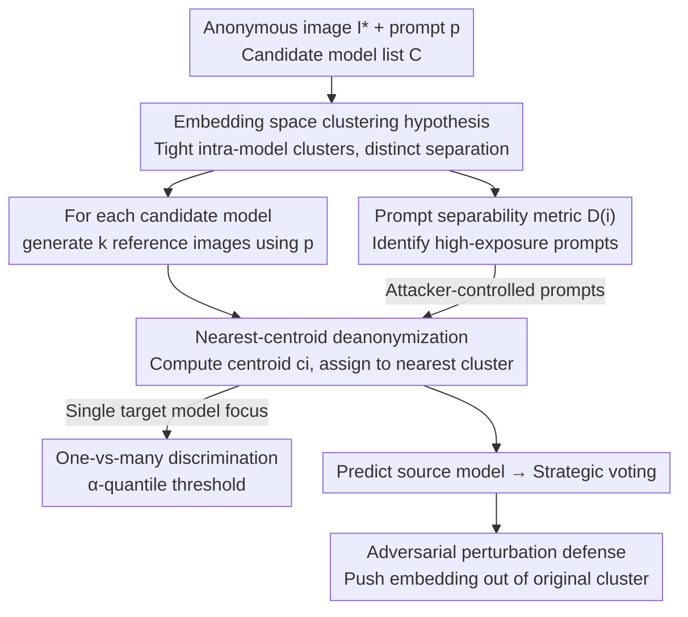

# When Anonymity Breaks: Identifying Models Behind Text-to-Image Leaderboards

**Conference**: CVPR 2026  
**Area**: Image Generation / AI Security  
**Keywords**: Text-to-Image, Leaderboard Deanonymization, Model Fingerprinting, Embedding Clustering, Voting-based Evaluation Security

## TL;DR
Authors discover that different Text-to-Image (T2I) models generate images for the same prompt that form tight, distinct clusters in image embedding spaces. Applying a **zero-training, black-box, nearest-centroid classification** method across 22 models and 280 prompts (150k images), they identify the "anonymous" source model with 91% top-1 accuracy, undermining the anonymity assumption essential for fair voting-based T2I leaderboards.

## Background & Motivation

**Background**: As T2I models proliferate, quality comparison becomes essential. Leaderboards are categorized into two types: benchmark-based using fixed test sets for automated metrics, and voting-based where users choose the better of two **anonymous** generated images. Since automated metrics like FID correlate poorly with human preference, voting-based leaderboards (e.g., Artificial Analysis, various Arenas) have become the mainstream paradigm for T2I evaluation.

**Limitations of Prior Work**: The fairness of voting-based leaderboards **rests entirely on the assumption of model anonymity**—users should not know which model produced which image to prevent strategic voting (upscoring own models or downscoring competitors). While deanonymization attacks on text (LLM) leaderboards exist, the robustness of anonymity in T2I scenarios has not been systematically investigated.

**Key Challenge**: Different models, due to varied training data, architectures, and parameter scales, leave **systematic stylistic/compositional/detailed signatures** for the same prompt. Meanwhile, even with different random seeds, a single model’s outputs are **strikingly consistent** (low intra-model variance). Consequently, the model identity that anonymity seeks to hide is actually deeply imprinted in the visual features of every image, detectable if the right representation space is used.

**Goal**: (1) Demonstrate that T2I leaderboard deanonymization is **significantly easier** than text-based equivalents, even when the attacker cannot control prompts and only has black-box API access; (2) Quantify "which prompts are more likely to expose model identity"; (3) Investigate feasible defenses.

**Key Insight**: The authors hypothesize that in a semantically meaningful image embedding space, inter-model variance **overwhelms** intra-model variance, causing outputs from each model to naturally form tight, well-separated clusters. Modern image encoders (CLIP/ViT-bigG) effectively capture these stylistic and semantic nuances.

**Core Idea**: No training, watermarking, or ground-truth data is required—simply generate a few reference images for each candidate model using the same prompt, compute the embedding centroids, and assign the anonymous image to the **nearest centroid**.

## Method

### Overall Architecture

The attacker faces a scenario where the leaderboard presents a pair of anonymous generated images $A, B$ and a prompt $p$. The **candidate model list** $\mathcal{C}=\{M_1,\dots,M_n\}$ is known (publicly listed by the leaderboard), and the attacker has black-box API access to these models. The attack process: upon receiving a prompt, generate $k$ reference images for each candidate model, map all images into an embedding space using a shared image encoder $\varphi(\cdot)$, compute centroids for each model, and assign the anonymous image $I^*$ to the model with the **nearest centroid**. This process requires no training, only a few inference-time API calls.

### Key Designs

**1. Embedding Space Clustering Hypothesis: Mapping "Hidden Identity" to Geometric Separability**

This is the physical basis of the attack. Model differences are split into: intra-model variation (variance between different seeds for the same prompt and model) and inter-model variation (variance between different models for the same prompt). Empirically, inter-model variance is **much larger** than intra-model variance. For instance, FLUX.1-dev produces consistent styles across five seeds, while FLUX, SDXL Turbo, and Playground v2 produce visibly different interpretations of the same prompt. This asymmetry implies that in a suitable representation space, generations from each model form **tight and mutually separated clusters**. Modern image encoders (ViT trained on CLIP/LAION) capture stylistic, compositional, and textural differences not specified by the prompt, making the cluster structures apparent.

**2. Nearest-Centroid Deanonymization: Zero-training, Black-box Identification**

To address real-world constraints (no large-scale classifiers, no truth data), authors use nearest-centroid classification. Formally: for each model $M_i$, generate $k$ reference images $I_{i,1},\dots,I_{i,k}$ using prompt $p$. Compute the centroid after encoding:

$$c_i = \frac{1}{k}\sum_{j=1}^{k}\varphi(I_{i,j}).$$

Given the leaderboard image embedding $e^* = \varphi(I^*)$, the source is predicted as the nearest centroid:

$$\hat{M} = \arg\min_{M_i \in \mathcal{C}} \lVert e^* - c_i \rVert_2.$$

This leverages the "low intra-model variance + high inter-model separation" hypothesis. The strength lies in the **extremely low barrier to entry**: no training or prompt control needed; even $k=1$ yields 62% accuracy.

**3. One-Vs-Many Discrimination: Identifying "Is this my model?"**

Attackers may only care if an image originates from their target model $M^*$ (e.g., to boost their own or downvote others), rather than a full 22-way classification. Two variants are provided: Case 1 (All models accessible): Reuse the centroid method; if the nearest centroid is $M^*$, classify as $M^*$. Case 2 (**Only target model accessible**): The attacker only generates $k$ reference images for $M^*$, computes centroid $c$, and sets a threshold using the $\alpha$-quantile of intra-cluster distances:

$$\lambda_\alpha = \text{quantile}_\alpha\big(\lVert x_i - c \rVert_2\big),$$

Test embedding $z$ is classified as $M^*$ if $\lVert z-c\rVert_2 \le \lambda_\alpha$. This shows that model signatures are strong enough for "self-authentication" without needing data from competitors.

**4. Prompt Separability Metric $D(i)$: Quantifying Exposure**

Not all prompts are equally revealing. Authors define a prompt-level separability score. First, at the model level: for prompt $p_i$ and model $M_j$, find the nearest neighbor of each embedding $e^{(\ell)}_{i,j}$ within the joint set of all models' embeddings for that prompt. If the neighbor belongs to $M_j$, it is "correctly clustered":

$$\text{frac}(i,j) = \frac{1}{k}\sum_{\ell=1}^{k}\mathbb{I}\big[\text{NN}(e^{(\ell)}_{i,j}) \in M_j\big].$$

If $\text{frac}(i,j) > \tau$, $(p_i, M_j)$ is considered separable. The prompt-level score is the proportion of models that form separable clusters:

$$D(i) = \frac{1}{|\mathcal{C}|}\sum_{M_j \in \mathcal{C}} \mathbb{I}\big[\text{frac}(i,j) > \tau\big].$$

High $D(i)$ indicates inter-model variance dominates. Attackers can choose prompts where $D(i)=1$ to reach 100% deanonymization, while defenders can use it to filter high-exposure prompts.

**5. Adversarial Perturbation Defense: Pushing Embeddings Out of Clusters**

As a countermeasure, authors investigate adding imperceptible perturbations to shift the embedding away from the source model's cluster toward others. Since defenders cannot directly modify embeddings (only pixels) and don't know the attacker's encoder (black-box), they use a contrastive loss: pulling the image toward the "farthest other model's generations" (positives) and pushing it away from its original embedding (negative). An ensemble of local encoders is used for transferability. While this reduces attack accuracy, it incurs a trade-off with image quality and is **not fully effective** (at $\epsilon=2$, top-1 accuracy remains at 75%).

## Key Experimental Results

### Main Results

Experiments used 22 SOTA T2I models from 8 companies. 280 prompts were collected from Artificial Analysis, generating 30 images per model per prompt ($280 \times 22 \times 30 = 184,800$ total images). Encoder: ViT trained on LAION.

| Category | Method | Top-1 (%) | Top-2 (%) | Top-3 (%) |
|------|------|-----------|-----------|-----------|
| Inference-time fingerprint | Marra et al. (Noise Residual) | 24.40 | 31.20 | 36.50 |
| Inference-time fingerprint | Dzanic et al. (Freq. Domain) | 11.79 | 21.57 | 28.43 |
| Supervised Classifier | Image (ResNet-50 pixel) | 54.86 | 67.00 | 72.86 |
| Supervised Classifier | Image Embedding (MLP) | 43.00 | 55.86 | 63.36 |
| Supervised Classifier | Image + Text Embedding | 42.50 | 57.71 | 65.50 |
| **Inference-time Embedding (Ours)** | **Embedding-1 (Ours)** | **90.86** | **96.14** | **97.50** |

Ours significantly outperforms all baselines with 91% top-1 accuracy in a black-box setting. Traditional fingerprints fail, and supervised classifiers generalize poorly to unseen prompts.

### One-vs-Many and Restricted Access

| Setting | Metric | Result |
|------|------|------|
| Case 1 (All models accessible) | top-1 | 99.16% |
| Case 2 ($\alpha=0.80$, only target model) | Accuracy / AUC | 0.926 / 0.928 |
| Case 2 ($\alpha=0.95$) | Accuracy / AUC | 0.841 / 0.916 |

Case 2 shows that even without knowledge of other models, model signatures are strong enough for reliable identification (AUC 0.92+).

### Ablation Study

| Configuration | Key Metric | Description |
|------|---------|------|
| $k=30$ | top-1 91% | Main setting |
| $k=10$ | ≈ Same as 30 | 10 images suffice; reduces cost |
| $k=1$ | ≈ 62% | Still far above random (1/22 ≈ 4.55%) |
| Candidate Pool 5/10/15 | 96.64 / 95.07 / 93.86% | Accuracy decreases slightly with more models |
| Defense $\epsilon=2$ | top-1 0.90 → 0.75 | Small perturbation, limited reduction |
| Defense $\epsilon=8$ | top-1 0.90 → 0.46 | Large perturbation, quality loss |

### Key Findings
- **Signatures are extremely cheap**: 10 reference images are enough to reach peak accuracy. De-anonymizing one image costs roughly \$5.40 at current API prices, a negligible cost for organized adversaries.
- **Prompt separability predicts success**: Deanonymization success correlates with $D(i)$. If an attacker can submit prompts, choosing high $D(i)$ leads to 100% success.
- **Supervised training is counter-intuitive**: Large supervised models perform worse because model signatures are stylistic/low-dimensional; zero-shot centroid methods capture them better without overfitting.
- **Defenses involve trade-offs**: Perturbations can lower accuracy but are susceptible to denoising and degrade visual quality.

## Highlights & Insights
- **Novelty**: Reduces a security concern to a geometric observation—leaderboards rely on anonymity, but model identities are naturally clustered in embedding spaces, allowing simple nearest-centroid methods to succeed.
- **Experimental Thoroughness**: Systematic evaluation across 22 models, 150k+ images, and various threat models (from restricted access to prompt control).
- **Value**: Directly challenges the fairness of current T2I evaluation paradigms. $D(i)$ provides a reusable metric for measuring exposure in any generative model attribution context.

## Limitations & Future Work
- **Dependency on Reproducibility**: The attack requires generating reference images. If leaderboards use private post-processing or models not publicly accessible, accuracy may drop.
- **Encoder Dependency**: The attack's strength depends on the quality of the image encoder. Leaderboards could use obscure encoders to mitigate the attack.
- **Defense Limitations**: Adversarial post-processing degrades quality and is not fully robust. Future work should explore semantic-preserving normalization.

## Related Work & Insights
- **vs LLM Leaderboard Deanonymization**: While text deanonymization relies on stylistic or strategic cues, T2I deanonymization is easier due to high-dimensional, persistent visual signatures.
- **vs Traditional Fingerprinting**: GAN-era fingerprints (noise/frequency) fail on modern T2I models (~12–24% top-1).
- **vs Training-time Watermarking**: Watermarking requires model access and impacts performance; the proposed method is a purely black-box post-hoc attribution.

## Rating
- Novelty: ⭐⭐⭐⭐⭐ 
- Experimental Thoroughness: ⭐⭐⭐⭐⭐ 
- Writing Quality: ⭐⭐⭐⭐ 
- Value: ⭐⭐⭐⭐⭐ 

<!-- RELATED:START -->

## Related Papers

- [\[CVPR 2026\] When Pretty Isn't Useful: Investigating Why Modern Text-to-Image Models Fail as Reliable Training Data Generators](when_pretty_isnt_useful_investigating_why_modern_text-to-image_models_fail_as_re.md)
- [\[CVPR 2026\] Selectively Extracting and Injecting Visual Attributes into Text-to-Image Models](selectively_extracting_and_injecting_visual_attributes_into_text-to-image_models.md)
- [\[CVPR 2026\] When Safety Collides: Resolving Multi-Category Harmful Conflicts in Text-to-Image Diffusion via Adaptive Safety Guidance](when_safety_collides_resolving_multi-category_harmful_conflicts_in_text-to-image.md)
- [\[CVPR 2026\] The Drift Kernel: Why Diffusion Models Change Even When Told Not To](the_drift_kernel_why_diffusion_models_change_even_when_told_not_to.md)
- [\[CVPR 2026\] CSF: Black-box Fingerprinting via Compositional Semantics for Text-to-Image Models](csf_black-box_fingerprinting_via_compositional_semantics_for_text-to-image_model.md)

<!-- RELATED:END -->
