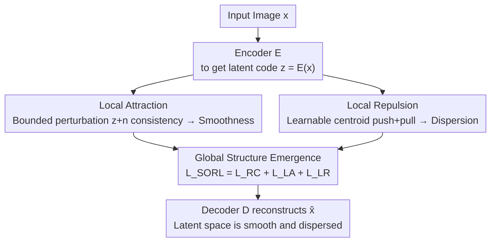

# When Local Rules Create Global Order: Self-Organized Representation Learning for Latent Diffusion Models

**Conference**: CVPR 2026  
**Paper**: [CVF Open Access](https://openaccess.thecvf.com/content/CVPR2026/html/Lian_When_Local_Rules_Create_Global_Order_Self-Organized_Representation_Learning_for_CVPR_2026_paper.html)  
**Code**: To be confirmed  
**Area**: Diffusion Models / Representation Learning  
**Keywords**: Latent Diffusion Models, Self-Organization, Representation Learning, Local Attraction and Repulsion, VAE Latent Space

## TL;DR
This paper points out that the quality of Latent Diffusion Models (LDM) depends on whether the VAE latent space simultaneously satisfies "local smoothness" and "global dispersion." It proposes SORL—a bottom-up training paradigm that utilizes two simple local rules, "local attraction" and "local repulsion," to allow these two global structures to emerge spontaneously, thereby simultaneously improving reconstruction fidelity and generation diversity.

## Background & Motivation

**Background**: LDMs first use an autoencoder (usually a VAE) to compress images into a compact latent space, then run diffusion in this latent space for generation. The geometric structure of this latent space determines both reconstruction fidelity and generation quality. Consequently, significant recent work has focused on "organizing" this space: using KL divergence with Gaussian priors, equivariant constraints (EQ-VAE) to force geometric consistency between image and latent transformations, or pre-trained vision encoders (like DINO) for semantic alignment (VA-VAE).

**Limitations of Prior Work**: Most existing methods focus on making the latent space "smooth." However, experimental measurements using Perceptual Path Length (PPL) and Interpolation Interquartile Range (IQR) reveal that while VAE, RV-VAE, and VA-VAE achieve interpolation smoothness, their IQRs are small. This implies that most latent codes are squeezed into a few narrow, high-density regions. "Smoothness" is only local, and the cost is that large volumes of the latent space remain idle. Sharper evidence shows that the better these models reconstruct in-distribution (ID) data, the more their performance drops on out-of-distribution (OOD) data (Fig. 2), indicating they learn "locally specialized" rather than "globally generalizable" representations.

**Key Challenge**: A long-standing optimization dilemma exists between reconstruction and generation—stronger smoothing/regularization (e.g., larger $\beta$ in $\beta$-VAE) improves reconstruction and generation stability but compresses diverse inputs into compact regions, weakening generation diversity. Conversely, weak regularization preserves details but results in irregular latent spaces that are difficult to sample. The fundamental problem is that current methods only optimize the "smoothness" dimension while ignoring "dispersion."

**Goal**: To find a mechanism that makes the latent space **both locally smooth and globally dispersed**, thereby supporting high-fidelity reconstruction and diverse generation simultaneously.

**Key Insight**: Instead of adding external constraints (Gaussian priors and pre-trained encoders are "top-down" external rules), the authors draw inspiration from **self-organization** in complex systems. Self-Organizing Maps (SOM) demonstrate that global ordered structures can spontaneously emerge from simple local interactions without centralized top-down design. The authors reinterpret the latent space of deep generative models as a self-organizing system.

**Core Idea**: Instead of directly imposing global attributes of "smoothness" and "dispersion," the authors design two complementary local rules: **local attraction** causes neighboring latent codes to produce consistent reconstructions (smoothness emerges from this), and **local repulsion** prevents latent codes from collapsing into dense clusters (dispersion emerges from this). Global structure is naturally generated during training as the cumulative effect of numerous local interactions.

## Method

### Overall Architecture
SORL (Self-Organized Representation Learning) is an "internal force field" added to the VAE training objective. Given an image $x$, the encoder $E$ maps it to a latent code $z=E(x)$, and the decoder $D$ reconstructs $\hat{x}=D(z)$. SORL does not change the network architecture; instead, it leaves the evolution of the latent space to three local interaction principles—**Autonomy**, **Horizontality**, and **Global Structure**—corresponding to two optimizable objectives and one emergent result. Autonomy uses "local attraction" to ensure reconstruction fidelity and local smoothness; Horizontality uses "local repulsion" to push apart crowded latent codes and ensure global dispersion. These two conflict during training, ultimately allowing a latent manifold that is both smooth and dispersed to "emerge." The overall training objective is the sum of three terms: $L_\text{SORL}=L_\text{RC}+L_\text{LA}+L_\text{LR}$.

### Key Designs

**1. Local Attraction: Reconstruction self-adjustment under bounded perturbation, allowing smoothness to emerge "on-site"**

The pain point is that reconstruction consistency alone brings some smoothness, but relying solely on it leads to weak continuity, aliasing, or texture sticking. SORL's "Autonomy" principle asserts that the movement of each latent code is primarily determined by its own reconstruction needs. Specifically, a **bounded** uniform noise $n\sim U(-c,c)$ (satisfying $\|n\|_\infty\le c$) is added to the latent code, requiring that the original image can still be reconstructed after perturbation:

$$L_\text{LA}=\mathbb{E}_{n\sim U(-c,c)}\big[\|x-D(z+n)\|_2^2\big]$$

The key here is not "adding noise for data augmentation," but the **strict boundary $c$**: it forces the formation of structure to come entirely from local interactions—only requiring the latent code to maintain reconstruction consistency within its own small neighborhood without matching any global prior. The authors point out that this "strictly local" regularization avoids posterior collapse. In other words, smoothness is not "pressed out" by an external Gaussian prior, but is a byproduct of each latent code maintaining the stability of its own small neighborhood.

**2. Local Repulsion: A "push-pull" mechanism with learnable centroids, allowing dispersion to spread "bottom-up"**

Smoothness alone is insufficient—a smooth but globally compact latent space has limited expressiveness and poor generation diversity. The "Horizontality" principle introduces a repulsion mechanism to push latent codes away from crowded areas. SORL maintains a set of $K$ **learnable centroids** $C=\{\hat{z}_1,\dots,\hat{z}_K\}$ in the latent space. Each latent code $z_t=E(x_t)$ is assigned to the nearest centroid $\hat{z}_{c_t}$ ($c_t=\arg\min_k\|z_t-\hat{z}_k\|_2^2$), which are updated using a moving average to ensure training stability. The local repulsion loss consists of two parts:

$$L_\text{LR}=L_\text{push}+\lambda_\text{pull}L_\text{pull}=\Big(-\min_{i\ne j}\|\hat{z}_i-\hat{z}_j\|_2^2\Big)+\lambda_\text{pull}\,\mathbb{E}_{z_k\sim Z}\|z_t-\hat{z}_{c_t}\|_2^2$$

Where **Centroid Push** ($L_\text{push}$) maximizes the minimum pairwise distance between centroids—spreading these "structural anchors" as much as possible; **Assignment Pull** ($L_\text{pull}$) minimizes the distance between each latent code and its assigned centroid—forcing the encoder to follow this spread-out structure. These two forces work together: push makes the skeleton occupy the entire latent space, while pull makes the real latent codes adhere to this skeleton. Thus, "filling the latent space capacity globally" emerges from local assignment-repulsion interactions without any global dispersion constraints. The authors provide a convergence Remark: under these rules, the system converges to a uniform stable configuration where the minimum spacing of all centroids is equal ($d_i=d_j$).

**3. Global Structure Emergence: Antagonistic local rules converge into a smooth and dispersed manifold**

The third principle, "Global Structure," is not a new loss itself but the result of the first two rules working together. It is included in the total objective: $L_\text{SORL}=L_\text{RC}+L_\text{LA}+L_\text{LR}$, where the reconstruction consistency term $L_\text{RC}=L_\text{mse}+L_\text{perc}+\lambda_\text{adv}L_\text{adv}$ (MSE + Perceptual Loss + Adversarial Loss). The key insight is that local attraction (causing codes to cohere) and local repulsion (causing codes to disperse) are **antagonistic** forces. Using either alone results in imbalance (attraction-only has poor diversity; repulsion-only has poor fidelity), but their superposition reaches a dynamic equilibrium in the latent space, spontaneously forming a latent manifold that is both locally smooth and globally dispersed. This entire process is "autonomous" (no external prior needed), "horizontal" (dynamics from local interactions), and "convergent" (local interactions lead to a stable global structure), which is the core value of treating the latent space as a self-organizing system.

### Loss & Training
The total objective is $L_\text{SORL}=L_\text{RC}+L_\text{LA}+L_\text{LR}$. All models compress $256\times256$ images into $64\times64$ latent representations (downsampling factor $f=4$). Optimizer: AdamW ($\beta_1=0.9, \beta_2=0.95$), base learning rate $2\times10^{-6}$, $\lambda_\text{adv}=0.8$; ablation shows $\lambda_\text{pull}=10^{-2}$ is optimal, and the number of centroids $K$ is stable between 8,192 and 16,384. Reconstruction training: 80 epochs on ADE20K/CelebA-HQ, 40 epochs on FFHQ, 20 epochs on LSUN-Churches; generation training: 200 epochs; 8×RTX 3090.

## Key Experimental Results

### Main Results

Reconstruction quality (Selection of CelebA-HQ / FFHQ):

| Dataset | Metric | VAE | RV-VAE | EQ-VAE | VA-VAE | Ours |
|--------|------|------|--------|--------|--------|------|
| CelebA-HQ | PSNR↑ | 28.40 | 29.74 | 29.57 | 28.28 | **31.51** |
| CelebA-HQ | SSIM↑ | 0.80 | 0.85 | 0.84 | 0.80 | **0.89** |
| CelebA-HQ | LPIPS↓ | 0.081 | 0.058 | 0.065 | 0.110 | **0.049** |
| FFHQ | PSNR↑ | 28.95 | 28.63 | 28.89 | 27.20 | **29.70** |
| FFHQ | LPIPS↓ | 0.058 | 0.051 | 0.057 | 0.105 | **0.042** |

Unconditional generation on CelebA-HQ (FID / IS / Precision / Recall):

| Method | FID↓ | IS↑ | Prec.↑ | Recall↑ |
|------|------|------|--------|---------|
| VAE | 13.02 | 3.30 | 0.33 | 0.63 |
| RV-VAE | 16.21 | 3.19 | 0.22 | 0.62 |
| EQ-VAE | 15.80 | 3.20 | 0.21 | 0.64 |
| VA-VAE | 53.15 | 3.18 | 0.22 | 0.38 |
| **Ours** | **9.74** | **3.34** | **0.47** | **0.65** |

On CelebA-HQ, PSNR is more than 3 dB higher than the VAE baseline, and FID dropped from 13.02 to 9.74, while IS, Precision, and Recall are optimal—indicating that a well-conditioned latent manifold not only improves reconstruction but also directly enhances generation diversity and fidelity.

### Key Findings
- **Two rules are indispensable**: Adding $L_\text{LA}$ alone compresses the manifold too much, leading to poor diversity (Recall 0.41); adding $L_\text{LR}$ alone pushes IS to 4.28 but the manifold becomes irregular, with FID collapsing to 98.82. Only joint optimization cuts FID from 80.02 to 23.55 while doubling Precision/Recall—proving that "smoothness" and "dispersion" are antagonistic objectives that must be satisfied simultaneously.
- **Centroid count $K$ is robust**: FID remains stable between 23-25 for $K$ in the 8,192–16,384 range; a value too small (1,024, FID 28.86) limits dispersion, while larger values yield diminishing returns.
- **Pull weight $\lambda_\text{pull}$ is sensitive**: $10^{-2}$ is optimal (FID 23.55); being too large (=1, FID 45.97) pulls latent codes too tightly, dropping Recall to 0.37.
- **Scalability**: Running SiT-XL/2 on ImageNet for 100K steps (iREPA protocol), Ours achieves reconstruction PSNR 26.43 and generation FID 15.12, both better than SiT-XL (FID 19.06) and +iREPA (FID 16.96), showing preliminary large-scale scalability.

### Ablation Study

| Configuration | FID↓ | IS↑ | Prec.↑ | Recall↑ | Description |
|------|------|------|--------|---------|------|
| Baseline ($L_\text{RC}$) | 80.02 | 3.13 | 0.21 | 0.19 | Reconstruction consistency only |
| + $L_\text{LA}$ | 45.54 | 3.19 | 0.42 | 0.41 | Local attraction: fidelity up, diversity limited |
| + $L_\text{LR}$ | 98.82 | 4.28 | 0.29 | 0.36 | Local repulsion: high IS but FID collapsed |
| + $L_\text{LA}$ & $L_\text{LR}$ (Ours) | **23.55** | 3.23 | **0.52** | **0.54** | Antagonism achieved best balance |

## Highlights & Insights
- **"Bottom-up emergence" instead of "top-down imposition"**: The most impressive aspect is that the authors do not write direct global losses for "smoothness" and "dispersion" but instead design two local rules to let them emerge. Formalizing self-organization principles from complex systems (Autonomy/Horizontality/Global Structure) into optimizable objectives is a novel approach.
- **Diagnosis is more convincing than the method**: Fig. 1 and Fig. 2 use PPL+IQR to reveal that "smoothness $\neq$ good latent space" and ID vs. OOD reconstruction gaps to reveal "local specialization." This directly refutes the common assumption in the field that "good reconstruction is enough"—this ID/OOD comparison experiment is itself a reusable diagnostic tool.
- **Push-pull mechanism for learnable centroids is transferable**: The design of using a set of learnable centroids as a "skeleton," with push to spread the skeleton and pull to align codes to it, is essentially a lightweight global structure regularization. It can be transferred to any representation learning/contrastive learning task that needs to "fill representation space and prevent collapse."

## Limitations & Future Work
- The authors admit that SORL primarily shapes **geometric** organization and does not explicitly model factors at the **semantic** level; interpretability may be limited in complex scenes. Extending these local rules into text-guided diffusion is a clear future direction.
- Self-identified limitations: Generation experiments were mainly performed on relatively single-domain datasets like CelebA-HQ (faces); the ImageNet experiment is only a "preliminary" 100K-step trial. Evidence for stability in large-scale class-conditional/text-to-image settings is not yet exhaustive.
- Introducing $K$ learnable centroids and nearest-neighbor assignment brings additional training overhead and a new hyperparameter $K$. While the authors state $K$ is robust, details on whether $\lambda_\text{pull}$ needs readjustment across datasets or the impact of centroid moving average updates on stability are not extensively discussed.

## Related Work & Insights
- **vs EQ-VAE (Equivariant Regularization)**: EQ-VAE forces geometric consistency between image and latent transformations to ensure local smoothness, which is a "top-down" external constraint. Ours uses only local reconstruction consistency (bounded perturbation) for smoothness and adds the "dispersion" dimension missing in EQ-VAE, resulting in better OOD/cross-resolution generalization.
- **vs VA-VAE (Semantic Alignment)**: VA-VAE aligns the latent space with semantic priors from pre-trained vision encoders (DINO, etc.). Ours argues that fixed external priors limit the characterization of the intrinsic structure of continuous latent spaces, allowing structure to emerge instead from the local interactions of the data itself.
- **vs VAE / $\beta$-VAE (Gaussian Prior + KL)**: Traditional VAE uses KL to match the posterior to a fixed Gaussian prior, a typical top-down constraint that easily squeezes diverse inputs into high-density regions. Ours removes the fixed global prior and uses "local repulsion" to dynamically spread out latent codes, alleviating the reconstruction-generation optimization dilemma.
- **vs Self-Organizing Maps (SOM)**: Classic SOM can only perform shallow clustering/visualization. Ours reinterprets the "local competition $\rightarrow$ global topology" principle of SOM within the latent space of deep generative models, representing a modern, differentiable revival of this classic idea.

## Rating
- Novelty: ⭐⭐⭐⭐⭐ Formalizing complex system self-organization into differentiable local rules is a fresh perspective with theoretical support.
- Experimental Thoroughness: ⭐⭐⭐⭐ Reconstruction on four datasets + generation + cross-domain + cross-resolution + multiple ablations is solid, though large-scale/class-conditional generation is preliminary.
- Writing Quality: ⭐⭐⭐⭐⭐ Diagnostic motivation (PPL/IQR, ID vs. OOD) progresses logically, and the method maps perfectly to the principles.
- Value: ⭐⭐⭐⭐ Provides a plug-and-play new paradigm for "how to train a better LDM latent space" that is transferable to representation learning.

<!-- RELATED:START -->

## Related Papers

- [\[CVPR 2026\] MPDiT: Multi-Patch Global-to-Local Transformer Architecture for Efficient Flow Matching](mpdit_multi-patch_global-to-local_transformer_architecture_for_efficient_flow_ma.md)
- [\[CVPR 2026\] SRA 2: Variational Autoencoder Self-Representation Alignment for Efficient Diffusion Training](sra_2_variational_autoencoder_self-representation_alignment_for_efficient_diffus.md)
- [\[ICLR 2026\] When One Modality Rules Them All: Backdoor Modality Collapse in Multimodal Diffusion Models](../../ICLR2026/image_generation/when_one_modality_rules_them_all_backdoor_modality_collapse_in_multimodal_diffus.md)
- [\[CVPR 2026\] Self-Corrected Image Generation with Explainable Latent Rewards](self-corrected_image_generation_with_explainable_latent_rewards.md)
- [\[CVPR 2026\] 2ndMatch: Finetuning Pruned Diffusion Models via Second-Order Jacobian Matching](2ndmatch_finetuning_pruned_diffusion_models_via_second-order_jacobian_matching.md)

<!-- RELATED:END -->
