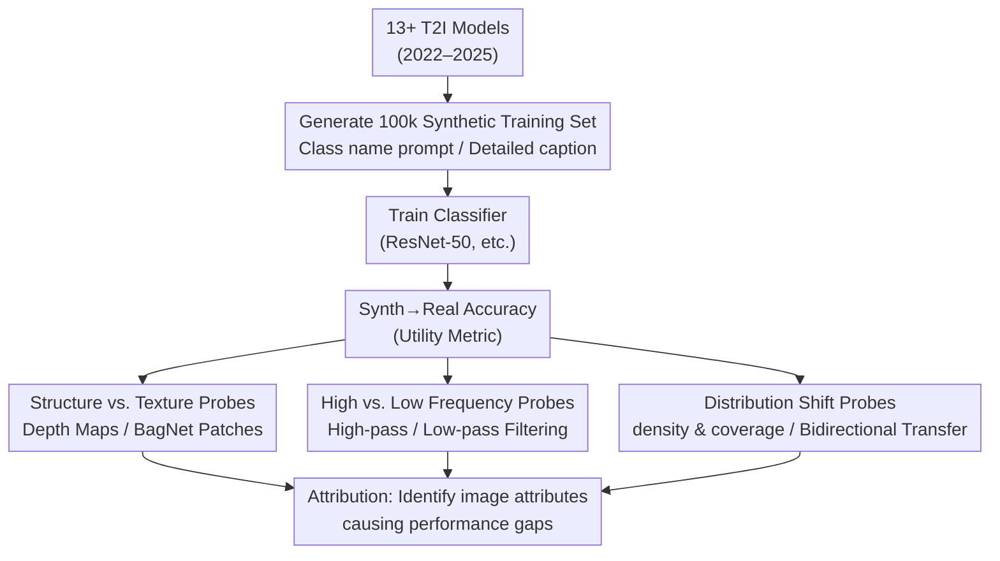

# When Pretty Isn't Useful: Investigating Why Modern Text-to-Image Models Fail as Reliable Training Data Generators

**Conference**: CVPR 2026  
**Paper**: [CVF Open Access](https://openaccess.thecvf.com/content/CVPR2026/html/Adamkiewicz_When_Pretty_Isnt_Useful_Investigating_Why_Modern_Text-to-Image_Models_Fail_CVPR_2026_paper.html)  
**Code**: TBD  
**Area**: Image Generation / Synthetic Data  
**Keywords**: Text-to-Image, Synthetic Training Data, Distribution Collapse, Spectral Analysis, density-coverage

## TL;DR
The authors evaluate over ten open-source T2I diffusion models released between 2022 and 2025 as "synthetic training data generators." By training classifiers on synthetic images and evaluating them on real test sets, they discover a counter-intuitive trend: newer models with better visual quality and prompt following produce less useful data. The Synth→Real accuracy has consistently declined over time because newer models collapse the distribution onto a narrow "aesthetic center" manifold, losing texture and high-frequency details while sacrificing diversity.

## Background & Motivation
**Background**: The quality, quantity, and distribution of data are fundamental determinants of generalization in deep learning. However, collecting, labeling, and debiasing real data is increasingly expensive, posing a bottleneck in privacy-sensitive, sample-scarce, or strong domain-shift scenarios. Consequently, using T2I diffusion models to generate bulk synthetic data as a replacement for real data has become an attractive direction. Prior works have reported that training on purely synthetic data can approach or even match real-data performance in tasks like classification, detection, contrastive learning, and pose estimation.

**Limitations of Prior Work**: These optimistic conclusions are almost entirely based on **early** diffusion models (e.g., SD1.5, SD2.1). The T2I field has advanced rapidly over the past few years—larger networks, internet-scale data, higher-resolution latent spaces, and stronger text conditioning. What these advancements mean for "synthetic data quality" has remained largely uninvestigated.

**Key Challenge**: The industry assumes an intuitive chain: **Visual Fidelity ↑ ⟹ Data Utility ↑**. Since newer models produce sharper, more realistic, and more obedient images, the training data they generate should theoretically be better. This paper questions this assumption: **Does progress in generative realism equate to progress in data realism?**

**Goal**: This study aims to (1) quantify whether T2I progress translates into better synthetic training data over time; (2) if not, identify which image attributes (texture, structure, spectrum, or distribution) are responsible for the degradation.

**Key Insight**: The authors distinguish between **sample realism** (whether a single image looks real) and **distribution realism** (whether the entire dataset covers the real distribution). While human eyes and standard generative metrics focus on the former, classifier generalization relies on the latter. This gap is the core explanatory thread of the paper.

**Core Idea**: Instead of proposing a new model, the authors conduct a **large-scale longitudinal empirical benchmark and controlled probing experiments**. They use "train on synthetic, test on real" transfer accuracy as the sole metric for "utility." Three sets of probes—structure/texture, high/low-frequency filtering, and density-coverage—are used to attribute performance differences to specific image attributes.

## Method
This is an analytical and empirical study that does not propose a new model. The "Method" refers to the **research design** and **attribution analysis framework**. The overall logic is to first plot the trend of "T2I progress vs. synthetic data utility" using a clean ImageNet subset (revealing an inverse correlation) and then decompose the causes using three sets of controlled transformations.

### Overall Architecture
The core experimental paradigm is consistent: for each T2I model, generate a synthetic training set of 100,000 images → train a standard classifier (ResNet-50) from scratch → evaluate accuracy on the **real** ImageNet-1k validation set. This Synth→Real accuracy serves as the utility score. The baseline is a classifier trained on real data (0.73 for ResNet-50).

Building on this, the authors apply three attribution probes. The strategy is "subtractive": by removing or amplifying specific information (texture/high-frequency/etc.) and observing whether the Synth→Real gap narrows or widens, the authors identify the "pathology" of synthetic data.

### Key Designs

**1. Longitudinal Utility Benchmark: Quantifying "Utility" via Synth→Real Transfer**

The most critical design is a clean experimental setup. The authors selected thirteen open-source T2I models (fourteen including distillation variants), ranging from SD1.5 (2022) to Qwen-Image and Lumina 2.0 (2025), including SDXL, SD3.5, Sana, FLUX, and their turbo/schnell versions. To control costs, the task is a 200-class subset of ImageNet-1k with 500 images per class (100k total). Generation uses CFG=2.0, 50 denoising steps (4 for turbo), and downsampling to $256\times256$. Classifiers are trained for 80 epochs using Adam and cosine annealing, with the checkpoint achieving the lowest loss on a same-domain validation set selected for evaluation on real data.

By fixing the pipeline, the only variable is the T2I model itself. The results (Figure 1) show that when using class names as prompts, Synth→Real accuracy **monotonically declines** with model release time, widening the gap with the 0.73 real-data baseline.

**2. Pitting Generative Quality Against Utility: Trade-off between Prompt-Following and Data Quality**

The authors correlate these findings with common alignment and quality metrics. Each model is scored using GenEval (fine-grained colors, positions, counts) and CLIPScore (overall CLIP space alignment). Plots against Synth→Real accuracy (Figure 3) reveal a striking **inverse correlation**: models with higher GenEval/CLIPScore are worse as training data generators. This suggests that "better prompt following" and "useful data generation" are **at odds** in class-name prompt scenarios. This holds across ResNet-50, ViT-Ti, ConvNeXt-Ti, and Swin-Ti architectures.

**3. Structure/Texture and High/Low Frequency Probes: Attributing Gaps to Image Attributes**

To explain "why it got worse," two sets of "information ablation" probes are used. **Structure vs. Texture**: training a structure-only ResNet-50 (input: depth maps from Depth Anything V2) and a texture-only BagNet (receptive field limited to $9\times9$ patches). If texture is the issue, the Synth→Real gap should narrow in the structure space. **High vs. Low Frequency**: Natural images follow a power law $S(f)\propto f^{-\alpha}$. Diffusion models often deviate in high frequencies. Models are evaluated on high-pass ($f\le 0.2\,f_N$) and low-pass ($f\ge 0.8\,f_N$) filtered images, where $f_N$ is the Nyquist frequency.

Both probes indicate that **structure and low frequencies are faithfully preserved, while texture and high frequencies are systematically corrupted**—a trend that worsens in newer "better" models. Detailed captions improve structure and low frequencies but cannot save texture and high frequencies, suggesting that high-frequency defects are **decoupled** from text input.

**4. density-coverage + Bidirectional Transfer: Diagnosing Distribution Collapse**

The third probe targets the "distribution." The authors use density (number of generated samples in real-image neighborhoods) and coverage (proportion of real images with at least one generated sample nearby) from CLIP-ViT-L features. **High density + low coverage** indicate manifold collapse into aesthetic modes; **low density and coverage** indicate domain shift.

A **bidirectional transfer control**—Real→Synth (train real, test synth) vs. Synth→Real—is also used. Results show strong asymmetry: models trained on real data classify synthetic images easily (high Real→Synth), but those trained on synthetic data fail on real data (low Synth→Real). This confirms that while **sample realism is maintained, distribution realism has collapsed**: the synthetic dataset forms overly separable, narrow clusters that fail to capture the complex decision boundaries of real data.

## Key Experimental Results

### Main Results: T2I Progress vs. Synthetic Data Utility (Class-name prompts)

| Setting | Synth→Real Accuracy (Trend) | Real Data Baseline |
|------|---------------------------|--------------|
| ResNet-50, Early Models (SD1.5 era) | Higher | 0.73 |
| ResNet-50, Recent Models (FLUX / Qwen-Image / Lumina) | **Continuous decline over time** | 0.73 |
| ViT-Ti | Same downward trend | 0.42 |
| ConvNeXt-Ti | Same downward trend | 0.68 |
| Swin-Ti | Same downward trend | 0.50 |

> Key Point: Across four architectures, **models with higher GenEval / CLIPScore exhibit lower Synth→Real accuracy** (Figure 1, Figure 3), indicating an inverse correlation between "generative quality" and "utility."

### Ablation Study: Which Image Attributes are Responsible?

| Probing Dimension | Damage Level | Can detailed caption fix? |
|----------|----------|------------------------|
| Structure (Depth Maps) | Minimal damage, small gap | Yes, improves further |
| Texture (BagNet Patches) | **Significant damage**, large gap | Little to no improvement |
| Low Frequency (Low-pass) | Retained well, follows RGB | Yes, improves |
| High Frequency (High-pass) | **Significant damage**, large gap | Little to no improvement |
| Distribution (density/coverage) | High density, low coverage (collapse) | Increases coverage, decreases density |

### Key Findings
- **"Pretty" is inverse to "Useful"**: Models with higher visual fidelity and prompt following are poorer data generators. This inverse correlation is stable across different classifier architectures.
- **The pathology is Texture and High Frequency**: Synthetic images capture global composition but lose the fine-grained texture variations and high-frequency statistics critical for neural network generalization.
- **Prompt engineering treats the symptoms, not the cause**: Detailed captions improve structure and coverage, but texture/high-frequency degradation is decoupled from text input and remains unfixable via prompts.
- **Sample Realism ≠ Distribution Realism**: The asymmetry between Real→Synth and Synth→Real shows that single images look real, but the dataset collapses into narrow aesthetic modes that fail to cover the real distribution.

## Highlights & Insights
- **The "Subtractive" Attribution Paradigm**: Instead of defining complex metrics, the authors use the gap reduction/expansion after removing information to locate the pathology. The visualization showing "Structure above the diagonal, Texture below" clearly identifies texture as the culprit.
- **Decoupling Realism Concepts**: Sample realism vs. distribution realism. The generative community pursues the former via FID/GenEval, but this study quantifies the latter using density-coverage and bidirectional transfer, showing it is the true bottleneck for utility.
- **Practical Evaluation Advice**: Future T2I research should report density-coverage, spectral transfer, and "learnability" (train synth, test real) checks alongside perceptual quality. Utility should be treated as a first-class citizen.
- **Value of Counter-intuitive Conclusions**: The paper directly challenges the assumption that better generation leads to better data, alerting researchers who rely on synthetic data to reconsider their choice of generators.

## Limitations & Future Work
- **Limited Tasks and Scale**: Experiments are restricted to a 200-class subset of ImageNet-1k. Whether these trends hold for detection, segmentation, or larger datasets remains to be verified.
- **Focus on Open-Source Models**: The evaluation is limited to publicly available T2I models. While closed-source models might differ, their limited accessibility for massive inference makes them less practical for large-scale data synthesis.
- **Idealized Caption Upper Bound**: Detailed captions were generated using GPT-4.1-nano on **real images**, which is an upper bound. In pure synthetic scenarios where original images are unavailable, this fix is less feasible.
- **Diagnosis without a Cure**: The study identifies the pathology (texture/high-frequency loss, distribution collapse) but does not provide a fix. Future work could involve explicit rewards for diversity and natural spectral statistics during training.

## Related Work & Insights
- **vs. Early Optimistic Studies (Tian, Lomurno, Hammoud, etc.)**: Those works used SD1.5 or small-scale, low-resolution domains. This paper proves that the optimistic assumption **has not scaled with T2I progress**; the gap is widening.
- **vs. Geng et al. (Synthesis vs. Retrieval)**: Consistent with Geng et al.'s findings that synthetic data is inferior to real data, but adds that this gap is growing in newer SOTA models.
- **vs. Caption-in-Prompt (CiP)**: While CiP improves structure and coverage, this study reveals its ceiling—texture and high-frequency defects are decoupled from text and remain unaddressed.
- **vs. Data Distillation (GLaD, LD3M, D4M)**: These methods optimize for "utility." The authors expect similar diversity collapse issues in those fields and call for learnability-centric design and evaluation.

## Rating
- Novelty: ⭐⭐⭐⭐ Uses a clean longitudinal benchmark and three-probe attribution to derive a counter-intuitive conclusion.
- Experimental Thoroughness: ⭐⭐⭐⭐ 13+ generators, 4 architectures, and multiple attribution strategies; though limited to a single task and dataset.
- Writing Quality: ⭐⭐⭐⭐ Clear main thread (sample vs. distribution) with well-aligned evidence.
- Value: ⭐⭐⭐⭐⭐ Vital warning for the synthetic data community and provides actionable evaluation advice.

<!-- RELATED:START -->

## Related Papers

- [\[CVPR 2026\] The Drift Kernel: Why Diffusion Models Change Even When Told Not To](the_drift_kernel_why_diffusion_models_change_even_when_told_not_to.md)
- [\[CVPR 2026\] When Anonymity Breaks: Identifying Models Behind Text-to-Image Leaderboards](when_anonymity_breaks_identifying_models_behind_text-to-image_leaderboards.md)
- [\[CVPR 2026\] Black-box Membership Inference Attacks on the Pre-training Data of Image-generation Models](black-box_membership_inference_attacks_on_the_pre-training_data_of_image-generat.md)
- [\[CVPR 2026\] CSF: Black-box Fingerprinting via Compositional Semantics for Text-to-Image Models](csf_black-box_fingerprinting_via_compositional_semantics_for_text-to-image_model.md)
- [\[ICCV 2025\] TRCE: Towards Reliable Malicious Concept Erasure in Text-to-Image Diffusion Models](../../ICCV2025/image_generation/trce_towards_reliable_malicious_concept_erasure_in_text-to-image_diffusion_model.md)

<!-- RELATED:END -->
