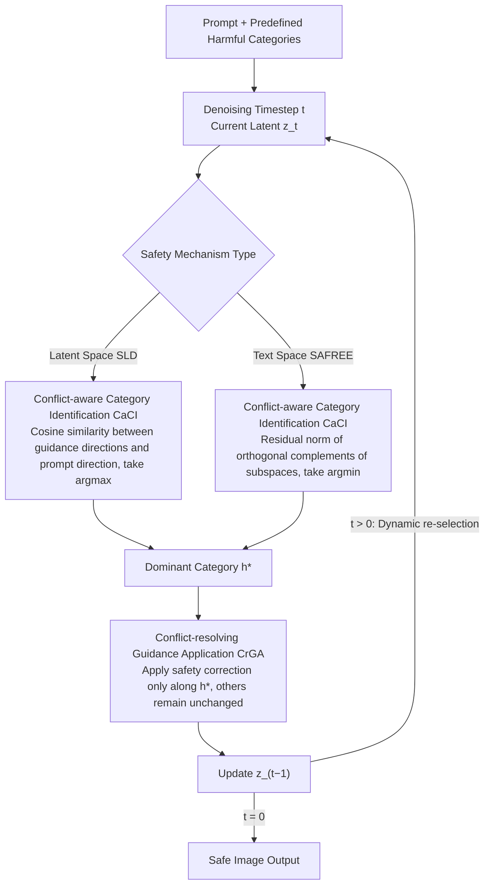

# When Safety Collides: Resolving Multi-Category Harmful Conflicts in Text-to-Image Diffusion via Adaptive Safety Guidance

## Basic Information

- **Conference**: CVPR 2026
- **arXiv**: [2602.20880](https://arxiv.org/abs/2602.20880)
- **Code**: [GitHub](https://github.com/tmllab/2026_CVPR_CASG)
- **Area**: Image Generation / T2I Safety
- **Keywords**: Diffusion Model Safety, Harmful Content Mitigation, Safety Guidance, Multi-category Conflict, Training-free Framework

## TL;DR

Ours proposes Conflict-aware Adaptive Safety Guidance (CASG), a training-free plug-and-play framework that resolves safety degradation caused by directional conflicts when aggregating multiple categories. It dynamically identifies the harmful category most aligned with the current generation state and applies safety guidance only along that direction.

## Background & Motivation

Text-to-Image (T2I) diffusion models (e.g., Stable Diffusion, Hunyuan-DiT) have made significant progress in generating high-quality images but also pose safety risks by generating harmful content (hate, pornography, violence, illegal acts, etc.). Existing safety guidance methods (e.g., SLD, SAFREE) are lightweight, training-free solutions that guide generation away from harmful regions by applying safety directions in latent or text spaces.

**Core Problem**: Prior safety guidance methods handle multi-category harmful content by simply concatenating all harmful keywords into an aggregate set to derive a unified safety direction. This category-agnostic design implicitly assumes that different types of harm are compatible. However, extensive experiments reveal that this assumption is flawed—different harmful categories define unique and often incompatible safety directions. Forcing aggregation leads to **Harmful Conflict**, which paradoxically degrades safety performance.

Harmful conflicts manifest in two forms:

**Directional Inconsistency** $\rightarrow$ Safety Misalignment Degradation: Safety directions of different categories point in incompatible or even opposite directions. For example, applying "hate" category safety guidance to a pornographic prompt increases the harmful rate from 67.2% to 72.4%, significantly higher than the 3.2% achieved by correctly using the "pornography" direction.

**Directional Attenuation** $\rightarrow$ Safety Averaging Degradation: Aggregating multiple categories causes heterogeneous directions to partially cancel each other out, weakening the net safety signal. While the "pornography" direction alone yields a 3.2% harmful rate, adding "hate" increases it to 5.8%, and aggregating all categories spikes it to 48.8%.

## Method

### Overall Architecture

CASG addresses a specific issue: when a prompt potentially triggers multiple harmful categories, existing methods concatenate keywords into one set to find a unified "safety direction," resulting in conflicting directions and reduced safety. The Mechanism of CASG avoids aggregate directions. Instead, at each denoising timestep, it first determines which harmful category the current generation trajectory most closely resembles, then applies safety correction only along that dominant category. This process consists of two steps—Conflict-aware Category Identification (CaCI) to select the dominant category, followed by Conflict-resolving Guidance Application (CrGA) to apply the correction. This mechanism is plug-and-play for both latent space (CASG+SLD) and text space (CASG+SAFREE) safety mechanisms.

### Key Designs

**1. Conflict-aware Category Identification (CaCI): Locking onto the best-aligned harmful category at each timestep**

Aggregating all categories mixes incompatible safety directions. The first step identifies which harmful category is currently being generated. In the latent space, CASG calculates the harmful guidance direction $g_i = \epsilon_\theta(z_t, c_{h_i}) - \epsilon_\theta(z_t)$ for each category $h_i$, and the prompt's own guidance direction $g_p = \epsilon_\theta(z_t, c_p) - \epsilon_\theta(z_t)$. It uses cosine similarity $\cos\theta_i = \frac{g_i \cdot g_p}{\|g_i\|\|g_p\|}$ to measure which category fits the current trajectory, selecting $h^* = h_{\arg\max_i \cos\theta_i}$ as the dominant category. In text space, SAFREE represents harmful concepts using subspace projection matrices $P_{h_i}$. CASG calculates the residual of the prompt embedding on the orthogonal complement of each subspace: $p_{h_i}^\perp = (I - P_{h_i})p$. A smaller residual norm $\|p_{h_i}^\perp\|$ indicates higher alignment, choosing $h^* = h_{\arg\min_i \|p_{h_i}^\perp\|}$. Both implementations use "alignment" to isolate the single most relevant category.

**2. Conflict-resolving Guidance Application (CrGA): Correcting only along the dominant category**

The second pain point is directional attenuation—averaging multiple categories dilutes the net safety signal. CrGA takes a restrained approach: once $h^*$ is identified, the latent space version applies only the direction of $h^*$ for the original SLD correction, and the text space version uses only $P_{h^*}$ for orthogonal projection. All original mechanisms and hyperparameters of SLD/SAFREE remain unchanged. By excluding irrelevant directions, the safety signal is not averaged out, preventing the degradation where the "wrong direction" pushes the harmful rate higher.

**3. Step-wise Dynamic Identification vs. One-time Text Pre-classification**

A natural alternative would be using an LLM to classify prompts before applying safety guidance. However, harmful semantics evolve dynamically during the denoising process. A fixed category chosen at the start cannot track these changes, and LLMs often struggle with hybrid or ambiguous prompts. By placing the identification on the generation trajectory and re-updating the dominant category at every timestep, CASG tracks dynamic conflicts—explaining why it significantly outperforms static pre-classification schemes like GPT-4o+SLD or QwenGuard+SLD.

## Key Experimental Results

### Main Results

| Method | Conflict-Aware | I2P ↓ | T2VSafetyBench ↓ | Unsafe Diffusion ↓ | CoProv2 ↓ | FID ↓ | CLIP ↑ |
|:---|:---:|:---:|:---:|:---:|:---:|:---:|:---:|
| SD-v1.5 | - | 42.2 | 58.3 | 52.3 | 28.2 | - | 31.43 |
| ESD | ✗ | 42.0 | 57.4 | 50.6 | 28.1 | 38.15 | 31.35 |
| UCE | ✗ | 26.7 | 28.2 | 33.0 | 19.4 | 77.41 | 29.12 |
| RECE | ✗ | 21.5 | 18.9 | 22.3 | 8.6 | 67.35 | 27.67 |
| SafetyDPO | ✗ | 13.7 | 24.0 | 16.7 | 4.2 | 49.64 | 30.61 |
| SAFREE | ✗ | 20.0 | 41.5 | 24.2 | 14.2 | 43.78 | 30.53 |
| **CASG+SAFREE** | ✓ | **18.9** | **37.5** | **17.5** | **11.8** | 46.25 | 30.35 |
| SLD | ✗ | 12.7 | 25.2 | 15.7 | 7.1 | 52.11 | 29.22 |
| **CASG+SLD** | ✓ | **10.2** | **9.8** | **9.8** | **3.9** | 52.00 | 29.36 |

CASG+SLD achieves SOTA across all four benchmarks, reducing the harmful rate by up to 15.4% (from 25.2% to 9.8% on T2VSafetyBench). Meanwhile, FID and CLIP scores remain nearly constant, indicating no loss in generation quality.

### Ablation Study: LLM-Assisted vs. CASG

| Method | I2P ↓ | T2VSafetyBench ↓ | UD ↓ |
|:---|:---:|:---:|:---:|
| SLD | 12.7 | 25.2 | 15.7 |
| GPT-4o+SLD | 11.6 | 12.3 | 20.1 |
| QwenGuard+SLD | 14.0 | 21.1 | 23.3 |
| **CASG+SLD** | **10.2** | **9.8** | **9.8** |

LLM-assisted schemes (GPT-4o/QwenGuard pre-classification followed by SLD) show limited or even negative effects for two reasons: (1) LLMs misclassify hybrid/ambiguous prompts; (2) fixed categories cannot adapt to evolving conflicts during denoising. CASG dynamically updates at each timestep, significantly outperforming LLM-assisted methods.

### Key Findings

1. **Category Aggregation $\neq$ Increased Safety**: The core finding is that aggregating more harmful categories can weaken safety.
2. **Conflicts are Systemic**: Consistent degradation patterns exist across different base models, safety mechanisms, and harmful keyword definitions.
3. **Dynamic Identification > Static Classification**: Trajectory-based step-wise identification is more effective than LLM-based one-time text classification.
4. **Plug-and-play Gain**: CASG brings consistent Gain to both SLD and SAFREE without additional training costs.

## Highlights & Insights

- Identifies a widely overlooked yet impactful problem—multi-category harmful conflicts—systematically revealing inconsistencies between safety guidance directions.
- Elegant and simple Design Motivation: Selects the dominant category via cosine similarity or residual norms, requiring no training or external models.
- High versatility: Applicable to both latent space (SLD) and text space (SAFREE) safety mechanisms.
- Experimental Thoroughness: Evaluation across four safety benchmarks, benign generation quality assessment, LLM-assisted comparison, and multi-model validation.

## Limitations & Future Work

- Computational overhead scales linearly with the number of categories as noise predictions/residual norms must be calculated for each category per timestep.
- Validation is primarily on SD v1.5; applicability to newer architectures (e.g., DiT, FLUX) is not fully explored.
- Relies on a predefined set of harmful keywords; incomplete definitions may lead to misses.
- Selecting only one dominant category per step might overlook prompts containing multiple simultaneous harmful semantics.

## Rating

⭐⭐⭐⭐ (4/5)

- **Novelty**: ⭐⭐⭐⭐⭐ — The discovery of the "harmful conflict" problem is highly valuable, challenging the intuition that "more categories = safer."
- **Technical Depth**: ⭐⭐⭐⭐ — Analysis of conflict mechanisms (inconsistency + attenuation) is systematic, and CDRR analysis is convincing.
- **Experimental Thoroughness**: ⭐⭐⭐⭐⭐ — Comprehensive evaluation over benchmarks, baselines, and LLM comparisons.
- **Writing Quality**: ⭐⭐⭐⭐⭐ — Problem introduction is clear; PCA visualizations and CDRR heatmaps are highly persuasive.
- **Value**: ⭐⭐⭐⭐ — A practical plug-and-play enhancement for T2I safety, though the application scenario is relatively vertical.

<!-- RELATED:START -->

## Related Papers

- [\[CVPR 2026\] TAP: A Token-Adaptive Predictor Framework for Training-Free Diffusion Acceleration](tap_a_token-adaptive_predictor_framework_for_training-free_diffusion_acceleratio.md)
- [\[CVPR 2025\] Multi-party Collaborative Attention Control for Image Customization](../../CVPR2025/image_generation/multi-party_collaborative_attention_control_for_image_customization.md)
- [\[CVPR 2025\] Fine-Grained Erasure in Text-to-Image Diffusion-based Foundation Models](../../CVPR2025/image_generation/fine-grained_erasure_in_text-to-image_diffusion-based_foundation_models.md)
- [\[ICCV 2025\] TRCE: Towards Reliable Malicious Concept Erasure in Text-to-Image Diffusion Models](../../ICCV2025/image_generation/trce_towards_reliable_malicious_concept_erasure_in_text-to-image_diffusion_model.md)
- [\[AAAI 2026\] Hierarchical Schedule Optimization for Fast and Robust Diffusion Model Sampling](../../AAAI2026/image_generation/hierarchical_schedule_optimization_for_fast_and_robust_diffusion_model_sampling.md)

<!-- RELATED:END -->
