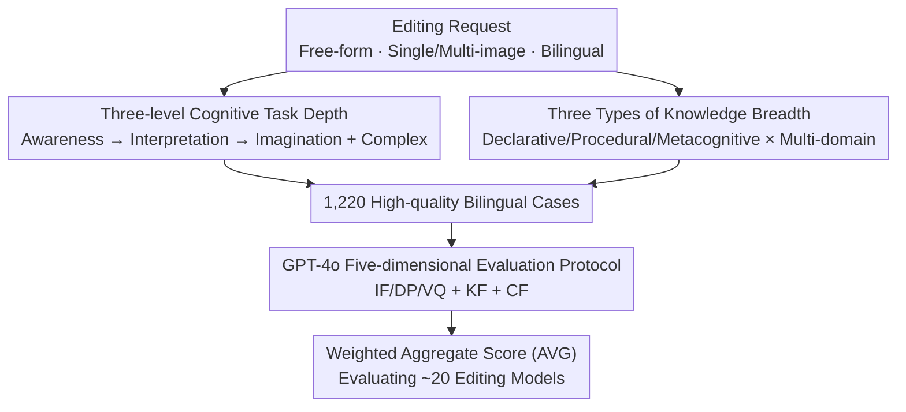

# WiseEdit: Benchmarking Cognition- and Creativity-Informed Image Editing

**Conference**: CVPR 2026  
**Paper**: [CVF Open Access](https://openaccess.thecvf.com/content/CVPR2026/html/Pan_WiseEdit_Benchmarking_Cognition-_and_Creativity-Informed_Image_Editing_CVPR_2026_paper.html)  
**Code**: https://github.com/beepkh/WiseEdit (Dataset available on HuggingFace `123123chen/WiseEdit-Benchmark`)  
**Area**: Image Editing / Benchmarking / Multimodal Generation  
**Keywords**: Image Editing, Cognition and Creativity, Knowledge-Intensive Evaluation, Multi-image Input, GPT-4o Evaluation

## TL;DR
WiseEdit decomposes instructive image editing into a three-level cognitive process of "Awareness—Interpretation—Imagination" paired with three categories of knowledge ("Declarative/Procedural/Metacognitive"). It constructs a challenging benchmark of 1,220 Chinese-English bilingual cases, including 26% multi-image inputs. Using GPT-4o for scoring across five dimensions—including self-developed Knowledge Fidelity (KF) and Creative Fusion (CF)—the study systematically exposes the shortcomings of current SOTA editing models in knowledge reasoning and compositional creation.

## Background & Motivation
**Background**: In the past two years, instructive image editing has evolved from early local edits like "adding a hat/deleting an object" to "reasoning-based editing" driven by MLLMs and large diffusion models. Open-source models like Bagel, Qwen-Image-Edit, and OmniGen2 unify visual understanding and generation into a single model. Closed-source models such as GPT-image-1 and Nano Banana further claim to perform "cognition- and creativity-driven" intelligent editing—understanding implicit intent and performing multi-concept compositional creation.

**Limitations of Prior Work**: While model capabilities are advancing rapidly, evaluation benchmarks have failed to keep pace. Most traditional benchmarks (e.g., MagicBrush, AnyEdit) use a single template of "one image + one straightforward instruction specifying which object to modify," requiring almost no cognition or creativity. Even newer benchmarks like KrisBench, RiseBench, and IntelligentBench, which introduce world knowledge, are limited to single-image inputs, only test the "interpretation" phase, lack metacognitive knowledge, and are exclusively in English.

**Key Challenge**: A truly intelligent editing process requires the completion of a full chain: "first understand where to change → then conceive how to change → finally render the result." This necessitates the invocation of different levels of knowledge. Current benchmarks are too narrow in both **Task Depth** (covering only intermediate steps) and **Knowledge Breadth** (lacking metacognition, multilingualism, and multi-image composition), making it impossible to truly measure high-level model capabilities.

**Goal**: To create a knowledge-intensive benchmark that simultaneously possesses high task depth and wide knowledge breadth, allowing for the granular examination of various aspects of editing capability.

**Key Insight**: By analogizing the human cognitive and creative process, the editing workflow is decomposed into three interconnected steps: Awareness (establishing selective visual attention to locate targets), Interpretation (parsing instructions into executable perceptual changes), and Imagination (rendering creative results with high fidelity). These are then orthogonally overlaid with three psychology-based knowledge types.

**Core Idea**: Design tasks using a 2D coordinate system of "Three-stage Cognitive Decomposition × Three Knowledge Types." Specialized high-difficulty cases are designed to "trap" models at each specific step. Additionally, KF/CF metrics for knowledge and creativity are introduced to decompose the monolithic "editing capability" into measurable sub-capabilities.

## Method

### Overall Architecture
WiseEdit is not a model but an evaluation benchmark. It functions as a pipeline: creating tasks along two orthogonal axes → assembling 1,220 bilingual cases → scoring using GPT-4o across five dimensions → calculating a weighted aggregate score. The first axis is **Task Depth**, which splits editing into Awareness, Interpretation, and Imagination, with specific hard problems designed for each alongside a "Complex" task. The second axis is **Knowledge Breadth**, where each case is associated with Declarative, Procedural, or Metacognitive knowledge across multiple domains like cultural common sense, natural science, and spatio-temporal logic. Inputs are free-form, allow multiple images (using ordinals like "first/second image" to denote roles as targets or references), and are provided in both Chinese and English.

### Key Designs

**1. Three-level Cognitive Decomposition + Four Task Categories: Making Every Step an Independent Test Point**

To address the issue that prior benchmarks mostly test shallow interpretation, WiseEdit explicitly segments editing into three steps with specialized challenges. **Awareness tasks** provide no explicit spatial clues, forcing models to locate targets via comparative reasoning ("remove the happiest person"), indirect reference ("mark Shakespeare's hometown on the map"), or cross-image visual correspondence. **Interpretation tasks** feature instructions that do not directly specify the change, requiring the model to use world knowledge to translate implicit intent into executable actions (e.g., error correction, time-lapse, or predicting cascading effects). **Imagination tasks** focus on high-difficulty subject-driven generation, requiring changes in attire, pose, or perspective while maintaining identity. **WiseEdit-Complex** sits atop these, requiring complex reasoning and creative generation simultaneously. This allows precise localization of where a model fails.

**2. Three Knowledge Systems + Multi-domain/Multilingual: Assessing What, How, and When**

WiseEdit expands significantly over benchmarks like KrisBench by categorizing world knowledge into three layers: **Declarative knowledge** (knowing what—facts and concepts, e.g., identifying a Panda as China's national animal), **Procedural knowledge** (knowing how—skills to decompose tasks into multi-step processes, e.g., converting a watercolor to a line drawing), and **Metacognitive knowledge** (knowing about knowing—self-regulation, such as knowing when to invoke specific knowledge types, exemplified by complex conditional instructions like "make the girl hold the longest object from the second image; if it can be used for brushing teeth, face the camera, otherwise face away"). Metacognition is a layer missing from almost all prior benchmarks.

**3. Five-dimensional Evaluation Protocol + KF/CF Metrics: Quantifying Knowledge and Creativity via GPT-4o**

To quantify knowledge and creativity where traditional metrics (IF, DP, VQ) fail, WiseEdit uses GPT-4o as an evaluator with two new dimensions. The five metrics are: Instruction Following (**IF**), Detail Preservation (**DP**), Visual Quality (**VQ**), **Knowledge Fidelity (KF)** (logical/scientific/cultural correctness), and **Creative Fusion (CF)** (novelty and depth of imagination relative to the original). Each is scored 1–10. The aggregate score is task-adaptively weighted:

$$\text{AVG} = \frac{\text{IF} + \text{DP} + \text{VQ} + \alpha \cdot \text{KF} + \beta \cdot \text{CF}}{3 + \alpha + \beta}$$

Where $\alpha,\beta\in\{0,1\}$—KF is enabled only for Awareness/Interpretation/Complex tasks ($\alpha=1$), and CF only for Imagination/Complex ($\beta=1$). This ensures dimensions only contribute where relevant, mapping the final 1-10 scores to a 0–100 scale.

## Key Experimental Results

### Main Results
The benchmark evaluates approximately 20 major editing models, including pure diffusion models (e.g., FLUX.1/2 Kontext), unified understanding-generation models (e.g., Bagel, Qwen-Image-Edit, OmniGen2), and closed-source models (e.g., GPT-image-1, Nano Banana Pro). The following table shows select results for the English version (0–100):

| Model | Type | Awareness AVG | Interpretation AVG | Imagination AVG | Total AVG |
|------|------|---------|---------|---------|---------|
| MagicBrush | Diffusion | 37.8 | 38.1 | 30.5 | 35.5 |
| FLUX.2 Dev | Diffusion | 59.4 | 58.4 | 67.5 | 61.8 |
| Qwen-Image-Edit | Unified | 62.5 | 54.1 | 63.8 | 60.2 |
| DreamOmni2 | Unified | 63.5 | 60.0 | 58.2 | 60.6 |
| Nano Banana | Closed | 79.6 | 75.3 | 70.2 | 75.0 |
| GPT-image-1 | Closed | 83.3 | 74.9 | 77.6 | 77.6 |
| Nano Banana Pro | Closed | 87.3 | 83.3 | 76.6 | **82.4** |

Performance on WiseEdit-Complex (multi-image models only) shows a significant drop in difficulty:

| Model | English AVG | Chinese AVG | Total AVG |
|------|---------|---------|---------|
| AnyEdit | 8.7 | 8.2 | 8.5 |
| Qwen-Image-Edit | 53.8 | 53.4 | 53.6 |
| Bagel | 54.5 | 54.7 | 54.6 |
| Nano Banana | 69.6 | 66.6 | 68.1 |
| GPT-image-1 | 71.0 | 71.4 | 71.2 |
| Nano Banana Pro | 75.5 | 78.7 | **77.1** |

### Ablation Study
The study uses several controlled analyses to validate the role of vision-driven generation and the evaluation protocol:

| Configuration / Analysis | Key Metric | Description |
|------|---------|------|
| Protocol vs. Human (Pearson) | GPT-ours highest | More aligned with humans than GPT-Kris, Gemini, or Qwen-based evaluators. |
| Disabling "Thinking" in Unified Models | Significant score drop | Bagel/DreamOmni2 drop markedly across tests without internal thinking. |
| Single vs. Multi-image Input | Multi-image lower | Compositional multi-image cases are the primary bottleneck for total scores. |
| Instruction Rewriting (Knowledge Hint, Bagel) | KF 78.4 (+28.2) | Open-source models compensate for reasoning gaps when provided external knowledge. |
| Instruction Rewriting (GPT-image-1) | AVG 74.2 (+6.0) | Closed-source models show less gain, as they already possess internal knowledge. |

### Key Findings
- **Massive Gap Between Closed and Open Source**: Closed-source models dominate in all tasks and languages. Even the weakest closed-source model outperforms the strongest open-source model by nearly 15 points, refuting claims that open-source has caught up.
- **Unified Architecture as a Watershed**: Models that unify vision understanding and generation generally outperform pure diffusion models. Even the strongest closed-source models utilize this unified architecture, suggesting that robust visual reasoning is a prerequisite for advanced editing.
- **Universal Weaknesses: KF and CF**: Low Knowledge Fidelity often drags down Instruction Following. Performance on metacognitive knowledge is significantly weaker than declarative/procedural. In imagination tasks, no model exceeds 80 in CF and DP, indicating fine-grained subject-driven generation remains unsolved.
- **"Thinking but not Doing"**: Some closed-source models achieve higher KF/CF on Complex tasks than on simple ones, yet their IF scores plummet. They grasp the intent but fail significantly in execution, sacrificing basic instruction following.
- **Cross-lingual Robustness in Top Models**: Despite limited Chinese training data, leading unified/closed-source models perform equally well on Chinese and English instructions due to strong internal visual-linguistic alignment.

## Highlights & Insights
- **Measurable Decoupling of Editing Capability**: The 2D coordinate system allows for precise diagnosis of whether a model fails at a specific cognitive stage or knowledge type, which is far more actionable than a single aggregate score.
- **Quantification of Knowledge and Creativity**: KF and CF metrics fill a significant gap in existing benchmarks. The use of task-adaptive weights ensures that models are only penalized/rewarded on relevant dimensions.
- **Insightful Instruction Rewriting**: The finding that open-source models gain ~15 points with external hints—while closed-source models do not—clearly demonstrates that the bottleneck for open-source is "internal reasoning/knowledge retrieval" rather than generation capacity.
- **Realistic Multi-image Design**: Tasks requiring ordinal reference and role inference (target vs. reference) effectively test capabilities that single-image benchmarks cannot reach.

## Limitations & Future Work
- **Reliance on GPT-4o as the Evaluator**: Despite human correlation checks, using a closed-source VLM risks internal biases, potential preference for same-family models, and difficulties in reproduction due to model version drifts.
- **Inconsistency in Model Counts**: There are minor discrepancies in the number of models mentioned in different sections of the paper.
- **Evaluation is Prompt-driven**: The KF/CF scores depend heavily on prompt engineering, making the resolution of the 1–10 scale somewhat "soft."
- **Focus on Diagnosis Over Solutions**: As a benchmark paper, it identifies phenomena like "thinking but not doing" but leaves the deeper architectural or data-driven causes for future exploration.

## Related Work & Insights
- **Compared to KrisBench/RiseBench/IntelligentBench**: WiseEdit provides systematic extensions in task depth (Awareness/Imagination/Complex), knowledge breadth (Metacognition), input modality (26% multi-image), and language (Bilingual).
- **Compared to Traditional Benchmarks (MagicBrush/AnyEdit)**: It moves beyond simple object manipulation toward high-level cognitive tasks.
- **Inspiration for Future Models**: Arguments strongly support the "Unified Architecture + Strong Visual Reasoning" roadmap. In the short term, augmenting open-source models with external "knowledge/intent rewriters" is a high-ROI strategy, while the long-term goal remains internalizing this reasoning.

## Rating
- Novelty: ⭐⭐⭐⭐⭐ First to decompose editing into three cognitive stages and three knowledge types with novel KF/CF metrics.
- Experimental Thoroughness: ⭐⭐⭐⭐⭐ Evaluates ~20 models with extensive ablation on thinking modules, instruction rewriting, and human correlation.
- Writing Quality: ⭐⭐⭐⭐ Clear framework and motivation, though minor inconsistencies in model counts exist.
- Value: ⭐⭐⭐⭐⭐ Provides a precise "cognitive ruler" for intelligent image editing, benefiting both evaluation and model development.

<!-- RELATED:START -->

## Related Papers

- [\[CVPR 2026\] Omni IIE Bench: Benchmarking the Practical Capabilities of Image Editing Models](omni_iie_bench_benchmarking_the_practical_capabilities_of_image_editing_models.md)
- [\[CVPR 2026\] CompBench: Benchmarking Complex Instruction-guided Image Editing](compbench_benchmarking_complex_instruction-guided_image_editing.md)
- [\[CVPR 2025\] GRADE: Benchmarking Discipline-Informed Reasoning in Image Editing](../../CVPR2025/image_generation/grade_benchmarking_discipline-informed_reasoning_in_image_editing.md)
- [\[CVPR 2026\] Leveraging Verifier-Based Reinforcement Learning in Image Editing](leveraging_verifier-based_reinforcement_learning_in_image_editing.md)
- [\[CVPR 2026\] ChordEdit: One-Step Low-Energy Transport for Image Editing](chordedit_one-step_low-energy_transport_for_image_editing.md)

<!-- RELATED:END -->
