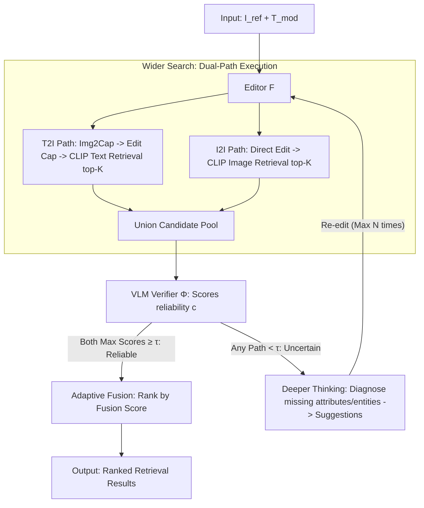

# WISER: Wider Search, Deeper Thinking, and Adaptive Fusion for Training-Free Zero-Shot Composed Image Retrieval

**Conference**: CVPR 2026  
**arXiv**: [2602.23029](https://arxiv.org/abs/2602.23029)  
**Code**: [https://github.com/Physicsmile/WISER](https://github.com/Physicsmile/WISER)  
**Area**: Image Generation  
**Keywords**: Composed Image Retrieval, Zero-Shot, T2I+I2I Fusion, Self-Reflective Refinement, VLM Verifier, CLIP

## TL;DR

Ours proposes WISER, a training-free Zero-Shot Composed Image Retrieval (ZS-CIR) framework. It unifies T2I and I2I dual-path retrieval through a "Retrieval–Verification–Refinement" iterative loop. By utilizing a VLM verifier to explicitly model intent-awareness and uncertainty-awareness, WISER achieves adaptive fusion and structured self-reflective refinement. It delivers relative improvements of 45% in CIRCO mAP@5 and 57% in CIRR Recall@1, outperforming many training-based methods.

## Background & Motivation

**Task Definition**: Composed Image Retrieval (CIR) retrieves a target image given a reference image $I_{\text{ref}}$ and a modifying text $T_{\text{mod}}$. ZS-CIR avoids reliance on labeled triplets by leveraging the generalization capabilities of pre-trained models.

**Two Paradigms**:
   - **T2I Paradigm** (Text-to-Image retrieval): Describes the reference image as text, combines it with the modifying text to generate an edited description, and retrieves via text vectors. It excels at complex semantic modifications but loses fine-grained visual details.
   - **I2I Paradigm** (Image-to-Image retrieval): Directly edits the reference image using image editing models and retrieves via image vectors. It preserves visual details better but performs poorly with complex compositional edits or ambiguous intents.

**Key Challenge**: Real-world query intents are diverse, and a single paradigm is insufficient. Existing fusion methods (e.g., CIG, IP-CIR) suffer from two critical flaws:
   - **Lack of Intent-Awareness**: Static fixed-weight fusion fails to adapt to different query intents.
   - **Lack of Uncertainty-Awareness**: They ignore the differences in reliability among candidate results from different branches.

**Goal**: Design an iterative closed loop of "Retrieval $\rightarrow$ Verification $\rightarrow$ Refinement." A VLM verifier evaluates candidate quality, triggering structured self-reflective refinement for uncertain results and adaptive multi-layer fusion for reliable results. The entire process is training-free and modularly plug-and-play.

## Method

### Overall Architecture

WISER addresses the inherent limitations of the two paths in CIR: the T2I paradigm handles complex semantics but loses details, while the I2I paradigm preserves details but struggles with complex compositions. Existing fusion methods (CIG, IP-CIR) use fixed weights to combine both paths without considering query intent or candidate reliability. WISER transforms retrieval from a single-shot process into a "Retrieval $\rightarrow$ Verification $\rightarrow$ Refinement" iterative loop. Both paths are executed simultaneously to broaden recall, followed by a VLM verifier that assigns reliability scores to each candidate. Reliable candidates are ranked via adaptive fusion based on scores, while unreliable ones trigger a diagnosis of missing modifications to generate improvement suggestions for a subsequent round of editing. No parameters are trained; the editors, verifiers, and refiners are all off-the-shelf models.

Formally, given $I_{\text{ref}}$ and $T_{\text{mod}}$, an editor $\mathcal{F}$ produces an edited description $C_{\text{edit}}$ and an edited image $I_{\text{edit}}$. These are encoded by CLIP visual/text encoders $E_{\text{img}}, E_{\text{txt}}$ into query vectors $q_v, q_t$ for cosine similarity retrieval in database $\mathcal{D}$. The three key designs correspond to the terms in the title: Wider Search for candidate expansion, Adaptive Fusion for verification-guided ranking, and Deeper Thinking for self-reflective refinement of uncertain results.

### Key Designs

**1. Wider Search: Broadening Recall via Dual Paths**

Single paradigms have blind spots. WISER avoids choosing between them by having the editor $\mathcal{F}$ execute both. The text side uses BLIP-2 to convert the reference image into a description $C_{\text{ref}}$, then fuses it with $T_{\text{mod}}$ to generate $C_{\text{edit}}$ for T2I retrieval. The image side directly edits the reference image for I2I retrieval:

$$C_{\text{edit}} = \mathcal{F}_{\text{txt}}(C_{\text{ref}}, T_{\text{mod}}), \qquad I_{\text{edit}} = \mathcal{F}_{\text{img}}(I_{\text{ref}}, T_{\text{mod}})$$

The top-$K$ candidates $\mathcal{R}_p = \{I_p^1, \ldots, I_p^K\}$ ($p \in \{\text{T2I}, \text{I2I}\}$) are retrieved and combined into a union pool $\mathcal{R}_{\text{union}} = \mathcal{R}_{\text{T2I}} \cup \mathcal{R}_{\text{I2I}}$. This ensures that if the correct target falls into the top-$K$ of either path, it is retained, pushing the "path selection" problem to the verification stage.

**2. Adaptive Fusion: Verification-Guided Weighting**

WISER differentiates itself from fixed-weight fusion (CIG/IP-CIR) by assessing reliability. Naive averaging (AVG) causes noise from one path to degrade the ranking; on CIRCO, AVG achieves an mAP@5 of 13.53, lower than the T2I single-path score of 17.28. WISER uses a VLM verifier $\Phi$ (Qwen2.5-VL-7B) to evaluate the triplet $(I_{\text{ref}}, T_{\text{mod}}, I_p^k)$. It uses the softmax logits of "yes/no" tokens as the confidence score:

$$c_p^k = \frac{\exp(\ell_{p,k}^{(\text{yes})})}{\exp(\ell_{p,k}^{(\text{yes})}) + \exp(\ell_{p,k}^{(\text{no})})}$$

Fusion occurs at two levels. The **Branch-level** manages uncertainty: if the maximum confidence $r_p = \max_k c_p^k$ for either path is below $\tau$ ($\min(r_{\text{T2I}}, r_{\text{I2I}}) < \tau$), WISER hands the task to Deeper Thinking. The **Candidate-level** manages intent: for reliable retrievals, the fusion score $c_{\text{fused}}^k = c_{\text{T2I}}^k + c_{\text{I2I}}^k$ is used, followed by lexicographical sorting using a triplet key:

$$\Psi(I^k) = \left(-c_{\text{fused}}^k, \ -\max(c_{\text{T2I}}^k, c_{\text{I2I}}^k), \ -c_{\text{T2I}}^k\right)$$

**3. Deeper Thinking: Self-Reflective Refinement**

When $r_p < \tau$, a structured self-reflection is triggered via an LLM refiner (GPT-4o). **Step 1: Identify targets**: Decompose expected changes into attributes ("red $\rightarrow$ blue") and entities ("add a hat"). **Step 2: Diagnose errors**: Compare the description of the pseudo-target $I_p^*$ against the target phrases. **Step 3: Targeted feedback**: Generate improvement suggestions. These are appended to $T_{\text{mod}}$ for the next editing round. This targeted correction only triggers for low-confidence samples (usually $<30\%$), keeping overhead manageable.

### A Walkthrough Example

Query: "A red dress + change the dress to blue and add a belt."

1. **Wider Search**: T2I generates "blue dress with a belt" for retrieval; I2I edits the image to include a blue dress and belt.
2. **Verification**: Verifier scores candidates. A "blue dress without belt" might get T2I $c=0.55$, I2I $c=0.82$.
3. **Branch Reliability**: If I2I max score is 0.6 < $\tau=0.7$, trigger Deeper Thinking.
4. **Candidate Fusion**: For reliable results, a "blue dress with belt" with $0.9+0.9=1.8$ ranks above the version without a belt ($1.37$).
5. **Deeper Thinking**: The refiner identifies the missing "belt" and provides specific prompts for the next iteration.

### Implementation Details

| Component | Specific Model |
|------|---------|
| Editor $\mathcal{F}$ | BAGEL (Unified T2I + I2I) |
| Verifier $\Phi$ | Qwen2.5-VL-7B |
| Refiner | GPT-4o |
| Captioner | BLIP-2 |
| Retrieval | CLIP ViT-B/32 / ViT-L/14 / ViT-G/14 |

Configuration: $K=50, \tau=0.7, N=1$.

## Key Experimental Results

### Main Results — CIRCO and CIRR (Table 1)

| Method | Backbone | Free | CIRCO mAP@5 | CIRCO mAP@25 | CIRR R@1 | CIRR R@5 | CIRR R_sub@1 |
|------|----------|------|-------------|-------------|----------|----------|-------------|
| CIReVL | ViT-L/14 | ✓ | 18.57 | 20.89 | 24.55 | 52.31 | 59.54 |
| LDRE | ViT-L/14 | ✓ | 23.35 | 26.44 | 26.53 | 55.57 | 60.43 |
| IP-CIR | ViT-L/14 | ✓ | 26.43 | 29.87 | 29.76 | 58.82 | 62.48 |
| CoTMR | ViT-L/14 | ✓ | 27.61 | 30.61 | 35.02 | 64.75 | 69.39 |
| **WISER** | **ViT-L/14** | **✓** | **35.10** | **38.46** | **49.23** | **76.72** | **77.81** |

### Ablation Study — Core Components (Table 3, ViT-B/32)

| T2I | I2I | Deeper Thinking | Fusion | FIQ Avg R@10 | CIRCO mAP@5 |
|-----|-----|----------------|--------|-------------|-------------|
| ✓ | ✓ | ✗ | AVG (Fixed) | 33.40 | 13.53 |
| ✓ | ✓ | ✗ | ADA (Adaptive) | 40.83 | 31.32 |
| ✓ | ✓ | ✓ | ADA (Full) | **41.99** | **32.23** |

### Key Findings

1. **Significant Lead**: WISER significantly outperforms all training-free methods (e.g., +27% mAP@5 on CIRCO).
2. **Surpassing Training-Based Models**: Outperforms several methods that require training (e.g., LinCIR, AutoCIR).
3. **Naive Fusion is Harmful**: Fixed-weight fusion scores 13.53 mAP@5, lower than the T2I single-path (17.28).
4. **Adaptive Fusion is Critical**: ADA improves mAP@5 from 13.53 to 31.32.
5. **Stability of Deeper Thinking**: Provides consistent gains (~1 mAP point) and aids single-path scenarios.
6. **Efficiency**: Most benefits are gained within $N=1$ iteration.

## Highlights & Insights

- **"Retrieve-Verify-Refine" Paradigm**: Elevates CIR to an iterative process, mimicking "trial-evaluation-improvement" human cognition.
- **Novel Use of VLM Verifier**: Transforms VLM logits into uncertainty signals for decision-making.
- **Addressing Conflict**: Reveals that T2I/I2I noise conflicts make adaptive fusion a necessity rather than an option.
- **Multi-layer Fusion**: Distinctly addresses uncertainty and intent across two levels.
- **Training-Free & Modular**: Components are replaceable, allowing the framework to evolve with newer foundation models.

## Limitations & Future Work

1. **Inference Latency**: Increased overhead due to multiple model calls (captioner, editor, verifier, etc.).
2. **API Dependence**: Defaults to closed-source GPT-4o for the refiner.
3. **Binary Judgment Granularity**: Yes/no logits may lack sensitivity to subtle visual nuances.
4. **Caption-based Refinement**: Refinement relies on captions rather than direct visual analysis.
5. **Large-scale Efficiency**: Performance on million-scale databases is unverified.

## Rating

- Novelty: ⭐⭐⭐⭐ 
- Experimental Thoroughness: ⭐⭐⭐⭐⭐ 
- Writing Quality: ⭐⭐⭐⭐ 
- Value: ⭐⭐⭐⭐ 

<!-- RELATED:START -->

## Related Papers

- [\[NeurIPS 2025\] Instance-Level Composed Image Retrieval](../../NeurIPS2025/image_generation/instance-level_composed_image_retrieval.md)
- [\[CVPR 2026\] RAISE: Requirement-Adaptive Evolutionary Refinement for Training-Free Text-to-Image Alignment](raise_requirement-adaptive_evolutionary_refinement_for_training-free_text-to-ima.md)
- [\[CVPR 2026\] OrthoFuse: Training-free Riemannian Fusion of Orthogonal Style-Concept Adapters for Diffusion Models](orthofuse_training-free_riemannian_fusion_of_orthogonal_style-concept_adapters_f.md)
- [\[CVPR 2026\] CRAFT-LoRA: Content-Style Personalization via Rank-Constrained Adaptation and Training-Free Fusion](craft-lora_content-style_personalization_via_rank-constrained_adaptation_and_tra.md)
- [\[CVPR 2026\] CaReFlow: Cyclic Adaptive Rectified Flow for Multimodal Fusion](careflow_cyclic_adaptive_rectified_flow_for_multimodal_fusion.md)

<!-- RELATED:END -->
