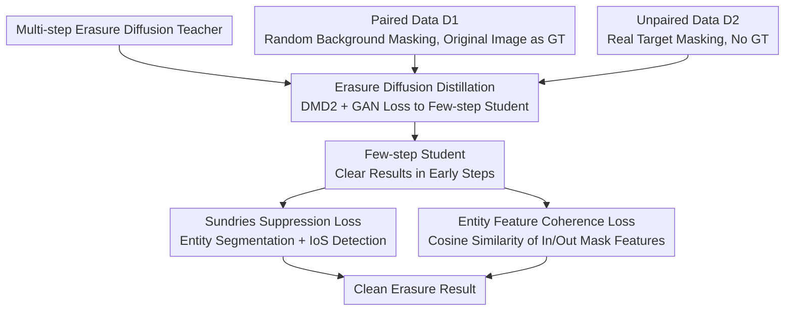

# YOEO: You Only Erase Once - Erasing Anything without Bringing Unexpected Content

**Conference**: CVPR 2026  
**arXiv**: [2603.27599](https://arxiv.org/abs/2603.27599)  
**Code**: [https://zyxunh.github.io/YOEO-ProjectPage/](https://zyxunh.github.io/YOEO-ProjectPage/)  
**Area**: Image Generation / Image Editing  
**Keywords**: Object Erasing, Diffusion Distillation, Hallucination Suppression, Entity Consistency, Unpaired Training

## TL;DR

YOEO proposes a single-pass erasure framework that achieves efficient inference by distilling a multi-step diffusion model into a few-step model. It introduces a sundries suppression loss (using entity segmentation to detect newly generated objects that should not appear) and an entity feature coherence loss (ensuring semantic consistency between the erased region and its surroundings) to resolve the hallucination problem of diffusion models in object erasing tasks.

## Background & Motivation

Diffusion models demonstrate excellent performance in image inpainting, but they often "hallucinate" when used for object erasing—generating new objects in the masked area that should not exist. Existing closed-source solutions (e.g., ChatGPT, Nano Banana) yield good results but suffer from high computational overhead, making them unsuitable for deployment on edge devices.

**Two Root Causes**: (1) Lack of real erasing data—synthetically paired data (random masking + original image as ground truth) does not represent real erasing scenarios; (2) Supervised Fine-Tuning (SFT) only teaches the model "denoising" rather than "erasing"—pixel-level reconstruction loss does not incorporate the constraint that "no new objects should be generated."

## Method

### Overall Architecture

YOEO aims to solve the hallucination problem where diffusion erasure models remove a target only to fill the space with new, unexpected objects, while ensuring efficient inference for edge deployment. The core strategy involves using a pre-trained multi-step erasure diffusion model as a teacher and distilling it into a few-step student model. Two losses specifically targeting "hallucinations" are then applied to the student. Training utilizes two types of data: paired data $\mathcal{D}_1$ (random background masking with original images as GT) to maintain basic inpainting capability, and unpaired data $\mathcal{D}_2$ (masking real target objects without GT) where supervision is provided by the two proposed losses. A key insight is that distillation allows the few-step student to produce clear images at early denoising steps, making it possible to evaluate whether artifacts have appeared and if the filling is semantically coherent, thus enabling end-to-end supervision on unpaired data.

### Key Designs

**1. Erasure Diffusion Distillation: Compressing Teacher to Student and Enabling Unpaired Supervision**

Edge deployment requires fast inference; thus, the first step is distilling the multi-step model into a few-step student using the DMD2 framework with GAN loss. However, distillation here is not just for speed—the crucial side effect is that while multi-step diffusion yields blurry intermediate results at early steps, the few-step student produces clear outputs early on. This clarity allows artifact detection and consistency metrics to be computed, transforming end-to-end supervision on unpaired data from "impossible" to "possible."

**2. Sundries Suppression Loss: Teaching "What Should Not Appear"**

Pixel-level reconstruction loss merely teaches the model "to make the image look like the original," ignoring the core constraint of erasure: "no independent objects should exist in the erased area." This loss employs a pre-trained entity segmentation model on the output. For each detected entity $S_i$, it calculates the IoS (Intersection over Segment) relative to the inpainting mask $M$:

$$\text{IoS}(S_i, M) = \frac{|S_i \cap M|}{|S_i|}$$

If the IoS of an entity exceeds a threshold $\lambda$, it indicates the entity primarily exists within the mask where it should have been erased. It is then classified as a "sundry" and penalized. This effectively translates the human prior that "erased regions should not contain independent entities" into an automated detection signal.

**3. Entity Feature Coherence Loss: Semantic Harmony with Surroundings**

Even without new objects, erasing fails if the filled content is semantically or stylistically inconsistent with the surrounding environment. This design extracts features from a pre-trained segmentation network to compare the generated area inside the mask with the original area outside. If the semantics are consistent, they should cluster towards the same representation center, indicated by high cosine similarity. This loss pulls these feature sets closer, ensuring the erased area appears as if it always belonged to the image.

### Loss & Training

The total loss combines LPIPS distillation loss, DMD loss, GAN loss, sundries suppression loss, and entity feature coherence loss. During training, paired data $\mathcal{D}_1$ and unpaired data $\mathcal{D}_2$ are fed alternately—the former maintains reconstruction quality, while the latter uses the two hallucination losses to teach the model not to generate unexpected content.

## Key Experimental Results

### Main Results

| Method | Erasure Cleanliness | Semantic Consistency | Inference Speed | Description |
|------|-----------|-----------|---------|------|
| SmartEraser | Low | Low | Slow | Prone to generating sundries |
| ASUKA | Medium | Medium | Slow | MAE + Diffusion |
| **YOEO** | **High** | **High** | **Fast (Few-step)** | Clean erasure in one pass |

YOEO outperforms existing methods across both quantitative and qualitative metrics.

### Ablation Study

| Configuration | Sundry Rate ↓ | Consistency ↑ | Description |
|------|--------|---------|------|
| Distillation Only | High | Low | Exhibits hallucinations like the teacher |
| + Sundries Suppression | Significantly Lower | Low | Effectively reduces artifacts |
| + Entity Coherence | Significantly Lower | High | Enhanced semantic consistency |
| Full YOEO | Lowest | Highest | Two losses are complementary |

### Key Findings

- Distilling into a few-step model is a prerequisite for enabling unpaired supervision, as multi-step intermediates are too blurry for meaningful evaluation.
- Sundries suppression loss contributes the most, indicating that "not generating new objects" is the most critical constraint in erasure tasks.
- Entity feature coherence provides "harmony," preventing the filled region from looking disconnected from the environment.

## Highlights & Insights

- **Cognitive Shift from "Denoising" to "Erasing"**: While traditional pixel reconstruction only teaches "image restoration," YOEO explicitly teaches the model "what not to do" through artifact detection and consistency constraints.
- **Unexpected Value of Distillation**: Distillation does not just accelerate inference; it enables end-to-end unpaired training previously deemed impossible—an insight transferable to other generative tasks requiring end-to-end evaluation.
- **Entity Segmentation as a General Evaluator**: Using a pre-trained segmentation model to automatically detect "things that shouldn't be there" is more robust and generalized than manually designed rules.

## Limitations & Future Work

- Dependency on the quality of the entity segmentation model—omissions or false detections by the segmenter affect loss accuracy.
- Single-pass erasure may be insufficient for extremely large masked areas.
- Few-step distillation might result in some loss of fine generative details.
- Future work could explore object erasing in video (temporal consistency).

## Related Work & Insights

- **vs SmartEraser**: SmartEraser utilizes synthetic paired data and target prompts; YOEO requires neither paired data nor explicit prompts.
- **vs ASUKA**: ASUKA uses MAE + Diffusion to reduce hallucinations; YOEO's sundries suppression loss is more direct.
- **vs TurboFill**: TurboFill focuses on efficient diffusion inpainting but lacks erasure-specific constraints.

## Rating

- Novelty: ⭐⭐⭐⭐ Creative use of sundries suppression and distillation to enable unpaired training.
- Experimental Thoroughness: ⭐⭐⭐⭐ Comprehensive comparisons and persuasive qualitative results.
- Writing Quality: ⭐⭐⭐⭐ Thorough problem analysis.
- Value: ⭐⭐⭐⭐ High practical value for image editing applications.

<!-- RELATED:START -->

## Related Papers

- [\[CVPR 2026\] You Only Erase Once: Erasing Anything without Bringing Unexpected Content](you_only_erase_once_erasing_anything_without_bringing_unexpected_content.md)
- [\[CVPR 2026\] WaDi: Weight Direction-aware Distillation for One-step Image Synthesis](wadi_weight_direction-aware_distillation_for_one-step_image_synthesis.md)
- [\[CVPR 2026\] DUO-VSR: Dual-Stream Distillation for One-Step Video Super-Resolution](duo-vsr_dual-stream_distillation_for_one-step_video_super-resolution.md)
- [\[CVPR 2026\] PortraitDirector: A Hierarchical Disentanglement Framework for Controllable and Real-time Facial Reenactment](portraitdirector_a_hierarchical_disentanglement_framework_for_controllable_and_r.md)
- [\[CVPR 2026\] MRT: Masked Region Transformer for Layered Image Generation and Editing at Scale](mrt_masked_region_transformer_for_layered_image_generation_and_editing_at_scale.md)

<!-- RELATED:END -->
