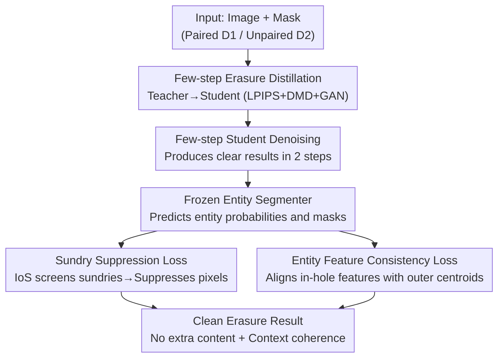

# You Only Erase Once: Erasing Anything without Bringing Unexpected Content

**Conference**: CVPR 2026  
**Paper**: [CVF Open Access](https://openaccess.thecvf.com/content/CVPR2026/html/Zhu_You_Only_Erase_Once_Erasing_Anything_without_Bringing_Unexpected_Content_CVPR_2026_paper.html)  
**Code**: https://zyxunh.github.io/YOEO-ProjectPage/ (Available)  
**Area**: Diffusion Models / Image Editing / Object Erasure  
**Keywords**: Object Erasure, Diffusion Distillation, Unpaired Supervision, Sundry Suppression, Entity Coherence

## TL;DR
YOEO employs a few-step diffusion erasure model trained on **unpaired data (real images without "erased ground truth")**. By utilizing "sundry detector + entity coherence" as two pair-free supervisory signals, it achieves clean object erasure in a single pass without generating unexpected content. Despite having only 860M parameters, it significantly outperforms 12B Flux-based methods in sundry-related metrics.

## Background & Motivation

**Background**: Object erasure is a fundamental image editing capability—given an image and a mask, the goal is to remove the object within the mask and interpolate the hole into a natural background. Early methods relied on GAN inpainting, which suffered from blurry textures and artifacts. Current mainstream approaches use text-to-image diffusion models for iterative denoising, which has become the de facto standard due to superior detail realism.

**Limitations of Prior Work**: Diffusion-based erasure suffers from a persistent issue—**hallucination**. After removing the target object, models often "imagine" a new object or a cluster of artifacts at the original site (e.g., SmartEraser and ASUKA in Fig. 1 generate unwanted items in the masked area), resulting in context inconsistency. Closed-source large models (ChatGPT, Nano Banana) erase cleanly but are computationally expensive and difficult to deploy on edge devices.

**Key Challenge**: The authors attribute hallucinations to two root causes. First, almost all diffusion erasure models are trained solely on **synthetic paired data**, where random holes are dug or objects are pasted, using the original image as ground truth. However, real-world "erased ground truth" does not exist, and synthetic data fails to represent authentic erasure scenarios. Second, existing methods rely entirely on **SFT** (Supervised Fine-Tuning), using pixel-wise losses (MSE/LPIPS) to reconstruct images from noise. This only teaches the model "denoising" rather than the "erasure" task goal itself—removing objects while maintaining contextual coherence. Thus, the model learns to denoise rather than to erase.

**Goal**: To create a specialized erasure model that is cleaner than SOTA while maintaining fewer parameters and lower latency. Most importantly, it should utilize real images for training to bypass the lack of paired ground truth.

**Key Insight**: In the absence of ground truth, supervision should focus not on "what the result looks like" but on "whether the erasure is correct." Drawing inspiration from reward-based learning, a **sundry detector** is introduced to automatically judge if extra objects appear. Additionally, a pretrained entity segmentation model extracts features to measure semantic coherence between the completed area and its surroundings. Neither signal requires paired ground truth.

**Core Idea**: By using **pair-free erasure-oriented supervision** ("sundry suppression + entity feature consistency") alongside few-step diffusion distillation, the model learns to "erase cleanly" rather than "reconstruct" using real unpaired data.

## Method

### Overall Architecture

YOEO starts with a pretrained erasure diffusion model $G_{init}$ as a teacher and fine-tunes it into a few-step student model $G_\theta$. The training data consists of two parts: a synthetic paired set $D_1=\{(X^i, Y^i, M^i)\}$ (randomly masked background with pixel-level correspondence) and a real unpaired set $D_2=\{(X^j, M^j)\}$ (using real entity masks from images, **without** erasure ground truth). The framework follows two parallel supervision lines: **Erasure Diffusion Distillation**, which compresses the teacher into a few-step student using LPIPS, DMD, and GAN losses; and **Entity-Coherent Erasure**, where a frozen entity segmenter drives the "Sundry Suppression Loss $\mathcal{L}_{SS}$" and "Entity Feature Consistency Loss $\mathcal{L}_{EFC}$" to mitigate hallucinations.

Few-step distillation is necessary because the sundry detector requires segmentation on generated images. Standard multi-step diffusion produces blurry intermediate results during early denoising stages, making it impossible to pass detector feedback end-to-end. Distilling into a few-step student (2 steps) allows the model to produce clear results early, enabling "sundry-aware" gradients to be directly backpropagated. The pipeline is as follows:

### Key Designs

**1. Dual Datasets + Pair-free Supervision: Bypassing the Lack of Ground Truth**

This is the foundation of the work. The paired set $D_1$ is constructed via random masking $X^i = (1-M^i)\odot Y^i$ with ground truth to initialize the teacher and stabilize student distillation. However, $D_1$ is synthetic. The innovation lies in $D_2$, where masks are sampled from actual entity masks $M^{entity}$. Since there is **no ground truth** for what these areas look like after erasure, the authors replace pixel reconstruction losses with two pair-free losses to judge if the erasure is "correct." This allows the model to learn erasure from large-scale real images (1.75M images based on Open Images).

**2. Sundry Suppression Loss $\mathcal{L}_{SS}$: Suppressing Hallucinated Content via IoS**

To target hallucinations, the authors define "sundry" objects. The student generation $\hat{X}$ is fed into a pretrained Mask2Former segmenter $S_\theta$ to obtain entity probabilities $P=\{(p_0^i,p_1^i)\}$ and masks $M$. An entity is likely a hallucination if it falls **almost entirely inside the mask**, quantified by Intersection over Self (IoS):

$$\text{IoS}(m^i, m_{in}) = \frac{|m^i \cap m_{in}|}{|m^i|}$$

Sundry entities are identified as $I=\{i \mid \text{IoS}(m^i,m_{in})>\lambda,\ p_1^i>\tau\}$ (with $\lambda=0.9, \tau=0.2$). The loss encourages the model to increase the "non-sundry" probability $p_0^i$ while suppressing pixel activations within the predicted sundry mask:

$$\mathcal{L}_{SS} = \sum_{i\in I}\left[-\alpha_i \log p_0^i - \sum_{x,y}\frac{\log(1-m_{x,y}^i)}{h\times w}\right]$$

This is effective because the feedback is precise to the "sundry area," providing a clear signal to "not generate anything here."

**3. Entity Feature Consistency Loss $\mathcal{L}_{EFC}$: Ensuring Semantic Continuity**

Beyond suppressing sundries, the completed area must be semantically coherent with the background. The authors observe that in modern segmenters (like Mask2Former), pixel features of the same entity naturally cluster together. For each entity, the mean feature in the outer visible region $R^i_{out}=m_{out}\odot m^i_{entity}$ is used as the cluster centroid:

$$f^i = \frac{1}{N_{pix}}\sum_{(x,y)\in R^i_{out}} F^{seg}_{x,y}$$

The features in the inner region $R^i_{in}=m_{in}\odot m^i_{entity}$ are aligned with this centroid via cosine similarity:

$$\mathcal{L}_{EFC} = -\sum_i \sum_{(x,y)\in R^i_{in}} \frac{F^{seg}_{x,y}\cdot f^i}{\|F^{seg}_{x,y}\|\,\|f^i\|}$$

By using feature alignment instead of pixel alignment, the model bypasses the need for pixel-level ground truth.

**4. Few-step Erasure Distillation: Enabling Reward Feedback**

This step is both an efficiency measure and a prerequisite for sundry detection. Based on Flash Diffusion, the student $G_\theta$ is initialized from $G_{init}$. Distillation losses align student single-step outputs with teacher multi-step predictions $\mathcal{L}_{distill}$ using LPIPS. DMD uses KL divergence to align distributions, $\nabla\mathcal{L}_{DMD}=\mathbb{E}[-(s_{real}(y)-s_{fake}(y))\nabla G_\theta(x_t,t,c)]$, followed by a GAN loss in latent space. This allows the student to produce clear images early enough for the segmenter to "see" sundries, which is impossible with standard multi-step diffusion.

### Loss & Training

The total loss combines distillation and erasure supervision:

$$\mathcal{L} = \lambda_1\mathcal{L}_{distill} + \lambda_2\mathcal{L}_{DMD} + \lambda_3\mathcal{L}_{GAN} + \lambda_{SS}\mathcal{L}_{SS} + \lambda_{EFC}\mathcal{L}_{EFC}$$

Weights are set as $\lambda_1=1,\lambda_2=0.7,\lambda_3=0.3,\lambda_{SS}=\lambda_{EFC}=0.5$. The base model is Stable Diffusion Inpainting 1.5, trained with AdamW ($lr=1\times10^{-5}$). Inference uses the LCM scheduler with 2 steps on a single A100. Training involves three stages: ① Teacher fine-tuning on $D_1$. ② Student distillation using $D_1$. ③ Joint training using both $D_1$ and $D_2$.

## Key Experimental Results

Evaluation is performed on COCO val2017 (3985 samples) and the Entity Segmentation test set (670 samples) using "thing" masks. Metrics include **MSN** (Mean Sundry Number), **MARS** (Mean Area Ratio of Sundry), **CFD** (Contextual Fidelity), and **FID**.

### Main Results

| Dataset | Metric | YOEO (860M) | EntityErasure (2.6B) | OmniPaint (11.9B Flux) | ASUKA (11.9B Flux) |
| :--- | :--- | :--- | :--- | :--- | :--- |
| EntitySeg | MSN↓ | **0.049** | 0.122 | 0.336 | 0.699 |
| EntitySeg | MARS↓ | **0.005** | 0.037 | 0.045 | 0.233 |
| EntitySeg | CFD↓ | **0.311** | 0.363 | 0.407 | 0.565 |
| COCO | MSN↓ | **0.22** | 0.51 | 1.47 | 1.49 |
| COCO | MARS↓ | **0.017** | 0.086 | 0.111 | 0.318 |
| COCO | CFD↓ | **0.528** | 0.584 | 0.705 | 0.794 |
| - | Inf. Time (s)↓ | **0.21** | 2.38 | 14.0 | 8.01 |

YOEO leads by nearly an order of magnitude in sundry metrics (MSN/MARS). On COCO, MARS is $0.017$, nearly 7x lower than the 12B OmniPaint ($0.111$). Contextual fidelity (CFD) is also consistently the best. While FID is slightly higher than Flux-based models (due to SD-1.5's lower baseline quality), YOEO achieves much more consistent erasure results with far fewer parameters. Inference at $0.21s$ is ~67x faster than OmniPaint.

### Ablation Study

| EFC | SS | D2 (Real Unpaired) | MSN↓ | MARS↓ | CFD↓ |
| :--- | :--- | :--- | :--- | :--- | :--- |
| ✗ | ✗ | ✗ | 0.330 | 0.0883 | 0.434 |
| ✓ | ✗ | ✗ | 0.193 | 0.0525 | 0.367 |
| ✓ | ✗ | ✓ | 0.079 | 0.0174 | 0.350 |
| ✗ | ✓ | ✓ | 0.136 | 0.0168 | 0.354 |
| ✓ | ✓ | ✓ | **0.049** | **0.0050** | **0.311** |

### Key Findings
- **All components are essential**: The baseline MSN of 0.330 drops to 0.049 when SS, EFC, and real data $D_2$ are combined. EFC ensures semantic coherence, while SS directly targets and suppresses hallucinations.
- **Unpaired data $D_2$ is an amplifier**: Applying these losses to synthetic data $D_1$ yields limited gains. Inclusion of $D_2$ significantly improves all metrics, proving that learning erasure from real images is crucial.
- **Strong cross-domain generalization**: YOEO erases cleanly in non-natural domains, including anime, watercolor, sketches, and posters.
- **Robustness over condition-guided methods**: Unlike methods that predict intermediate masks/depth, YOEO integrates guidance into the generation process, avoiding cascading failures if conditions are mispredicted.

## Highlights & Insights
- **Turning "No Ground Truth" into a Design Prerequisite**: The core insight is to supervise "how well it erases" rather than "what it becomes." This allows real images to be used effectively—a concept transferable to other inverse editing tasks like watermark or shadow removal.
- **Few-step Distillation as an Enabler**: Making the model clear early in training is a prerequisite for sundry detection. "Clear generation enables perception-based rewards" is a valuable causal takeaway.
- **Dual-use Segmenter**: A single frozen Mask2Former acts as both a sundry detector (via IoS) and a coherence measure (via feature clustering) with zero additional annotation.
- **Small Model Outperforming Large Models**: An 860M SD-1.5 outperforms 12B models in specific metrics, suggesting that for constrained editing, specialized reward design is more cost-effective than scaling parameters.

## Limitations & Future Work
- Sundries may still persist in extremely dense or complex interactive scenes.
- FID is limited by the SD-1.5 base; higher image quality would require stronger base models.
- Reliance on IoS thresholds ($\lambda=0.9, \tau=0.2$) and segmenter quality: Errors in the segmenter lead to inaccurate SS supervision.
- Confusion between "sundry" and "intentional background": If a background object is supposed to be revealed, IoS may mistakenly suppress it.

## Related Work & Insights
- **vs EntityErasure / GeoRemover**: These use segmentation/depth as explicit "pre-conditions." YOEO treats the segmenter as a training-time "evaluator/reward," which is more robust to prediction errors.
- **vs SmartEraser**: SmartEraser relies on synthetic "object pasting" and explicit prompts; YOEO uses real unpaired data and pair-free rewards to better match the real erasure distribution.
- **vs ASUKA**: ASUKA uses MAE + Diffusion to reduce hallucinations at 12B parameters; YOEO achieves superior results at 860M using the SS loss.
- **vs Diffusion Distillation**: Unlike generic speed-up methods like Flash Diffusion, YOEO integrates erasure-specific pair-free supervision into the distillation process.

## Rating
- Novelty: ⭐⭐⭐⭐⭐ Redefining erasure supervision via pair-free rewards is highly innovative.
- Experimental Thoroughness: ⭐⭐⭐⭐ Extensive baselines and clear ablation, though hyperparameter sensitivity is relegated to the appendix.
- Writing Quality: ⭐⭐⭐⭐ Clear motivation-root cause-solution chain.
- Value: ⭐⭐⭐⭐⭐ Efficient, clean erasure at 0.21s; highly practical for deployment.

<!-- RELATED:START -->

## Related Papers

- [\[CVPR 2026\] YOEO: You Only Erase Once - Erasing Anything without Bringing Unexpected Content](yoeo_you_only_erase_once_erasing_anything_without_bringing_unexpected_content.md)
- [\[CVPR 2026\] PortraitDirector: A Hierarchical Disentanglement Framework for Controllable and Real-time Facial Reenactment](portraitdirector_a_hierarchical_disentanglement_framework_for_controllable_and_r.md)
- [\[CVPR 2026\] MRT: Masked Region Transformer for Layered Image Generation and Editing at Scale](mrt_masked_region_transformer_for_layered_image_generation_and_editing_at_scale.md)
- [\[CVPR 2026\] WaDi: Weight Direction-aware Distillation for One-step Image Synthesis](wadi_weight_direction-aware_distillation_for_one-step_image_synthesis.md)
- [\[CVPR 2026\] DUO-VSR: Dual-Stream Distillation for One-Step Video Super-Resolution](duo-vsr_dual-stream_distillation_for_one-step_video_super-resolution.md)

<!-- RELATED:END -->
