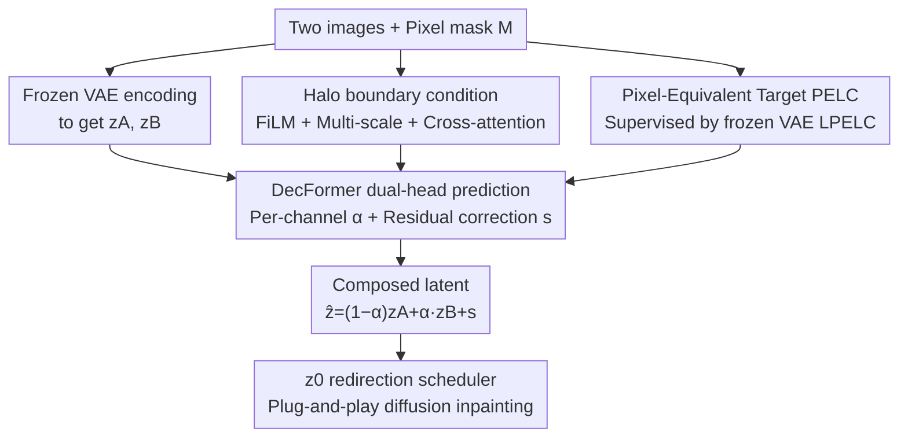

# Your Latent Mask is Wrong: Pixel-Equivalent Latent Compositing for Diffusion Models

**Conference**: CVPR 2026  
**Paper**: [CVF Open Access](https://openaccess.thecvf.com/content/CVPR2026/html/Bradbury_Your_Latent_Mask_is_Wrong_Pixel-Equivalent_Latent_Compositing_for_Diffusion_CVPR_2026_paper.html)  
**Keywords**: Latent space composition, Diffusion inpainting, VAE, Soft mask, Plug-and-play

## TL;DR
This paper demonstrates that the widely used heuristic of linearly interpolating two latents according to a mask in the VAE latent space is mathematically incorrect. It proposes the "Pixel-Equivalent" principle for latent composition and introduces DecFormer, a lightweight 7.7M-parameter transformer that learns this equivalent operator. DecFormer reduces mask boundary errors by up to 53% with only approximately 3.5% FLOPs overhead, without modifying the diffusion backbone.

## Background & Motivation

**Background**: Modern image generation predominantly utilizes Latent Diffusion Models (LDMs), which operate in the latent space of a pre-trained VAE downsampled by a factor of 8. For masked generation tasks such as inpainting and local editing, the standard approach treats latents as "pseudo-pixels"—downsampling the pixel mask $M$ to latent resolution $m$ and performing a convex combination of new and old latents at each sampling step: $z_{t-1}=(1-m)\odot\hat z+m\odot z^{orig}$. This heuristic is the default implementation in Diffusers, commercial products, and academic pipelines.

**Limitations of Prior Work**: This "blending latents like pixels" heuristic causes significant halos, color shifts, and blurring at mask boundaries. More critically, the paper observes global degradation and discoloration even in background regions far from the mask. Furthermore, downsampling the pixel mask by 8x loses fine structures; heuristic masks cannot represent boundaries finer than $1/8$ resolution, leading to blurry high-resolution inpainting.

**Key Challenge**: The fundamental cause is that modern VAE decoders $D$ are **non-linear and spatially entangled**, rather than simple downsampling operators. Effective Receptive Field (ERF) analysis quantifies this: a single latent in the Flux VAE does not just cover an aligned $8\times8$ patch; the encoder's receptive field for a single latent position is approximately 217 pixels, and the decoder's "influence domain" is about 536 pixels, following a power-law distribution. Consequently, linear blending in latent space **does not guarantee** pixel-space equivalence:

$$E(x_A\oplus_M x_B)\neq (1-m)\cdot E(x_A)+m\cdot E(x_B)$$

The paper further proves that for non-linear decoders, there exist $z_A, z_B, M$ such that no convex interpolation $\alpha\in[0,1]$ can achieve pixel equivalence. In soft-mask scenarios, over half of the voxels would require mixing coefficients outside $[0,1]$ to restore the ground-truth encoding—making convex interpolation theoretically insufficient.

**Goal / Key Insight**: Instead of training massive mask-aware denoising backbones (such as ControlNet, BrushNet, or Flux-Fill, which range from hundreds of millions to 12 billion parameters and require multi-GPU training), the authors redefine the problem as "fixing the composition operator itself." Boundary stitching quality should be handled by a lightweight, plug-and-play latent operator, while semantic content remains the responsibility of the original backbone.

**Core Idea**: Formalize "Pixel-Equivalent Latent Compositing" (PELC) as a trainable objective. Using a frozen VAE for pixel-level supervision, the model learns a truly equivalent latent composition operator, enabling full-resolution mask control and genuine soft-boundary alpha blending without fine-tuning the backbone.

## Method

### Overall Architecture

The method consists of two layers. The **Principle Layer (PELC)** defines the criteria for a correct latent operator: for any pixel operation $F$, its corresponding latent operator $C_F$ should satisfy Decoding Equivalence (DE) and Encoding Equivalence (EE):

$$D(C_F(z))=F(D(z)),\qquad C_F(E(x))=E(F(x))$$

Inpainting is the specific case where $F(x_A,x_B,M)=(1-M)\odot x_A+M\odot x_B$. The **Instance Layer (DecFormer)** is a 7.7M-parameter transformer that takes latents $(z_A,z_B)$ and a pixel mask $M$ as input, outputting **per-channel mixing weights** $\alpha$ and a **residual correction** $s$ to predict the composed latent $\hat z=(1-\alpha)z_A+\alpha z_B+s$. During training, a frozen VAE encodes the "pixel composition result" into the target latent $z_T=E(F(x_1,x_2,M))$ for supervision, ensuring "composition-then-decoding" approximates "composition in pixel space." The pipeline is plug-and-play for diffusion backbones, requiring no fine-tuning and merely replacing the heuristic blending step during inference.

### Key Designs

**1. PELC Target: Transforming "Operator Correctness" into an Optimizable Signal**

The lack of a definition for "correct latent composition" has led to the ubiquitous but flawed use of linear interpolation. PELC provides a criterion: the decoded result of the composition must equal the composition in pixel space (DE), and the encoding of a composed image must equal the composed encoding (EE). The training objective constrains both:

$$\mathcal L_{PELC}=\lambda_E\,\mathcal L_E+\mathcal L_D,\quad \mathcal L_E=\mathbb E\,\|\hat z-z_T\|_2^2,\quad \mathcal L_D=\mathbb E\big[\mathcal L_{LPIPS}(\hat x,x_T)+\lambda_H\,\mathcal L_{Halo\text{-}L1}(\hat x,x_T)\big]$$

Where $z_T=E(F(x_1,x_2,M))$ is the target latent obtained via "pixel composition then encoding", $\hat x=D(\hat z)$, and $x_T=D(z_T)$. A key trick is using the **encoded-decoded** pixels $x_T=D(z_T)$ as the supervision target rather than the original pixel composition, allowing the VAE's reconstruction error to cancel out and avoid contaminating the objective. This forces the model to satisfy per-pixel alignment after decoding rather than merely matching latent values—a proxy target that fails to account for human perception.

**2. Dual-head Decomposition of α and Residual s: Handling Non-linearity**

A simple mixing weight is insufficient since convex interpolation cannot achieve equivalence due to VAE non-linearity. The authors observe that heuristic blending errors are **highly concentrated at mask boundaries**. Thus, the operator is decomposed into two parts: per-channel, full-resolution weights $\alpha\in[0,1]^{C\times h\times w}$ to recover most of the signal, and a residual $s\in\mathbb R^{C\times h\times w}$ to provide "off-axis" corrections for decoder curvature:

$$\hat z=(1-\alpha)z_A+\alpha z_B+s$$

Notably, $\alpha$ is **per-channel** rather than a broadcasted single-channel mask, addressing the "channel heterogeneity" of modern VAEs. Ablation studies (Table 1) show that removing the residual $s$ significantly degrades performance (LPIPS 0.030→0.051). This decomposition keeps the model lightweight by using linear operations where possible and reserving the residual for complex boundaries.

**3. Halo Boundary Condition + Multi-scale Architecture: Focused Computation**

Errors are concentrated at mask edges due to spatial entanglement. The authors calculate a "halo" zone (approx. 8 pixels wide) with soft decay along the mask boundary. This serves two purposes: first, it conditions $\alpha$ and $s$ via FiLM, informing the heads of their proximity to the boundary; second, it acts as a loss weight to focus optimization on regions where naive interpolation fails. DecFormer uses a multi-scale patch architecture ([4, 2, 1, 1]); coarse scales gather global context cheaply, while patch=1 refines pixel-level boundaries. Cross-attention (for mask tokens) is only applied at the finest scale to ensure spatial alignment while saving computation.

**4. z0 Redirection Scheduler: Bridging Training and Inference**

DecFormer is trained on **clean latents** $z_0$, but diffusion sampling involves noisy latents $z_t$. The authors rewrite the scheduling step into three parts: (A) Predict the clean latent $z_0^\theta=z_t-t\,v_\theta(z_t,t)$; (B) Compose using DecFormer at the $z_0$ level: $z_0^\star=(1-\alpha)\odot z_0^\theta+\alpha\odot z_0^{ref}+s$; (C) Redirect the velocity toward the composed $z_0^\star$:

$$v^\star=\frac{z_t-z_0^\star}{t},\qquad z_{t'}=z_t+(t'-t)\,v^\star$$

DecFormer thus acts as a direct replacement for heuristic blending during sampling, ensuring geometrically correct composition at each step.

### Loss & Training
- **Losses**: Latent MSE ($\mathcal L_E$) + Pixel LPIPS + Halo-weighted L1 ($\mathcal L_D$).
- **Alpha-Shift Strategy**: Train $\alpha$ first, then gradually enable the residual head $s$ and introduce halo-weighted loss to focus on boundary residuals, preventing interference between heads.
- **Training**: H100, batch size 8, ~80k steps (128 epochs); resolutions 256–384 with aspect ratios $[0.5, 2.0]$; masks enhanced with edge detection and feathering.
- **Data**: 30k images from Flickr30k, 10k from WikiArt, and 100k internal high-res images; masks from P3M, GFM, and procedural shapes.

## Key Experimental Results

### Main Results: Composition Fidelity (1024px, COCO-2017 + Compositions-1k masks)

| Mask Type | Method | SSIM ↑ | PSNR ↑ | LPIPS ↓ | Halo L1 ↓ |
|----------|------|--------|--------|---------|-----------|
| Soft Mask σ=21 | DecFormer | **0.985** | **41.3** | **0.027** | **0.018** |
| Soft Mask σ=21 | Heuristic | 0.941 | 32.9 | 0.088 | 0.050 |
| Binary | DecFormer | **0.964** | **35.7** | **0.045** | **0.060** |
| Binary | Heuristic | 0.913 | 28.4 | 0.110 | 0.141 |
| Original | DecFormer | **0.968** | **38.6** | **0.049** | **0.037** |
| Original | Heuristic | 0.918 | 31.1 | 0.104 | 0.080 |
| Fine Mask | DecFormer | **0.967** | **34.7** | **0.045** | **0.073** |
| Fine Mask | Heuristic | 0.920 | 27.3 | 0.111 | 0.174 |

DecFormer outperforms the heuristic baseline across all mask types, with Halo L1 errors typically halved and PSNR improvements of 6–8 dB.

### Diffusion Inpainting (COCO-2017 val, mask area > 15%)

| Method | SSIM ↑ | PSNR ↑ | LPIPS ↓ | FID ↓ |
|------|--------|--------|---------|-------|
| Heuristic | 0.643 | 13.58 | 0.354 | 23.51 |
| DecFormer (Frozen Backbone) | 0.682 | 13.94 | 0.314 | 20.56 |
| LoRA only (No Compositor) | 0.653 | 14.16 | 0.331 | 21.52 |
| Flux.1-Fill (Full Fine-tune Ref) | 0.681 | 16.75 | 0.313 | 19.34 |
| DecFormer + LoRA | 0.680 | 14.23 | **0.303** | **19.28** |

DecFormer outperforms the heuristic baseline without backbone modification. Combined with a lightweight LoRA, it achieves perceptual quality (LPIPS/FID) comparable to or exceeding the 12B-parameter Flux.1-Fill.

### Ablation Study

| Configuration | Halo L1 ↓ | LPIPS ↓ | MSE ↓ | Description |
|------|-----------|---------|-------|------|
| Baseline (α+s+halo) | 0.0829 | 0.0303 | 0.0303 | Full model |
| w/o Halo L1 Loss | 0.0973 | 0.0299 | 0.0297 | Global metrics stable, boundary quality drops |
| Unconstrained α, w/o residual s | 0.1079 | 0.0514 | 0.0331 | Significant degradation |

### Key Findings
- **The residual head $s$ is essential**: Removing it leads to an LPIPS spike from 0.030 to 0.051, confirming that convex interpolation is insufficient.
- **Halo loss focuses on boundaries**: Removing it leaves global metrics unchanged but significantly worsens Halo L1.
- **Error localization**: Signed Distance Field (SDF) analysis shows that heuristic errors peak at distance=0; DecFormer exhibits a much lower peak and sharper decay.
- **DecFormer and LoRA are complementary**: LoRA handles semantic reasoning ("what to draw"), while DecFormer handles geometric stitching ("how to sew").
- **PELC generalizes beyond composition**: For parametric pixel transforms (gamma, contrast, brightness), PELC-trained operators reproduce the target with high fidelity, whereas direct latent transforms cause catastrophic degradation.

## Highlights & Insights
- **Challenging Industry Assumptions**: Proving that linear latent interpolation is fundamentally flawed in modern VAEs is a high-impact insight.
- **Self-Supervised Supervision**: Supervising with $D(E(\cdot))$ allows VAE reconstruction errors to cancel out, providing a "clean" signal for learning latent-space operations.
- **Efficiency**: Achieving 53% error reduction with only 7.7M parameters (0.07% of the backbone) and 3.5% FLOPs overhead offers an extremely high performance-to-cost ratio.
- **Decoupled Control**: Separating "stitching quality" from "denoising semantic generation" simplifies the task and avoids the need for massive full-model fine-tuning.

## Limitations & Future Work
- **Composition Only**: DecFormer handles "stitching" but not "content generation"; large-scale semantic editing still requires a mask-aware denoising backbone.
- **Theoretical Bounds**: VAE compression is lossy, and finite latent resolution means residual errors can be minimized but not eliminated.
- **VAE Scope**: Primarily validated on Flux VAE; generalization across more diverse VAE architectures remains to be tested.
- **Future Directions**: Extending PELC to spatial deformations and temporal consistency in video editing.

## Related Work & Insights
- **Comparison with Flux-Fill / BrushNet**: These models add millions of parameters and require heavy fine-tuning to teach the backbone mask awareness. Ours fixes the operator instead, staying lightweight and plug-and-play.
- **Comparison with SDEdit / Blended Diffusion**: These methods splice or modulate latents within the denoising trajectory but still rely on heuristic blending with downsampled masks, failing to address VAE spatial entanglement.
- **Comparison with Differential Diffusion**: While it uses hard swaps, it still operates on sub-latent voxels under broadcasted masks; DecFormer provides per-channel, full-resolution residual corrections.

## Rating
- Novelty: ⭐⭐⭐⭐⭐ Decisively debunks a standard industry practice and provides a theoretically grounded, lightweight solution.
- Experimental Thoroughness: ⭐⭐⭐⭐ Comprehensive analysis across mask types and tasks, though broader VAE validation would be ideal.
- Writing Quality: ⭐⭐⭐⭐⭐ Clear logical progression from theory (DE/EE) to pathology analysis and architecture.
- Value: ⭐⭐⭐⭐⭐ High practical utility for the LDM ecosystem with minimal overhead.

<!-- RELATED:START -->

## Related Papers

- [\[CVPR 2026\] SpeeDiff: Scalable Pixel-Anchored End-to-End Latent Diffusion Model](speediff_scalable_pixel-anchored_end-to-end_latent_diffusion_model.md)
- [\[CVPR 2026\] FlashDecoder: Real-Time Latent-to-Pixel Streaming Decoder with Transformers](flashdecoder_real-time_latent-to-pixel_streaming_decoder_with_transformers.md)
- [\[CVPR 2026\] Latent Diffusion Inversion Requires Understanding the Latent Space](latent_diffusion_inversion_requires_understanding_the_latent_space.md)
- [\[CVPR 2026\] LacTokGen: Latent Consistency Tokenizer for 1024-pixel Image Generation by 256 Tokens](lactokgen_latent_consistency_tokenizer_for_1024-pixel_image_generation_by_256_to.md)
- [\[CVPR 2026\] Taming Sampling Perturbations with Variance Expansion Loss for Latent Diffusion Models](taming_sampling_perturbations_with_variance_expansion_loss_for_latent_diffusion_.md)

<!-- RELATED:END -->
