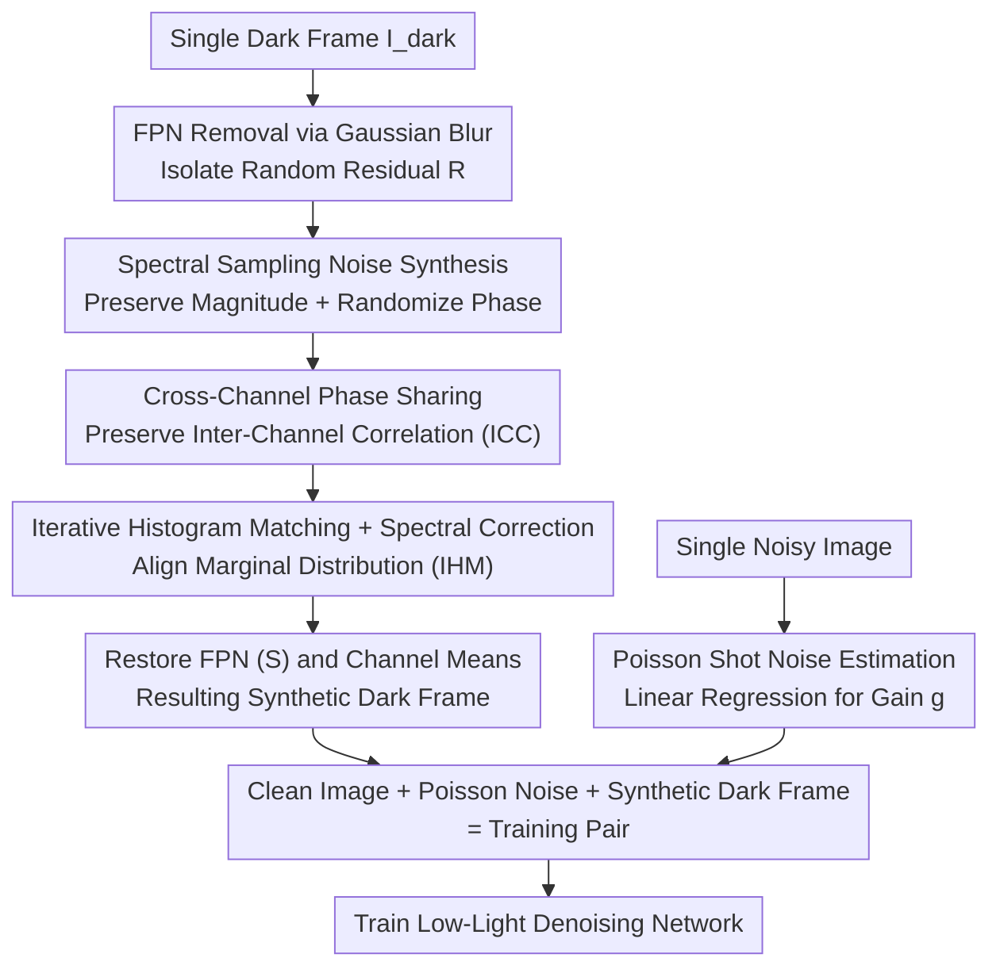

# 2-Shots in the Dark: Low-Light Denoising with Minimal Data Acquisition

**Conference**: CVPR 2026  
**Paper**: [CVF Open Access](https://openaccess.thecvf.com/content/CVPR2026/html/Lu_2-Shots_in_the_Dark_Low-Light_Denoising_with_Minimal_Data_Acquisition_CVPR_2026_paper.html)  
**Code**: https://github.com/IVRL/2-Shots-in-the-Dark  
**Area**: Image Restoration / Low-Light Denoising / Noise Synthesis  
**Keywords**: Low-light denoising, sensor noise synthesis, Fourier spectral sampling, random phase, dark frames

## TL;DR
This paper proposes a "two-shots are enough" sensor noise synthesis method—requiring only one noise image and one dark frame per ISO. It synthesizes signal-independent noise as a texture using random phase sampling in the Fourier domain, complemented by iterative histogram matching to correct marginal distributions. This allows for the generation of infinitely diverse training pairs without large-scale paired datasets, enabling denoising networks to achieve SOTA performance among physics-based methods on several low-light benchmarks.

## Background & Motivation

**Background**: Low-light RAW images are extremely noisy due to low photon counts and strong sensor noise. Learning-based denoisers require large volumes of "clean-noisy" paired images for training. Collecting such pairs is time-consuming, requiring tripods and remote triggers for every scene. Consequently, "noise synthesis" has become a mainstream alternative: given a clean image, a realistic noisy version is synthesized to create training pairs from scratch.

**Limitations of Prior Work**: Sensor noise is the sum of various sources, decomposable into **signal-dependent** (primarily photon shot noise) and **signal-independent** components. The signal-independent part is the most challenging, comprising dark current noise, thermal noise, reset noise, and banding noise. Existing approaches have significant drawbacks: ① Parametric physical models (ELD, SFRN) lack representational power and require tedious per-sensor multi-parameter calibration; ② Learning-based models (GAN, normalizing flow, diffusion) are more accurate but suffer from GAN training instability, flow architecture limitations, or slow diffusion generation—and **all still rely on large amounts of real paired data** to learn noise distributions.

**Key Challenge**: The goal is to make noise modeling "both accurate and data-efficient." Accuracy usually requires abandoning simplified parametric models for data-driven ones, but data-driven methods often sacrifice data efficiency. SFRN attempts a compromise by sampling signal-independent noise from patches within 10 dark frames, but the diversity of noise samples derived from 10 frames remains limited.

**Goal**: Push the data requirement for signal-independent noise synthesis to the limit—using only **one** dark frame and one noise image per ISO, without relying on paired data or parametric calibration, while generating diverse and statistically realistic noise.

**Key Insight**: The authors reinterpret the task of "creating infinitely diverse noise from a single dark frame" as a **texture synthesis** problem. Key observation: After removing Fixed Pattern Noise (FPN), signal-independent noise in a dark frame approximates a **stationary stochastic process**. Stationary random textures can be synthesized using the classic Random Phase Noise (RPN) algorithm: preserve the Fourier magnitude spectrum and randomize the phase to generate new realizations.

**Core Idea**: Use spectral sampling in the Fourier domain (preserving magnitude and randomizing phase) instead of parametric noise models to synthesize signal-independent noise, then refine the marginal distribution via iterative histogram matching. The signal-dependent part still utilizes a Poisson model, reducing the data collection cost to "two images per ISO."

## Method

### Overall Architecture
The input consists of **one real dark frame** $I_{dark}$ (captured with a lens cap in total darkness) and **one real noisy image** for each ISO setting; the output is any number of synthetic dark frames, which are overlaid onto clean images to create infinite "clean-noisy" training pairs. The pipeline has two branches: signal-independent noise follows the "spectral sampling" path (FPN removal → magnitude spectrum extraction → random phase → iterative histogram/spectral refinement → structural restoration), while signal-dependent noise follows the Poisson estimation branch (linear regression of gain $g$ from a single noisy image). These are combined during training: a clean image first receives Poisson noise, then a randomly selected synthetic dark frame of the same ISO is added.

### Key Designs

**1. Spectral Sampling for Dark Frames: Infinite Noise Diversity from a Single Texture**

Parametric models struggle with the trade-off between calibration effort and representational power, while patch-based sampling (SFRN) lacks diversity. The authors sidestep this via Random Phase Noise (RPN): for a stationary random texture, the Fourier **magnitude spectrum** encodes spatial correlation and frequency content, while the **phase** determines spatial positioning. By preserving the magnitude spectrum and randomizing the phase, one can generate new noise realizations with identical frequency characteristics.

This involves three steps. First, **FPN Removal**: Dark frames contain low-frequency structures (bias shading, FPN). Direct spectral analysis would be dominated by these components, skewing the statistics. Thus, a large Gaussian kernel is used to estimate the fixed pattern $S = G_\omega * I_{dark}$, yielding the random residual $R' = I_{dark} - S$, which is then zero-centered per channel $R = R' - \mu_R$. Second, **Spectral Prior Extraction**: Apply 2D DFT $\hat{R} = \mathcal{F}\{R\}$; the magnitude spectrum $|\hat{R}|$ serves as the "fingerprint" of the sensor noise. Third, **Phase Randomization**: Sample a random phase offset $\xi$ from a uniform distribution $[-\pi,\pi]$ to construct a new spectrum:

$$\hat{N} = |\hat{R}| \odot \exp\!\big(i(\theta_{\hat{R}} + \xi)\big),$$

Inverse transformation yields a new noise realization $N^{(0)} = \frac{1}{\sqrt{HW}}\mathcal{F}^{-1}\{\hat{N}\}$. Since only the phase changes, each $\xi$ produces a noise sample with identical frequency characteristics but a completely new spatial arrangement.

**2. Cross-Channel Phase Sharing: Preserving Inter-Channel Correlation (ICC)**

This is a subtle yet critical design. Real sensor noise has strong correlations across RGB channels (especially banding noise). Implementing independent phase offsets per channel would break this correlation, resulting in unrealistic noise and residual banding artifacts in the trained denoiser. The authors instead sample a **single-channel** random phase map $\xi_0 \sim \mathcal{U}[-\pi,\pi]$ and **replicate it across all channels** $\xi = \text{replicate}(\xi_0, C)$, ensuring shared phase perturbations and naturally maintaining ICC.

**3. Iterative Histogram Matching + Spectral Correction: Restoring Marginal Distributions**

Phase randomization preserves the magnitude spectrum but does **not guarantee** a histogram consistent with real noise. Sensor noise is often non-Gaussian (asymmetric or heavy-tailed). Magnitude spectra cannot capture moments like mean, variance, skewness, or kurtosis, which are vital for robust denoising. An iterative refinement process alternates between two complementary constraints for $K$ iterations. Each round performs **histogram matching** $N'^{(k)}_{hist} = \mathcal{H}(N^{(k)}, R)$ to align the marginal distribution with the real residual. Since this disrupts the frequency content, **spectral constraints are reapplied**: after zero-centering and DFT, the magnitude is replaced with the reference $|\hat{R}|$, keeping only the phase of the histogram-matched sample:

$$\hat{N}^{(k)}_{corrected} = |\hat{R}| \odot \exp\!\big(i\,\theta_{\hat{N}^{(k)}_{hist}}\big).$$

This ensures the synthetic noise satisfies both "pixel-wise marginal distribution" and "frequency/spatial correlation." The paper uses $K=10$ to balance quality and overhead.

**4. Single-Image Poisson Noise Estimation: Regression via a Single Noisy Frame**

Signal-dependent noise follows a Poisson distribution: $y = g\,\mathcal{P}(x) + n_{other}$, where $g$ is system gain. Given $\text{Var}(y) = g(gx) + \text{Var}(n_{other})$, $g$ can be estimated via linear regression. Without a clean image, the authors approximate the signal using the **mean intensity** within small patches as a "pseudo-clean signal," fitting the linear relationship with the noisy image. This achieves noise modeling with only one frame.

## Key Experimental Results

### Main Results
On SID and ELD test sets, the proposed method (Non-learning, 0 paired data, 1 dark frame per ISO) leads among physics-based methods and approaches the performance of models trained on real pairs.

| Dataset (Ratio) | Real Paired | ELD | SFRN | PMN | NoiseDiff (Learning) | Ours |
|--------|------|------|------|------|------|------|
| SID ×100 | 42.95 / 0.958 | 41.95 / 0.953 | 42.81 / 0.957 | 43.47 / 0.961 | **43.92** / 0.961 | 43.57 / 0.961 |
| SID ×250 | 40.27 / 0.943 | 39.44 / 0.931 | 40.18 / 0.934 | 41.04 / 0.947 | **41.28** / 0.946 | 41.24 / 0.945 |
| SID ×300 | 37.32 / 0.928 | 36.36 / 0.911 | 37.09 / 0.918 | 37.87 / 0.934 | **37.90** / 0.929 | 37.77 / 0.929 |
| ELD ×100 | 45.52 / 0.977 | 45.45 / 0.975 | 46.38 / 0.979 | 46.99 / 0.984 | 46.95 / 0.978 | **47.13** / **0.986** |

**Data Volume Comparison**: LRD/NoiseDiff/PMN require 1865 real pairs and hundreds of dark frames; ELD requires several dark frames and multi-parameter calibration; **Ours requires 0 pairs and only 1 dark frame**.

### Ablation Study
Ablation of ICC and IHM (SID, PSNR/SSIM):

| Configuration | SID ×100 | SID ×250 | SID ×300 | Description |
|------|---------|---------|---------|------|
| w/o ICC | 43.63 / 0.959 | 40.94 / 0.935 | 37.51 / 0.917 | Removing ICC results in banding artifacts. |
| w/o IHM | 43.55 / 0.952 | 40.75 / 0.926 | 37.39 / 0.911 | Removing IHM causes distribution mismatch and color distortion. |
| Full Model | **43.72** / **0.961** | **41.30** / **0.944** | **37.86** / **0.929** | — |

### Key Findings
- **ICC and IHM are complementary**: Removing ICC primarily leads to banding artifacts, while removing IHM results in distribution mismatch and downstream color distortion.
- **Cross-Sensor Generalization**: On the LRID dataset (Redmi K30, IMX686), the method remains superior or competitive using only 1 noise frame + 1 dark frame.
- **Diversity Advantage**: Compared to RandomCrop, spectral sampling generates significantly more diverse samples from a single dark frame, showing a clear Gain at higher exposure ratios.

## Highlights & Insights
- **Elegant Analogy**: Reinterpreting "noise synthesis" as "stationary texture synthesis" allows the use of classic RPN, bypassing parametric calibration.
- **Engineering Value**: Reducing data needs from "thousands of pairs" to "two frames per ISO" is highly practical for manufacturers without controlled calibration environments.
- **Universal Trick**: Cross-channel phase sharing is a valuable technique for any frequency-domain synthesis task needing to preserve inter-channel/view statistics.

## Limitations & Future Work
- **Ours** assumes stable imaging conditions. In reality, dark current and black level errors vary with sensor temperature and exposure time, which are not currently explicitly modeled.
- The method depends on the stationarity of noise after FPN removal. The estimation of $g$ from a single noisy image slightly underperforms compared to estimation from multiple pairs.

## Related Work & Insights
- **vs ELD**: ELD uses parametric distributions requiring complex calibration; Ours "learns" features directly from the dark frame spectrum.
- **vs SFRN**: SFRN samples from 10 frames; Ours samples from 1 frame with higher diversity via spectral manipulation.
- **vs Learning-based**: While methods like NoiseDiff may be slightly more accurate, they rely on massive paired data and are computationally expensive; Ours is lightweight and calibration-free.

## Rating
- Novelty: ⭐⭐⭐⭐⭐ 
- Experimental Thoroughness: ⭐⭐⭐⭐ 
- Writing Quality: ⭐⭐⭐⭐⭐ 
- Value: ⭐⭐⭐⭐⭐ 

<!-- RELATED:START -->

## Related Papers

- [\[CVPR 2026\] Efficient Real-Time Raw-to-Raw Denoising for Extreme Low-Light Ultra HD Video on Mobile Devices](efficient_real-time_raw-to-raw_denoising_for_extreme_low-light_ultra_hd_video_on.md)
- [\[CVPR 2026\] Bi-Bridge: Bidirectional Diffusion Bridges for Low-Light Image Enhancement](bi-bridge_bidirectional_diffusion_bridges_for_low-light_image_enhancement.md)
- [\[CVPR 2026\] Multinex: Lightweight Low-light Image Enhancement via Multi-prior Retinex](multinex_lightweight_low-light_image_enhancement_via_multi-prior_retinex.md)
- [\[CVPR 2026\] UDAPose: Unsupervised Domain Adaptation for Low-Light Human Pose Estimation](udapose_unsupervised_domain_adaptation_for_low_light_human_pose_estimation.md)
- [\[CVPR 2026\] VSRELL: A Simple Baseline for Video Super-Resolution and Enhancement in Low-Light Environment](vsrell_a_simple_baseline_for_video_super-resolution_and_enhancement_in_low-light.md)

<!-- RELATED:END -->
