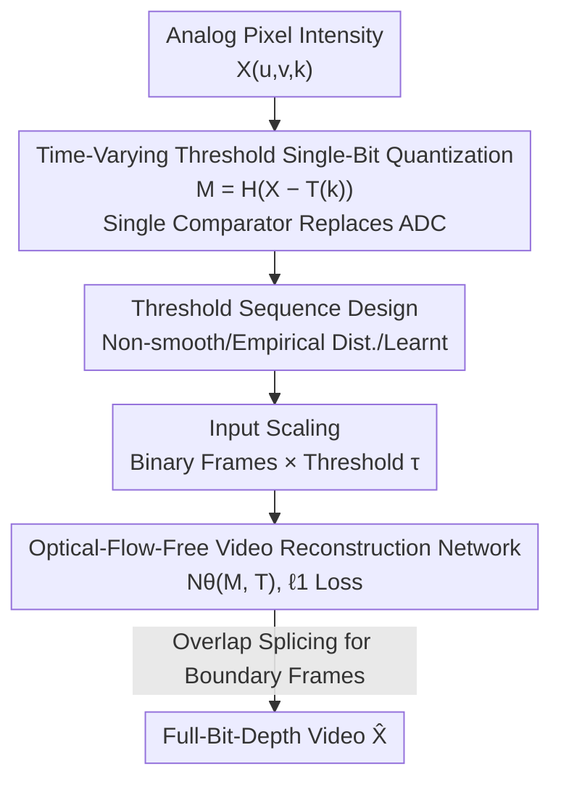

# A Bit is All You Need! Efficient Video Capture via Single Bit Imaging

**Conference**: CVPR 2026  
**Paper**: [CVF Open Access](https://openaccess.thecvf.com/content/CVPR2026/html/Gandikota_A_Bit_is_All_You_Need_Efficient_Video_Capture_via_CVPR_2026_paper.html)  
**Code**: None  
**Area**: Image Restoration / Computational Imaging  
**Keywords**: Single-Bit Imaging, Computational Video, Time-Varying Threshold, Video Reconstruction, Low-Power Sensors

## TL;DR
By sampling only 1 bit per pixel at the sensor end and "encoding" intensity information into the binary stream via time-varying thresholds, a video reconstruction network without optical flow recovers the full-bit-depth video. This approach eliminates the high-precision ADC, which consumes the most power, while achieving high-fidelity reconstruction with 32.77 dB PSNR on GoPro.

## Background & Motivation

**Background**: Conventional cameras use high-precision analog-to-digital converters (ADCs) on the sensor for uniform quantization to obtain 8-24 bit intensities. To reduce sensor output, existing approaches either rely on complex optical front-ends for compressed sensing / single-pixel imaging, or sacrifice resolution at high frame rates using ROIs, binning, and sub-sampling.

**Limitations of Prior Work**: These schemes cannot bypass a fundamental bottleneck—the ADC stage itself. As bit depth increases linearly, the sampling rate drops exponentially, while the ADC + chip I/O accounts for 70%-85% of the total sensor power consumption. Consequently, as long as high-bit-depth quantization is performed, massive data throughput remains a bottleneck, which is prohibitive for ultra-low-power, high-resolution, or extremely high-speed scenarios.

**Key Challenge**: To save power/bandwidth or increase the frame rate, bit depth must be reduced; however, reducing bit depth usually means loss of information and degradation of reconstruction quality. Retaining reconstructible information while pushing the bit depth to its absolute limit is a key challenge.

**Goal**: This work aims to compress the sensor bit depth directly to **1 bit/pixel** while recovering high-fidelity videos with full bit depth (8-14 bits), without introducing any complex optics, thereby simplifying the sensor hardware.

**Key Insight**: Fixed-threshold 1-bit quantization only provides a "bright/dark" binary output, which obviously discards most intensity information. However, the authors observe that if the **threshold varies over time**, and combined with the inherent spatiotemporal correlation in videos, then binary measurements across different frames slice the scene at different intensity levels. Consolidating multiple frames virtually "spreads" the intensity information across the temporal dimension.

**Core Idea**: Replacing the "high-bit-depth ADC" with "time-varying thresholded single-bit quantization + neural network reconstruction" embeds hardware compression directly into the physical sampling process, outsourcing the entire reconstruction burden to deep networks.

## Method

### Overall Architecture
The method consists of two stages: The **capture end** uses a single comparator to compare the analog pixel intensity with a frame-by-frame varying threshold $T(k)$, outputting a 1-bit measurement $M$. The **reconstruction end** uses a video reconstruction network $\mathcal{N}_\theta$ that takes the binary measurement sequence and the corresponding thresholds to directly regress the full-bit-depth video. The most critical aspect is the design of the "threshold sequence," which determines how much reconstructible spatiotemporal information is encoded into the binary stream. The core pipeline transformation is: high-bit-depth ADC $\rightarrow$ single comparator + time-varying thresholds $\rightarrow$ binary stream $\rightarrow$ neural network $\rightarrow$ full-bit-depth video.

### Key Designs

**1. Time-Varying Threshold Single-Bit Capture: Replacing the Entire ADC with a Single Comparator**

The problem is straightforward: fixed-threshold 1-bit quantization only distinguishes "bright/dark" and cannot preserve high-bit-depth intensity. The proposed approach varies the threshold $T(k)$ at each discrete time step $k$ across the full dynamic range of the sensor. The measurement is defined as:

$$M(u,v,k) = H\big(X(u,v,k) - T(k)\big),$$

where $H(\cdot)$ is the Heaviside step function (1 if $\ge 0$, 0 otherwise). In simple terms, a pixel in the $k$-th frame is 1 if its intensity exceeds that frame's threshold, and 0 otherwise. Hardware-wise, this aligns with the comparator of a ramp ADC in CMOS sensors. However, this method uses a **single threshold per frame** (applying the same DC reference voltage across the entire array, modulated externally between frames), allowing the complete ADC to be replaced by a single comparator per column or even per pixel. Since the intra-frame reference threshold remains uniform, the dynamic requirements of the comparator are significantly relaxed. It effectively shifts the "bit-depth" from the spatial dimension (multiple bits per pixel) to the temporal dimension (1 bit per frame over multiple frames), slicing the intensity across different thresholds. The spatiotemporal correlation allows these slices to be jointly reconstructed.

**2. Formulating Reconstruction as an Underdetermined Feasibility Problem Solved by an Optical-Flow-Free Network**

For static images, $2^m$ time-varying thresholds (corresponding to the steps of an m-bit ramp) can be used to solve an **overdetermined** system of inequalities per pixel to accurately recover m-bit intensities. However, in video, pixel intensities change frame-by-frame due to motion, leaving only **one** inequality per pixel per frame. The reconstruction degrades into an underdetermined linear feasibility problem with non-unique solutions:

$$\hat{X} = \arg\min_X R(X)\ \text{ s.t. }\ H(X - T) = M,$$

which relies on the video prior $R(X)$ to converge. Instead of explicitly solving this regularized optimization, the authors directly train a network:

$$\hat{X} = \mathcal{N}_\theta(M, T)$$

supervised by the $\ell_1$ loss between the network output and the ground truth. A key design choice is to **deliberately avoid optical flow-based reconstruction networks**. Many video reconstruction networks rely on estimated optical flow for temporal alignment. However, because thresholds vary frame-by-frame, a motion-compensated pixel may be binarized as 0 in one frame and 1 in another, causing optical flow estimation to fail. Therefore, the authors select **optical-flow-free** networks such as Aswin, EfficientSCI++, Res2former, and Shiftnet.

**3. Choice of Threshold Sequences: Non-smooth Permutation as the Quality Watershed**

How thresholds are sequenced directly determines how much temporal information is encoded into the binary stream. The authors systematically compare four strategies: ① **Uniform spacing, smooth variation**—minimizes single-frame error. However, when thresholds increase smoothly, the pixel-to-threshold relationship remains unchanged over adjacent frames (remaining 0 or 1), which severely degrades temporal resolution and performs the worst. ② **Uniform spacing with a non-smooth permutation**—finding a permutation that maximizes the minimum distance between adjacent thresholds. This induces frequent "threshold crossings," preserving temporal resolution and yielding a 1.4–1.8 dB PSNR increase over the smooth sequence, representing a quality watershed. ③ **Non-uniform non-smooth permutation**—since real pixel intensities are non-uniquely distributed, inverse transform sampling $T_2(k) = \Phi^{-1}(T_1(k))$ (where $\Phi^{-1}$ is the inverse CDF of the target distribution) is used to map uniform thresholds to a fitted Beta distribution or empirical quantiles, followed by a non-smooth permutation. ④ **Learnable thresholds**—learning thresholds and network weights end-to-end. Since quantization is non-differentiable, backpropagation approximates the thresholding operation with a continuous sigmoid. In experiments, the empirical distribution with non-smooth permutation slightly outperforms other methods, while the learnable thresholds remain almost unchanged when initialized with a non-smooth sequence, suggesting that the non-smooth uniform sequence is already near-optimal. Crucially, the threshold function and its optimization are decoupled from the sensor array/data converter design, allowing the same hardware to run arbitrary threshold sequences.

**4. Overlapping Reconstruction to Fix Boundary Frames + Input Scaling: Squeezing Out Every Bit of Information**

Two engineering but highly effective designs are introduced. First, **overlapping reconstruction**: repeating 10 unique thresholds to obtain 20 frames as network input. However, boundary frames have less context, leading to lower reconstruction quality. To address this, the authors perform another reconstruction shifted by 10 frames and replace the boundary frames of the initial reconstruction with the corresponding center frames of the shifted version. Second, **input scaling**: instead of feeding the binary frames directly, they are weighted by the current frame's threshold $\tau$ (0 $\rightarrow$ 0, 1 $\rightarrow$ $\tau$), or symmetrically mapped as 0 $\rightarrow$ $\tau/2$, 1 $\rightarrow$ $(1+\tau)/2$ to distribute the quantization error symmetrically. Direct binary input performs the worst, while both scaling variants provide a distinct boost with comparable results.

### Loss & Training
The reconstruction network is trained using the $\ell_1$ loss between the output and the full-bit-depth ground truth. The 8-bit experiments use GoPro (22 training videos, 250 fps, 8-bit) for training and evaluate on 11 test videos. The RAW experiments use Real-RawVSR (14-bit, 25 fps) and ReCRVD (12-bit). RAW frames are linearly normalized to $[0, 1]$ to approximate the linear sensor response, and tone-mapped using a gamma mapping with $\gamma=1.6$, where the thresholds are also scaled by $\tau^{1/\gamma}$. All experiments use fixed random seeds to ensure reproducibility and fair comparison.

## Key Experimental Results

### Main Results
Evaluation of different reconstruction networks on the GoPro dataset (reconstructing 8-bit grayscale videos from simulated 1-bit measurements):

| Network | PSNR/SSIM (overlap) | PSNR/SSIM (no-overlap) |
|------|----------------------|--------------------------|
| Aswin | **32.77 / 0.9239** | **32.24 / 0.9174** |
| EfficientSCI++ | 32.17 / 0.9207 | 31.78 / 0.9142 |
| Shiftnet | 30.69 / 0.8930 | — |
| Res2former | 30.26 / 0.8808 | 29.82 / 0.8729 |

Aswin provides the highest reconstruction fidelity; the overlap boundary fix consistently yields a gain of about 0.4–0.5 dB.

### Ablation Study

Threshold Strategy Selection (Tab. 2, 10 threshold repetitions):

| Threshold Strategy | PSNR/SSIM (no-overlap) | PSNR/SSIM (overlap) |
|----------|--------------------------|------------------------|
| Uniform-Smooth | 30.32 / 0.8828 | 31.31 / 0.9132 |
| Uniform-Non-smooth | 32.20 / 0.9171 | 32.75 / 0.9236 |
| Empirical Dist.-Non-smooth | **32.24 / 0.9174** | **32.77 / 0.9239** |
| Beta Dist.-Non-smooth | 31.15 / 0.9096 | 31.66 / 0.9138 |
| Learnable | 32.15 / 0.9162 | 32.68 / 0.9230 |

Threshold Sequence Length (uniform, smoothly increasing):

| Configuration | PSNR/SSIM |
|------|-----------|
| n = 8 | 29.23 / 0.8710 |
| n = 10 | 29.29 / 0.8712 |
| n = 20 | 26.50 / 0.8043 |
| n = 10 (repeated 2x → 20 frames) | **30.32 / 0.8828** |

Input Scaling (non-smooth uniform thresholds):

| Scaling Method | PSNR/SSIM (overlap) |
|----------|------------------------|
| No scaling | 31.74 / 0.9168 |
| 0→0, 1→τ | **32.75 / 0.9236** |
| 0→τ/2, 1→(1+τ)/2 | 32.73 / 0.9235 |

### Key Findings
- **Non-smooth permutation is the major contributor**: Changing the threshold sequence from smooth to maximally non-smooth increases PSNR by 1.4–1.8 dB, significantly outperforming distribution modifications (e.g., using Beta distribution is worse than uniform non-smooth). This underscores that preserving "temporal resolution" is far more critical than "matching the intensity distribution."
- **More thresholds do not necessarily yield better results**: Increasing $n$ from 8 to 10 provides only a minor gain, while extending it directly to 20 drops performance by over 2.5 dB (as adjacent thresholds become too dense, the inter-frame relationships remain static, leading to a loss in temporal resolution). Conversely, repeating 10 thresholds to 20 frames improves performance because the network can exploit motion information across frames with identical thresholds.
- **Strong generalization**: The Aswin model trained on GoPro (250 fps) directly evaluates on XVFI (1000 fps) at 35.09 dB and QUIVER (2000 fps) at 34.76 dB, generalizing across 250–5000 fps and various high-speed cameras. Feeding RGB channels sequentially into the grayscale model restores color videos.
- **Motion is the primary challenge**: Optical flow analysis indicates that reconstruction quality remains generally stable across varying motion ranges ($>27.85$ dB). Failure cases are concentrated in extreme motion samples from Real-RawVSR (ranging from a worst of 18.27 dB to a best of 37.45 dB).
- **Robustness to noise and non-ideal comparators**: After fine-tuning, the model remains stable under noise level $\sigma \in [0, 0.1]$, and still achieves 30.77 dB under hardware comparator jitter.

## Highlights & Insights
- **Trading Spatial Bit Depth for Temporal Dimension**: The core insight is reconstructing intensity information temporally from "1 bit/pixel/frame × multi-frame time-varying thresholds." This perspective makes the counter-intuitive "1-bit recovery of full-bit-depth" mathematically self-consistent and transferable to any low-power imaging system where comparators replace ADCs.
- **Clever Counter-intuitive Discovery of Non-smooth Thresholds**: Intuitively, smooth thresholds are expected to perform better. However, because they remain stagnant across frames, temporal details are lost. The authors resolve this by explicitly maximizing the minimum distance between adjacent thresholds, creating a clean, reproducible design.
- **Deliberately Avoiding Optical Flow in Reconstruction**: Standard video tasks rely heavily on optical flow alignment. Here, the authors demonstrate that frame-varying thresholds disrupt pixel correspondence, making optical flow counterproductive—representing a valuable case study where task characteristics govern architectural trade-offs.
- **Solid System-Level Benefit Analysis**: The paper quantitatively analyzes memory reductions ($1/m$), speedups (1 comparison instead of 256), and silicon area/cost reduction alongside power savings (70-85% saved from ADC elimination), moving beyond simple PSNR metrics.

## Limitations & Future Work
- **Acknowledged Bottleneck**: Outsourcing reconstruction entirely to external deep networks leads to higher network inference power compared to conventional high-bit-depth capture. However, compared to the hard bottleneck of "high-bit-depth capture at high frame rates," the overall savings from 1-bit capture remain highly favorable.
- **Vulnerability to Extreme Motion**: Under low frame rates with large inter-frame motion (e.g., in Real-RawVSR), the mathematical constraints of the feasibility problem become too relaxed, leading to performance drops (such as the 18.27 dB failure case). The method is best suited for high-frame-rate scenes with small frame-to-frame movements.
- **Simulation-only Validation**: Although a hardware proof-of-concept is present (using digital frames routed to analog voltage via a high-speed comparator), end-to-end evaluation on real large-scale sensors under actual noise and analog comparator jitter remains limited.
- **Future Directions**: Explicitly incorporating motion cues into reconstruction (without disrupting binary correspondence), designing adaptive threshold sequences for extreme motion, and deploying of the pipeline on a fabricated low-power sensor chip.

## Related Work & Insights
- **vs. Compressed Sensing / Single-Pixel Video Imaging**: They rely on complex optical front-ends to perform multiplexed compression, followed by algorithmic inversion. This paper simplifies hardware by replacing ADCs with comparators to perform compression directly within the sensor circuitry without modulating optics.
- **vs. Video Bit-Depth Extension / HDR Reconstruction**: Existing bit-depth extension works focus on moderately quantized uniform inputs, and HDR uses multi-exposure low-dynamic-range arrays. None are designed for the extreme quantization of 1-bit inputs, which this work directly addresses.
- **vs. Quanta/Photon-Counting Sensors, Spike/Event Cameras**: Although they also record high-temporal-resolution 1-bit data, they require specialized digital photon-counting or asynchronous hardware, and often require a conventional camera to recover full-resolution videos. In contrast, this approach records 1 bit/pixel on **ordinary sensor grids** and reconstructs full videos computationally without auxiliary sensors.
- **vs. 1-bit Compressed Sensing / Dithering Schemes**: Prior works rely on fixed-threshold sign measurements or dithered random thresholds to improve reconstruction, but have not been validated on video. This paper systematically explores the effect of time-varying threshold sequences on video reconstruction.

## Rating
- Novelty: ⭐⭐⭐⭐⭐ Compressing sensor bit depth to 1 bit while retaining high-fidelity recovery represents a paradigm-shifting approach to camera pipeline design.
- Experimental Thoroughness: ⭐⭐⭐⭐ Extensive ablation studies on network types, threshold sequences, frame lengths, scaling, noise, OOD performance, and RAW formats. However, it relies heavily on simulated measurements, with limited real hardware validation.
- Writing Quality: ⭐⭐⭐⭐⭐ Clear motivations, in-depth design trade-offs, and robust system-level benefit analysis.
- Value: ⭐⭐⭐⭐⭐ Targets the core bottleneck of ultra-low-power, high-speed, and gigapixel imaging, with strong practical relevance for sensor and computational imaging design.

<!-- RELATED:START -->

## Related Papers

- [\[CVPR 2026\] LRDUN: A Low-Rank Deep Unfolding Network for Efficient Spectral Compressive Imaging](lrdun_a_low-rank_deep_unfolding_network_for_efficient_spectral_compressive_imagi.md)
- [\[CVPR 2026\] DetectSCI: Toward Object-Guided ROI Reconstruction for High-Resolution Video Snapshot Compressive Imaging](detectsci_toward_object-guided_roi_reconstruction_for_high-resolution_video_snap.md)
- [\[CVPR 2026\] Retrieve-to-Restore: Efficient All-in-One Image Restoration with a Retrieval-Based Degradation Bank](retrieve-to-restore_efficient_all-in-one_image_restoration_with_a_retrieval-base.md)
- [\[CVPR 2025\] Proximal Algorithm Unrolling: Flexible and Efficient Reconstruction Networks for Single-Pixel Imaging](../../CVPR2025/image_restoration/proximal_algorithm_unrolling_flexible_and_efficient_reconstruction_networks_for_.md)
- [\[CVPR 2026\] Time-Specialized Event-Image Alignment for Blur-to-Video Decomposition](time-specialized_event-image_alignment_for_blur-to-video_decomposition.md)

<!-- RELATED:END -->
