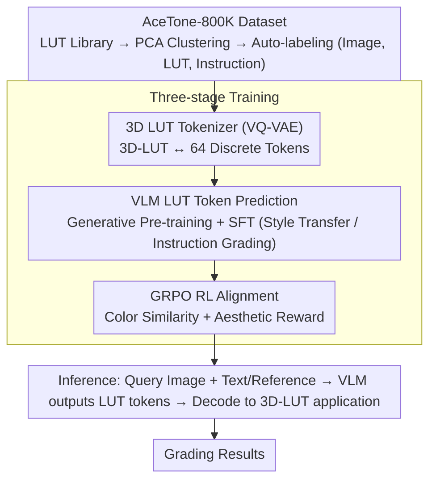

# AceTone: Bridging Words and Colors for Conditional Image Grading

**Conference**: CVPR 2026  
**arXiv**: [2604.00530](https://arxiv.org/abs/2604.00530)  
**Code**: [https://github.com/martian422/AceTone](https://github.com/martian422/AceTone)  
**Area**: Image Restoration  
**Keywords**: Color grading, 3D-LUT, VQ-VAE tokenizer, VLM, GRPO reinforcement learning

## TL;DR
AceTone is proposed as the first unified framework supporting multimodal conditional color grading for both text and reference images. It compresses 3D-LUT into 64 discrete tokens via VQ-VAE, trains a VLM to predict LUT token sequences, and utilizes GRPO reinforcement learning to align color similarity and aesthetic preferences, achieving a 50% LPIPS improvement in style transfer and instruction-based grading.

## Background & Motivation

**Background**: Color grading is essential for image style and emotion. Existing methods either rely on weight combinations of predefined filter libraries or use CNNs for patch-wise recoloring. Reference-based style transfer and text-based instruction grading tasks often utilize incompatible models.

**Limitations of Prior Work**: (1) Existing methods lack sufficient expressive power or efficiency; (2) Generative Adversarial Network (GAN) training is unstable and prone to mode collapse; (3) There is a lack of alignment mechanisms with human aesthetic preferences; (4) Reference-based and text-based grading require independent models.

**Key Challenge**: Color grading requires both precise color control (the advantage of LUTs) and deep understanding of complex semantic instructions (the advantage of VLMs), yet these two have not been effectively integrated.

**Key Insight**: Treat the LUT as atomic operations for color transformation by tokenizing it, enabling a VLM to generate these tokens.

**Core Idea**: (1) A VQ-VAE tokenizer compresses the $3 \times 32^3$ LUT into 64 discrete tokens; (2) The VLM predicts the LUT token sequence; (3) GRPO is used for reward alignment based on color similarity and aesthetic scores.

## Method

### Overall Architecture
The core challenge AceTone addresses is the need for the precise, lossless global color control of LUTs combined with the complex semantic understanding of VLMs, which were previously handled by disjoint and incompatible models. The proposed solution is to transform the LUT itself into a "language" that the VLM can "speak." A VQ-VAE first compresses the 3D-LUT into 64 discrete tokens, then the VLM is trained to autoregressively predict this token sequence like a sentence. Finally, reinforcement learning aligns the output with human aesthetics.

The process consists of three training stages: first, training the LUT Tokenizer (VQ-VAE) for reversible conversion between LUTs and tokens; second, generative pre-training for the VLM to learn LUT token prediction; and third, post-training (SFT for specific tasks + GRPO for preference alignment). During inference, the query image, along with text instructions or a reference image, is fed into the VLM, which outputs a sequence of LUT tokens that are decoded into a 3D-LUT and applied to the image.

### Key Designs

**1. 3D LUT Tokenizer: Compressing continuous color mapping volumes into discrete tokens for VLM generation.**

VLMs are inherently designed to generate discrete tokens, while a $3 \times 32 \times 32 \times 32$ LUT is a continuous high-dimensional volume. To bridge this gap, AceTone uses a VQ-VAE: a 3D convolutional encoder downsamples the LUT to $4 \times 4 \times 4 \times D$, which is then discretized into 64 tokens via a vector quantization layer with a codebook of size $K=256$, and reconstructed by a 3D convolutional decoder. The training objective is reconstruction loss plus a codebook commitment term $\mathcal{L} = \mathcal{L}_{rec} + \beta \mathcal{L}_{commit}$. VQ-VAE is chosen over direct regression because a LUT is essentially a 3D color mapping volume; volumetric convolution with quantization provides significant compression while maintaining an error of $\Delta E < 2$ (perceptually negligible), ensuring the precision of the pipeline.

**2. VLM LUT Token Prediction: Unifying "Reference Transfer" and "Text-based Grading" into a single sequence generation problem.**

Previously, reference-based style transfer and text-instruction grading required incompatible models due to different condition formats. AceTone formalizes color transformation as autoregressive token sequence prediction given vision-text conditions, making both tasks essentially the same problem with different conditions $c$. It first performs generative pre-training using (Image, LUT, prompt) triplets to maximize conditional likelihood $\mathcal{L}_{gen} = -\sum \log p_\theta(z_t \mid z_{<t}, I, L(I), c)$. Subsequently, SFT is applied to both tasks: reference images are provided for Perspective Style Transfer (PST), while Qwen2.5-VL-32B generates editing instructions for Image-Guided Grading (IGG). This allows a single model to comprehend both reference images and natural language.

**3. GRPO Reinforcement Learning Alignment: Avoiding GAN instability by aligning a stable likelihood model with aesthetics via RL.**

Likelihood-based pre-training only learns to "grade like the training set" without a mechanism to align with human aesthetic preferences. Unlike unstable GAN training, AceTone employs GRPO for preference alignment on a stable generative model. The reward consists of two items: a color similarity reward $r_{color} = \frac{1}{\max(2, \Delta E) - 1}$ (full score when $\Delta E < 2$ to ensure target adherence) and an aesthetic reward $r_{aes}$ (visual pleasure score from a pre-trained DeQA model). Following standard GRPO, $G$ candidate LUTs are sampled for one condition, rewards are computed, group normalization provides the advantage, and the policy is updated with KL regularization to prevent divergence.

**4. AceTone-800K Dataset: A high-quality LUT corpus and benchmark tailored for tokenization and RL.**

A massive, diverse (Image, LUT, Instruction) dataset was required. Starting from 10K licensed LUT filters and PPR-10K expert grading, the authors selected 8192 core LUTs via PCA clustering to remove redundancy, eventually auto-labeling 800K tuples. Two evaluation benchmarks were established: AceTone-Bench Transfer (1024 samples) and AceTone-Bench Instruct (128 samples). Ablations confirm that data diversity is critical for the GRPO stage.

### Loss & Training
The Tokenizer uses MSE reconstruction loss and commitment loss; Generative pre-training and SFT utilize cross-entropy; the RL stage employs the GRPO objective with KL regularization.

## Key Experimental Results

### Main Results (Style Transfer PST-50)

| Method | Aes.↑ | PSNR↑ | LPIPS↓ | ΔE↓ |
|------|-------|-------|--------|-----|
| Neural Preset | 3.03 | 21.24 | 0.15 | 9.57 |
| SA-LUT | 3.07 | 21.64 | 0.16 | 9.01 |
| ModFlow | 3.08 | 20.13 | 0.16 | 10.62 |
| **Ours (AceTone)** | **3.29** | **24.26** | **0.09** | **7.26** |

On AceTone-Bench[Transfer], LPIPS decreased from 0.22 (SA-LUT) to **0.11** (a 50% improvement).

### Ablation Study

| Configuration | Aes.↑ | LPIPS↓ | Description |
|------|-------|--------|------|
| Pre-train only | Baseline | Baseline | Basic LUT prediction capability |
| + SFT | + Gain | + Gain | Task adaptation |
| + GRPO | **Best** | **Best** | Key for aesthetic alignment |
| w/o Aesthetic Reward | Decrease | Constant | Aesthetic score contributes to perceptual quality |
| w/o Color Reward | Constant | Decrease | Color reward ensures accuracy |

### Key Findings
- The contribution of the GRPO stage is primarily reflected in aesthetic score improvement and color consistency optimization.
- The fidelity of the LUT tokenizer ($\Delta E < 2$) serves as the foundation for the entire pipeline's precision.
- Data diversity is crucial for GRPO training; the performance gap between using the full dataset versus a subset is significant.
- It is demonstrated for the first time that VLMs can effectively predict discrete representations of 3D color transformations.

## Highlights & Insights
- **Innovation in LUT Tokenization**: Compressing 3D-LUTs into 64 tokens makes color transformation a "language" for VLMs, bridging the gap between language models and color operations.
- **Staged Learning Paradigm**: Starting with likelihood pre-training followed by RL alignment avoids the instability of GANs and provides a scalable training path for color grading.
- **Unified Multimodal Conditioning**: A single model supports both reference image and text instruction grading modes simultaneously.

## Limitations & Future Work
- LUTs perform global color transformations and cannot handle local grading (e.g., adjusting only the sky).
- The $32^3$ resolution of the LUT has finite precision (extreme transformations may cause quantization artifacts).
- GRPO training requires heavy sampling and reward computation, leading to high training costs.
- The preferences of the aesthetic evaluation model (DeQA) itself may be "learned" into the model.

## Related Work & Insights
- **vs Neural Preset/SA-LUT**: These combine predefined LUT libraries with limited expression. AceTone generates LUTs from scratch.
- **vs Diffusion Models**: Diffusion models can recolor images but suffer from high latency and potential structural damage. LUT applications are lossless.
- **vs CLIP-guided methods**: CLIP maps text to color operations but is limited by a small vocabulary. VLMs understand complex instructions.

## Rating
- Novelty: ⭐⭐⭐⭐⭐ Complete innovation chain of LUT tokenization + VLM generation + GRPO alignment.
- Experimental Thoroughness: ⭐⭐⭐⭐ Quantitative results and user studies included, though the dataset is not yet public.
- Writing Quality: ⭐⭐⭐⭐ Clear methodological descriptions and complete dataset details.
- Value: ⭐⭐⭐⭐⭐ Opens a new direction for language-driven color grading with practical value for post-production industries.

<!-- RELATED:START -->

## Related Papers

- [\[CVPR 2026\] Bridging the Perception Gap in Image Super-Resolution Evaluation](bridging_the_perception_gap_in_image_super-resolution_evaluation.md)
- [\[CVPR 2026\] Bridging Human Evaluation to Infrared and Visible Image Fusion](bridging_human_evaluation_to_infrared_and_visible_image_fusion.md)
- [\[CVPR 2026\] CanonCGT: Reference-Based Color Grading via Canonical Pivot Representation](canoncgt_reference-based_color_grading_via_canonical_pivot_representation.md)
- [\[CVPR 2026\] Bridging Fidelity-Reality with Controllable One-Step Diffusion for Image Super-Resolution](bridging_fidelity-reality_with_controllable_one-step_diffusion_for_image_super-r.md)
- [\[ICML 2026\] One-shot Conditional Sampling: MMD meets Nearest Neighbors](../../ICML2026/image_restoration/one-shot_conditional_sampling_mmd_meets_nearest_neighbors.md)

<!-- RELATED:END -->
