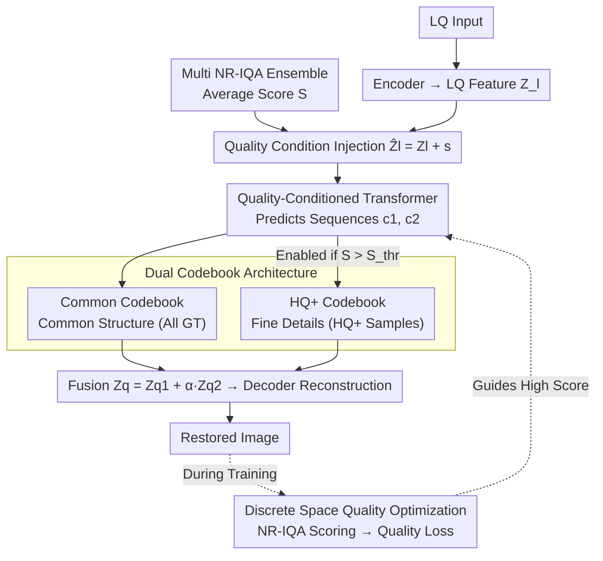

# Beyond Ground-Truth: Leveraging Image Quality Priors for Real-World Image Restoration

**Conference**: CVPR 2026  
**arXiv**: [2603.29773](https://arxiv.org/abs/2603.29773)  
**Code**: [https://github.com/fengyang1399-pixel/IQPIR](https://github.com/fengyang1399-pixel/IQPIR)  
**Area**: Image Restoration  
**Keywords**: Image Restoration, Image Quality Prior, Dual Codebook, NR-IQA, Quality Conditioning

## TL;DR
The IQPIR framework is proposed, which introduces Image Quality Priors (IQP) from pre-trained NR-IQA models as conditioning signals. Through three mechanisms—a quality-conditioned Transformer, a dual-codebook structure, and quality optimization in discrete representation space—the model guides the restoration process toward the highest perceptual quality, comprehensively outperforming SOTA on tasks such as blind face restoration.

## Background & Motivation

**Background**: Real-world image restoration aims to recover high-quality (HQ) images from low-quality (LQ) inputs with complex degradations. Codebook-based methods transform restoration into a code prediction problem in a discrete representation space, effectively reducing reconstruction ambiguity.

**Limitations of Prior Work**: Existing methods implicitly assume that the Ground-Truth (GT) is the perfect and unique source of supervision. However, as shown in Figure 1, the perceptual quality of GT datasets (e.g., FFHQ) is inconsistent—most GT quality scores fall between 5-8, with very few reaching 9. Models tend to converge to the **average quality level** of the GT rather than the maximum achievable quality.

**Key Challenge**: (1) Training only on the highest-quality GT leads to insufficient data diversity, resulting in artifacts and failure to handle various degradations; (2) Training on the entire GT dataset pulls the performance down to the average quality.

**Key Insight**: Different quality levels of GT provide different functions—HQ+ GT is proficient in fine structural control, while average GT is better suited for restoring large-scale blur.

**Core Idea**: Inject NR-IQA scores as conditioning signals into the restoration model and set them to the maximum value during inference to guide the network toward the highest quality output. A dual-codebook structure is used to learn general structures and HQ+ details separately.

## Method

### Overall Architecture
The core problem IQPIR addresses is that inconsistent GT quality pulls the model toward the average quality level. IQPIR explicitly treats "quality" as a controllable condition, pulling the network toward the highest quality during inference. The process consists of two stages. In the first stage, a set of discrete representations (Dual Codebook) is learned to decouple "common structure" and "high-quality specific details" into separate codebooks. In the second stage, the codebooks are frozen, and a quality-conditioned Transformer is trained to predict two code sequences from the LQ input. These codes are used to query the codebooks to reconstruct the restored image. During training, an NR-IQA model scores the output to form a quality loss. At inference, the quality condition is set to the maximum value to ensure the network outputs the highest achievable perceptual quality.

### Key Designs

**1. Dual Codebook Architecture: Decoupling "General Restoration" and "High-Quality Details"**

Training a single codebook on all GT data causes fine visual details (hair ends, skin textures) from high-quality GT to be diluted by mediocre GT. Conversely, training only on high-quality GT results in poor degradation coverage. IQPIR splits the representation into two: the Common Codebook is trained on all GT for broad structure and degradation recovery, while the HQ+ Codebook is only utilized when a GT sample's quality score $S > S_{thr}$, specifically capturing fine details from high-quality samples. Quantized features are fused via $Z_q = Z_q^1 + \alpha Z_q^2$ (degrading to $Z_q^1$ only when $S \le S_{thr}$). This ensures the common codebook handles robust restoration while the HQ+ codebook adds high-frequency details without interference.

**2. Quality-Conditioned Transformer: Quality Scores as Controllable Knobs**

The codebook serves as a "dictionary," but the output quality is determined by the code prediction in the second stage. IQPIR uses an NR-IQA model to score the target quality $S$, which is embedded as a vector $\mathbf{s} \in \mathbb{R}^{h \times w \times c}$ and added to the LQ features $\hat{Z}_l = Z_l + \mathbf{s}$. The Transformer reads $\hat{Z}_l$ to predict two code sequences $\mathbf{c}_1$ and $\mathbf{c}_2$. During training, the network learns the mapping from "quality score to corresponding quality image." During inference, setting $S$ to its maximum value guides the output toward the highest perceptual quality, bypassing the limitations of the GT average.

**3. Quality Optimization in Discrete Space: Preventing "Over-optimization"**

To further push the output toward higher quality, a quality loss $\mathcal{L}_{quality}$ is added during training, using NR-IQA scores as optimization targets. Maximizing IQA scores in continuous pixel or feature spaces often leads to "reward hacking," where the model generates artifacts that yield high scores but look unrealistic. By performing optimization in the discrete representation space, the output is restricted to combinations of finite codebook entries. This naturally constrains the search space and prevents the model from drifting toward adversarial or unnatural outputs.

**4. Multi NR-IQA Ensemble for Quality Scoring**

A single NR-IQA model may have specific biases (e.g., favoring over-sharpening or over-smoothing). IQPIR averages the scores from multiple NR-IQA models, $S = \frac{1}{n}\sum_{i=1}^{n} s_i$, to define the final quality score. This ensures the conditioning signal reflects a more "universal" consensus on quality rather than the bias of a single metric.

### Loss & Training
The Codebook stage uses reconstruction loss, quantization commitment loss, and perceptual loss to learn the dual codebooks. The code prediction stage uses cross-entropy loss for the code sequences combined with the aforementioned quality optimization loss $\mathcal{L}_{quality}$.

## Key Experimental Results

### Main Results (Blind Face Restoration, LFW-Test)

| Method | TOPIQ-G↑ | Musiq-G↑ | Q-Align↑ | CLIP-IQA↑ |
|------|----------|----------|----------|-----------|
| CodeFormer | 0.809 | 0.832 | 4.31 | 0.697 |
| DAEFR | 0.814 | 0.827 | 4.33 | 0.696 |
| WaveFace | 0.786 | 0.799 | 4.43 | 0.788 |
| Interlcm | 0.831 | 0.834 | 4.55 | 0.721 |
| **IQPIR (Ours)** | **0.861** | **0.878** | **4.67** | **0.790** |

The method also demonstrates comprehensive leads on WebPhoto-Test and WIDER-Test.

### Ablation Study

| Configuration | Main Metric | Description |
|------|---------|------|
| w/o Quality Condition | Decrease | Proves the necessity of IQP conditioning |
| Single Codebook | Decrease | HQ+ Codebook is critical for fine details |
| Continuous Space Optimization | Over-optimization | Advantages of discrete space optimization |
| Single IQA Model | Slight decrease | Multi-model ensemble is more robust |

### Key Findings
- **IQP is a universal strategy**: Applying the quality conditioning method to DifFace (DifFace+) significantly improves restoration quality, demonstrating its plug-and-play capability.
- In the dual-codebook setup, the HQ+ Codebook primarily improves fine details such as hair ends and skin textures.
- Setting the quality score to the maximum during inference leads to perceptual quality that significantly exceeds the GT average.

## Highlights & Insights
- **Challenging the GT Perfection Assumption**: This work is the first to systematically reveal the impact of inconsistent GT quality on restoration models and proposes a "Beyond Ground-Truth" paradigm.
- **Plug-and-play Nature**: IQP can be inserted as an independent module into any restoration architecture without structural modifications.
- **Discrete Space Quality Optimization**: Cleverly leverages the discreteness of VQ-VAE to avoid the IQA reward hacking problem common in continuous spaces.

## Limitations & Future Work
- NR-IQA models themselves have biases; although mitigated by ensembling, they cannot be completely eliminated.
- The $S_{thr}$ threshold and $\alpha$ weight require manual adjustment.
- When GT quality is extremely low across the dataset, the HQ+ Codebook may have limited learning potential.
- Future work could explore extending quality priors to video and 3D restoration.

## Related Work & Insights
- **vs CodeFormer/DAEFR**: These methods assume perfect GT and perform direct supervision. This work introduces a quality dimension to break this limitation.
- **vs GAN/Diffusion-based Restoration**: While generative priors are powerful, they may produce hallucinations. Codebook priors combined with quality priors offer better control.
- **vs NR-IQA Research**: This work transforms IQA from an evaluation tool into a training signal, expanding the boundaries of IQA applications.

## Rating
- **Novelty**: ⭐⭐⭐⭐⭐ The idea of using quality priors for restoration is novel, and the system design (dual-codebook + conditioning + discrete optimization) is comprehensive.
- **Experimental Thoroughness**: ⭐⭐⭐⭐ Solid results across multiple datasets and metrics, with convincing plug-and-play validation.
- **Writing Quality**: ⭐⭐⭐⭐ The motivation figures (GT quality distribution) are intuitive and compelling.
- **Value**: ⭐⭐⭐⭐⭐ As a universal quality guidance strategy, it has a broad impact on the restoration field.

<!-- RELATED:START -->

## Related Papers

- [\[CVPR 2026\] Beyond the Ground Truth: Enhanced Supervision for Image Restoration](beyond_the_ground_truth_enhanced_supervision_for_image_restoration.md)
- [\[CVPR 2026\] UniLDiff: Unlocking the Power of Diffusion Priors for All-in-One Image Restoration](unildiff_unlocking_the_power_of_diffusion_priors_for_all-in-one_image_restoratio.md)
- [\[CVPR 2026\] One-Step Diffusion Transformer for Controllable Real-World Image Super-Resolution](one-step_diffusion_transformer_for_controllable_real-world_image_super-resolutio.md)
- [\[CVPR 2026\] Next-Scale Prediction: A Self-Supervised Approach for Real-World Image Denoising](next-scale_prediction_a_self-supervised_approach_for_real-world_image_denoising.md)
- [\[CVPR 2026\] RAR: Restore, Assess, Repeat - A Unified Framework for Iterative Image Restoration](rar_restore_assess_repeat_a_unified_framework_for_iterative_image_restoration.md)

<!-- RELATED:END -->
