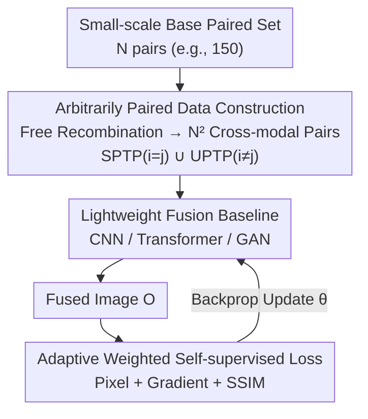

# Beyond Strict Pairing: Arbitrarily Paired Training for High-Performance Infrared and Visible Image Fusion

**Conference**: CVPR 2026  
**Paper**: [CVF Open Access](https://openaccess.thecvf.com/content/CVPR2026/html/Deng_Beyond_Strict_Pairing_Arbitrarily_Paired_Training_for_High-Performance_Infrared_and_CVPR_2026_paper.html)  
**Code**: https://github.com/yanglinDeng/IVIF_unpair (Available)  
**Area**: Image Restoration / Infrared and Visible Image Fusion  
**Keywords**: Infrared and visible fusion, arbitrarily paired training, unpaired learning, self-supervised fusion, adaptive weighted loss

## TL;DR
This paper challenges the convention that Infrared and Visible Image Fusion (IVIF) must be trained on "strictly aligned paired data." It proposes the **Arbitrarily Paired Training Paradigm (APTP)**—freely recombining $N$ pairs of base data into $N^2$ cross-modal pairs, equipped with a set of adaptively weighted pixel-level self-supervised losses. Trained on only 150 pairs of content-inconsistent data, it approaches the fusion performance of models trained on 100 times the amount of strictly paired data.

## Background & Motivation
**Background**: IVIF aims to fuse thermal radiation information from infrared images and color/texture from visible images into a single image $O=F(I_{ir}, I_{vis})$. Mainstream methods (CNN, CNN-Transformer, and GAN) almost all assume a prerequisite: training must consume **strictly spatio-temporally aligned infrared-visible image pairs** to learn fusion rules based on the consistency of "same scene, same content."

**Limitations of Prior Work**: Collecting strictly paired data is extremely expensive. It requires synchronizing spatial, temporal, and device parameters of two sensors under various weather conditions, while handling registration issues caused by calibration errors, object motion, and thermal deformation. Due to the inherent differences between modalities, "perfect registration" is nearly impossible. A more subtle cost is that the number of cross-modal relationships observable in a dataset is capped by the dataset size ($N$ pairs mean $N$ relationships), directly limiting the model's fusion capability and generalization ceiling.

**Key Challenge**: Performance depends on data volume, but the requirements for "large volume" and "strict alignment" are contradictory—stricter alignment reduces collectible data, while increasing data often means sacrificing alignment.

**Key Insight**: The authors seize an overlooked essence of the IVIF task—**it is a pixel-level self-supervised task without ground-truth fusion images**. Supervision signals are extracted from the source images rather than an "ideal fusion image." Therefore, whether the two input source images belong to the "same aligned scene" is technically irrelevant, as long as they provide pixel relationships where losses can be calculated. Unpaired training in image generation (like CycleGAN) follows a similar logic, but it requires a clear target domain, which IVIF lacks (no "fusion image domain"), making direct transfer impossible.

**Core Idea**: Relax the learning objective of "strict content consistency" in SPTP, allowing **arbitrary cross-modal pixel combinations** to generate effective supervision. Based on probabilistic independence, the optimization goal is expanded from strict pairing ($i=j$) to arbitrary pairing ($\forall i,j$), demonstrating that APTP is the union of Unpaired Training (UPTP) and Strictly Paired Training (SPTP).

## Method

### Overall Architecture
The core of the method is not a new network architecture, but rather **redefining the data pairing method during training + a suite of self-supervised losses independent of content consistency**. The workflow is: take a **very small** base strictly paired set (e.g., 150 pairs), perform a Cartesian recombination of the infrared set $\{x_{ir}^i\}$ and visible set $\{x_{vis}^j\}$ to obtain up to $N^2$ "arbitrarily paired" samples (where $i=j$ is traditional SPTP and $i \neq j$ is UPTP). These arbitrary pairs are fed into a **lightweight fusion baseline** (the authors implement one for each of CNN, Transformer, and GAN to verify the paradigm's architecture-agnostic nature). After outputting the fused image $O$, a set of **adaptively linearly weighted pixel/gradient/SSIM losses** is used for backpropagation. This loss only asks "which source should each pixel trust more and in what proportion," never forcing content consistency between the two source images, thus allowing stable convergence with arbitrary pairs.

Theoretically, the authors prove that an optimal parameter exists when the source inputs $\{x_{ir}^i\}$ and $\{x_{vis}^j\}$ are mutually independent, and $D_{APTP}=D_{SPTP} \cup D_{UPTP}$—any method/strategy compatible with both SPTP and UPTP automatically fits APTP (but not necessarily vice versa).

### Key Designs

**1. Arbitrarily Paired Training Paradigm: Decoupling "Strict Pairing" into "Free Recombination" via Probabilistic Independence**

The approach addresses the bottlenecks of SPTP—high collection costs and the $N$-capped relationship limit. The authors modify the optimization target. First, IVIF is formulated as maximum likelihood: by introducing statistical independence probabilities for three loss terms, the joint probability becomes proportional to the optimization goal. Using Bayes' theorem, it is decomposed into likelihood and prior terms. The element-wise form is $\arg\max_\theta \sum_{i=j} \big(\log p(x_{ir}^i, x_{vis}^j \mid o_{ij};\theta) + \log p(o_{ij};\theta)\big)$, where $i=j$ represents the strict pairing constraint. The key step: when infrared and visible images are collected independently at different locations/times/devices, the pairing relationship is essentially random, and the joint distribution can be decoupled as $p(x_{ir}^i, x_{vis}^j)=p(x_{ir}^i)\cdot p(x_{vis}^j)$. Substituting this yields the goal:

$$\arg\max_{\theta'} \sum_{\forall i,j} \log p(o'_{ij}\mid x_{ir}^i, x_{vis}^j;\theta'),$$

loosening the constraint from $i=j$ to $\forall i,j$. This leads to two theoretical conclusions: an optimal solution exists when source inputs are independent; and SPTP ($i=j$) and UPTP ($i \neq j$) are complementary subsets of APTP. **Why it works**: It doesn't overturn existing work but expands the available relationships from a "diagonal" to the "entire matrix." $N$ base pairs can produce $N^2$ trainable pairs (ratio of paired:unpaired = $1:(N-1)$), which is particularly cost-effective when data is limited—reducing collection costs while enhancing generalization and robustness through relationship diversity.

**2. Adaptive Linearly Weighted Self-supervised Loss: Enabling Stable Supervision for "Content-Inconsistent Arbitrary Pairs"**

This is the key to making APTP practical—if the loss function explicitly enforced cross-modal content consistency (or inconsistency), arbitrary pairing would fail to train. The authors design a **universal linear weighting function**:

$$W(a; a, b) = \frac{a}{a+b},$$

which automatically determines which source image should have a higher weight at each pixel and each information dimension (intensity / gradient / structure) and preserves the relative magnitude of source pixels to avoid distortion, preventing gradient explosion/vanishing. Three types of adaptive weights are constructed: intensity weight $P_{ir}=W(I_{ir};I_{ir},I_{vis})$, gradient weight $G_{ir}=W(\nabla I_{ir};\nabla I_{ir},\nabla I_{vis})$, and structural weight $S_{ir}=W(\mathrm{SSIM}(I_{ir},O);\cdots)$ (similarly for visible). These correspond to three losses:

$$L_{int}=\tfrac{1}{HW}\lVert O-(P_{ir}I_{ir}+P_{vis}I_{vis})\rVert_1,$$

$$L_{grad}=\tfrac{1}{HW}\lVert \nabla O-(G_{ir}\nabla I_{ir}+G_{vis}\nabla I_{vis})\rVert_1,$$

$$L_{ssim}=\lVert 1-(S_{ir}\,\mathrm{SSIM}(I_{ir},O)+S_{vis}\,\mathrm{SSIM}(I_{vis},O))\rVert_1.$$

CNN and Transformer baselines use $L_C=L_T=L_{int}+\alpha L_{grad}+\beta L_{ssim}$, while the GAN baseline subtracts an adversarial loss $-\lambda L_{adv}$. **Why it works**: The loss only measures "whether the output pixel is an ideal combination of source pixels." Since this combination presents different data relationships for different loss terms regardless of alignment, strict alignment is no longer a necessary condition.

**3. Three-Framework Lightweight Baselines: Proving the Paradigm, Not the Network**

To exclude the possibility that performance is due to a specific sophisticated network, the authors intentionally build **lightweight baselines** for three classic frameworks: CNN (local context), Transformer (long-range modeling), and GAN (generator-discriminator). The models are only about 0.81MB (0.71MB for GAN) but function across SPTP, UPTP, and APTP paradigms with similar performance. **Why it works**: Success across three architectures proves that the feasibility of APTP/UPTP stems from the training paradigm and loss design rather than specific networks, offering higher universality.

### Loss & Training
Hyperparameters are fixed: $\alpha=1, \beta=0.2, \lambda=0.01$. Datasets for training/evaluation include MSRS, M3FD, LLVIP, RoadScene, and TNO. Metrics include an unreferenced index EN (Entropy) and four full-reference indices MI, VIFF, $Q_{ab/f}$, and SSIM. A counter-intuitive engineering note: because the baseline is only 0.88MB, **blindly increasing the volume of trainable data can actually degrade performance**—capacity and data volume must be matched.

## Key Experimental Results

### Main Results (Comparison with SOTA across four datasets)
Using only 150 pairs from MSRS+M3FD expanded to 15,000 for training, compared against 9 SOTAs (higher is better; MI and SSIM for LLVIP/MSRS shown):

| Method | Source | LLVIP MI | LLVIP SSIM | MSRS MI | MSRS SSIM |
|------|------|----------|-----------|---------|-----------|
| SAGE | 25' CVPR | 1.81 | 0.81 | 2.23 | 0.88 |
| GIFNet | 25' CVPR | 1.56 | 0.74 | 1.36 | 0.85 |
| DCINN | 24' IJCV | 2.00 | 0.77 | 2.30 | 0.73 |
| **Ours (CNN)** | — | **2.54** | **0.91** | **2.69** | **1.00** |
| **Ours (Transf)** | — | **2.56** | **0.92** | **2.64** | **0.99** |
| **Ours (GAN)** | — | **2.51** | **0.92** | **2.56** | **1.01** |

The three lightweight baselines comprehensively lead across four datasets (including three unseen: MSRS/RoadScene/TNO), despite being only ~0.81MB, demonstrating strong generalization and high efficiency.

### Ablation Study
Core verification of APTP's ability to "do more with less"—comparing three paradigms using the same 150 base pairs expanded to 15,000 (100x) (CNN baseline on MSRS):

| Paradigm | Base Pairs | Expanded | Trainable Vol | MI | VIF | Qabf | SSIM |
|------|--------|---------|---------|----|-----|------|------|
| SPTP | 150 | ✗ | 150 | 2.57 | 0.88 | 0.60 | 0.96 |
| UPTP | 150 | ✗ | 150 | 2.62 | 0.90 | 0.61 | 0.97 |
| UPTP | 150 | ✓ | 15000 | 2.70 | 0.93 | 0.65 | 0.99 |
| SPTP | 15000 | ✗ | 15000 | 2.70 | 0.93 | 0.65 | 0.98 |
| APTP | 150 | ✓ | 15000 | 2.69 | 0.93 | 0.65 | 0.98 |

Using only 150 base pairs + recombination, the performance matches that of 15,000 strictly paired samples (100x data). Another experiment on "different base pair volumes" shows that the relative gain of APTP is more significant when base data is smaller.

### Key Findings
- **UPTP intermediate results are "visually chaotic" but don't affect final performance**: Due to the lack of explicit pairing, early UPTP fusion images are messy. However, when evaluated on paired test images, SSIM is comparable to or better than SPTP—proving the model learns content-independent pixel relationships rather than memorizing aligned scenes.
- **EN occasionally drops while other metrics rise**, which the authors explain as the model filtering noise and increasing information density—a positive phenomenon.
- **More data is not always better**: Due to the 0.88MB small model capacity, excessive expansion of trainable data leads to performance drops; a capacity-data matching point exists.
- **Cross-dataset recombination is effective**: Training with cross-library recombinations (e.g., M3FD IR + MSRS Visible) still results in consistent improvements, indicating that fusion learns content-independent pixel mappings.

## Highlights & Insights
- **Turning "Self-supervision without GT" from a weakness into a selling point**: Since IVIF lacks an ideal fusion image and supervision comes from the source images themselves, "whether source images are aligned" is fundamentally unimportant for loss calculation—this insight is the backbone of the paper, simple yet counter-intuitive.
- **$N \to N^2$ data relationship amplification** is a transferable perspective: Any task where "pairing is expensive but supervision comes from internal relationships rather than external labels" could potentially use similar free recombination to expand training relationships.
- **Verifying the paradigm across three architectures simultaneously** cleanly decouples "paradigm effectiveness" from "specific network effectiveness," making the methodology very robust.
- The simple linear weight $W(a;a,b)=\frac{a}{a+b}$ serves the dual role of "automatic source selection + gradient explosion prevention," making it a concise and reusable trick.

## Limitations & Future Work
- **Strong dependency on small model capacity**: The authors admit that excessive data volume leads to performance drops; the method's "sweet spot" is tied to model capacity. Whether $N^2$ expansion remains beneficial for larger models is unknown.
- **Cross-dataset recombination has "sub-optimal groups"**: A trade-off occurs in certain cross-library combinations where EN/SSIM drops in exchange for MI/VIF/$Q_{ab/f}$ gains, suggesting that not all combinations are safe and criteria for selection are missing.
- **Strong theoretical independence assumption**: The assumption $p(x_{ir}^i,x_{vis}^j)=p(x_{ir}^i)p(x_{vis}^j)$ assumes complete independence between modalities, but real-world IR and visible data still have statistical correlation; this gap is not fully discussed. ⚠️ Refer to the original text for exact formula details (e.g., positions of $\alpha, \beta$ in Eqns 8/9).
- **Downstream tasks not verified**: Only fusion quality metrics are reported; the actual benefits for downstream tasks like detection or segmentation have not been verified.

## Related Work & Insights
- **vs. Strictly Paired IVIF (CNN/Transformer/GAN, e.g., SAGE, GIFNet)**: These rely on large volumes of strictly aligned pairs and are limited by the relationship ceiling of fixed pairing structures; this paper breaks that ceiling, matching 100x data with only 150 pairs.
- **vs. Unpaired Training in Image Generation (CycleGAN [57], etc.)**: CycleGAN requires an explicit target domain + cycle consistency; IVIF has no "fusion image domain," so it cannot be directly copied. This paper instead leverages the pixel-level self-supervision of IVIF to achieve unpaired training without a target domain.
- **vs. Registration-based methods**: Traditional routes "register first, then fuse" to combat misalignment; this paper bypasses the registration requirement entirely by dissolving alignment dependency at the paradigm level.

## Rating
- **Novelty**: ⭐⭐⭐⭐⭐ Freeing IVIF from "strict pairing" to "arbitrary pairing" with a theoretical characterization (SPTP $\cup$ UPTP = APTP) is both novel and self-consistent.
- **Experimental Thoroughness**: ⭐⭐⭐⭐ Solid across 3 architectures × 5 datasets × multiple paradigms, but lacks downstream tasks and large model validation.
- **Writing Quality**: ⭐⭐⭐⭐ Theoretical derivations are clear and motivations are explained; some formula layouts may require cross-referencing with the original text.
- **Value**: ⭐⭐⭐⭐⭐ Directly addresses the pain point of IVIF data collection; matching 100x data with 150 pairs yields high practical value.

<!-- RELATED:START -->

## Related Papers

- [\[CVPR 2026\] Bridging Human Evaluation to Infrared and Visible Image Fusion](bridging_human_evaluation_to_infrared_and_visible_image_fusion.md)
- [\[CVPR 2026\] RegionFuse: Region-Adaptive Pixel Distribution Learning for Infrared and Visible Image Fusion](regionfuse_region-adaptive_pixel_distribution_learning_for_infrared_and_visible_.md)
- [\[CVPR 2026\] Customized Fusion: A Closed-Loop Dynamic Network for Adaptive Multi-Task-Aware Infrared-Visible Image Fusion](customized_fusion_a_closed-loop_dynamic_network_for_adaptive_multi-task-aware_in.md)
- [\[CVPR 2026\] Degradation-Robust Fusion: An Efficient Degradation-Aware Diffusion Framework for Multimodal Image Fusion in Arbitrary Degradation Scenarios](degradation-robust_fusion_an_efficient_degradation-aware_diffusion_framework_for.md)
- [\[CVPR 2026\] Beyond the Ground Truth: Enhanced Supervision for Image Restoration](beyond_the_ground_truth_enhanced_supervision_for_image_restoration.md)

<!-- RELATED:END -->
