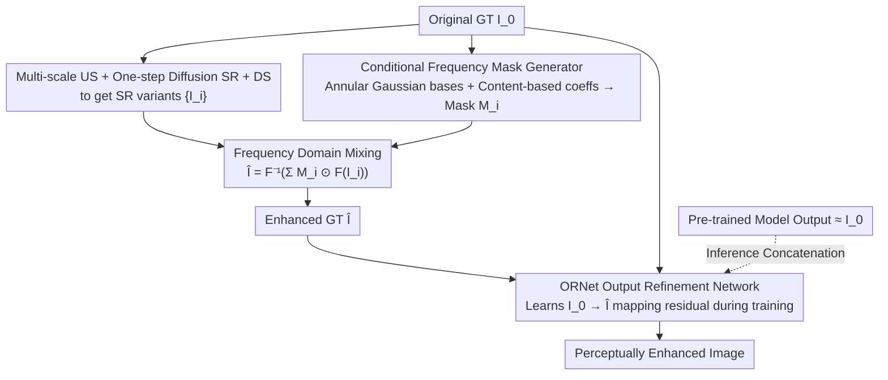

# Beyond the Ground Truth: Enhanced Supervision for Image Restoration

**Conference**: CVPR 2026  
**arXiv**: [2512.03932](https://arxiv.org/abs/2512.03932)  
**Code**: [Project Page](https://hij1112.github.io/beyond-the-ground-truth/)  
**Area**: Image Restoration  
**Keywords**: Supervision Enhancement, Frequency Domain Mixing, Super-resolution, Output Refinement Network, Perceptual Quality

## TL;DR
This paper proposes enhancing the perceptual quality of sub-optimal GT images in existing datasets through super-resolution combined with frequency-adaptive mixing. It introduces a lightweight ORNet refinement module that can be trained to improve the perceptual quality of outputs from pre-trained restoration models without architectural modifications.

## Background & Motivation
**Background**: Deep learning-based image restoration has achieved significant success under the supervised training paradigm; however, model performance is intrinsically limited by the quality of Ground Truth (GT) images.

**Limitations of Prior Work**: GT images in real-world datasets are often **sub-optimal** due to acquisition constraints:
   - Deblurring datasets (e.g., GoPro): GTs selected from video sequences may still contain subtle camera shake.
   - Denoising datasets (e.g., SIDD): GTs obtained by averaging multiple noisy frames often result in slight blurring.
   - Models trained on such sub-optimal GTs inevitably inherit these defects.

**Existing attempts**: Diffusion models can enhance perceptual quality but suffer from high inference overhead and are prone to hallucinations.

**Core Idea**: Instead of modifying the model architecture, this work focuses on **enhancing the supervision signal itself**. It adaptively fuses the semantic structures of the original GT with the perceptual details of super-resolved variants in the frequency domain to produce an "Enhanced GT" (EGT).

## Method

### Overall Architecture

This paper does not modify the restoration model itself but refines the "supervision signal." Since the GT in datasets is often imperfect (e.g., GoPro GTs with slight shake, SIDD GTs blurred by multi-frame averaging), the original GT $I_0^{GT}$ is first upgraded to an "Enhanced GT" (EGT). Subsequently, a lightweight module learns to map the standard GT to the EGT. The process consists of two stages: the supervision enhancement stage generates $N$ variants $\{I_i^{GT}\}_{i=1}^N$ via multi-scale bicubic upsampling, one-step diffusion super-resolution (SR), and downsampling back to original resolution, which are then adaptively mixed in the frequency domain to form the EGT $\hat{I}^{GT}$; the output refinement stage trains an ORNet to learn the mapping $I_0^{GT} \to \hat{I}^{GT}$. During inference, ORNet is appended to any pre-trained restoration model.

### Key Designs

**1. Frequency Domain Mixing: Preserving Semantics while Adding Details**

Mixing SR variants and the original GT in the spatial domain makes it difficult to maintain high-level semantic structures while only enhancing details. This work performs mixing in the frequency domain: $\hat{I}^{GT} = \mathcal{F}^{-1}\left(\sum_{i=0}^{N} M_i \odot \mathcal{F}(I_i^{GT})\right)$, where the frequency masks satisfy $\sum_i M_i = 1$. This allows for a precise division of labor: low frequencies (semantics) are preserved from the original GT, while high frequencies (details) selectively incorporate SR variants to improve perceptual quality while avoiding common diffusion hallucinations.

**2. Conditional Frequency Mask Generator: Image-Adaptive Mixing**

The quality of frequency mixing depends on the masks $M_i$. This paper predefines $B$ annular Gaussian base masks $R_b$, $(R_b)_{h,w} = \exp\!\big(-(d(h,w)-\mu_b)^2/2\sigma_b^2\big)$, which cover frequencies from low to high with band-pass shapes. The smooth Gaussian transitions prevent artifacts at frequency boundaries. A network predicts combination coefficients $c_{i,b} = g(I_0^{GT}, \lambda)$ based on image content, resulting in masks $M_i = \text{softmax}_i\!\big(\sum_b c_{i,b} R_b\big)$. The network utilizes both RGB and FFT representations to customize the mixing strategy for each image.

**3. ORNet Output Refinement Network: Plug-and-Play Inference**

Enhanced GT only exists during training. To benefit existing restoration systems, ORNet acts as a bridge for inference. It learns the mapping $I_0^{GT} \to \hat{I}^{GT}$ with a training objective $\mathcal{L}_{ref} = \|R_\theta(I_0^{GT}, \lambda) - \hat{I}^{GT}\|_2^2$. Since pre-trained models already satisfy $R_\phi(I^{LQ}) \approx I_0^{GT}$, ORNet effectively learns the small residual between the GT and the Enhanced GT. It is decoupled from specific architectures and can be appended to any pre-trained model without re-training the backbone.

### Loss & Training

The Mask Generator is trained using a fidelity-perception weighted loss: $\mathcal{L} = (1-\lambda)\mathcal{L}_{recon} + \lambda\mathcal{L}_{percep}$, where $\mathcal{L}_{recon} = \|\hat{I}^{GT} - I_0^{GT}\|_2^2$ maintains semantic consistency and $\mathcal{L}_{percep} = -\sum_k \text{IQA}_k(\hat{I}^{GT})$ (using MUSIQ/MANIQA/TOPIQ) enhances perceptual quality. $\lambda$ controls the trade-off between fidelity and perception.

## Key Experimental Results

### Main Results (GoPro Deblurring + SIDD Denoising)

| Method | MUSIQ↑ | MANIQA↑ | TOPIQ↑ | LIQE↑ |
|------|--------|---------|--------|-------|
| AdaRevD | 45.49 | 0.5363 | 0.3393 | 1.566 |
| **+ORNet** | **64.25** | **0.5916** | **0.4880** | **2.429** |
| FFTformer | 46.47 | 0.5420 | 0.3456 | 1.613 |
| **+ORNet** | **64.57** | **0.5949** | **0.4924** | **2.466** |
| NAFNet (SIDD) | 22.73 | 0.3937 | 0.2458 | 1.219 |
| **+ORNet** | **35.87** | **0.4380** | **0.3776** | **1.959** |

### Ablation Study / OOD Robustness

| Scenario | Method | MUSIQ↑ | LPIPS↓ | Note |
|------|------|--------|--------|------|
| +Gaussian Blur σ=2.5 | FFTformer | 22.38 | 0.471 | OOD Degradation |
| | +ORNet | **42.91** | **0.343** | Strong Robustness |
| +White Noise σ=9 | FFTformer | 30.14 | 0.446 | OOD Degradation |
| | +ORNet | **41.88** | **0.407** | Removes residual noise |

### Key Findings
- ORNet yields **massive improvements** across all perceptual metrics (e.g., MUSIQ increases by over 40%).
- It remains effective in Out-of-Distribution (OOD) scenarios (unseen degradations), suggesting that ORNet learns generalized perceptual enhancement.
- VLM-based evaluations (VisualQuality-R1, Q-Insight) and user studies further confirm the superiority of Enhanced GT and ORNet outputs.

## Highlights & Insights
- **Novel Perspective**: Improving the supervision signal rather than the model architecture serves as a vital complement to the image restoration paradigm.
- Frequency domain mixing effectively circumvents the hallucination issues of super-resolution by preserving low-frequency semantics while selectively enhancing high-frequency details.
- The model-agnostic nature of ORNet is highly practical: train once, and it can be adapted to various restoration models.
- OOD robustness indicates that ORNet learns perceptual enhancement beyond just correcting specific dataset artifacts.

## Limitations & Future Work
- Fidelity metrics like PSNR/SSIM may decrease slightly (perception-distortion trade-off).
- The performance depends on the quality of the pre-trained SR models used for enhancement.
- Strictly defining the "correctness" of Enhanced GT remains an open problem.
- Temporal consistency in video restoration scenarios has yet to be explored.

## Related Work & Insights
- Complementary to diffusion-prior methods like StableSR: while the latter replaces the entire pipeline, this method focuses on augmenting supervision.
- The frequency mixing approach could be extended to other supervised tasks, such as enhancing GTs for medical image segmentation.
- Insights for dataset synthesis: GT quality can be systematically improved via post-processing.

## Rating
- Novelty: ⭐⭐⭐⭐ High (New perspective via supervision enhancement).
- Experimental Thoroughness: ⭐⭐⭐⭐⭐ Comprehensive (Multi-task, multi-model, OOD testing, and user studies).
- Writing Quality: ⭐⭐⭐⭐ Excellent (Clear framework and detailed methodology).
- Value: ⭐⭐⭐⭐ Strong (ORNet is practical and plug-and-play).

<!-- RELATED:START -->

## Related Papers

- [\[CVPR 2026\] Beyond Ground-Truth: Leveraging Image Quality Priors for Real-World Image Restoration](beyond_ground-truth_leveraging_image_quality_priors_for_real-world_image_restora.md)
- [\[CVPR 2026\] ShiftLUT: Spatial Shift Enhanced Look-Up Tables for Efficient Image Restoration](shiftlut_spatial_shift_enhanced_look-up_tables_for_efficient_image_restoration.md)
- [\[CVPR 2026\] UnReflectAnything: RGB-Only Highlight Removal by Rendering Synthetic Specular Supervision](unreflectanything_rgb-only_highlight_removal_by_rendering_synthetic_specular_sup.md)
- [\[CVPR 2026\] LRHDR: Learning Representation-enhanced HDR Video Reconstruction](lrhdr_learning_representation-enhanced_hdr_video_reconstruction.md)
- [\[CVPR 2026\] Beyond Strict Pairing: Arbitrarily Paired Training for High-Performance Infrared and Visible Image Fusion](beyond_strict_pairing_arbitrarily_paired_training_for_high-performance_infrared_.md)

<!-- RELATED:END -->
