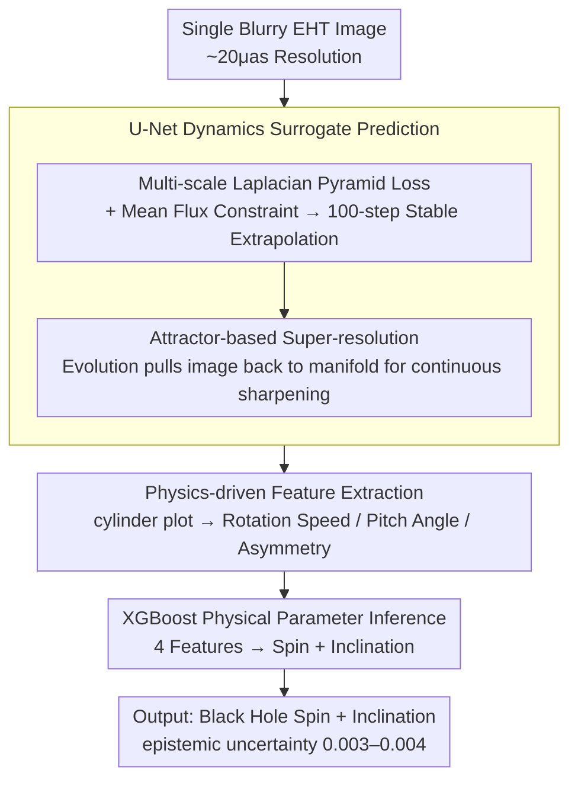

# BHCast: Unlocking Black Hole Plasma Dynamics from a Single Blurry Image with Long-Term Forecasting

**Conference**: CVPR 2026  
**arXiv**: [2603.26777](https://arxiv.org/abs/2603.26777)  
**Code**: None  
**Area**: Image Restoration/Scientific Imaging  
**Keywords**: Black Hole Imaging, Super-resolution, Long-term Time Series Forecasting, Physical Inference, Dynamics Modeling

## TL;DR
Starting from a single blurry EHT black hole image, BHCast performs super-resolution and long-term autoregressive prediction (stable for 100 steps) via a U-Net dynamics surrogate model. Physical features (rotation speed, pitch angle, etc.) are extracted from the predicted plasma dynamics, and black hole spin and inclination are inferred using XGBoost, demonstrating effectiveness on real M87* observational images.

## Background & Motivation
**Background**: The Event Horizon Telescope (EHT) captured the first black hole image, but is limited by a resolution of ~20 $\mu$as, yielding only static blurry images and preventing direct observation of plasma dynamics.

**Limitations of Prior Work**: Interpreting EHT images requires comparison with General Relativistic Magnetohydrodynamics (GRMHD) simulations. However, a single simulation takes weeks on a supercomputer, making large-scale parameter space searches infeasible.

**Key Challenge**: (1) Recovering lost high-frequency information from resolution-limited images (super-resolution); (2) Key dynamical metrics require stable **long-term prediction** (300 $GM c^{-3}$+) for precise measurement.

**Core Idea**: Reframe the ill-posed astrophysical inverse problem into a "Prediction + Inference" framework—replacing expensive GRMHD simulations with a neural surrogate model and achieving self-correcting super-resolution through the attractor theory of dissipative dynamical systems.

## Method

### Overall Architecture

BHCast reformulates an ill-posed astrophysical inverse problem into a two-stage "Prediction + Inference" pipeline. Instead of running GRMHD simulations for weeks, a neural surrogate model is trained to replace the simulation. Specifically, starting from a single blurry EHT image, a U-Net is used to autoregressively predict plasma dynamics frame-by-frame (stable extrapolation to 100 steps). From the predicted sequence, a cylinder plot is constructed to extract physical features such as pattern speed and pitch angle. Finally, XGBoost is used to infer the black hole spin and inclination from these features. The three-stage pipeline is modular and independently improvable.

### Key Designs

**1. Multi-scale Laplacian Pyramid Loss: Sustaining Long-term Prediction with Mean Flux Constraints**

The primary risk of autoregressive prediction is error accumulation, leading to divergence after a few dozen steps. The loss in this work provides hierarchical supervision across multiple spatial frequencies: $\mathcal{L}_{total} = \mathcal{L}_{Lap_0} + \tfrac{1}{2}\mathcal{L}_{Lap_1} + \tfrac{1}{4}\mathcal{L}_{Lap_2} + \tfrac{1}{8}\mathcal{L}_{\Phi}$, where each $Lap_k$ term handles details, intermediate scales, and coarse structures respectively, using $\ell_1 + \ell_2$ to balance outlier robustness and optimization ease. The critical component is the mean flux $\Phi(I) = \frac{1}{HW}\sum I(i,j)$ (a core physical quantity of light curves). Ablations show that prediction with only multi-scale loss stabilizes for ~20 steps, whereas adding the mean flux constraint extends stability to 100 steps by constraining total system energy output and providing global physical consistency.

**2. Attractor-based Super-resolution: Pulling Images Back to the Manifold via Dynamics**

EHT images suffer from resolution limits and loss of high-frequency details. This work treats super-resolution not as a single-step operation, but through the lens of attractor theory in dissipative dynamical systems. GRMHD simulations form a low-dimensional global attractor in state space. Blurry inputs deviate from this attractor manifold due to missing high frequencies. The learned dynamics mapping of the U-Net pulls the prediction back to the manifold during frame-by-frame evolution—the first step becomes clearer, and subsequent steps continue to sharpen. Power Spectral Density (PSD) analysis shows high-frequency components recover to match the ground truth after approximately 6 steps. Unlike traditional SR, this is self-correction inherent to the dynamical system rather than hallucinated detail.

**3. Physics-driven Feature Extraction: Using Astrophysical Observables as Information Bottlenecks**

To ensure interpretability, the intermediate representation cannot be a black-box feature. This work constructs a cylinder plot $T(\theta, t)$ (a 2D function of angle-time) from predicted frames to extract four key observables defined by astrophysicists: Pattern Speed $\Omega_p$ (rotation rate), rotation curve slope, Pitch Angle $\Phi$ (tightness of spiral arms), and asymmetry. This step compresses high-dimensional predictions into physically meaningful low-dimensional features, inserting a physics-driven information bottleneck into the pipeline.

**4. XGBoost Physical Parameter Inference: Replacing Deep Classifiers with Interpretable Tabular Models**

The final stage infers spin and inclination from the four features. XGBoost is chosen over deep models for three reasons: it provides feature importance scores for traceability; it naturally handles heterogeneous tabular data; and it is scale-invariant. Taking the four plasma features as input, it outputs classifications for spin and inclination. The ensemble further provides a very low epistemic uncertainty (0.003–0.004), quantifying prediction reliability.

### Training Data

32 GRMHD simulation movies of Sgr A*, each with 1000 frames at 100×100 resolution, split into 800/100/100 frames for training/validation/testing.

## Key Experimental Results

### Main Results (MAE of Plasma Feature Extraction)

| Feature | BHCast | ResNet Baseline | Description |
|------|--------|-----------|------|
| Pattern Speed $\Omega_p$ | **0.46±0.05** | 0.64±0.07 | BHCast is significantly better |
| Pitch Angle $\Phi$ | **0.13±0.01** | 0.14±0.02 | Comparable |
| Asymmetry | 0.30±0.03 | **0.23±0.02** | Baseline slightly better |
| Rotation Curve Slope | **0.24±0.03** | 0.25±0.03 | Comparable |

### Ablation Study (Black Hole Parameter Inference Accuracy)

| Blur Level | Model | Inclination Accuracy | Spin Accuracy |
|---------|------|-----------|-----------|
| 20μas (Std) | BHCast | **56.41%** | **69.22%** |
| | ResNet | 47.19% | 67.66% |
| 25μas | BHCast | 56.72% (+0.31) | 71.09% (+1.87) |
| | ResNet | 31.41% (**-15.78**) | 54.53% (-13.13) |
| 30μas | BHCast | 53.44% (-2.97) | 65.78% (-3.44) |
| | ResNet | 25.47% (**-21.72**) | 44.37% (-23.29) |

### Key Findings
- **Enormous Robustness Gap**: As blur increases, BHCast performance remains nearly constant (-2~3%), while ResNet collapses sharply (-15~23%).
- Pattern speed correlation reaches 0.927, correctly distinguishing prograde and retrograde rotation.
- The epistemic uncertainty of the XGBoost ensemble is only 0.003-0.004, indicating highly reliable predictions.
- **Real M87* Image Validation**: Predicting 3 steps from the April 6 EHT image successfully captured the counter-clockwise brightness shift seen in the April 11 image.

## Highlights & Insights
- Elegantly decomposes the astrophysical inverse problem into a "Prediction → Feature → Inference" three-stage pipeline, where each stage can be independently improved.
- Attractor theory provides a physical interpretation for super-resolution: it is dynamical self-correction rather than hallucination.
- The combination of multi-scale pyramid loss and mean flux loss is key to achieving 100-step stable prediction.
- Modular design brings full interpretability: inference results can be traced back to visual cues.

## Limitations & Future Work
- Only discrete classification of spin/inclination; continuous value regression would be more valuable.
- U-Net capacity is limited; Transformer/FNO might provide further improvements.
- M87* training data is extremely limited; cross-system generalization remains a challenge.
- Did not directly process data in the EHT visibility domain.

## Related Work & Insights
- Complementary to direct inference methods like Deep Horizon: BHCast achieves more robust inference through dynamical intermediate representations.
- The combination of multi-scale loss and mean flux constraints can be generalized to surrogate modeling for other scientific simulations.
- Provides a new paradigm of "predicting dynamics before inferring parameters" for resolution-limited scientific data analysis.

## Rating
- Novelty: ⭐⭐⭐⭐⭐ Interdisciplinary innovation, deeply combining CV techniques with astrophysics through a unique framework.
- Experimental Thoroughness: ⭐⭐⭐⭐ Detailed evaluation on Sgr A* plus M87* generalization and complete ablations.
- Writing Quality: ⭐⭐⭐⭐⭐ Sufficient background context with tight coupling between physical intuition and method design.
- Value: ⭐⭐⭐⭐⭐ Provides a reproducible paradigm for scientific imaging inverse problems with convincing real-world data validation.

<!-- RELATED:START -->

## Related Papers

- [\[NeurIPS 2025\] Elucidated Rolling Diffusion Models for Probabilistic Forecasting of Complex Dynamics](../../NeurIPS2025/image_restoration/elucidated_rolling_diffusion_models_for_probabilistic_forecasting_of_complex_dyn.md)
- [\[CVPR 2026\] UniLDiff: Unlocking the Power of Diffusion Priors for All-in-One Image Restoration](unildiff_unlocking_the_power_of_diffusion_priors_for_all-in-one_image_restoratio.md)
- [\[CVPR 2026\] LightRR: A Lightweight Network for Single Image Reflection Removal](lightrr_a_lightweight_network_for_single_image_reflection_removal.md)
- [\[CVPR 2026\] Reflection Separation from a Single Image via Joint Latent Diffusion](reflection_separation_from_a_single_image_via_joint_latent_diffusion.md)
- [\[CVPR 2026\] RawMetaDiff: Unlocking Extreme Darkness from Dual-Exposure RAW with Meta-Guided Diffusion](rawmetadiff_unlocking_extreme_darkness_from_dual-exposure_raw_with_meta-guided_d.md)

<!-- RELATED:END -->
