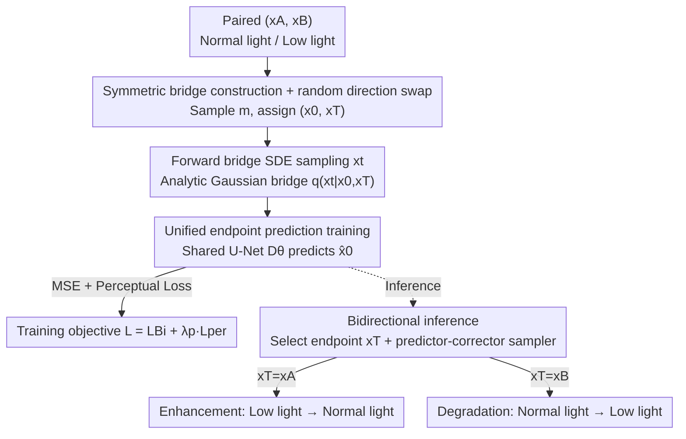

# Bi-Bridge: Bidirectional Diffusion Bridges for Low-Light Image Enhancement

**Conference**: CVPR 2026  
**Paper**: [CVF Open Access](https://openaccess.thecvf.com/content/CVPR2026/html/Hua_Bi-Bridge_Bidirectional_Diffusion_Bridges_for_Low-Light_Image_Enhancement_CVPR_2026_paper.html)  
**Code**: Not available  
**Area**: Image Restoration / Diffusion Models  
**Keywords**: Low-light enhancement, Diffusion bridge, Bidirectional consistency, DDBM, Content fidelity  

## TL;DR
This work integrates "low-light to normal-light" enhancement and "normal-light to low-light" degradation into a **single symmetric diffusion bridge**. By training a shared U-Net with a bidirectional consistency constraint as implicit regularization, the model significantly outperforms existing SOTA in fidelity (PSNR/LPIPS).

## Background & Motivation
**Background**: Low-light image enhancement (LLIE) is essentially an ill-posed inverse problem. Texture and color information are severely lost in dark areas, meaning one low-light image can correspond to multiple "correct-looking" normal-light images (one-to-many). Mainstream approaches fall into two categories: ① Regressive methods (CNN/Transformer, e.g., SNR-Aware, Retinexformer, CIDNet) that learn a one-to-one mapping; ② Generative diffusion models ("Noise-to-Image", e.g., GSAD, ReDDiT) that model the restoration distribution starting from random noise.

**Limitations of Prior Work**: Regressive methods tend to output the "average prediction" of all possible solutions, resulting in over-smoothed textures and lost high-frequency details. "Noise-to-Image" diffusion starts from an uninformative random prior and must bridge a massive domain gap to restore the source structure, often failing to maintain content fidelity and causing color shifts. Even recent "Image-to-Image" diffusion bridges (DDBM) only narrow the domain gap by bridging data distributions but **only learn in one direction**—focusing solely on the restoration process.

**Key Challenge**: Existing LLIE paradigms are almost entirely **asymmetric and unidirectional**, modeling only the "enhancement" direction. This discards the physical prior that "illumination changes are inherently symmetric and reversible." Since enhancement (lightening) and degradation (darkening) share the same underlying content structure, unidirectional training fails to capture this invariance, limiting fidelity.

**Goal**: Can we **learn the degradation and enhancement processes simultaneously** and use this symmetry as a constraint to improve restoration fidelity?

**Key Insight**: The authors identify a neglected mathematical property of DDBM—its analytical Gaussian bridge distribution has a **mean that is structurally symmetric with respect to the two endpoints $x_0$ and $x_T$**. Since enhancement and degradation are simply role reversals of these endpoints, a single network and bridge formula can cover both directions.

**Core Idea**: Introducing a **bidirectional consistency constraint** on top of DDBM. During training, the roles of the start and end points are randomly swapped, forcing a shared U-Net to learn a "direction-independent" unified mapping. This compels the network to decouple "content" from "illumination," acting as a powerful implicit regularizer that significantly boosts fidelity.

## Method

### Overall Architecture
Bi-Bridge is built upon the Denoising Diffusion Bridge Model (DDBM). Unlike standard diffusion that erodes images into pure noise, DDBM uses Doob's h-transform to build a stochastic bridge directly **between two data distributions** (normal-light $x_0$ ↔ low-light $x_T$). The forward SDE includes a guidance term $h(\cdot)=\nabla_{x_t}\log p(x_T\mid x_t)$ to ensure trajectories reach the specified endpoint; the learning objective is to approximate the reverse score via Denoising Bridge Score Matching.

The critical modification in Bi-Bridge is simple: **instead of training separate models for enhancement and degradation**, a shared U-Net $D_\theta$ handles both. During training, for each pair $(x_A,x_B)$, a binary direction indicator $m$ is randomly sampled to dynamically assign which is $x_0$ and which is $x_T$. The network performs one task: predicting the correct start point given the endpoint. During inference, by selecting different conditional endpoints $x_T$, the same reverse path can perform either enhancement ($x_A\to x_B$) or degradation ($x_B\to x_A$).

### Key Designs

**1. Symmetric Bridge Construction + Random Direction Swapping: One network for both enhancement and degradation**

Unidirectional DDBM requires two models for bidirectional tasks, which doubles computational costs and, more critically, prevents the network from learning the intrinsic symmetric relationship of illumination changes. The authors noted that in the analytical Gaussian bridge $q(x_t\mid x_0,x_T)=\mathcal{N}(x_t;\hat\mu_t,\hat\sigma_t^2 I)$, the mean

$$\hat\mu_t=\alpha_t\Big(1-\tfrac{\mathrm{SNR}_T}{\mathrm{SNR}_t}\Big)x_0+\alpha_t\tfrac{\alpha_T}{\alpha_t}\tfrac{\mathrm{SNR}_T}{\mathrm{SNR}_t}x_T$$

is explicitly symmetric regarding the endpoints $(x_0,x_T)$ (where $\mathrm{SNR}_t=\alpha_t^2/\sigma_t^2$). Thus, endpoints can be swapped: for a pair $(x_A,x_B)$, if $m=0$, $(x_0,x_T)=(x_A,x_B)$; if $m=1$, $(x_0,x_T)=(x_B,x_A)$. Learning both "low-to-normal" and "normal-to-low" with one network forces the separation of variable illumination and invariant content.

**2. Unified Endpoint Prediction Training: Stable bidirectional score matching via simple MSE**

Optimizing the score-matching objective directly can be unstable. Following the pred-x parameterization, the network **directly predicts the start point** $\hat x_0=D_\theta(x_t,x_T,t)$. This prediction is used to approximate the score:

$$\nabla_{x_t}\log q(x_t\mid x_T)\approx s_\theta(x_t,x_T,t)=-\frac{x_t-\hat\mu_t(\hat x_0,x_T)}{\hat\sigma_t^2}$$

The training objective simplifies to a basic MSE regression:

$$\mathcal{L}_{Bi}=\mathbb{E}_{m,(x_A,x_B),t}\big[\lVert D_\theta(x_t,x_T,t)-x_0\rVert^2\big]$$

where $x_t\sim q(x_t\mid x_0,x_T)$. Minimizing this single objective is equivalent to stable score matching in both directions simultaneously.

**3. Bidirectional Inference + Predictor-Corrector Hybrid Sampler**

Post-training, $D_\theta$ is used for both tasks by selecting the conditional endpoint. For enhancement, $x_T=x_A$ (low-light) is set, and the reverse SDE is integrated from $t=T$ to generate normal-light $x_B$. To balance fidelity and efficiency, a high-order hybrid sampler is used: a stochastic step (Euler-Maruyama) injects noise to generate fine textures, followed by a deterministic correction step (Heun) for stability. This allows Bi-Bridge to reach performance at 10 NFE that other bridge models achieve at 80 NFE.

### Loss & Training
The total objective includes an auxiliary perceptual loss $L_{per}$, penalizing the MSE between the deep features of the prediction $\hat x_0$ and the ground truth $x_0$:

$$\mathcal{L}=\mathcal{L}_{Bi}+\lambda_p\mathcal{L}_{per}$$

The perceptual loss helps align structures and textures with human visual preference.

## Key Experimental Results

### Main Results
Evaluation was conducted on LOL-v1 and LOL-v2 (Real/Synthetic) benchmarks using PSNR↑, SSIM↑, and LPIPS↓. Bi-Bridge leads in PSNR and LPIPS, showing a massive improvement over the unidirectional DDBM baseline.

| Dataset | Metric | Ours (Bi-Bridge) | DDBM (Baseline) | Prev. SOTA | Gain (vs Baseline) |
|--------|------|------|------|------|------|
| LOL-v2-Synthetic | PSNR / LPIPS | **31.019** / **0.025** | 27.872 / 0.079 | ReDDiT 30.166 / 0.028 | +3.15 dB / −0.05 |
| LOL-v2-Real | PSNR / LPIPS | **31.287** / **0.040** | 26.353 / 0.165 | PyDiff 29.629 / ReDDiT 0.040 | +4.93 dB / −0.12 |
| LOL-v1 | PSNR / LPIPS | 27.879 / **0.052** | 24.451 / 0.159 | CIDNet 28.141 / ReDDiT 0.052 | +3.43 dB / −0.11 |

Compared to the regressive SOTA CIDNet, PSNR increases by +2.894 dB on LOL-v2-real. Note: SSIM is not always the highest; on LOL-v2-real, the SSIM (0.841) is lower than CIDNet (0.887)/ReDDiT (0.895). The primary strengths lie in PSNR/LPIPS.

Unpaired zero-shot generalization (NIQE↓):

| Method | DICM | LIME | MEF | NPE | VV |
|------|------|------|------|------|------|
| CIDNet | 3.79 | 4.13 | 3.56 | 3.74 | **3.21** |
| ReDDiT | 3.62 | 3.45 | 3.93 | 3.24 | 3.00 |
| **Ours** | **3.35** | **3.14** | **3.11** | **3.11** | 3.19 |

### Ablation Study
Comparing the full model with three variants (Baseline DDBM, w/o Bi-directional, and w/o $L_{per}$):

| Configuration | Relative Performance | Description |
|------|---------|------|
| Full (Ours) | Best | Bidirectional + Perceptual loss |
| w/o $L_{per}$ | Second Best | Slight drop, affects fine texture/structure |
| w/o Bi-directional | Moderate | Bridge structure without symmetry constraint |
| Baseline (DDBM) | Worst | Standard unidirectional diffusion bridge |

### Key Findings
- **Bidirectional Consistency is the Performance Engine**: The leap from "w/o Bi-directional" to "Full" is substantial and stems entirely from symmetric training without architectural changes. 
- **Sampling Efficiency (~4×)**: 20-NFE Bi-Bridge matches or exceeds 80-NFE Baseline performance. 10-NFE already outperforms 80-NFE DDBM/I2SB in PSNR.
- **Emergent Advantage in Degradation**: The model trained bidirectionally performs "normal-to-low" degradation better than a model trained **only** for degradation, retaining more texture in shadows.

## Highlights & Insights
- **Zero-Cost Strong Regularization**: Bidirectional capability requires no new modules, just a one-line change in role assignment during training, yielding a +4.9 dB PSNR boost. 
- **Engineering Physical Priors**: Directly translating the intuition that "illumination change is reversible" into the symmetric structure of the DDBM formula is an elegant marriage of prior and vehicle.
- **Transferable Logic**: This "endpoint swapping" logic can be applied to any paired translation task where content is shared but an attribute changes (dehazing, denoising, super-resolution).

## Limitations & Future Work
- **Sampling Speed**: Despite the 10-NFE optimization, iterative sampling remains slower than one-step regressive models.
- **SSIM Performance**: The model does not outperform all SOTAs in SSIM, suggesting symmetric constraints may not be the optimal prior for every metric.
- **Data Dependency**: The core objective relies on paired data for MSE training.

## Related Work & Insights
- **vs DDBM**: Bi-Bridge upgrades DDBM from a "specialist unidirectional" model to a "unified bidirectional" model purely by leveraging mathematical symmetry, achieving a +4.9 dB gain on the same baseline.
- **vs BDBM**: While BDBM is also bidirectional, Bi-Bridge uses a simpler, task-oriented design that outperforms the more generalized BDBM in LLIE.
- **vs Noise-to-Image (GSAD/ReDDiT)**: By bridging data domains directly and enforcing symmetry, Bi-Bridge fundamentally resolves content preservation issues found in noise-based diffusion.

## Rating
- Novelty: ⭐⭐⭐⭐⭐ Translating Gaussian bridge symmetry into a training constraint is ingenious.
- Experimental Thoroughness: ⭐⭐⭐⭐ Extensive benchmarks and efficiency tests, though some ablation results lack tabular numerical precision.
- Writing Quality: ⭐⭐⭐⭐⭐ Clear derivation and motivation.
- Value: ⭐⭐⭐⭐ Refreshes SOTA for LLIE fidelity and offers a transferable training paradigm.

<!-- RELATED:START -->

## Related Papers

- [\[CVPR 2026\] BiEvLight: Bi-level Learning of Task-Aware Event Refinement for Low-Light Image Enhancement](bievlight_bi-level_learning_of_task-aware_event_refinement_for_low-light_image_e.md)
- [\[CVPR 2026\] MR. Illuminate: Zero-Shot Low-Light Image Enhancement with Diffusion Prior](mr_illuminate_zero-shot_low-light_image_enhancement_with_diffusion_prior.md)
- [\[CVPR 2026\] Multinex: Lightweight Low-light Image Enhancement via Multi-prior Retinex](multinex_lightweight_low-light_image_enhancement_via_multi-prior_retinex.md)
- [\[CVPR 2026\] Event-Illumination Collaborative Low-light Image Enhancement with a High-resolution Real-world Dataset](event-illumination_collaborative_low-light_image_enhancement_with_a_high-resolut.md)
- [\[ICML 2026\] Structured Diffusion Bridges: Inductive Bias for Denoising Diffusion Bridges](../../ICML2026/image_restoration/structured_diffusion_bridges_inductive_bias_for_denoising_diffusion_bridges.md)

<!-- RELATED:END -->
