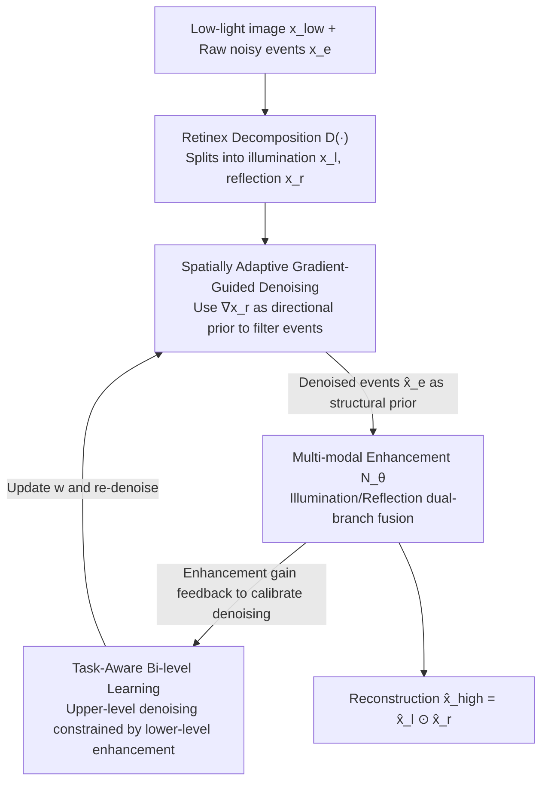

# BiEvLight: Bi-level Learning of Task-Aware Event Refinement for Low-Light Image Enhancement

**Conference**: CVPR 2026  
**Paper**: [CVF Open Access](https://openaccess.thecvf.com/content/CVPR2026/html/Yao_BiEvLight_Bi-level_Learning_of_Task-Aware_Event_Refinement_for_Low-Light_Image_CVPR_2026_paper.html)  
**Code**: https://github.com/iijjlk/BiEvlight  
**Area**: Image Restoration / Low-Light Enhancement / Event Camera  
**Keywords**: Low-light image enhancement, Event camera, Event denoising, Bi-level optimization, Gradient guidance

## TL;DR
To address the issues of event streams being contaminated by BA noise and the separation of denoising from enhancement in event-aided low-light enhancement, BiEvLight reformulates event denoising from a static preprocessing step into a task-aware bi-level optimization problem. This allows the enhancement gain from the lower level to calibrate the upper-level denoising, supplemented by a spatially adaptive denoising prior guided by image gradients. It achieves an average gain of 1.30dB PSNR / 0.047 SSIM on the real-world SDE dataset.

## Background & Motivation
**Background**: Event cameras offer high dynamic range and microsecond-level temporal resolution, bypassing motion blur and exposure issues of traditional frame cameras under low light. Consequently, event-assisted Low-Light Image Enhancement (LLIE) has become a popular research topic. Prevailing methods focus on fusion modules (event–image fusion) to integrate high-frequency edges or temporal information into frame images.

**Limitations of Prior Work**: Most existing works ignore the fact that **event data under low light is inherently noisy**. Random fluctuations in internal circuits and dark currents trigger "Background Activity (BA) noise." To capture weak luminance changes in low-light scenes, the contrast threshold $\epsilon$ is often lowered, which drastically amplifies BA noise, causing the event stream to be submerged and reducing its reliability as a high-frequency prior. Current denoising methods (e.g., nearest neighbor filtering, Time Surface) rely on single-modal spatio-temporal correlation, which fails in extremely dark settings with high-density BA noise, either failing to remove noise or erasing real structural details.

**Key Challenge**: The problem is twofold. First, low SNR in images combined with BA noise in events leads to **dual degradation**, where coupled noise complicates the fusion process. Second, treating event denoising as a "static preprocessing step" before enhancement entails an inevitable trade-off: aggressive denoising removes real structures, while weak denoising allows residual noise to contaminate the enhancement. Once denoising results are fixed, they **cannot adapt to the specific requirements of the downstream enhancement task** due to the lack of feedback.

**Goal**: Replace the serial "denoising followed by fusion/enhancement" pipeline with a collaborative optimization where both tasks calibrate each other, learning event representations specifically tailored for the enhancement objective.

**Key Insight**: Based on the brightness constancy hypothesis and Retinex theory, the authors observe that **events are primarily triggered by the motion of object edges, making event streams spatially correlated with image gradients** ($\Delta J_\zeta(t) \approx -\nabla_R J_\zeta(t)\cdot v\Delta t$). Real events align with strong gradients, while BA noise lacks such spatio-temporal consistency. This provides a natural mechanism to use image gradients as directional priors to filter events.

**Core Idea**: Reformulate event denoising as a bi-level optimization problem constrained by the enhancement task, using the gradient of the reflection component as a spatially adaptive denoising prior, establishing a bidirectional feedback loop between denoising and enhancement.

## Method

### Overall Architecture
BiEvLight consists of two core sub-networks: an **event denoising network** $N_w(\cdot)$ (parameter $w$) and a **multi-modal enhancement network** $N_\theta(\cdot)$ (parameter $\theta$), both based on encoder–decoder architectures. The low-light image $x_{low}$ is first decomposed into an initial illumination map $x_l$ and a reflection map $x_r$ via a pre-trained decomposition network $D(\cdot)$. The enhancement network uses two branches: an illumination branch $N_l$ to enhance $x_l$, and a reflection branch $N_r$ that fuses the reflection map with denoised events $\hat{x}_e$ to enhance details. The final reconstruction is $\hat{x}_{high} = \hat{x}_l \odot \hat{x}_r$. Events only enter the reflection branch as they represent intrinsic object structures.

The core mechanism is that these networks are **not serial**: the denoising network provides structural priors for enhancement, while the enhancement performance gain provides gradient feedback to calibrate the denoising network through bi-level optimization.

### Key Designs

**1. Spatially Adaptive Gradient-Guided Denoising**
Single-modal denoising cannot distinguish sparse real events from dense BA noise in extreme darkness. This method uses the gradient of the reflection component $\nabla\tilde{x}_r$ to guide denoising. An event mask $m_j$ is used to retain events only where strong gradient support exists:

$$m_j = \begin{cases} \nabla\tilde{x}_{r,i}, & \nabla\tilde{x}_{r,i} \notin (q-\mu,\, q+\mu) \\ 0, & \text{otherwise} \end{cases}$$

The threshold $q$ is not globally fixed but is a **spatially adaptive** local mean:

$$q = \frac{1}{|W|^2} \sum_{(x,y)\in W_s} |\nabla\tilde{x}_r(x,y)|$$

This adaptive threshold adjusts denoising intensity based on regional gradient distributions, preserving sparse events in smooth areas while suppressing noise in textured areas.

**2. Task-Aware Bi-level Learning**
This addresses the dilemma of static preprocessing. Denoising $w$ and enhancement $\theta$ are formulated as a bi-level optimization:

$$\min_w \varphi\big(w, \theta^*(w)\big) \quad \text{s.t.} \quad \theta^*(w) \in \arg\min_\theta \psi(w,\theta)$$

The upper-level objective $\varphi$ includes the enhancement loss $L_{enh}$, forcing the denoising process to optimize for the final enhancement quality. This bidirectional calibration allows the model to adaptively balance noise suppression and structural preservation.

**3. One-step Truncated Bi-level Gradient Approximation**
To avoid the computational cost of Hessian inversion in bi-level optimization, the authors use **one-step truncated Iterative Differentiation (ITD)**. They approximate the optimal solution $\theta^*(w_k) \approx \theta_k - \eta_\theta\nabla_\theta\psi(w_k,\theta_k)$ and use **finite differences** to approximate the Hessian–vector product:

$$\nabla^2_{w\theta}\psi \cdot \nabla_{\theta'}\varphi \approx \frac{\nabla_w\psi(w_k,\theta^+) - \nabla_w\psi(w_k,\theta^-)}{2\epsilon}$$

This captures bi-level coupling while keeping the framework computationally feasible.

### Loss & Training
The enhancement loss $L_{enh}$ uses L1 reconstruction and dual constraints on illumination/reflection. Event denoising $L_{den}$ utilizes cross-entropy to classify pixels as positive, negative, or no event. Training proceeds in two stages: Stage 1 involves pre-training event denoising, and Stage 2 performs collaborative bi-level optimization.

## Key Experimental Results

### Main Results
On real noisy datasets SDE and SDSD, BiEvLight out-performs the Prev. SOTA (EvLight, CVPR'24):

| Task | Metric | EvLight (CVPR'24) | BiEvLight | Gain |
|------|------|-------------------|-----------|------|
| SDE-in | PSNR | 22.188 | **22.868** | +0.68 |
| SDE-in | PSNR* | 23.694 | **26.002** | +2.31 |
| SDE-out | PSNR | 22.437 | **24.360** | +1.92 |
| SDSD-in | PSNR | 29.356 | **30.758** | +1.41 |

The significantly higher gain in PSNR* (focusing on structural recovery) compared to standard PSNR indicates that the improvements stem from **structural detail restoration** via effective denoising.

### Ablation Study
**Denoising Strategy (SDE-in)**:
- Base (No denoising): 21.430 PSNR
- Base + $x_{low}$ Gradient: 22.043 PSNR
- BiEvLight (Spatially Adaptive): 22.868 PSNR

**Learning Paradigm**:
- Joint Learning: 21.981 PSNR (Gradient conflicts)
- Alternating Learning: 22.679 PSNR (Lack of task interaction)
- BiEvLight (Bi-level): 22.868 PSNR (Optimal)

### Key Findings
- **Denoising is a prerequisite**: Moving from the Base model to incorporating denoising strategies results in a massive jump in metrics, particularly PSNR*, confirming that clean events are essential for fusion.
- **Bi-level > Alternating > Joint**: Joint training suffers from conflicting gradients, while alternating training lacks interaction. Only bi-level optimization achieves mutual calibration.
- **Visuals**: BiEvLight clearly restores text structures in extremely dark scenes where raw event streams are completely submerged in noise.

## Highlights & Insights
- The transition from a serial "denoising → enhancement" pipeline to a **bi-level optimization** is highly effective, allowing the downstream task to define "optimal denoising."
- Utilizing a **physically-derived gradient prior** provides a theoretical foundation for cross-modal event filtering.
- Implementing **one-step truncated ITD** makes the theoretically elegant bi-level optimization practically trainable for image restoration.

## Limitations & Future Work
- Performance depends on the quality of the initial Retinex decomposition; errors in decomposing extremely dark images may introduce faulty priors.
- While tested on real datasets, some BA noise distributions were simulated; cross-sensor generalization requires further validation.
- Bi-level optimization, even with approximations, remains more computationally expensive than single-pass feedforward methods during training.

## Related Work & Insights
- **vs. EvLight (CVPR'24)**: While EvLight uses different noise distributions for fusion, it treats denoising as a fixed step. BiEvLight dynamically calibrates denoising under enhancement constraints, leading to superior structural details.
- **vs. Traditional Event Denoising**: Standard filters fail at high noise densities due to a reliance on single-modal spatio-temporal locality. BiEvLight uses cross-modal image guidance to preserve high-frequency structures.

## Rating
- Novelty: ⭐⭐⭐⭐⭐ 
- Experimental Thoroughness: ⭐⭐⭐⭐ 
- Writing Quality: ⭐⭐⭐⭐ 
- Value: ⭐⭐⭐⭐⭐ 

<!-- RELATED:START -->

## Related Papers

- [\[CVPR 2026\] Event-Illumination Collaborative Low-light Image Enhancement with a High-resolution Real-world Dataset](event-illumination_collaborative_low-light_image_enhancement_with_a_high-resolut.md)
- [\[CVPR 2026\] Bi-Bridge: Bidirectional Diffusion Bridges for Low-Light Image Enhancement](bi-bridge_bidirectional_diffusion_bridges_for_low-light_image_enhancement.md)
- [\[CVPR 2026\] Event-Based Motion Deblurring Using Task-Oriented 3D Gaussian Event Representations](event-based_motion_deblurring_using_task-oriented_3d_gaussian_event_representati.md)
- [\[CVPR 2026\] Human-Centric Multi-Exposure Fusion: Benchmark and Bi-level Cognition Distillation Framework](human-centric_multi-exposure_fusion_benchmark_and_bi-level_cognition_distillatio.md)
- [\[CVPR 2026\] Multinex: Lightweight Low-light Image Enhancement via Multi-prior Retinex](multinex_lightweight_low-light_image_enhancement_via_multi-prior_retinex.md)

<!-- RELATED:END -->
