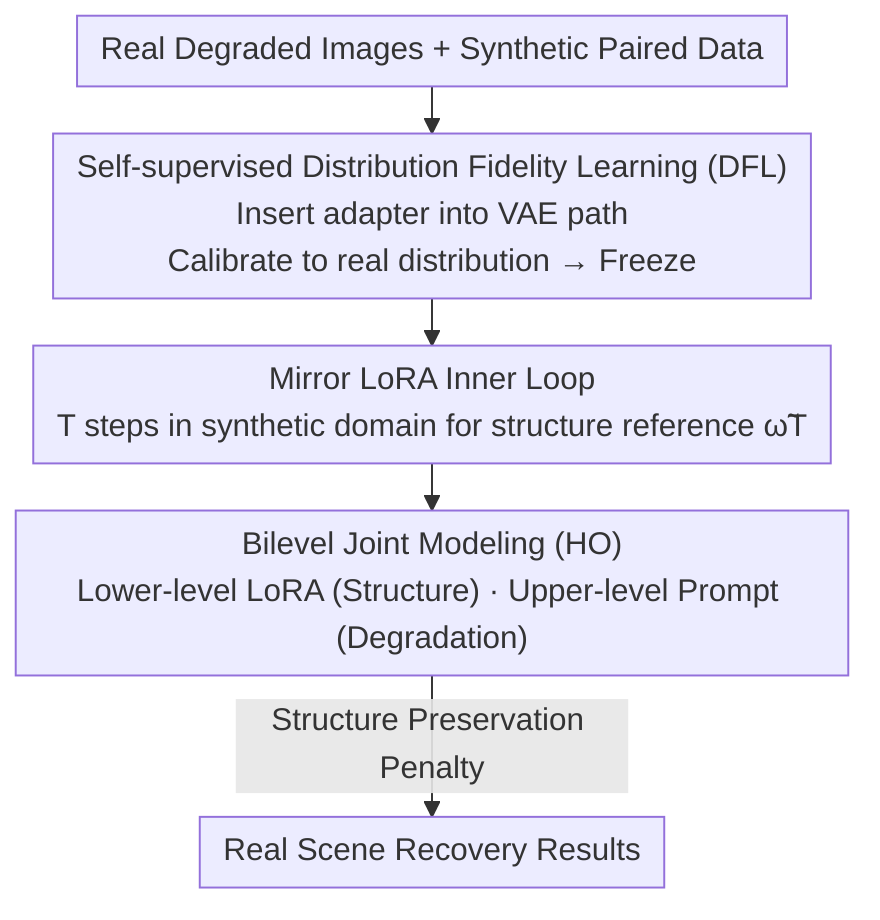

# BiProLoRA: Bilevel Prompt LoRA for Real Scene Recovery

**Conference**: CVPR 2026  
**Paper**: [CVF Open Access](https://openaccess.thecvf.com/content/CVPR2026/html/An_BiProLoRA_Bilevel_Prompt_LoRA_for_Real_Scene_Recovery_CVPR_2026_paper.html)  
**Code**: https://github.com/Defender0527/BiProLoRA  
**Area**: Image Restoration / Diffusion Models  
**Keywords**: Real Scene Recovery, Synthetic-to-Real Adaptation, LoRA, Prompt Embedding, Bilevel Optimization

## TL;DR
To address the severe degradation issue when large diffusion models "trained on synthetic data generalize to real scenes," BiProLoRA first calibrates the VAE auto-encoder path to the real degradation distribution via self-supervised distribution fidelity learning. It then formulates "LoRA for structure recovery and Prompt for degradation-aware modulation" as a bilevel (hyperparameter optimization) problem for joint training. Using real data equivalent to only 10% of the synthetic data volume, it surpasses SOTA across five non-reference metrics in low-light, dehazing, and underwater tasks.

## Background & Motivation

**Background**: The mainstream approach for real-world scene recovery (low-light enhancement, dehazing, underwater restoration) involves using generative restoration with large diffusion models (e.g., Stable Diffusion series). A typical paradigm is "training on synthetic paired data and testing in real scenes," accompanied by simple adaptation strategies (direct LoRA fine-tuning or prompt tuning).

**Limitations of Prior Work**: This paradigm suffers from two specific issues in real-world scenarios. First, the distribution of real degradation observations is barely utilized—the pre-trained VAE auto-encoder path has never encountered real degradation distributions, leading to distorted reconstructed textures and "unfaithful" restoration results. Second, the model's structure recovery and degradation handling capabilities learned in the synthetic domain are overfitted into the same parameter space, making them difficult to adapt to unseen degradations.

**Key Challenge**: The fundamental cause is the coupling of "learning structure recovery" and "adapting to real degradation" within the same set of weights. While LoRA has sufficient capacity to learn structural mapping, its low-rank updates become tied to the training distribution when fitting real degradations. Prompt embeddings are naturally suited for learning new degradations without altering core weights, but they lack operator-level fine-grained control and affect many layers simultaneously, hindering structural recovery when used alone. Both have strengths but constrain each other.

**Goal**: Design a real-scene adaptation scheme that ensures both distribution fidelity (credible textures) and robust generalization to unseen degradations. This is divided into two sub-problems: (1) how to calibrate the auto-encoder path to the real degradation distribution, and (2) how to decouple structure recovery and degradation adaptation while making them mutually beneficial.

**Key Insight**: The authors observe a natural complementarity between LoRA and prompts—LoRA provides "reusable structure recovery capability learned under controlled supervision," while prompts provide a "lightweight mechanism to modulate how this capability is activated when facing diverse unseen degradations." Treating the prompt as a "hyperparameter" that modulates LoRA corresponds precisely to the bilevel structure of Hyperparameter Optimization (HO).

**Core Idea**: Replace direct LoRA/prompt fine-tuning with "distribution fidelity pre-calibration + bilevel joint modeling (LoRA as the lower level, Prompt as the upper level)," allowing structural learning and real degradation adaptation to be managed separately yet synergistically.

## Method

### Overall Architecture
BiProLoRA uses the efficiency-oriented single-step diffusion model SD-Turbo as the backbone, adapting it to real scenes in two steps. The first step is **Self-supervised Distribution Fidelity Learning (DFL)**: the UNet is temporarily removed, and lightweight adapters are inserted into the VAE auto-encoder path (encoder $V_e$, decoder $V_d$), using real degraded data to self-supervise the calibration of the latent space to the real degradation distribution, after which it is frozen. The second step is **Bilevel Prompt LoRA Joint Modeling**: on the calibrated latent space, "LoRA learning structure recovery (lower level, using synthetic pairs)" and "Prompt learning degradation-aware modulation (upper level, using real data)" are formulated as a bilevel optimization problem. This is trained via a penalty-based solver with a "Mirror LoRA inner loop + main parameter outer loop," ultimately yielding prompt parameters $\theta^*$, LoRA parameters $\omega^*$, and adapter parameters $\pi^*$.

### Key Designs

**1. Self-supervised Distribution Fidelity Learning (DFL): Calibrating latent space before recovery**

The pain point is that pre-trained VAEs have never "seen" real degradation distributions; the latent space is biased towards clean/synthetic images, causing texture distortion during diffusion denoising. DFL's approach is: temporarily remove UNet $U$, insert a lightweight adapter $A_\pi$ with parameters $\pi$ (implemented as two zero-convolution modules between $V_e$ and $V_d$ features, and between input/output). Given a real degraded image, the adapter is trained via self-supervision using an $L_1$ reconstruction loss $\ell_1$ (Alg.1: $\pi_{n+1}\leftarrow\pi_n-\delta\nabla_\pi\ell_1(\pi_n)$, frozen after $N$ steps). 

Key differences from existing VAE strategies: it applies constraints at **both feature and pixel levels**, and optimizes directly using **real degraded data $D_{real}$** rather than ideal clean images. This forces the adapter to encode the task-irrelevant real degradation distribution into the latent representation, ensuring faithful textures in subsequent recovery. Note that DFL is used for **pre-training** (in ablations, "pretrain-only" outperformed "pretrain+finetune").

**2. Formulating "LoRA↔Prompt Complementarity" as Bilevel Joint Modeling: Decoupling Structure and Degradation Adaptation**

This is the core contribution. The authors formalize the complementarity as a bilevel program: the upper level optimizes the prompt on real data, while the lower level optimizes LoRA on synthetic data:

$$\min_{\theta}\ \ell_{real}\big(\theta,\omega^*(\theta);D_{real}\big),\quad \text{s.t.}\ \ \omega^*(\theta)\in\arg\min_{\omega}\ \ell_{syn}(\omega,\theta;D_{syn}),$$

where $\theta$ represents the parameters of learnable prompt embedding $P_\theta$ and $\omega$ represents LoRA parameters $R_\omega$. Intuitively: the lower level allows LoRA to learn "general structure recovery modulated by the current prompt" on reliable synthetic data, while the upper level updates the prompt based on "how the synthetically trained LoRA performs in the real world"—treating the prompt as a hyperparameter to find the optimal modulation for aligning LoRA with complex real degradations.

**3. Structure Preservation Penalty + Mirror LoRA Solver: Modulating LoRA instead of "breaking" it**

To solve the bilevel problem efficiently, Eq.(1) is rewritten as a single-level penalty objective:

$$\min_{\theta,\omega}\ \ell_{real}(\theta,\omega)+\lambda\big(\ell_{syn}(\theta,\omega)-v(\theta)\big),\quad v(\theta):=\min_{\omega}\ell_{syn}(\theta,\omega),$$

where $v(\theta)$ is the lower-level value function and $\lambda$ balances real adaptation with lower-level optimality. **Inner Loop (Mirror LoRA)**: A temporary copy of LoRA parameters $\tilde\omega_0=\omega_k$ is updated for $T$ steps on synthetic data $\tilde\omega_{t+1}\leftarrow\tilde\omega_t-\alpha\nabla_{\tilde\omega}\ell_{syn}(\tilde\omega_t,\theta)$. The resulting $\tilde\omega_T$ serves as a reference for what the structure recovery *should* be under the current prompt. **Outer Loop** updates main parameters:

$$g_\omega=\nabla_\omega\ell_{real}(\theta,\omega)+\lambda\nabla_\omega\ell_{syn}(\theta,\omega),$$
$$g_\theta=\nabla_\theta\ell_{real}(\theta,\omega)+\lambda\big(\nabla_\theta\ell_{syn}(\theta,\omega)-\nabla_\theta\ell_{syn}(\theta,\tilde\omega_T)\big).$$

LoRA updates are heavily regularized by synthetic data to maintain structural fidelity, while prompt updates are driven by real-world objectives. The penalty term $\nabla_\theta\ell_{syn}(\theta,\tilde\omega_T)$ prevents the prompt from choosing a configuration that severely hinders LoRA's ability to reach its synthetic optimum $\tilde\omega_T$, ensuring the prompt **modulates** rather than **destroys** LoRA's capability.

### Loss & Training
The synthetic domain utilizes $L_2$ loss $\ell_2$ and perceptual loss LPIPS $\ell_{lpips}$: $\ell_{syn}=\ell_2+\ell_{lpips}$. The real domain uses a non-reference contrastive objective based on CLIP: real degraded images $x_D$ and real clean images $x_C$ are used as positive/negative samples to train the prompt by maximizing image-text cosine similarity and minimizing binary cross-entropy. After learning the prompts, restoration results $z_D$ are optimized directly via cosine similarity:

$$\ell_{real}=\frac{e^{\cos(G_{image}(z_D),G_{text}(t_D))}}{\sum_{i\in\{D,C\}}e^{\cos(G_{image}(z_D),G_{text}(t_i))}}.$$

Training: DFL uses Adam ($\delta=2\times10^{-5}$). BiProLoRA uses three Adam optimizers for Mirror LoRA/LoRA ($\alpha=\beta=2\times10^{-5}$) and prompt ($\gamma=1\times10^{-5}$). Each scene uses only 500 synthetic pairs + 50 real images for training, and 500 real images for testing.

## Key Experimental Results

### Main Results
Low-light evaluation on DARKFACE (seen) + ExDark / NOD (unseen) using five non-reference metrics. NIQE (lower is better) and MUSIQ (higher is better) for representative methods are as follows:

| Dataset | Metric | BiProLoRA | ReDDiT (CVPR25) | LightenDiff (ECCV24) |
|--------|------|-----------|-----------------|----------------------|
| DARKFACE | NIQE↓ | **2.971** | 3.864 | 3.582 |
| DARKFACE | MUSIQ↑ | **61.33** | 54.08 | 49.90 |
| ExDark | NIQE↓ | **3.806** | 4.223 | 4.088 |
| NOD | NIQE↓ | **3.119** | 3.244 | 3.664 |

Hazy and Underwater results also show lead:

| Scene | Method | NIQE↓ | MUSIQ↑ |
|------|------|-------|--------|
| Hazy | C2PNet | 4.295 | 57.43 |
| Hazy | **BiProLoRA** | **3.972** | **61.79** |
| Underwater | WF-Diff | 3.735 | 43.06 |
| Underwater | **BiProLoRA** | **3.514** | **45.99** |

Downstream night-time object detection further validates practical utility:

| Method | mAP↑ | AP50↑ | AP75↑ |
|------|------|-------|-------|
| Baseline | 37.5 | 63.8 | 39.4 |
| **BiProLoRA** | **40.9** | **67.4** | **44.2** |

Note: Other restoration methods (Di-Retinex/ReDDiT) showed lower mAP than the Baseline, whereas BiProLoRA effectively boosted downstream performance.

### Ablation Study
Analysis of DFL (Pretrain vs. Finetune) and Joint Modeling (LoRA vs. Prompt vs. Naive vs. HO):

| Configuration | DFL | Jointing Method | NIQE↓ | Description |
|------|-----|----------|-------|------|
| Sa | None | LoRA only | 4.145 | LoRA only: Decent structure |
| Sb | None | Prompt only | 6.972 | Prompt only: Poor recovery |
| Sc | None | Naive | 3.967 | Naive concatenation |
| Sd | None | HO | 3.403 | HO better than naive |
| **Ours** | **Pretrain** | **HO** | **2.971** | Complete model |

### Key Findings
- **LoRA and Prompt complementarity validated**: Prompt only (Sb 6.972) fails to restore; LoRA only (Sa 4.145) has structure but weak adaptation. Their combination is essential.
- **Bilevel (HO) significantly outperforms Naive**: For the same LoRA+Prompt setup, Naive (Sc 3.967) is markedly worse than HO (Sd 3.403).
- **DFL as Pre-training is superior**: Using DFL solely as pre-training (Ours 2.971) is better than pretrain+finetune (3.607) or no DFL (3.403).
- **High Data Efficiency**: Significant gains are achieved with real data consisting of only ~10% of synthetic volume.

## Highlights & Insights
- **Mapping adaptation to Hyperparameter Optimization (HO)**: Formulating the "modulator-executor" relationship between Prompt and LoRA as HO provides a principled framework for coordination.
- **Structure Preservation Penalty $\nabla_\theta\ell_{syn}(\theta,\tilde\omega_T)$**: Using a "Mirror LoRA" synthetic reference effectively defines a gradient boundary between "modulation" and "destruction."
- **Decoupled and Reusable DFL**: Calibrating the VAE path with a lightweight zero-conv module before recovery allows for faithful textures with minimal overhead.
- **Downstream Validation**: The improvement in mAP underscores that "faithful recovery" is more valuable than mere aesthetic enhancement for practical tasks.

## Limitations & Future Work
- The real-world objective relies entirely on CLIP similarity with randomly initialized prompts, which may lack stability or discriminative power for certain degradations.
- Small training scale (50 real images per scene) leaves scalability to heterogeneous degradations unverified.
- Evaluation relies on non-reference metrics (NIQE/MUSIQ) in the absence of ground truth, which may not always align with human perception.

## Related Work & Insights
- **vs. Direct LoRA fine-tuning**: BiProLoRA decouples structure (LoRA) and adaptation (Prompt), leading to better generalization on unseen degradations.
- **vs. Pure Prompt tuning**: Unlike methods that only tune prompts, this approach uses prompts to modulate high-capacity LoRA weights.
- **vs. Previous VAE branching**: DFL uses feature+pixel dual-level constraints on real data, forcing the latent space to encode the actual real-world distribution.

## Rating
- Novelty: ⭐⭐⭐⭐⭐ 
- Experimental Thoroughness: ⭐⭐⭐⭐ 
- Writing Quality: ⭐⭐⭐⭐ 
- Value: ⭐⭐⭐⭐ 

<!-- RELATED:START -->

## Related Papers

- [\[CVPR 2026\] PNG: Diffusion-Based sRGB Real Noise Generation via Prompt-Driven Noise Representation Learning](diffusion-based_srgb_real_noise_generation_via_prompt-driven_noise_representatio.md)
- [\[CVPR 2026\] Gaussian Splatting-based Low-Rank Tensor Representation for Multi-Dimensional Image Recovery](gaussian_splatting-based_low-rank_tensor_representation_for_multi-dimensional_im.md)
- [\[CVPR 2026\] Restore Text First, Enhance Image Later: Two-Stage Scene Text Image Super-Resolution with Glyph Structure Guidance](restore_text_first_enhance_image_later_two-stage_scene_text_image_super-resoluti.md)
- [\[CVPR 2026\] Real-Time Neural Video Compression with Unified Intra and Inter Coding](real-time_neural_video_compression_with_unified_intra_and_inter_coding.md)
- [\[CVPR 2026\] One-Step Diffusion Transformer for Controllable Real-World Image Super-Resolution](one-step_diffusion_transformer_for_controllable_real-world_image_super-resolutio.md)

<!-- RELATED:END -->
