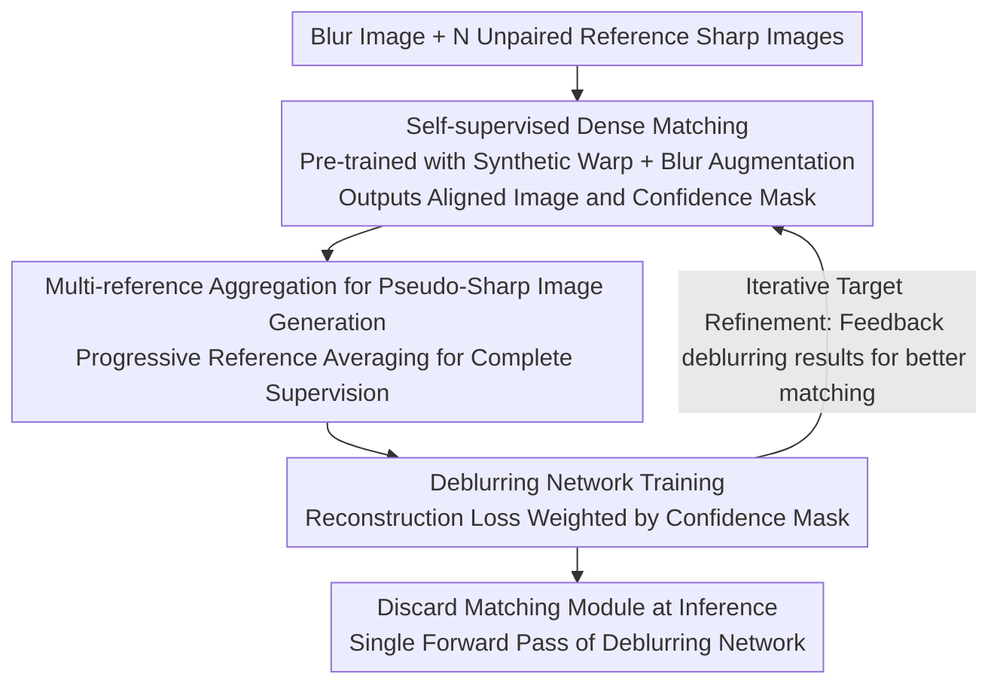

# BluRef: Unsupervised Image Deblurring with Dense-Matching References

**Conference**: CVPR 2026  
**arXiv**: [2603.14176](https://arxiv.org/abs/2603.14176)  
**Code**: [Project Page](https://qualcomm-ai-research.github.io/BluRef/)  
**Area**: Image Restoration  
**Keywords**: Unsupervised Deblurring, Dense Matching, Pseudo-Sharp Image Generation, Reference Images, Iterative Optimization

## TL;DR

Ours proposes BluRef, the first unsupervised framework that utilizes unpaired reference sharp images through dense matching to generate pseudo ground truth for training deblurring networks, achieving performance close to or even surpassing supervised methods.

## Background & Motivation

**Prevalence of Motion Blur**: Motion blur in images/videos significantly degrades visual quality and impacts the performance of downstream vision tasks. Reliable deblurring techniques possess substantial practical value.

**High Cost of Paired Data Collection**: Current mainstream supervised methods rely on paired blurry-sharp training data. However, acquiring such data requires complex setups like beam splitters and multi-camera synchronization. In most capture scenarios (e.g., dashcams, bodycams), deploying such systems is nearly impossible.

**Domain Discrepancy in Reblurring Methods**: Methods like Blur2Blur indirectly deblur by mapping unknown blur to an intermediate blur domain of existing paired data. However, finding a suitable intermediate domain is difficult, and domain mismatch leads to performance degradation. Furthermore, multi-stage pipelines increase computational overhead.

**Domain Gap as the Primary Bottleneck**: Whether it is the training-test domain difference in supervised methods or the intermediate domain matching in reblurring methods, the domain gap consistently limits the performance upper bound of unsupervised deblurring.

**Accessibility of Unpaired Reference Images**: The same scene may contain both blurry and sharp frames at different timestamps. These unpaired, same-scene images are abundantly available and serve as natural training resources.

**Existing Reference-Based Methods Still Rely on Supervised Training**: Previous reference-augmented deblurring methods (e.g., dual-camera face enhancement by Lai et al.) still require paired data for training, failing to address the core challenge of unsupervised learning.

## Method

### Overall Architecture

BluRef is an iterative optimization framework consisting of two alternating steps: (1) **Pseudo-Sharp Image Generation**—using a dense matching model to establish correspondences between the current deblurring results and unpaired reference sharp images to generate pseudo ground truth; (2) **Deblurring Network Training**—updating deblurring network parameters using the pseudo-sharp images as supervision targets. In each epoch, the improved deblurring results are fed back to the dense matching module, gradually bringing the pseudo-sharp images closer to the true sharp images. At inference time, only a single forward pass of the deblurring network is required, without the dense matching module.

### Key Designs

**1. Self-supervised Dense Matching: Learning pixel correspondences across sharp-blurry domains without ground truth pairs**

To "synthesize" pseudo ground truth from sharp references, the first step is a dense matching model $\mathcal{DM}$ capable of establishing correspondences between the blurry target and sharp reference, outputting an aligned image $I_{\text{trans}}$ and a confidence mask $M_{\text{conf}}$. BluRef trains this in a purely self-supervised manner: applying random homography and TPS transformations to a sharp image to create geometric deformation pairs, then applying blur/noise augmentation (referencing BSRGAN's degradation modeling) to the deformed image. Thus, the "target-reference" pairs seen by the model naturally span both sharp and blurry domains. The backbone follows PDC-Net+ and GLU-Net-GOCor. Crucially, this synthetic data is only used for matching model pre-training and does not touch real blurry samples, maintaining the strict unsupervised nature of the framework. Blur augmentation ensures the matcher remains accurate when facing real blurry inputs.

**2. Multi-reference Aggregation for Pseudo-Sharp Image Generation: Compounding multiple references for complete supervision**

A single reference sharp image and a blurry image often match in less than 40% of the regions; using it directly as ground truth results in large unsupervised areas. Given $N$ reference images, BluRef aggregates matched regions into a complete pseudo-sharp image via dense matching. Three strategies were compared: **Weighted Averaging** (independent matching followed by confidence-weighted averaging), which is simple but has harsh edges; **Sequential Accumulation** (using the previous stitch as the next matching input), which maintains continuity; and **Progressive Reference Averaging** (introducing new references only for unmatched regions and then fusing all results). The latter balances coverage and detail without redundant matching, performing best in experiments.

**3. Iterative Target Refinement: Allowing the network and pseudo-GT to co-evolve**

Initially, matching quality between the blurry and reference images is limited, and pseudo ground truths are coarse. BluRef decouples generation and training into an alternating cycle: the deblurring result $I_{\text{deblur}}^{(k)}$ from the $k$-th iteration is fed back to the dense matcher. Because it is sharper than the original blurry image, matching becomes more accurate, yielding a cleaner $I^{(k)}_{\text{pseudo}}$. This is used as supervision to train stronger network parameters $\Theta^{(k+1)}$, leading to better results in the next round. For the first round, the blurry image is used directly as the matching input for cold starting. This positive feedback allows the quality of the pseudo ground truth to climb monotonically during training. Even when the reference frame temporal distance increases to $\Delta=20$ and the matching rate drops to 25-28%, performance remains stable, with PSNR clearly converging after approximately 100K iterations.

**4. Efficiency at Inference: Standard deblurring network deployment**

Dense matching and pseudo-sharp image generation only serve the purpose of "creating supervised data" during training. Once training is complete, these modules and the dependency on reference images are discarded. Inference involves only a single forward pass of the deblurring network, with a computational cost identical to any standard deblurring backbone. Furthermore, the generated pseudo-paired data can be reused to train networks of various capacities—including lightweight models for mobile devices—allowing multiple models to benefit from a single generation process with zero additional inference overhead.

### Loss & Training

The training objective for the deblurring network is a reconstruction loss weighted by the confidence mask:

$$\Theta^{(k+1)} := \arg\min_{\Theta} \mathcal{L}\left(\mathcal{D}(I_{\text{blur}};\Theta) * \bar{M}^{(k)}_{\text{pseudo}},\; I^{(k)}_{\text{pseudo}} * \bar{M}^{(k)}_{\text{pseudo}}\right)$$

Where $\bar{M}^{(k)}_{\text{pseudo}}$ is the confidence mask binarized with a threshold of 0.7, and $\mathcal{L}$ can be $L_1$, $L_2$, or PSNR loss. The mask ensures the network learns only from high-confidence regions, shielding it from noise in misaligned areas and preventing incorrect pseudo GT from contaminating the training.

## Key Experimental Results

**Table 1: Quantitative comparison on GoPro and RB2V datasets (PSNR/SSIM)**

| Method | GoPro $\Delta=1$ | GoPro $\Delta=10$ | GoPro $\Delta=20$ | RB2V $\Delta=1$ | RB2V $\Delta=10$ | RB2V $\Delta=20$ |
|---|---|---|---|---|---|---|
| DualGAN | 22.23/0.721 | 22.10/0.719 | 21.24/0.702 | 21.01/0.512 | 20.87/0.500 | 20.92/0.505 |
| UID-GAN | 23.42/0.732 | 23.18/0.724 | 22.38/0.724 | 22.22/0.578 | 22.01/0.551 | 22.13/0.569 |
| UAUD | 24.25/0.792 | 24.02/0.750 | 23.77/0.745 | 22.87/0.590 | 22.29/0.581 | 22.28/0.581 |
| NAFNet-BluRef (Prog.) | **31.94/0.960** | **31.87/0.955** | **31.52/0.947** | **27.87/0.821** | **27.72/0.820** | **27.24/0.812** |
| Restormer-BluRef (Prog.) | 31.02/0.950 | 30.97/0.949 | 30.95/0.938 | 26.82/0.839 | 26.76/0.832 | 26.13/0.829 |
| NAFNet (Supervised Upper) | 33.32/0.962 | — | — | 28.54/0.824 | — | — |

BluRef reaches 31.94 dB on GoPro (vs 33.32 dB supervised). On RB2V, the Restormer backbone even surpasses the supervised upper bound (27.87 vs 27.43). Performance drops only slightly when $\Delta$ increases from 1 to 20, demonstrating robustness to reference frame temporal distance.

**Table 2: Performance of BluRef + Blur2Blur combination in real-world scenarios (NIQE↓/FID↓)**

| Method | NIQE/FID |
|---|---|
| BSRGAN | 13.34/10.25 |
| Blur2Blur (GoPro) | 12.01/8.93 |
| Blur2Blur (RSBlur) | 10.07/6.28 |
| BluRef | 10.43/6.45 |
| **BluRef + Blur2Blur (RSBlur)** | **8.47/5.62** |

On the PhoneCraft real-world dataset without paired ground truth, BluRef combined with Blur2Blur significantly outperforms individual methods in NIQE and FID. Additionally, the performance gap between models trained with BluRef-generated pseudo-pairs and those trained with real ground truth is < 1 dB PSNR (27.73 vs 28.54 on RB2V).

**Table 3: Ablation on number of reference images (GoPro, NAFNet, $\Delta=1$)**

| Number of Refs | 4 | 6 | 8 | 10 |
|---|---|---|---|---|
| PSNR/SSIM | 31.42/0.942 | **31.94/0.960** | 31.93/0.961 | 31.05/0.924 |

The optimal range is 6-8 frames. Too few references result in insufficient coverage, while too many introduce redundancy or strongly misaligned content.

## Highlights & Insights

1. **First Unpaired Reference-Guided Unsupervised Deblurring Framework**: Completely eliminates the need for paired training data and pre-trained deblurring networks, requiring only unpaired video frames from the same scene.
2. **Performance Approaches/Surpasses Supervised Methods**: Surpasses the supervised Restormer baseline on the RB2V real blur dataset (27.87 vs 27.43) and lags behind supervised GoPro results by only ~1.4 dB.
3. **Zero Inference Overhead**: The dense matching and pseudo GT generation modules are discarded during inference; the cost is equivalent to standard deblurring backbones.
4. **Reusable Pseudo-Paired Data**: The generated pseudo-pairs can train networks of any capacity (including mobile-friendly models), providing value across multiple deployments from a single training run.
5. **Robustness to Temporal Distance**: Performance remains high even at $\Delta=20$ where the matching rate is only 25-28%, showcasing strong robustness.

## Limitations & Future Work

1. **Dependency on Same-Scene References**: Requires sharp reference images of the same or similar scenes as the blurry image; inapplicable to isolated image scenarios where references are unavailable.
2. **Pre-training Cost of Dense Matcher**: While trained on synthetic data, training and inferring with PDC-Net+ incurs computational overhead, limiting BluRef's training efficiency on massive datasets.
3. **Quality Ceiling of Pseudo GT**: When coverage between the reference and blurry image is extremely low (e.g., large movement or scene cuts), pseudo-sharp image quality is limited, potentially affecting training.
4. **Lack of End-to-End Joint Optimization**: The dense matching model and deblurring network are trained separately in alternating iterations, which may lead to sub-optimal solutions compared to joint optimization.

## Related Work & Insights

- **Unsupervised Deblurring**: Methods based on CycleGAN or self-augmentation like DualGAN, UID-GAN, and UAUD exhibit significantly lower performance than BluRef (PSNR gap of 7-9 dB).
- **Reblurring Methods**: Blur2Blur performs indirect deblurring via domain translation and depends on the quality of the intermediate domain; it can be used complementarily with BluRef.
- **Reference Image Augmented Deblurring**: Xiang et al. use reference videos to augment deblurring networks; Zou et al. and Liu et al. have also explored reference augmentation, but all work within supervised frameworks.
- **Dense Matching**: Methods such as DGC-Net, GLU-Net, and PDC-Net+ are innovatively used here for cross-domain semantic correspondence between sharp and blurry images.

## Rating

- Novelty: ⭐⭐⭐⭐ — First to introduce dense matching + unpaired references into unsupervised deblurring with a clear, intuitive framework.
- Experimental Thoroughness: ⭐⭐⭐⭐ — Covers synthetic/real datasets, multiple backbones, extensive ablations, and comparisons with supervised bounds and hybrid methods.
- Writing Quality: ⭐⭐⭐⭐ — Clear structure, well-defined motivations, and highly informative charts.
- Value: ⭐⭐⭐⭐ — Significantly lowers the barrier for deblurring training data; the pseudo-pair reuse mechanism enhances practical utility.

<!-- RELATED:START -->

## Related Papers

- [\[CVPR 2026\] Rethinking Diffusion Model-Based Video Super-Resolution: Leveraging Dense Guidance from Aligned Features](rethinking_diffusion_model-based_video_super-resolution_leveraging_dense_guidanc.md)
- [\[CVPR 2026\] Gyro-based Deep Video Deblurring](gyro-based_deep_video_deblurring.md)
- [\[CVPR 2026\] UDAPose: Unsupervised Domain Adaptation for Low-Light Human Pose Estimation](udapose_unsupervised_domain_adaptation_for_low_light_human_pose_estimation.md)
- [\[CVPR 2026\] SelfHVD: Self-Supervised Handheld Video Deblurring](selfhvd_self-supervised_handheld_video_deblurring.md)
- [\[CVPR 2026\] MAD-Avatar: Motion-Aware Animatable Gaussian Avatars Deblurring](motionaware_animatable_gaussian_avatars_deblurring.md)

<!-- RELATED:END -->
