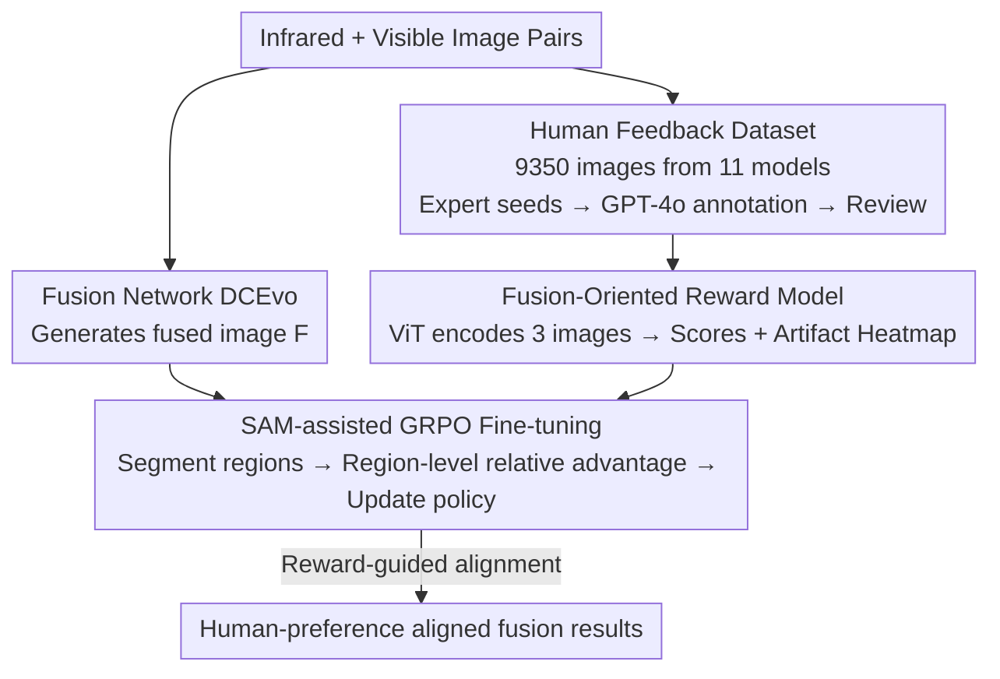

# Bridging Human Evaluation to Infrared and Visible Image Fusion

**Conference**: CVPR 2026  
**Paper**: [CVF Open Access](https://openaccess.thecvf.com/content/CVPR2026/html/Liu_Bridging_Human_Evaluation_to_Infrared_and_Visible_Image_Fusion_CVPR_2026_paper.html)  
**Code**: https://github.com/ALKA-Wind/EVAFusion  
**Area**: Image Fusion / Image Restoration  
**Keywords**: Infrared and Visible Image Fusion, RLHF, Human Preference, Reward Model, GRPO

## TL;DR
To address the long-standing issue of Infrared and Visible Image Fusion (IVIF) optimizing only handcrafted metrics and disconnecting from human aesthetics, this paper constructs the first large-scale IVIF human feedback dataset. It trains a "fusion-oriented reward model" to quantify perceptual quality and utilizes SAM-assisted GRPO to align the fusion network with human preferences, achieving SOTA performance on mainstream benchmarks with more visually pleasing fusion results.

## Background & Motivation
**Background**: IVIF aims to synthesize the thermal radiation information from infrared images and the texture details from visible images into a single image, serving high-risk scenarios such as autonomous driving, security monitoring, and medical imaging. Mainstream methods (CNN / GAN / Transformer / Diffusion Models) primarily compete on higher objective metrics like entropy, SSIM, and gradients.

**Limitations of Prior Work**: IVIF is an **ill-posed problem**—there is no unique ground-truth fusion result. Consequently, the field is dominated by "optimizing manual losses + numerical metrics," yet a systematic gap exists between these mathematical proxies and actual human perceptual preferences: metrics may improve, but the fused images do not necessarily look comfortable to the human eye (exhibiting artifacts, overexposure, or blurred textures). Although deep learning methods have stronger feature extraction capabilities, they inherit the same evaluation paradigm, using pixel-level or feature-level losses during training, which essentially decouples them from human judgment.

**Key Challenge**: Two missing components have blocked the path toward "aligning with the human eye": (1) the lack of a large-scale, high-quality IVIF dataset with human feedback annotations; (2) the absence of a reliable, automatic reward mechanism to quantify perceptual quality and guide model learning.

**Goal**: To directly and scalably incorporate subjective human evaluation into the optimization loop of IVIF, making "human preference" the ultimate supervision signal for this ill-posed task.

**Key Insight**: Drawing inspiration from the success of RLHF in NLP and CV—first collect human preference data, train a reward model, and then move the policy (fusion network) toward high rewards using reinforcement learning. The difficulty lies in the fact that subjective feedback is expensive and sparse, requiring it to be efficiently converted into differentiable training signals.

**Core Idea**: By establishing a feedback reinforcement chain of "Human Feedback Dataset → Fusion-Oriented Reward Model → GRPO Fine-tuning of the Fusion Network," the task of IVIF is shifted from "aligning with metrics" to "aligning with human preferences."

## Method

### Overall Architecture
The system is a three-stage serial RLHF pipeline: **data construction, reward training, and fusion network tuning**. In the first stage, infrared-visible image pairs are collected from eight public datasets. Eleven SOTA fusion models generate 9,350 fused images. Experts score seed samples, GPT-4o is fine-tuned for large-scale annotation, and experts re-verify the results to produce a human feedback dataset with four-dimensional fine-grained scores and artifact heatmaps. In the second stage, a ViT-based "fusion-oriented reward model" is trained on this dataset, taking three images (IR/visible/fused) as input and outputting four perceptual quality scores and an artifact probability map. In the third stage, this reward model serves as the scorer. SAM is used to segment fused images into semantic regions to calculate region-level relative advantages, and the fusion network DCEvo is fine-tuned using GRPO to align its output with human preferences.

### Key Designs

**1. Human Feedback IVIF Dataset: Filling the "Human Supervision" Gap for Ill-posed Tasks**

To address the primary pain point of lacking human feedback data, the authors constructed the first large-scale human feedback dataset in the IVIF field. The process involved collecting over 30,000 infrared-visible pairs from eight datasets (FMB, LLVIP, M3FD, MFNet, RoadScene, SMOD, TNO, VIFB), cleaning them to 900 pairs using CLIP for deduplication, and having experts select 850 high-quality pairs. Each pair was fused using 11 SOTA methods (MURF, DDcGAN, CDDFuse, SegMif, Text-IF, DDFM, TarDAL, etc.), resulting in 9,350 fused images. Annotation followed a collaborative approach of "expert seeds + LLM expansion + expert review": each fused image is associated with four fine-grained scores (1–5: thermal retention, texture retention, artifacts, sharpness), a total average score, and a heatmap indicating artifact regions. Four senior experts first meticulously annotated 100 images (artifacts represented by center coordinates + radius) to form a seed set; GPT-4o was then fine-tuned on this seed set to automatically annotate the remaining 9,350 images; finally, five researchers with over 3 years of experience reviewed the GPT scores and heatmaps to correct biases and missing artifact regions. This ensures "human standard" priors while scaling expensive subjective annotations using large models.

**2. Fusion-Oriented Reward Model: Encoding Subjective Preferences into Differentiable Reward Signals**

To address the lack of an automatic quantization mechanism for perceptual quality, the authors trained a reward model based on the ViT vision-language model to convert human scores into differentiable scalar rewards. For each sample, the infrared, visible, and fused images are fed into a **weight-shared** ViT encoder to extract patch-level semantic features $F_i = \mathrm{ViT}(x_i)[:,1:,:]$ (excluding the CLS token), where $x_i \in \{x_{ir}, x_{vi}, x_{fused}\}$. The three sets of features are concatenated along the channel dimension as $[F_{ir}\,\|\,F_{vi}\,\|\,F_{fused}] \in \mathbb{R}^{N\times 3D}$, compressed back to the original dimension via linear projection, and fed into another isomorphic ViT for cross-modal fusion. The output is reshaped into a spatial feature map $F_{map}\in\mathbb{R}^{D\times H'\times W'}$. This map enters two prediction branches: the heatmap branch uses convolution compression + residual upsampling + Sigmoid to output a $[0,1]$ artifact probability map; the score branch uses convolution compression + flatten + MLP + Sigmoid to regress scores for each dimension. During training, the ViT is frozen, and only the upper prediction heads are optimized to stabilize convergence. The loss is a weighted sum of two MSE terms:

$$L_{score} = \sum_{i=1}^{5} \mathrm{MSE}(s_i, \hat{s}_i), \quad L_{heatmap} = \mathrm{MSE}(H, \hat{H})$$

$$L_{total} = \lambda_1 \cdot L_{score} + \lambda_2 \cdot L_{heatmap}$$

Freezing the ViT backbone and only training the headers prevents overfitting and improves stability when annotation scale is limited.

**3. SAM-assisted GRPO Policy Optimization: Shifting Fusion Networks Toward Human Preferences via Region-level Relative Advantages**

With the reward model in place, the key is how to update the fusion network. Using DCEvo (an encoder-decoder structure with discriminative enhancement) as the baseline fusion policy $\pi_\theta$, the authors adopt GRPO for policy optimization. The intuition is that human judgment of image quality largely falls on key semantic objects (cars, people, buildings), so the entire image should not be treated equally. Specifically, for an input pair $(v,i)$, the policy network fuses image $F$. **SAM** is used to segment it into $K$ semantic regions $f_k = F\odot M_k$ ($M_k$ is the binary mask for region $k$). These region images, along with the fused image, are sent to the reward model for scores $\{s_1,\dots,s_K\}$, and normalized relative advantages are calculated within the group:

$$\mu = \frac{1}{K}\sum_{k=1}^{K} s_k, \quad \hat{A}_k = \frac{s_k - \mu}{\sigma + \epsilon}$$

The policy is then updated using an objective with KL regularization:

$$J(\theta) = \mathbb{E}_{(v,i)}\big[L(\theta) - \beta\cdot D_{KL}[\pi_\theta\,\|\,\pi_{ref}]\big]$$

$$L(\theta) = \sum_{k=1}^{K} w_k \cdot \min\big(r_k\hat{A}_k,\ \mathrm{clip}(r_k, 1-\epsilon, 1+\epsilon)\hat{A}_k\big)$$

where $\pi_{ref}$ is a frozen copy of the initial policy, and the region-level ratio $r_k = 1 + \alpha\cdot \frac{|F_\theta[M_k] - F_{\theta_{old}}[M_k]|}{|F_{\theta_{old}}[M_k]|}$ measures the policy change in that region. The KL term prevents the policy from deviating too far from the reference. Compared to scoring the whole image directly, this design of "SAM segmentation + intra-group relative advantage + regional weighting" focuses the reward signal on key semantic targets, explaining the performance gains in downstream segmentation/detection.

### Loss & Training
The reward model uses ViT-Large-Patch16-384 as a feature extractor (frozen), training the score head and heatmap generator for 30 epochs with AdamW + cosine annealing (2e-5→1e-5) and weight decay of 2e-3. In the RLHF fine-tuning stage, the KL coefficient $\beta=0.1$, $\epsilon=0.2$, using Adam with a learning rate of 1e-4, weight decay of 0.01, and batch size of 2 for 20 epochs with CosineAnnealingLR (decay factor 0.5, minimum 1e-6). All experiments were conducted on 2 A40 GPUs. The reward dataset of 9,350 images was split into 7,350/1,000/1,000 for train/val/test.

## Key Experimental Results

### Main Results
Compared with 13 SOTA methods on TNO, RoadScene, and M3FD benchmarks. For reference-based metrics CC / PSNR / Qabf / SSIM, higher is better. Ours achieves the highest CC and PSNR across all test sets.

| Dataset | Metric | Ours | DCEvo(Baseline) | CDDFuse |
|--------|------|------|------|----------|
| TNO | CC↑ / PSNR↑ | **0.51 / 65.43** | 0.48 / 63.83 | 0.47 / 63.49 |
| RoadScene | CC↑ / PSNR↑ | **0.56 / 61.84** | 0.49 / 59.66 | 0.52 / 59.84 |
| M3FD | CC↑ / PSNR↑ | **0.65 / 65.09** | 0.55 / 62.87 | 0.62 / 63.14 |

For no-reference metrics NIQE / BRISQUE, lower is better. Ours is optimal or sub-optimal across three datasets:

| Dataset | NIQE↓ | BRISQUE↓ |
|--------|-------|----------|
| TNO | **5.37** | **22.58** |
| RoadScene | **3.06** | **18.79** |
| M3FD | **4.03** | 29.80 |

Additionally, a double-blind preference ranking experiment with 15 participants (5 experts + 10 non-experts) showed that Ours had the highest average preference ranking. Downstream semantic segmentation (FMB, mIoU 56.92) and object detection (M3FD, mAP 62.23) also ranked first.

### Ablation Study
**Ablation of Key Components** (CC↑ / PSNR↑, TNO / RoadScene / M3FD):

| Config | TNO | RoadScene | M3FD | Description |
|------|-----|-----------|------|------|
| w/o Score | 0.50 / 64.21 | 0.51 / 60.97 | 0.58 / 64.81 | Without score branch, reward cannot fully assess quality |
| w/o Heatmap | 0.50 / 65.17 | 0.54 / 61.21 | 0.60 / 64.93 | Without artifact heatmap branch |
| w/o SAM | 0.48 / 65.03 | 0.52 / 60.92 | 0.57 / 63.02 | Replacing semantic regions with random crops causes significant drop |
| **Ours** | **0.51 / 65.43** | **0.56 / 61.84** | **0.65 / 65.09** | Full model |

**Ablation of Policy Optimization Methods** (CC↑ / PSNR↑) — Replacing GRPO with DPO / PPO:

| Method | TNO | RoadScene | M3FD |
|------|-----|-----------|------|
| Baseline | 0.48 / 63.83 | 0.49 / 59.66 | 0.55 / 62.87 |
| DPO | 0.50 / 63.98 | 0.49 / 61.50 | 0.57 / 63.74 |
| PPO | 0.51 / 63.59 | 0.53 / 61.17 | 0.59 / 64.32 |
| **Ours (GRPO)** | **0.51 / 65.43** | **0.56 / 61.84** | **0.65 / 65.09** |

### Key Findings
- **SAM Regional Segmentation contributes the most**: Removing SAM (replaced by random crops) leads to a widespread decline in CC/PSNR (e.g., CC 0.65→0.57 on M3FD), indicating that focusing rewards on key semantic regions is the core of the improvement, also echoed by the boost in downstream tasks.
- **GRPO outperforms DPO/PPO**: All three RL strategies exceed the baseline, but the intra-group relative advantage mechanism of GRPO achieves the largest gap in PSNR (e.g., M3FD 62.87→65.09), suggesting that "region-level relative comparison" is more stable than absolute preference optimization.
- **Dual Reward Branches are Complementary**: Removing either the score or heatmap branch leads to blurred vehicle edges and artifacts; they constrain the reward from "global quality scoring" and "artifact localization" respectively.

## Highlights & Insights
- **Cleanly Migrating RLHF Paradigm to Ill-posed Low-level Vision Tasks**: Since IVIF lacks a ground-truth, it is naturally suited for "aligning with human preferences." Replacing manual metrics with reward models is a clear idea that can be transferred to other tasks without gold standards (dehazing, low-light enhancement, HDR).
- **SAM + Region-level Relative Advantage is the Finishing Touch**: Instead of a single score for the whole image, rewards are focused on semantic targets that humans actually care about. This binds "perceptual quality" with "downstream task utility"—the fused images are both visually pleasing and better for detection/segmentation.
- **Scaling Annotations with Expert-seeded GPT-4o**: Using an expert-annotated seed set of 100 images to align the large model, and then letting it annotate 9,350 images with expert review, is a pragmatic low-cost data production chain of "human prior + large model expansion."

## Limitations & Future Work
- **Reward Dependence on GPT-4o Labels**: The vast majority of the 9,350 images are scored by fine-tuned GPT-4o; while reviewed by experts, the reward model may inherit GPT-4o's perceptual biases. ⚠️ Consistency gaps between GPT and pure human annotations are not quantified.
- **Validation on a Single Baseline**: Policy optimization is tied to DCEvo; it is not fully explored whether this is equally effective for other architectures.
- **Computational Overhead**: Each step requires SAM segmentation and multiple forward passes of the reward model, which is costlier than pure supervised training; training/inference time comparisons are not provided.
- **Improvements**: Distilling the reward model into a lightweight scorer; or using more specific artifact type labels (rather than a single-channel heatmap) to provide structural reward signals.

## Related Work & Insights
- **vs. Traditional IVIF (CDDFuse / DDFM / SegMif, etc.)**: These optimize manual metrics like entropy/SSIM. Ours uses a reward model trained from human feedback as supervision. The difference lies in switching from "aligning with mathematical proxies" to "aligning with the human eye," resulting in superior no-reference metrics and subjective preference rankings.
- **vs. Generative RLHF (ImageReward / DPOK)**: Those utilize human feedback to improve quality in text-to-image generation. Ours applies the same logic to the multi-modal low-level task of IVIF and introduces SAM for region-level advantages.
- **vs. DPO / PPO Fine-tuning**: Ours selects GRPO with region-level relative advantages and weighting. Ablations show higher PSNR gains than DPO/PPO, suggesting group-wide relative comparison better suits scenarios lacking absolute preference pairs.

## Rating
- Novelty: ⭐⭐⭐⭐ First IVIF human feedback dataset + clean landing of RLHF/GRPO in low-level fusion.
- Experimental Thoroughness: ⭐⭐⭐⭐ 13 SOTA comparisons, 6 metrics, downstream tasks, double-blind experiments, and extensive ablations.
- Writing Quality: ⭐⭐⭐⭐ Clear motivation-method-experiment logic; formulas and flows are well-explained.
- Value: ⭐⭐⭐⭐ Provides a reusable "aligning with human eyes" paradigm for ill-posed low-level vision tasks; dataset and code are open-sourced.

<!-- RELATED:START -->

## Related Papers

- [\[CVPR 2026\] RegionFuse: Region-Adaptive Pixel Distribution Learning for Infrared and Visible Image Fusion](regionfuse_region-adaptive_pixel_distribution_learning_for_infrared_and_visible_.md)
- [\[CVPR 2026\] Beyond Strict Pairing: Arbitrarily Paired Training for High-Performance Infrared and Visible Image Fusion](beyond_strict_pairing_arbitrarily_paired_training_for_high-performance_infrared_.md)
- [\[CVPR 2026\] Bridging the Perception Gap in Image Super-Resolution Evaluation](bridging_the_perception_gap_in_image_super-resolution_evaluation.md)
- [\[CVPR 2026\] Customized Fusion: A Closed-Loop Dynamic Network for Adaptive Multi-Task-Aware Infrared-Visible Image Fusion](customized_fusion_a_closed-loop_dynamic_network_for_adaptive_multi-task-aware_in.md)
- [\[CVPR 2026\] Human-Centric Multi-Exposure Fusion: Benchmark and Bi-level Cognition Distillation Framework](human-centric_multi-exposure_fusion_benchmark_and_bi-level_cognition_distillatio.md)

<!-- RELATED:END -->
