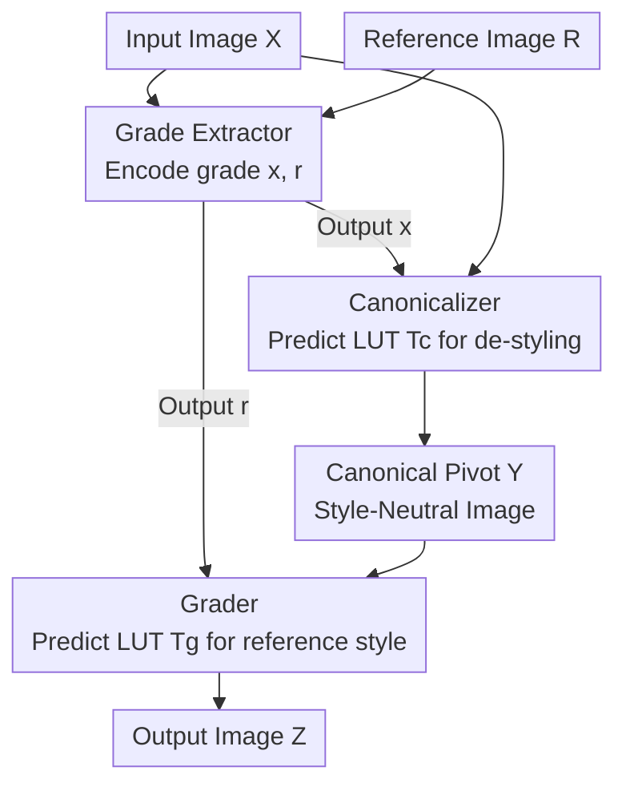

# CanonCGT: Reference-Based Color Grading via Canonical Pivot Representation

**Conference**: CVPR 2026  
**arXiv**: [2606.01638](https://arxiv.org/abs/2606.01638)  
**Code**: https://github.com/Jinwon-Ko/CanonCGT (Available)  
**Area**: Image Restoration / Color Grading / Style Transfer  
**Keywords**: Reference-based color grading, 3D LUT, style neutralization, self-supervised, FiLM modulation

## TL;DR
CanonCGT decomposes "reference-based color grading" into two steps—first using a canonicalizer to "wash" the input image into a style-neutral "canonical pivot," and then using a grader to apply the tone of the reference image. Combined with a two-phase supervised and self-supervised training strategy (DP-CGT), PSNR on 6 datasets improved from the second-best 18.62 to 28.99, resulting in significantly more stable and natural results.

## Background & Motivation

**Background**: Reference-based color grading allows users to provide a reference image representing a "desired look," and the system automatically transfers its tone and lighting atmosphere to the user's photo, eliminating professional manual adjustments for exposure, contrast, and color temperature. There are two primary research paths: first, photorealistic style transfer, which aligns statistics or modulates activations in feature space; second, filter-style transfer, which learns low-level color mappings from "original-filtered" image pairs.

**Limitations of Prior Work**: Both paths are unstable. Photorealistic methods (PhotoNAS, PhotoWCT2, Neural Preset, CAP-VST) are prone to **excessive tonal shifts**, local color bleeding, and texture distortion—whereas color grading requires "subtle yet precise" control. Filter-style methods (Deep Preset), while producing clean results, lock the mapping to "natural image $\rightarrow$ filtered image" pairs used in training: **when the input image itself is already graded**, these methods often retain the original tone or even "stack" the styles rather than transforming it to match the reference.

**Key Challenge**: The root problem is that these methods assume inputs are "clean natural images" and perform style mapping directly on the input. However, most real-world photos have undergone camera processing or preset filtering, carrying an inherent "style bias." Direct transfer leads to "stacking filters on existing bias," which is inherently unstable.

**Goal**: Decompose the task into two sub-problems: (1) How to remove the style bias inherent in the input image to obtain a stable neutral baseline; (2) How to controllably apply the reference style on this clean baseline.

**Key Insight**: The authors introduce the concept of a **"canonical pivot"**: a style-neutral intermediate representation. All inputs with various styles are first normalized to this neutral domain before being graded. This provides a stable common starting point for color grading, avoiding "style stacking."

**Core Idea**: A two-stage "canonicalization $\rightarrow$ grading" approach decouples "de-styling" and "re-styling," using 3D LUTs for color transformation throughout to ensure spatial consistency and structural fidelity.

## Method

### Overall Architecture

CanonCGT aims to change the color grading of an input image $X$ to match reference image $R$ without destroying structure or stacking styles. The process involves: a **grade extractor** that encodes grade vectors $x$ and $r$ from $X$ and $R$ respectively; a **canonicalizer** that uses $x$ to remove the style from $X$, generating a neutral image $Y$ (canonical pivot); and a **grader** that uses $r$ to apply the reference style to $Y$, producing the final image $Z$. The canonicalizer and grader share the same network architecture (conditioned LUT generator) but use different parameters and conditional vectors. Neither directly modifies pixels; instead, they predict 3D LUTs ($T_c$ and $T_g$) that are applied to the images.

Conceptually, the canonicalizer performs a **many-to-one** mapping (normalizing various styles to one neutral domain), while the grader performs a **one-to-many** mapping (grading the same neutral image into various target styles). These two stages complement each other.

### Key Designs

**1. Canonical pivot: Using a "style-neutral image" as the common starting point**

This is the core contribution. The pain point is that real photos carry style bias; direct transfer equals stacking style on a dirty base. The authors map the input to a **style-neutral intermediate domain**—the canonical pivot $Y$. Specifically, they use the **Expert C** edits from the FiveK dataset as the "canonical style" because Expert C is considered the most neutral with minimal bias. The canonicalizer learns to map any style input $X$ to its corresponding Expert C version. With this stable baseline, grading changes from "input $\rightarrow$ reference" (infinite starting points) to "neutral $\rightarrow$ reference" (fixed starting point), drastically improving stability.

**2. Two-stage canonicalization-grading: Decoupling "de-styling" and "re-styling"**

The authors explicitly decouple grading into two independent modules in series. A comparative experiment shows that merging these into a "one-stage" generator (concatenating input and reference grades) results in significantly worse PSNR and $\Delta E_{ab}$. This is because a single stage must simultaneously understand input bias and reference style, which is difficult to learn. The two-stage approach allows each module to perform a clear task, with the neutral image $Y$ serving as a supervised anchor point.

**3. Conditioned LUT generator + FFN-FiLM: One network for both neutralizing and grading**

The core component, the **conditioned LUT generator**, takes an image $I$ and a condition vector $g$ to modulate an identity LUT $T_i$ into an image-adaptive output LUT $T_o$. A CNN extracts features $F \in \mathbb{R}^{\frac{L}{8} \times \frac{L}{8} \times C}$, which are processed by encoder blocks. 8 decoder blocks refine query tokens $P_0$ (initialized as identity LUT grid points) via cross-attention with image features to produce $T_o$. The condition vector $g$ is injected via a modified FiLM called **FFN-FiLM block**: $g$ generates per-channel scale/shift parameters $\alpha = W_1 g, \beta = W_2 g$ to modulate features $F_l^{(\mathrm{film})} = \alpha \odot \sigma(F_l^{(\mathrm{sa})}W_3) + \beta$. This allows the same weights to switch between "de-styling" and "re-styling" behaviors based on $g$.

**4. DP-CGT training: Supervised presets + Self-supervised generalization**

Training only on discrete presets would fail to generalize to real-world continuous tonal distributions. The authors designed **DP-CGT (dual-phase color grading training)**. **Supervised Warm-up Phase**: Uses Expert C as the canonical style on FiveK with 56 additional synthesized styles. The grade extractor is trained with supervised contrastive loss $\mathcal{L}_{\mathrm{supcon}}$, followed by reconstruction loss $\mathcal{L}_{\mathrm{rec}}$ for the canonicalizer and grader. **Self-supervised Generalization Phase**: Refines the model on 100k unlabeled real photos. Two non-overlapping crops $A, B$ are taken from the same image and subjected to random grading perturbations $t \sim \mathcal{T}$ to get $A^*, B^*$. The model processes $(A, B^*)$ and $(A^*, B)$ symmetrically, using the consistent internal tone for self-reference reconstruction. This step is the primary source of generalization ability.

### Loss & Training
Two types of objectives: the grade extractor uses supervised contrastive loss $\mathcal{L}_{\mathrm{supcon}}$ to learn compact and separable style embeddings; the canonicalizer and grader use reconstruction loss $\mathcal{L}_{\mathrm{rec}}$ (pixel + gradient + perceptual). Optimizer: AdamW ($\beta_1=0.9, \beta_2=0.999$, weight decay $5 \times 10^{-5}$), learning rate $2 \times 10^{-4}$ with cosine annealing to $5 \times 10^{-5}$. Key hyperparameters: $L=224, C=64,$ LUT dimension $N=17$. Backbone: pre-trained MobileNet-v2. Full training takes approximately 7 days on an RTX 3090.

## Key Experimental Results

### Main Results
Evaluated across six unsupervised datasets (Flickr2K / LSDIR / PPR10K / DIV2K / Food-101 / GLD-v2, 20,196 test images) using self-reference evaluation.

| Method | PSNR ↑ | SSIM ↑ | $\Delta E_{ab}$ ↓ | LPIPS ↓ | SSIM$_\text{ED}$ ↑ | H-Corr ↑ | H-Chi ↓ |
| :--- | :--- | :--- | :--- | :--- | :--- | :--- | :--- |
| PhotoNAS | 16.71 | 0.7436 | 19.40 | 0.3174 | 0.6420 | 0.2547 | 0.3301 |
| PhotoWCT2 | 16.36 | 0.8130 | 19.96 | 0.2256 | 0.7342 | 0.3207 | 0.2869 |
| Neural Preset* | 18.50 | 0.8451 | 17.28 | 0.2226 | 0.7174 | 0.2783 | 0.3526 |
| CAP-VST | 18.00 | 0.8058 | 18.60 | 0.2335 | 0.7112 | 0.3249 | 0.2924 |
| Deep Preset | 18.62 | 0.8582 | 15.21 | 0.1750 | 0.7575 | 0.2752 | 0.3185 |
| **Ours** | **28.99** | **0.9608** | **5.46** | **0.0665** | **0.8933** | **0.5204** | **0.1785** |

CanonCGT outperformed all others across **all 7 metrics**. PSNR is 10.37 dB higher than the second-best, and $\Delta E_{ab}$ dropped from 15.21 to 5.46.

User Research (Ranking, lower is better):

| Method | Tonal Consistency ↓ | Perceptual Integrity ↓ |
| :--- | :--- | :--- |
| CAP-VST | 1.89 | 2.49 |
| Deep Preset | 2.33 | 1.97 |
| **Ours** | **1.78** | **1.54** |

### Ablation Study

| Configuration | Test Set | PSNR ↑ | $\Delta E_{ab}$ ↓ | Note |
| :--- | :--- | :--- | :--- | :--- |
| One-stage | FiveK val | 29.43 | 4.53 | Merged de-styling/re-styling |
| **Two-stage** | FiveK val | **30.29** | **4.25** | Decoupling is more stable |
| Supervised only | Unsupervised test | 19.17 | 15.07 | **Generalization collapse** |
| + Self-supervised | Unsupervised test | **28.99** | **5.46** | Main source of generalization |

### Key Findings
- **Self-supervision is critical for generalization**: Without it, PSNR on unsupervised test sets collapses to 19.17.
- **Two-stage > One-stage**: Decoupling the tasks validates the value of the canonical pivot as a stable anchor.
- **Robustness to "pre-graded inputs"**: Deep Preset retains color bias from the input, while CanonCGT produces consistent results across different inputs for the same reference.

## Highlights & Insights
- **Pivot Representation**: The "Normalization $\rightarrow$ Transformation" paradigm can be applied to other tasks where input bias needs to be replaced by target attributes (lighting transfer, makeup transfer).
- **LUT as Style Carrier**: Unlike implicit feature transformations, 3D LUTs provide deterministic, spatially consistent mappings that preserve structure.
- **FFN-FiLM Dual Use**: The same network weights can toggle between neutralizing and grading by switching the condition vector $g$.
- **Self-supervised Protocol**: Utilizing "consistent internal tone of image crops" solves the lack of paired GT and provides a direct tonal fidelity evaluation.

## Limitations & Future Work
- **Limitations**: In cases of extreme global color bias (e.g., pure black and white or heavy monochrome cast), CanonCGT chooses to maintain photographic realism rather than saturating the entire image with the bias. This means it **cannot replicate extreme artistic styles**.
- **Expert C Dependency**: The canonical domain definition is tied to Expert C; if "neutrality" in a target domain differs, bias might be introduced.
- **Training Cost**: 7 days on an RTX 3090 with a two-phase process is relatively heavy.

## Related Work & Insights
- **vs Deep Preset**: Deep Preset suffers from style accumulation; CanonCGT's neutralization makes it robust to "dirty" inputs.
- **vs Neural Preset / PhotoWCT2**: These suffer from over-saturation or texture distortion; CanonCGT's LUT-based approach ensures superior structural fidelity.
- **vs Traditional image-adaptive LUT**: While previous methods focused on general enhancement, CanonCGT extends LUTs to reference-driven bi-directional tasks.

## Rating
- Novelty: ⭐⭐⭐⭐⭐ The "canonical pivot" idea is a precise anatomical dissection of instability in color grading.
- Experimental Thoroughness: ⭐⭐⭐⭐⭐ Comprehensive lead across 6 datasets and 7 metrics.
- Writing Quality: ⭐⭐⭐⭐ Clear framework; network details are somewhat dense.
- Value: ⭐⭐⭐⭐ High practical value for a high-frequency demand; limited by extreme style constraints.

<!-- RELATED:START -->

## Related Papers

- [\[CVPR 2026\] AceTone: Bridging Words and Colors for Conditional Image Grading](acetone_bridging_words_and_colors_for_conditional_image_grading.md)
- [\[CVPR 2026\] Time Without Time: Pseudo-Temporal Representation for Space-Time Super-Resolution](time_without_time_pseudo-temporal_representation_for_space-time_super-resolution.md)
- [\[CVPR 2026\] Polarization State Tracing for Reflection Removal and Color-Consistent Reconstruction](polarization_state_tracing_for_reflection_removal_and_color-consistent_reconstru.md)
- [\[CVPR 2026\] ColorFLUX: A Structure-Color Decoupling Framework for Old Photo Colorization](colorflux_a_structure-color_decoupling_framework_for_old_photo_colorization.md)
- [\[CVPR 2026\] ZeroIDIR: Zero-Reference Illumination Degradation Image Restoration with Perturbed Consistency Diffusion Models](zeroidir_zero-reference_illumination_degradation_image_restoration_with_perturbe.md)

<!-- RELATED:END -->
